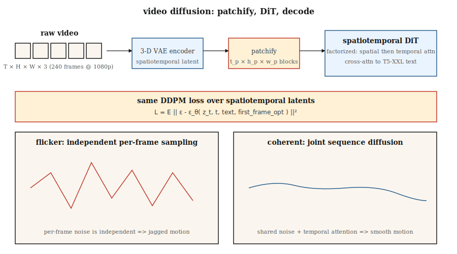

# 视频生成

> 图像是一个 2-D 张量。视频是一个 3-D 张量。理论相同；计算难 10-100 倍。OpenAI 的 Sora（2024 年 2 月）证明了这是可能的。到 2026 年，Veo 2、Kling 1.5、Runway Gen-3、Pika 2.0 和 WAN 2.2 以 1080p 生产视频从文本发货——开源权重栈（CogVideoX、HunyuanVideo、Mochi-1、WAN 2.2）落后 12 个月。

**类型：** Build
**语言：** Python
**前置知识：** Phase 8 · 07（潜在扩散），Phase 7 · 09（ViT），Phase 8 · 06（DDPM）
**时间：** 约 45 分钟

## 问题

10 秒 1080p 24fps 视频是 240 帧，每帧 1920×1080×3 像素。原始数据每clip约 1.5 GB。像素空间扩散不可行。你需要：

1. **时空压缩。** 一个编码视频（而不是帧）的 VAE，压缩为一序列时空 patches。
2. **时间一致性。** 帧需要在秒级上共享内容、光照和物体身份。网络必须建模运动。
3. **计算预算。** 相同模型大小下，视频训练比图像贵 10-100 倍。
4. **条件化。** 文本、图像（第一帧）、音频或另一个视频。大多数生产模型接受所有四种。

解决这个问题的架构是**Diffusion Transformer（DiT）**应用于时空 patches，在大量（提示、标题、视频）数据集上训练。相同的扩散损失如 Lesson 06。

## 核心概念



### Patchify

用 3D VAE（学习的时空压缩）编码视频。潜在变量形状为 `[T_latent, H_latent, W_latent, C_latent]`。分割为大小 `[t_p, h_p, w_p]` 的 patches。对于 Sora 风格模型，`t_p = 1`（每帧 patches）或 `t_p = 2`（每两帧）。一个 10 秒 1080p 视频压缩为约 20,000-100,000 个 patches。

### 时空 DiT

一个 transformer 处理 flat patches 序列。每个 patch 有 3D 位置嵌入（时间 + y + x）。注意力通常是因式分解的：

- **空间注意力**在每帧的 patches 内。
- **时间注意力**跨帧在同一空间位置。
- **完整 3D 注意力**贵 16-100 倍；仅在低分辨率或研究中使用。

### 文本条件化

与大型文本编码器（T5-XXL 用于 Sora，CogVideoX-5B 使用 T5-XXL）的交叉注意力。长提示很重要——Sora 的训练集有 GPT 生成的密集重标题，平均每clip 200 个 token。

### 训练

在时空潜在变量上的标准扩散损失（ε 或 v 预测）。数据：网络视频 + ~1 亿策划 clips + 合成文本标题。计算：即使是一个小型研究运行也需要 10,000+ GPU 小时；Sora 规模是 100,000+。

## 2026 年生产格局

| 模型 | 日期 | 最大时长 | 最大分辨率 | 开源权重？ | 备注 |
|------|------|---------|----------|-----------|------|
| Sora（OpenAI） | 2024-02 | 60 秒 | 1080p | 否 | 第一个在规模上显示世界模拟器特性的模型 |
| Sora Turbo | 2024-12 | 20 秒 | 1080p | 否 | 生产 Sora 推理速度快 5 倍 |
| Veo 2（Google） | 2024-12 | 8 秒 | 4K | 否 | 2025 年最高质量 + 物理 |
| Veo 3 | 2025 Q3 | 15 秒 | 4K | 否 | 原生音频和更强相机控制 |
| Kling 1.5 / 2.1（快手） | 2024-2025 | 10 秒 | 1080p | 否 | 2025 Q1 最好的人体运动 |
| Runway Gen-3 Alpha | 2024-06 | 10 秒 | 768p | 否 | 顶部有专业视频工具 |
| Pika 2.0 | 2024-10 | 5 秒 | 1080p | 否 | 最强角色一致性 |
| CogVideoX（THUDM） | 2024 | 10 秒 | 720p | 是（2B、5B） | 第一个开源 5B 规模视频 |
| HunyuanVideo（腾讯） | 2024-12 | 5 秒 | 720p | 是（13B） | 2024 年底开源 SOTA |
| Mochi-1（Genmo） | 2024-10 | 5.4 秒 | 480p | 是（10B） | 许可最宽松 |
| WAN 2.2（阿里巴巴） | 2025-07 | 5 秒 | 720p | 是 | 2025 年中开源最强模型 |

开源权重正在比图像空间更快地缩小差距：HunyuanVideo + WAN 2.2 LoRA 到 2026 年中已经为大多数开源 workflow 提供支持。

## 构建

`code/main.py` 模拟核心时空 DiT 思想：在小合成视频上 patchify，添加每 patch 位置嵌入，用 transformer 风格注意力在 patches 上对整个序列去噪。纯 Python，无 numpy。我们展示即使在 1-D 中，当相邻帧 patches 共享去噪器和位置嵌入时，时间一致性也会出现。

### 第 1 步：在合成 1-D"视频"上 patchify

```python
def make_video(T_frames=8, rng=None):
    # "视频"是遵循平滑轨迹的 1-D 值序列
    base = rng.gauss(0, 1)
    return [base + 0.3 * t + rng.gauss(0, 0.1) for t in range(T_frames)]
```

### 第 2 步：每帧位置嵌入

```python
def pos_embed(t, dim):
    return sinusoidal(t, dim)
```

### 第 3 步：去噪器看到整个序列

不是独立地对每帧去噪，我们的小网络连接所有帧值 + 它们的位置嵌入，并联合预测所有帧的噪声。

### 第 4 步：时间一致性测试

训练后，采样一个视频。测量帧间 delta。如果模型学习了时间结构，delta 比独立采样每帧时更小。

## 陷阱

- **独立每帧采样 = 闪烁。** 如果你在每帧上单独运行图像扩散，输出会闪烁，因为每帧的噪声是独立的。视频扩散通过注意力或共享噪声耦合帧来修复这个问题。
- **朴素 3D 注意力 = OOM。** 10 秒 1080p 潜在变量上的完整 3D 注意力是数百亿次操作。因式分解为空间 + 时间。
- **数据标题比大小更重要。** Sora 相对于之前工作的主要升级是在约 10 倍更详细标题上训练（GPT-4 重新标记 clips）。OpenAI 的技术报告明确说明了这一点。
- **第一帧条件化。** 大多数生产模型也接受图像作为第一帧。这就是"图生视频"模式；训练包括这个变体。
- **物理漂移。** 长 clips（>10 秒）累积微妙的不一致。滑动窗口生成 + 关键帧锚定有助于。

## 使用

| 用例 | 2026 年选择 |
|------|-----------|
| 最高质量文生视频，托管 | Veo 3 或 Sora |
| 相机控制的电影感 | Runway Gen-3 带 Motion Brushes |
| 跨 clips 角色一致性 | Pika 2.0 或 Kling 2.1 |
| 开源权重，快速微调 | WAN 2.2 + LoRA |
| 图生视频 | WAN 2.2-I2V、Kling 2.1 I2V 或 Runway |
| 音频到视频唇形同步 | Veo 3（原生音频）或专用唇形同步模型 |
| 视频编辑 | Runway Act-Two、Kling Motion Brush、Flux-Kontext（静帧） |

在 2024 年到 2026 年之间，质量相当的每秒视频成本下降了 20 倍。

## 发布

保存为 `outputs/skill-video-brief.md`。Skill 接收视频简报（时长、纵横比、风格、相机计划、主体一致性、音频）并输出：模型 + 托管、提示脚手架（相机语言、主体描述、运动描述符）、种子 + 可复现协议，以及帧级 QA 检查清单。

## 练习

1. **简单。** 在 `code/main.py` 中，比较（a）独立每帧采样和（b）联合序列采样的帧间 delta。报告 delta 的均值和方差。
2. **中等。** 添加第一帧条件化：将帧 0 固定到给定值并采样其余。测量固定值如何传播。
3. **困难。** 使用 HuggingFace diffusers 在本地 GPU 上运行 CogVideoX-2B。在 720p 6 秒 clip 上计时 20 步推理。分析时空注意力以识别瓶颈。

## 关键术语

| 术语 | 常见说法 | 实际含义 |
|------|---------|---------|
| 视频 VAE | "3D VAE" | 将 `(T, H, W, C)` 压缩为时空潜在变量的编码器。 |
| Patches | "Token" | 潜在变量的固定大小 3D 块；DiT 的输入。 |
| 因式分解注意力 | "空间 + 时间" | 先在空间上运行注意力，再在时间上；跳过完整 3D 注意力。 |
| 图生视频（I2V） | "为这张照片制作动画" | 模型接收图像 + 文本，输出以该图像开始的视频。 |
| 关键帧条件化 | "锚帧" | 固定特定帧以控制视频的弧线。 |
| Motion Brush | "方向提示" | UI 输入，用户在图像上绘制运动向量。 |
| 重标题 | "密集标题" | 使用 LLM 用详细提示重新标记训练 clips。 |
| 闪烁 | "时间伪影" | 帧间不一致；通过耦合去噪修复。 |

## 生产笔记：视频潜在变量是内存带宽问题

10 秒 1080p 24fps clip 是 240 帧 × 1920 × 1080 × 3 ≈ 1.5 GB 原始像素。经过 4× 视频 VAE 压缩（`2 × 空间 × 2 × 时间`）后，潜在变量约为每请求 100 MB。用时空 DiT 运行 30 步，batch 1，你在 HBM 中每步移动约 3 GB——瓶颈是内存带宽，而不是 FLOPs。

三个生产旋钮，全部直接来自生产推理文献推理章节：

- **跨 DiT 的 TP。** 文生视频模型通常 ≥10B 参数。跨 4 个 H100 的 TP=4 是标准的；对于 405B 类模型 PP=2 × TP=2。每步延迟随 TP 线性下降直到 all-reduce 墙。
- **帧批处理 = 连续批处理。** 在生成时，视频在概念上是由注意力链接的帧 batch。连续批处理（飞行中调度）适用：如果模型架构允许滑动窗口生成，在帧 `t-1` 返回时开始渲染帧 `t+1`。
- **Clip 级预填充缓存。** 对于图生视频，第一帧条件化类似于 LLM 的提示预填充：计算一次，在时间解码器传递中重用。这实际上是视频的 KV-cache。

## 进一步阅读

- [Brooks et al. (2024). Video generation models as world simulators](https://openai.com/index/video-generation-models-as-world-simulators/) — Sora 技术报告。
- [Yang et al. (2024). CogVideoX: Text-to-Video Diffusion Models with An Expert Transformer](https://arxiv.org/abs/2408.06072) — CogVideoX。
- [Kong et al. (2024). HunyuanVideo: A Systematic Framework for Large Video Generative Models](https://arxiv.org/abs/2412.03603) — HunyuanVideo。
- [Genmo (2024). Mochi-1 Technical Report](https://www.genmo.ai/blog/mochi) — Mochi-1。
- [Alibaba (2025). WAN 2.2](https://wanvideo.io/) — 2025 年中开源 SOTA。
- [Ho, Salimans, Gritsenko et al. (2022). Video Diffusion Models](https://arxiv.org/abs/2204.03458) — 经典视频扩散论文。
- [Blattmann et al. (2023). Align your Latents (Video LDM)](https://arxiv.org/abs/2304.08818) — Stable Video Diffusion 的祖先。