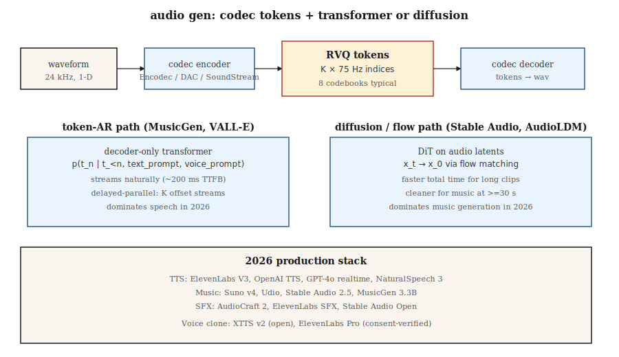

# 音频生成

> 音频是 16-48 kHz 的 1-D 信号。一个 5 秒 clip 是 80-240k 个样本。没有 transformer 直接关注那个序列。2026 年每个生产音频模型的解决方案相同：一个神经编解码器（Encodec、SoundStream、DAC）将音频压缩到 50-75 Hz 的离散 token，一个 transformer 或扩散模型生成 token。

**类型：** Build
**语言：** Python
**前置知识：** Phase 6 · 02（音频特征），Phase 6 · 04（ASR），Phase 8 · 06（DDPM）
**时间：** 约 45 分钟

## 问题

三个音频生成任务：

1. **文本转语音。** 给定文本，生成语音。干净语音是窄带的，有强语音结构——用 transformer-over-token 解决得很好。VALL-E（Microsoft）、NaturalSpeech 3、ElevenLabs、OpenAI TTS。
2. **音乐生成。** 给定提示（文本、旋律、和弦进行、类型），生成音乐。更广泛的分布。MusicGen（Meta）、Stable Audio 2.5、Suno v4、Udio、Riffusion。
3. **音频效果 / 声音设计。** 给定提示，生成环境音或 Foley。AudioGen、AudioLDM 2、Stable Audio Open。

三者都运行在相同的底层：神经音频编解码器 + token-AR 或扩散生成器。

## 核心概念



### 神经音频编解码器

Encodec（Meta，2022）、SoundStream（Google，2021）、Descript Audio Codec（DAC，2023）。卷积编码器将波形压缩为每时间步向量；残差向量量化（RVQ）将每个向量转换为 K 个 codebook 索引的级联。解码器逆转。24 kHz 音频在 2 kbps 使用 8 个 RVQ codebook 在 75 Hz = 600 token/秒。

```
waveform (16000 samples/sec)
    └─ encoder conv ─┐
                     ├─ RVQ layer 1 → indices at 75 Hz
                     ├─ RVQ layer 2 → indices at 75 Hz
                     ├─ ...
                     └─ RVQ layer 8
```

### 顶部的两种生成范式

**Token 自回归。** 将 RVQ token 展平为序列，运行 decoder-only transformer。MusicGen 使用"延迟并行"以 per-stream 偏移并行发出 K 个 codebook 流。VALL-E 从文本提示 + 3 秒语音样本生成语音 token。

**潜在扩散。** 将编解码器 token 打包为连续潜在变量，或用分类扩散建模它们。Stable Audio 2.5 在连续音频潜在变量上使用 flow matching。AudioLDM 2 使用文本到梅尔到音频扩散。

2024-2026 年趋势：flow matching 在音乐上胜出（推理更快，样本更干净），而 token-AR 仍在语音上占主导，因为它天然是因果的且流式良好。

## 生产格局

| 系统 | 任务 | Backbone | 延迟 |
|------|------|----------|------|
| ElevenLabs V3 | TTS | Token-AR + 神经声码器 | 首个 token 约 300ms |
| OpenAI GPT-4o audio | 全双工语音 | 端到端多模态 AR | 约 200ms |
| NaturalSpeech 3 | TTS | 潜在 flow matching | 非流式 |
| Stable Audio 2.5 | 音乐 / SFX | DiT + 音频潜在变量 flow matching | 1 分钟 clip 约 10s |
| Suno v4 | 完整歌曲 | 未公开；疑似 token-AR | 每首歌约 30s |
| Udio v1.5 | 完整歌曲 | 未公开 | 每首歌约 30s |
| MusicGen 3.3B | 音乐 | 在 Encodec 32kHz 上 Token-AR | 实时 |
| AudioCraft 2 | 音乐 + SFX | Flow matching | 5s clip 约 5s |
| Riffusion v2 | 音乐 | 频谱图扩散 | 约 10s |

## 构建

`code/main.py` 模拟核心思想：在两个不同"风格"的合成"音频 token"序列（风格 A 交替高低 token，风格 B 单调递增）上训练一个微型 next-token transformer。条件化风格并采样。

### 第 1 步：合成音频 token

```python
def make_tokens(style, length, vocab_size, rng):
    if style == 0:  # "语音式"：交替
        return [i % vocab_size for i in range(length)]
    # "音乐式"：递增
    return [(i * 3) % vocab_size for i in range(length)]
```

### 第 2 步：训练微型 token 预测器

一个 bigram 风格预测器，以风格为条件。要点是模式：编解码器 token → 交叉熵训练 → 自回归采样。

### 第 3 步：条件采样

给定风格 token 和起始 token，从预测分布中采样下一个 token。继续 20-40 token。

## 陷阱

- **编解码器质量上限输出质量。** 如果编解码器不能忠实地表示声音，再多的生成器质量也无济于事。DAC 是当前开源最佳。
- **RVQ 误差累积。** 每个 RVQ 层对前一个的残差建模。第 1 层的误差会传播。在更高层用温度 0 采样有帮助。
- **音乐结构。** 30 秒 token 是 75 Hz 的 20k+ token。对 transformer 来说很难。MusicGen 使用滑动窗口 + 提示延续；Stable Audio 使用更短 clips + 交叉淡入淡出。
- **边界处的伪影。** 生成 clips 之间的交叉淡入淡入需要仔细的重叠相加。
- **干净数据需求。** 音乐生成器需要数万小时的许可音乐。Suno / Udio 的 RIAA 诉讼（2024 年）将这个问题浮出水面。
- **语音克隆伦理。** 3 秒样本加文本提示足以用 VALL-E / XTTS / ElevenLabs 克隆声音。每个生产模型都需要滥用检测 + 选择退出列表。

## 使用

| 任务 | 2026 年技术栈 |
|------|-------------|
| 商业 TTS | ElevenLabs、OpenAI TTS 或 Azure Neural |
| 语音克隆（经验证同意） | XTTS v2（开源）或 ElevenLabs Pro |
| 背景音乐，快速 | Stable Audio 2.5 API、Suno 或 Udio |
| 带歌词的音乐 | Suno v4 或 Udio v1.5 |
| 音效 / Foley | AudioCraft 2、ElevenLabs SFX 或 Stable Audio Open |
| 实时语音代理 | GPT-4o 实时或 Gemini Live |
| 开源权重音乐研究 | MusicGen 3.3B、Stable Audio Open 1.0、AudioLDM 2 |
| 配音 / 翻译 | HeyGen、ElevenLabs Dubbing |

## 发布

保存为 `outputs/skill-audio-brief.md`。Skill 接收音频简报（任务、时长、风格、声音、许可）并输出：模型 + 托管、提示格式（类型标签、风格描述符、结构标记）、编解码器 + 生成器 + 声码器链、种子协议和评估计划（MOS / CLAP 分数 / TTS 的 CER / 用户 A/B）。

## 练习

1. **简单。** 运行 `code/main.py` 并显式设置风格。验证生成的序列匹配风格的模式。
2. **中等。** 添加延迟并行解码：模拟 2 个 token 流，必须保持 1 步偏移。训练联合预测器。
3. **困难。** 使用 HuggingFace transformers 在本地运行 MusicGen-small。用三个不同提示生成 10 秒 clip；A/B 测试风格遵循度。

## 关键术语

| 术语 | 常见说法 | 实际含义 |
|------|---------|---------|
| 编解码器 | "神经压缩" | 音频编码器/解码器；典型输出是 50-75 Hz token。 |
| RVQ | "残差 VQ" | K 个量化的级联；每个对前一个的残差建模。 |
| Token | "一个编解码器符号" | Codebook 中的离散索引；典型 1024 或 2048。 |
| 延迟并行 | "偏移 codebook" | 发出 K 个带交错偏移的 token 流以减少序列长度。 |
| Flow matching | "2024 年音频赢家" | 比扩散更直路径的替代方案；采样更快。 |
| 语音提示 | "3 秒样本" | 说话人 embedding 或 token 前缀，引导克隆声音。 |
| 梅尔频谱图 | "视觉表示" | 对数幅度感知频谱图；许多 TTS 系统使用。 |
| 声码器 | "梅尔到波形" | 将梅尔频谱图转换回音频的神经组件。 |

## 生产笔记：音频是一个流式问题

音频是用户期望在生成时到达*的*一种输出模态，而不是一次性全部到达。在生产术语中，这意味着 TPOT 很重要（每个输出 token 的时间），因为用户的听力速度是目标吞吐量——而不是他们的阅读速度。对于 16kHz 音频在约 75 token/秒（Encodec）标记化，服务器必须为每个用户生成 ≥75 token/秒以保持播放流畅。

两个架构后果：

- **Flow-matching 音频模型不能简单地流式化。** Stable Audio 2.5 和 AudioCraft 2 一次传递渲染一个固定 clip 长度。要流式化，你将 clip 分块并在边界处重叠——想想滑动窗口扩散——与编解码器 AR 模型相比增加了 100-300ms 延迟开销。

如果产品是"直播语音聊天"或"实时音乐延续"，选择编解码器 AR 路径。如果是"提交时渲染 30 秒 clip"，flow matching 在质量和总延迟上胜出。

## 进一步阅读

- [Défossez et al. (2022). Encodec: High Fidelity Neural Audio Compression](https://arxiv.org/abs/2210.13438) — 编解码器标准。
- [Zeghidour et al. (2021). SoundStream](https://arxiv.org/abs/2107.03312) — 第一个广泛使用的神经音频编解码器。
- [Kumar et al. (2023). High-Fidelity Audio Compression with Improved RVQGAN (DAC)](https://arxiv.org/abs/2306.06546) — DAC。
- [Wang et al. (2023). Neural Codec Language Models are Zero-Shot Text to Speech Synthesizers (VALL-E)](https://arxiv.org/abs/2301.02111) — VALL-E。
- [Copet et al. (2023). Simple and Controllable Music Generation (MusicGen)](https://arxiv.org/abs/2306.05284) — MusicGen。
- [Liu et al. (2023). AudioLDM 2: Learning Holistic Audio Generation with Self-supervised Pretraining](https://arxiv.org/abs/2308.05734) — AudioLDM 2。
- [Stability AI (2024). Stable Audio 2.5](https://stability.ai/news/introducing-stable-audio-2-5) — 2025 年 flow matching 文生音乐。