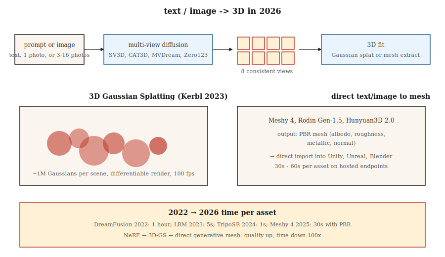

# 3D 生成

> 3D 是 2D 到 3D 杠杆最强的模态。2023 年的突破是 3D Gaussian Splatting。2024-2026 年的生成推送将多视图扩散 + 3D 重建叠加在上面，从单个提示或照片生成对象和场景。

**类型：** Learn
**语言：** Python
**前置知识：** Phase 4（视觉），Phase 8 · 07（潜在扩散）
**时间：** 约 45 分钟

## 问题

3D 内容是痛苦的：

- **表示。** 网格、点云、体素网格、有符号距离场（SDF）、神经辐射场（NeRF）、3D Gaussian。每种都有权衡。
- **数据稀缺。** ImageNet 有 1400 万张图像。最大的干净 3D 数据集（Objaverse-XL，2023 年）有约 1000 万个对象，大部分质量低。
- **内存。** 512³ 体素网格是 1.28 亿个体素；一个有用的场景 NeRF 每光线需要 100 万次采样。生成比重建难。
- **监督。** 对于 2D 图像，你有像素。对于 3D，你通常只有少量 2D 视图，必须提升到 3D。

2026 年的技术栈将两个问题分开。首先，用扩散模型生成*2D 多视图图像*。其次，将*3D 表示*（通常是 Gaussian splatting）拟合到这些图像上。

## 核心概念



### 表示：3D Gaussian Splatting（Kerbl 等人，2023 年）

将场景表示为一团约 100 万个 3D Gaussian。每个有 59 个参数：位置（3）、协方差（6，或四元数 4 + 缩放 3）、不透明度（1）、球谐颜色（3 度 48，0 度 3）。

渲染 = 投影 + alpha 合成。快（1080p 在 4090 上约 100 fps）。可微分。用梯度下降拟合对抗 ground-truth 照片。一个场景在消费级 GPU 上 5-30 分钟拟合。

2023-2024 年的两个创新叠加：
- **生成式 Gaussian splatting。** LGM、LRM、InstantMesh 等模型直接从一张或几张图像预测 Gaussian 云。
- **4D Gaussian Splatting。** 带每帧偏移的 Gaussian 用于动态场景。

### 多视图扩散

微调预训练图像扩散模型以从文本提示或单张图像生成同一对象的多个一致视图。Zero123（Liu 等人，2023 年）、MVDream（Shi 等人，2023 年）、SV3D（Stability，2024 年）、CAT3D（Google，2024 年）。通常输出围绕对象的 4-16 个视图，通过 Gaussian splatting 或 NeRF 提升到 3D。

### 文本到 3D pipeline

| 模型 | 输入 | 输出 | 时间 |
|------|------|------|------|
| DreamFusion（2022） | 文本 | 通过 SDS 的 NeRF | 每个资产约 1 小时 |
| Magic3D | 文本 | 网格 + 纹理 | 约 40 分钟 |
| Shap-E（OpenAI，2023） | 文本 | 隐式 3D | 约 1 分钟 |
| SJC / ProlificDreamer | 文本 | NeRF / 网格 | 约 30 分钟 |
| LRM（Meta，2023） | 图像 | 三平面 | 约 5 秒 |
| InstantMesh（2024） | 图像 | 网格 | 约 10 秒 |
| SV3D（Stability，2024） | 图像 | 新视角 | 约 2 分钟 |
| CAT3D（Google，2024） | 1-64 张图像 | 3D NeRF | 约 1 分钟 |
| TripoSR（2024） | 图像 | 网格 | 约 1 秒 |
| Meshy 4（2025） | 文本 + 图像 | PBR 网格 | 约 30 秒 |
| Rodin Gen-1.5（2025） | 文本 + 图像 | PBR 网格 | 约 60 秒 |
| 腾讯 Hunyuan3D 2.0（2025） | 图像 | 网格 | 约 30 秒 |

2025-2026 年方向：直接文到网格模型，输出适合游戏引擎的 PBR 材质。多视图扩散中间步骤仍然是通用对象上性能最好的配方。

### NeRF（背景）

神经辐射场（Mildenhall 等人，2020 年）。一个微型 MLP 接收 `(x, y, z, 视角方向)` 并输出 `(颜色, 密度)`。通过沿光线积分渲染。在质量上优于基于网格的新视角合成，但渲染速度慢 100-1000 倍。被 Gaussian splatting 在大多数实时用例中超越，但在研究中仍占主导地位。

## 构建

`code/main.py` 实现了一个玩具 2D"Gaussian splatting"拟合：将合成目标图像（平滑渐变）表示为 2D Gaussian splats 的和。通过梯度下降优化位置、颜色和协方差以匹配目标。你看到两个核心操作：前向渲染（splat + alpha 合成）和通过梯度下降拟合。

### 第 1 步：2D Gaussian splat

```python
def gaussian_at(x, y, gaussian):
    px, py = gaussian["pos"]
    sigma = gaussian["sigma"]
    d2 = (x - px) ** 2 + (y - py) ** 2
    return math.exp(-d2 / (2 * sigma * sigma))
```

### 第 2 步：通过求和 splats 渲染

```python
def render(image_size, gaussians):
    img = [[0.0] * image_size for _ in range(image_size)]
    for g in gaussians:
        for y in range(image_size):
            for x in range(image_size):
                img[y][x] += g["color"] * gaussian_at(x, y, g)
    return img
```

真实的 3D Gaussian splatting 通过深度排序 Gaussians 并按顺序 alpha 合成。我们的 2D 玩具只是求和。

### 第 3 步：通过梯度下降拟合

```python
for step in range(steps):
    pred = render(size, gaussians)
    loss = mse(pred, target)
    gradients = compute_grads(pred, target, gaussians)
    update(gaussians, gradients, lr)
```

## 陷阱

- **视图不一致。** 如果独立生成 4 个视图且它们不同意对象结构，3D 拟合会模糊。修复：带共享注意力的多视图扩散。
- **背面幻觉。** 单图像 → 3D 必须发明看不见的一面。质量差异很大。
- **Gaussian splatting 爆炸。** 无约束训练增长到 1000 万 splats 并过拟合。3D-GS 原始论文的致密化 + 剪枝启发式是必不可少的。
- **拓扑问题。** 来自隐式场（SDF）的网格通常有孔或自交。在发货前运行重新网格化器（例如 blender 的体素重新网格化）。
- **训练数据许可。** Objaverse 有混合许可；商业使用因模型而异。

## 使用

| 任务 | 2026 年选择 |
|------|-----------|
| 从照片重建场景 | Gaussian splatting（3DGS、Gsplat、Scaniverse） |
| 游戏文生 3D 对象 | Meshy 4 或 Rodin Gen-1.5（PBR 输出） |
| 图像到 3D | Hunyuan3D 2.0、TripoSR、InstantMesh |
| 从少量图像合成新视角 | CAT3D、SV3D |
| 动态场景重建 | 4D Gaussian Splatting |
| Avatar / 穿衣人 | Gaussian Avatar、HUGS |
| 研究 / SOTA | 上周发布的任何内容 |

对于在游戏或电子商务 pipeline 中发布生产 3D：Meshy 4 或 Rodin Gen-1.5 输出直接进入 Unity / Unreal 的 PBR 网格。

## 发布

保存为 `outputs/skill-3d-pipeline.md`。Skill 接收 3D 简报（输入：文本 / 一张图像 / 少量图像；输出：网格 / splat / NeRF；用途：渲染 / 游戏 / VR）并输出：pipeline（多视图扩散 + 拟合，或直接网格模型）、基础模型、迭代预算、拓扑后处理、所需材质通道。

## 练习

1. **简单。** 用 4、16、64 个 Gaussian 运行 `code/main.py`。报告最终 MSE vs 目标。
2. **中等。** 扩展到彩色 Gaussian（RGB）。确认重建匹配目标颜色模式。
3. **困难。** 使用 gsplat 或 Nerfstudio，从 50 张照片 capture 重建真实对象。报告拟合时间和在保留视图上的最终 SSIM。

## 关键术语

| 术语 | 常见说法 | 实际含义 |
|------|---------|---------|
| 3D Gaussian Splatting | "3DGS" | 场景作为 3D Gaussian 云；可微分 alpha 合成渲染。 |
| NeRF | "神经辐射场" | 输出 3D 点颜色 + 密度的 MLP；通过光线积分渲染。 |
| 三平面 | "三个 2D 平面" | 将 3D 分解为三个 2D 轴对齐特征网格；比体积便宜。 |
| SDS | "分数蒸馏采样" | 使用 2D 扩散分数作为伪梯度训练 3D 模型。 |
| 多视图扩散 | "一次多视图" | 输出批量一致相机视图的扩散模型。 |
| PBR | "基于物理的渲染" | 带 albedo、roughness、metallic、normal 通道的材质。 |
| 致密化 | "增长 splat" | 3DGS 训练启发式：在高梯度区域分割 / 克隆 splat。 |

## 生产笔记：3D 还没有共享底层

与图像（潜在扩散 + DiT）和视频（时空 DiT）不同，3D 在 2026 年没有单一主导运行时。生产决策树在表示上分叉：

- **NeRF / 三平面。** 推理是光线行进 + 每样本 MLP 前向传播。512² 渲染需要数百万次 MLP 前向传播。积极批处理光线样本；SDPA/xformers 适用。
- **多视图扩散 + LRM 重建。** 两阶段 pipeline。阶段 1（多视图 DiT）就像 Lesson 07 那样的扩散服务器。阶段 2（LRM transformer）是对视图的一次性前向传递。整体延迟配置文件是"扩散 + 一次性"——相应地选择每阶段服务原语。
- **SDS / DreamFusion。** 每个资产优化，不是推理。构建作业，而不是请求处理程序。

对于 2026 年的大多数产品，正确的答案是"按请求运行多视图扩散模型，异步重建为 3DGS，实时查看时提供 3DGS"。这在 GPU 推理服务器（快）和离线优化器（慢）之间干净地分配工作负载。

## 进一步阅读

- [Mildenhall et al. (2020). NeRF: Representing Scenes as Neural Radiance Fields](https://arxiv.org/abs/2003.08934) — NeRF。
- [Kerbl et al. (2023). 3D Gaussian Splatting for Real-Time Radiance Field Rendering](https://arxiv.org/abs/2308.04079) — 3DGS。
- [Poole et al. (2022). DreamFusion: Text-to-3D using 2D Diffusion](https://arxiv.org/abs/2209.14988) — SDS。
- [Liu et al. (2023). Zero-1-to-3: Zero-shot One Image to 3D Object](https://arxiv.org/abs/2303.11328) — Zero123。
- [Shi et al. (2023). MVDream](https://arxiv.org/abs/2308.16512) — 多视图扩散。
- [Hong et al. (2023). LRM: Large Reconstruction Model for Single Image to 3D](https://arxiv.org/abs/2311.04400) — LRM。
- [Gao et al. (2024). CAT3D: Create Anything in 3D with Multi-View Diffusion Models](https://arxiv.org/abs/2405.10314) — CAT3D。
- [Stability AI (2024). Stable Video 3D (SV3D)](https://stability.ai/research/sv3d) — SV3D。