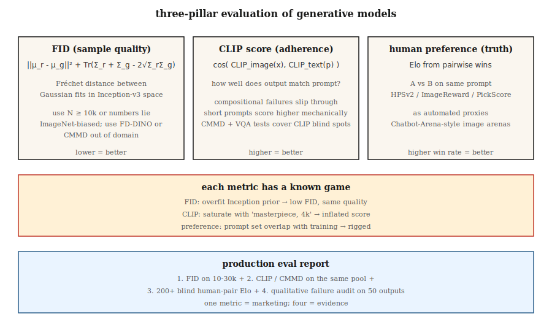

# 评估 — FID、CLIP 分数、人工偏好

> 每个生成模型排行榜都引用 FID、CLIP 分数和来自人工偏好 arena 的胜率。每个数字都有一种坚定的研究人员可以游戏的失败模式。如果你不了解失败模式，你就无法区分真正的改进和游戏出来的结果。

**类型：** Build
**语言：** Python
**前置知识：** Phase 8 · 01（分类体系），Phase 2 · 04（评估指标）
**时间：** 约 45 分钟

## 问题

生成模型根据*样本质量*和*条件化遵循度*来判断。两者都没有闭式度量。你的模型必须渲染 10,000 张图像；某物必须为它们分配数字；你必须相信跨模型族、跨分辨率、跨架构的数字。三个指标在 2014-2026 年的考验中存活下来：

- **FID（Fréchet Inception Distance）。** 真实分布与生成分布在 Inception 网络特征空间中的距离。越低越好。
- **CLIP 分数。** 生成的图像的 CLIP 图像 embedding 与提示的 CLIP 文本 embedding 之间的余弦相似度。越高越好。衡量提示遵循度。
- **人工偏好。** 在相同提示上让两个模型正面对决，让人类（或 GPT-4 级模型）选择更好的，汇总为 Elo 分数。

你还会看到：IS（Inception 分数，大多已淘汰）、KID、CMMD、ImageReward、PickScore、HPSv2、MJHQ-30k。每个都纠正了前一个的一个失败。

## 核心概念



### FID — 样本质量

Heusel 等人（2017 年）。步骤：

1. 为 N 张真实图像和 N 张生成图像提取 Inception-v3 特征（2048-D）。
2. 对每个池拟合高斯：计算均值 `μ_r, μ_g` 和协方差 `Σ_r, Σ_g`。
3. FID = `||μ_r - μ_g||² + Tr(Σ_r + Σ_g - 2 · (Σ_r · Σ_g)^0.5)`。

解读：特征空间中两个多元高斯的 Fréchet 距离。越低 = 分布越相似。

失败模式：
- **小 N 有偏。** FID 是特征分布上的均方误差——小 N 低估协方差，给出虚假低 FID。始终使用 N ≥ 10,000。
- **依赖 Inception。** Inception-v3 在 ImageNet 上训练。远离 ImageNet 的领域（人脸、艺术、文字图像）产生无意义的 FID。使用领域特定的特征提取器。
- **游戏。** 对 Inception 先验过拟合给出低 FID 而没有视觉质量改进。用下面的 CMMD 来打败它。

### CLIP 分数 — 提示遵循度

Radford 等人（2021 年）。对于生成的图像 + 提示：

```
clip_score = cos_sim( CLIP_image(x_gen), CLIP_text(prompt) )
```

在 30k 张生成图像上平均 → 一个在模型之间可比较的标量。

失败模式：
- **CLIP 自己的盲点。** CLIP 组合推理弱（"蓝球上的红立方体"经常失败）。模型可以在 CLIP 分数上排名很好而没有真正遵循复杂提示。
- **短提示偏差。** 短提示在野外有更多 CLIP 图像匹配。更长的提示在机械上 CLIP 分数更低。
- **提示游戏。** 在提示中包含"高质量、4k、杰作"会膨胀 CLIP 分数而不改善图像-文本绑定。

CMMD（Jayasumana 等人，2024 年）修复了其中一些：使用 CLIP 特征而不是 Inception，最大均值差异而不是 Fréchet。在检测微妙质量差异方面更好。

### 人工偏好——ground truth

选择一个提示池。用模型 A 和模型 B 生成。在人类（或强 LLM 评判）面前显示配对。将胜率汇总为 Elo 或 Bradley-Terry 分数。基准：

- **PartiPrompts（Google）**：1,600 个多样化提示，12 个类别。
- **HPSv2**：107k 人工注释，广泛用作自动化代理。
- **ImageReward**：137k 提示-图像偏好对，MIT 许可。
- **PickScore**：在 Pick-a-Pic 2.6M 偏好上训练。
- **Chatbot Arena 风格图像 arena**：https://imagearena.ai/ 等。

失败模式：
- **评判者差异。** 非专家与专家有不同的偏好。两者都用。
- **提示分布。** 精心挑选的提示偏向一个模型族。始终记录。
- **LLM 评判奖励黑客。** GPT-4 评判会被漂亮但错误的输出欺骗。用人工三角验证。

## 一起使用

生产评估报告应包括：

1. 与保留真实分布上 10-30k 样本的 FID（样本质量）。
2. 同一样本与其提示的 CLIP 分数 / CMMD（遵循度）。
3. 与前一模型在盲目 arena 中的胜率（整体偏好）。
4. 失败模式分析：50 个随机采样的输出，标记已知问题（手部解剖、文字渲染、一致物体数量）。

任何一个指标都是谎言。三个互相印证的指标 + 定性审查是一个主张。

## 构建

`code/main.py` 在合成"特征向量"（我们使用 4-D 向量作为 Inception 特征的替身）上实现 FID、类 CLIP 分数和 Elo 聚合。你看到：

- 在小 N 和大 N 上计算 FID——偏差。
- "CLIP 分数"作为特征池之间的余弦相似度。
- 来自合成偏好流的 Elo 更新规则。

### 第 1 步：四行代码的 FID

```python
def fid(real_features, gen_features):
    mu_r, cov_r = mean_and_cov(real_features)
    mu_g, cov_g = mean_and_cov(gen_features)
    mean_diff = sum((a - b) ** 2 for a, b in zip(mu_r, mu_g))
    trace_term = trace(cov_r) + trace(cov_g) - 2 * sqrt_cov_product(cov_r, cov_g)
    return mean_diff + trace_term
```

### 第 2 步：CLIP 风格余弦相似度

```python
def clip_like(image_feat, text_feat):
    dot = sum(a * b for a, b in zip(image_feat, text_feat))
    norm = math.sqrt(dot_self(image_feat) * dot_self(text_feat))
    return dot / max(norm, 1e-8)
```

### 第 3 步：Elo 聚合

```python
def elo_update(r_a, r_b, winner, k=32):
    expected_a = 1 / (1 + 10 ** ((r_b - r_a) / 400))
    actual_a = 1.0 if winner == "a" else 0.0
    r_a_new = r_a + k * (actual_a - expected_a)
    r_b_new = r_b - k * (actual_a - expected_a)
    return r_a_new, r_b_new
```

## 陷阱

- **N=1000 时的 FID。** 启发式在 N<10k 时不可靠。报告低 N FID 的论文在游戏。
- **跨分辨率比较 FID。** Inception 的 299×299 resize 改变特征分布。仅在匹配分辨率下比较。
- **报告单一种子。** 最少运行 3 个种子。报告标准差。
- **通过负提示膨胀 CLIP 分数。** 一些 pipeline 通过过度拟合提示来提升 CLIP。检查视觉饱和度。
- **Elo 来自提示重叠的偏差。** 如果两个模型都在训练期间看到了基准提示，Elo 就毫无意义。使用保留的提示集。
- **人工评估付费人群偏见。** Prolific、MTurk 注释者偏向年轻 / 科技友好。与招募的艺术 / 设计专家混合。

## 使用

2026 年生产评估协议：

| 支柱 | 最低要求 | 推荐 |
|------|---------|------|
| 样本质量 | 10k vs 保留真实的 FID | + 5k 上 CMMD + 每类别子集 FID |
| 提示遵循度 | 30k 上 CLIP 分数 | + HPSv2 + ImageReward + VQA 式问答 |
| 偏好 | 200 对盲目 vs 基线 | + 2000 对人工 + LLM 评判 + Chatbot Arena |
| 失败分析 | 50 个人工标记 | 500 个人工标记 + 自动化安全分类器 |

报告中的所有四个支柱 = 主张。任何一个单独 = 营销。

## 发布

保存为 `outputs/skill-eval-report.md`。Skill 接收新模型 checkpoint + 基线并输出完整评估计划：样本量、指标、失败模式探测、签收标准。

## 练习

1. **简单。** 运行 `code/main.py`。在同一合成分布上比较 N=100 vs N=1000 时的 FID。报告偏差幅度。
2. **中等。** 从合成 CLIP 风格特征实现 CMMD（见 Jayasumana 等人，2024 年公式）。与 FID 相比，检测质量差异的灵敏度如何？
3. **困难。** 复制 HPSv2 设置：从 Pick-a-Pic 子集中取 1000 个图像-提示对，在偏好上微调小型 CLIP 基础评分器，并测量其与保留集的 agreement。

## 关键术语

| 术语 | 常见说法 | 实际含义 |
|------|---------|---------|
| FID | "Fréchet Inception Distance" | 真实与生成 Inception 特征的高斯拟合的 Fréchet 距离。 |
| CLIP 分数 | "文本-图像相似度" | CLIP 图像和文本 embedding 之间的余弦相似度。 |
| CMMD | "FID 的替代" | CLIP 特征 MMD；偏见更少，无需高斯假设。 |
| IS | "Inception 分数" | Exp KL(p(y|x) || p(y))；与现代模型相关性差，已淘汰。 |
| HPSv2 / ImageReward / PickScore | "习得偏好代理" | 在人类偏好上训练的小模型；用作自动评判。 |
| Elo | "国际象棋评分" | 配对胜率的 Bradley-Terry 汇总。 |
| PartiPrompts | "基准提示集" | 1,600 个 Google 策划提示，跨 12 个类别。 |
| FD-DINO | "自监督替代" | 使用 DINOv2 特征的 FD；用于 ImageNet 以外的领域更好。 |

## 生产笔记：评估也是推理工作负载

在 10k 样本上运行 FID 意味着生成 10k 张图像。对于 L4 单卡上 1024² 的 50 步 SDXL 基础，那是约 11 小时的单请求推理。评估预算是真实的，框架与离线推理场景完全相同（最大化吞吐量，忽略 TTFT）：

- **Batch hard，忘记延迟。** 离线评估 = 在内存允许的最大尺寸下静态批处理。`pipe(...).images` 带上 `num_images_per_prompt=8` 在 80GB H100 上比单请求 wall-clock 快 4-6 倍。
- **缓存真实特征。** 真实参考集上的 Inception（FID）或 CLIP（CLIP 分数、CMMD）特征提取运行*一次*，存储为 `.npz`。不要在每次评估时重新计算。

对于 CI / 回归门：每次 PR 在 500 样本子集上运行 FID + CLIP 分数（约 30 分钟）；每晚运行完整 10k FID + HPSv2 + Elo。

## 进一步阅读

- [Heusel et al. (2017). GANs Trained by a Two Time-Scale Update Rule Converge to a Local Nash Equilibrium (FID)](https://arxiv.org/abs/1706.08500) — FID 论文。
- [Jayasumana et al. (2024). Rethinking FID: Towards a Better Evaluation Metric for Image Generation (CMMD)](https://arxiv.org/abs/2401.09603) — CMMD。
- [Radford et al. (2021). Learning Transferable Visual Models from Natural Language Supervision (CLIP)](https://arxiv.org/abs/2103.00020) — CLIP。
- [Wu et al. (2023). HPSv2: A Comprehensive Human Preference Score](https://arxiv.org/abs/2306.09341) — HPSv2。
- [Xu et al. (2023). ImageReward: Learning and Evaluating Human Preferences for Text-to-Image Generation](https://arxiv.org/abs/2304.05977) — ImageReward。
- [Yu et al. (2023). Scaling Autoregressive Models for Content-Rich Text-to-Image Generation (Parti + PartiPrompts)](https://arxiv.org/abs/2206.10789) — PartiPrompts。
- [Stein et al. (2023). Exposing flaws of generative model evaluation metrics](https://arxiv.org/abs/2306.04675) — 失败模式调查。