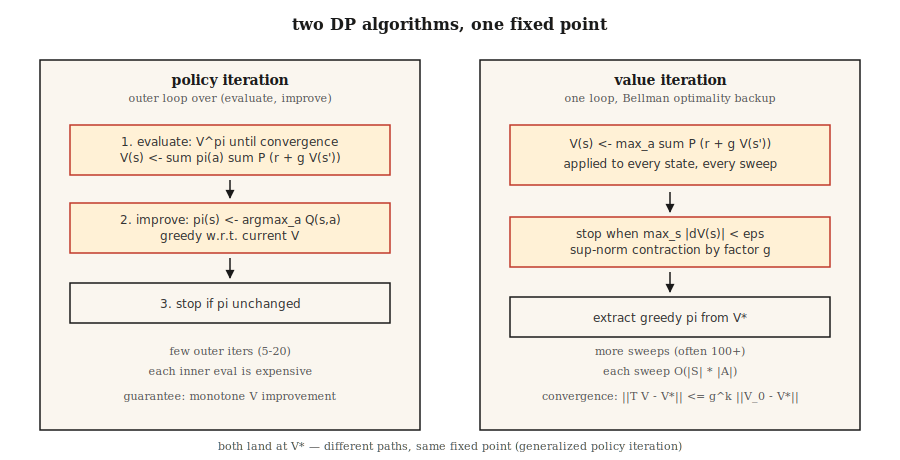

# 动态规划——策略迭代与值迭代

> 动态规划是"作弊版"的 RL。你已经知道转移函数和奖励函数；只需迭代 Bellman 方程直到 `V` 或 `π` 不再变化。这是每个基于采样的方法试图逼近的基准。

**类型：** 构建
**语言：** Python
**前置要求：** Phase 9 · 01（MDP）
**时间：** 约 75 分钟

## 问题

你有一个已知模型的 MDP：可以对任意状态-动作对查询 `P(s' | s, a)` 和 `R(s, a, s')`。库存经理知道需求分布。棋盘游戏有确定性转移。GridWorld 只有四行 Python。你有的是一个*模型*。

无模型 RL（Q-learning、PPO、REINFORCE）是为了你没有模型的情况而发明的——你只能从环境中采样。但当你有模型时，有更快、更好的方法：动态规划。Bellman 在 1957 年设计出它们。它们至今仍是正确性的定义：当人们说"这个 MDP 的最优策略"，他们指的是 DP 会返回的策略。

2026 年你需要它们有三个原因。第一，RL 研究中的每个表格环境（GridWorld、FrozenLake、CliffWalking）都用 DP 来产生金牌策略。第二，精确值让你能够*调试*采样方法：如果 Q-learning 对 `V*(s_0)` 的估计与 DP 答案相差 30%，你的 Q-learning 有 bug。第三，现代离线 RL 和规划方法（MCTS、AlphaZero 的搜索、Phase 9 · 10 的基于模型的 RL）都在一个学到的或给定的模型上迭代 Bellman backup。

## 概念



**两个算法，都是 Bellman 上的不动点迭代。**

**策略迭代。** 交替执行两个步骤直到策略不再变化。

1. *评估：* 给定策略 `π`，通过反复应用 `V(s) ← Σ_a π(a|s) Σ_{s',r} P(s',r|s,a) [r + γ V(s')]` 直到收敛来计算 `V^π`。
2. *改进：* 给定 `V^π`，使 `π` 对 `V^π` 贪婪：`π(s) ← argmax_a Σ_{s',r} P(s',r|s,a) [r + γ V(s')]`。

收敛是有保证的，因为 (a) 每次改进步骤要么保持 `π` 不变，要么对某个状态严格增加 `V^π`，(b) 确定性策略空间是有限的。即使在大状态空间中通常也只需约 5–20 轮外迭代就收敛。

**值迭代。** 将评估和改进合并为一次扫描。应用 Bellman *最优性*方程：

`V(s) ← max_a Σ_{s',r} P(s',r|s,a) [r + γ V(s')]`

重复直到 `max_s |V_{new}(s) - V(s)| < ε`。最后通过取贪婪动作来提取策略。每次迭代严格更快——没有内层评估循环——但通常需要更多迭代才能收敛。

**广义策略迭代（GPI）。** 统一框架。值函数和策略处于双向改进循环中；任何驱动两者趋于相互一致的方法（异步值迭代、修正策略迭代、Q-learning、Actor-Critic、PPO）都是 GPI 的实例。

**为什么 `γ < 1` 很关键。** Bellman 算子是 sup 范数下的 `γ`-压缩映射：`||T V - T V'||_∞ ≤ γ ||V - V'||_∞`。压缩意味着唯一不动点和几何收敛。去掉的 `γ < 1` 保证——你需要有限视野或吸收型终止状态。

## 构建

### 步骤 1：构建 GridWorld MDP 模型

使用 Lesson 01 中相同的 4×4 GridWorld。增加一个随机变体：以概率 `0.1` 智能体滑到随机的垂直方向。

```python
SLIP = 0.1

def transitions(state, action):
    if state == TERMINAL:
        return [(state, 0.0, 1.0)]
    outcomes = []
    for direction, prob in action_probs(action):
        outcomes.append((apply_move(state, direction), -1.0, prob))
    return outcomes
```

`transitions(s, a)` 返回一个 `(s', r, p)` 列表。这就是整个模型。

### 步骤 2：策略评估

给定策略 `π(s) = {action: prob}`，迭代 Bellman 方程直到 `V` 不再变化：

```python
def policy_evaluation(policy, gamma=0.99, tol=1e-6):
    V = {s: 0.0 for s in states()}
    while True:
        delta = 0.0
        for s in states():
            v = sum(pi_a * sum(p * (r + gamma * V[s_prime])
                              for s_prime, r, p in transitions(s, a))
                   for a, pi_a in policy(s).items())
            delta = max(delta, abs(v - V[s]))
            V[s] = v
        if delta < tol:
            return V
```

### 步骤 3：策略改进

用对 `V` 贪婪的策略替换 `π`。如果 `π` 没有变化，返回——已到最优。

```python
def policy_improvement(V, gamma=0.99):
    new_policy = {}
    for s in states():
        best_a = max(
            ACTIONS,
            key=lambda a: sum(p * (r + gamma * V[s_prime])
                              for s_prime, r, p in transitions(s, a)),
        )
        new_policy[s] = best_a
    return new_policy
```

### 步骤 4：拼接起来

```python
def policy_iteration(gamma=0.99):
    policy = {s: "up" for s in states()}   # 任意起始
    for _ in range(100):
        V = policy_evaluation(lambda s: {policy[s]: 1.0}, gamma)
        new_policy = policy_improvement(V, gamma)
        if new_policy == policy:
            return V, policy
        policy = new_policy
```

在 4×4 上典型收敛：4–6 轮外迭代。输出 `V*(0,0) ≈ -6` 和一个严格减少步数的策略。

### 步骤 5：值迭代（单循环版本）

```python
def value_iteration(gamma=0.99, tol=1e-6):
    V = {s: 0.0 for s in states()}
    while True:
        delta = 0.0
        for s in states():
            v = max(sum(p * (r + gamma * V[s_prime])
                       for s_prime, r, p in transitions(s, a))
                   for a in ACTIONS)
            delta = max(delta, abs(v - V[s]))
            V[s] = v
        if delta < tol:
            break
    policy = policy_improvement(V, gamma)
    return V, policy
```

相同的定点，更少的代码行数。

## 陷阱

- **忘记处理终止状态。** 如果对吸收状态应用 Bellman，它仍然会挑选一个"最佳动作"但什么都不改变。用 `if s == terminal: V[s] = 0` 来守卫。
- **sup 范数 vs L2 收敛。** 使用 `max |V_new - V|`，不是平均值。理论保证是基于 sup 范数的。
- **原地更新 vs 同步更新。** 原地更新 `V[s]`（Gauss-Seidel）比单独的 `V_new` 字典（Jacobi）收敛更快。生产代码使用原地更新。
- **策略平局。** 如果两个动作有相等的 Q 值，`argmax` 可能在每次迭代中以不同方式打破平局，导致"策略稳定"检查振荡。使用稳定的平局打破规则（固定顺序中的第一个动作）。
- **状态空间爆炸。** DP 每轮扫描是 `O(|S| · |A|)`。在约 10⁷ 个状态以内有效。超过这个规模，你需要函数近似（Phase 9 · 05 起）。

## 使用

2026 年，DP 是正确性基准和规划器的内层循环：

| 用例 | 方法 |
|----------|--------|
| 精确求解小型表格 MDP | 值迭代（更简单）或策略迭代（外迭代更少） |
| 验证 Q-learning / PPO 实现 | 在玩具环境上与 DP 最优 V* 比较 |
| 基于模型的 RL（Phase 9 · 10） | 在学到的转移模型上做 Bellman backup |
| AlphaZero / MuZero 中的规划 | 蒙特卡洛树搜索 = 异步 Bellman backup |
| 离线 RL（CQL、IQL） | 保守 Q 迭代——对 OOD 动作带惩罚的 DP |

每次有人说"最优值函数"，他们指的是"DP 不动点"。当你在论文中看到 `V*` 或 `Q*` 时，脑中浮现的就是这个循环。

## 交付

保存为 `outputs/skill-dp-solver.md`：

```markdown
---
name: dp-solver
description: 通过策略迭代或值迭代精确求解小型表格 MDP。报告收敛行为。
version: 1.0.0
phase: 9
lesson: 2
tags: [rl, dynamic-programming, bellman]
---

给定一个已知模型的 MDP，输出：

1. 选择。策略迭代 vs 值迭代。与 |S|、|A|、γ 相关的理由。
2. 初始化。V_0、起始策略。收敛敏感性。
3. 停止。Sup 范数容差 ε。预期扫描次数。
4. 验证。精确计算的 V*(s_0)。提取的贪婪策略。
5. 使用。如何用此基准来调试/评估基于采样的方法。

拒绝在状态空间 > 10⁷ 上运行 DP。拒绝在没有 sup 范数检查的情况下声称收敛。标记任何在无限视野任务上 γ ≥ 1 的情况为保证违反。
```

## 练习

1. **简单。** 在 4×4 GridWorld 上运行值迭代，`γ ∈ {0.9, 0.99}`。直到 `max |ΔV| < 1e-6` 需要多少轮扫描？将 `V*` 打印为 4×4 网格。
2. **中等。** 在*随机* GridWorld（滑动概率 `0.1`）上比较策略迭代 vs 值迭代。计数：扫描次数、墙上时间、最终 `V*(0,0)`。哪个在迭代次数上收敛更快？哪个在墙上时间上更快？
3. **困难。** 构建修正策略迭代：在评估步骤中只运行 `k` 轮扫描而不是到收敛。绘制 `V*(0,0)` 误差 vs `k`，`k ∈ {1, 2, 5, 10, 50}`。曲线告诉你评估/改进权衡的什么信息？

## 关键术语

| 术语 | 人们怎么说 | 实际指什么 |
|------|-----------------|-----------------------|
| 策略迭代（Policy Iteration） | "DP 算法" | 交替执行评估（`V^π`）和改进（对 `V^π` 贪婪的 `π`）直到策略不再变化。 |
| 值迭代（Value Iteration） | "更快的 DP" | 一次扫描应用 Bellman 最优性 backup；几何收敛到 `V*`。 |
| Bellman 算子 | "递归" | `(T V)(s) = max_a Σ P (r + γ V(s'))`；sup 范数下的 `γ`-压缩。 |
| 压缩映射（Contraction） | "为什么 DP 收敛" | 任何满足 `||T x - T y|| ≤ γ ||x - y||` 的算子 `T` 有唯一不动点。 |
| GPI | "一切皆 DP" | 广义策略迭代：任何驱动 `V` 和 `π` 趋于相互一致的方法。 |
| 同步更新 | "Jacobi 风格" | 在整轮扫描中使用旧的 `V`；干净可分析但更慢。 |
| 原地更新 | "Gauss-Seidel 风格" | 在 `V` 被更新的同时使用它；实践中收敛更快。 |

## 拓展阅读

- [Sutton & Barto (2018). Ch. 4 — Dynamic Programming](http://incompleteideas.net/book/RLbook2020.pdf) — 策略迭代和值迭代的标准表述。
- [Bertsekas (2019). Reinforcement Learning and Optimal Control](http://www.athenasc.com/rlbook.html) — 压缩映射论证的严格处理。
- [Puterman (2005). Markov Decision Processes](https://onlinelibrary.wiley.com/doi/book/10.1002/9780470316887) — 修正策略迭代及其收敛分析。
- [Howard (1960). Dynamic Programming and Markov Processes](https://mitpress.mit.edu/9780262582300/dynamic-programming-and-markov-processes/) — 原始策略迭代论文。
- [Bertsekas & Tsitsiklis (1996). Neuro-Dynamic Programming](http://www.athenasc.com/ndpbook.html) — 从 DP 到后续每课使用的近似 DP/深度 RL 的桥梁。