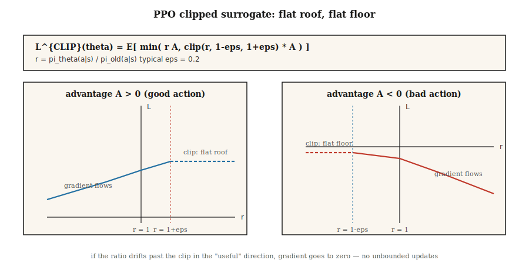

# 近端策略优化（PPO）

> A2C 在一次更新后丢弃每个 rollout。PPO 将策略梯度包装在一个裁剪的重要性比率中，这样你就可以在相同数据上做 10+ 轮 epoch 而不会让策略爆炸。Schulman 等人（2017）。2026 年仍然是默认的策略梯度算法。

**类型：** 构建
**语言：** Python
**前置要求：** Phase 9 · 06（REINFORCE），Phase 9 · 07（Actor-Critic）
**时间：** 约 75 分钟

## 问题

A2C（Lesson 07）是在线策略的：梯度 `E_{π_θ}[A · ∇ log π_θ]` 要求数据从*当前* `π_θ` 采样。执行一次更新后，`π_θ` 变化；你使用的数据现在就是离策略的。复用它则梯度有偏。

Rollout 是昂贵的。在 Atari 上，一个跨 8 个环境 × 128 步的 rollout = 1024 个转移和约十秒的环境时间。在一次梯度步后丢弃是浪费的。

信任域策略优化（TRPO，Schulman 2015）是第一个修复：约束每次更新使旧策略和新策略之间的 KL 散度保持在 `δ` 以下。理论上干净，但每次更新需要共轭梯度求解。2026 年没人跑 TRPO。

PPO（Schulman 等人 2017）用简单的裁剪目标替换了硬信任域约束。一行额外代码。每个 rollout 十轮 epoch。没有共轭梯度。足够好的理论保证。九年后它仍然是所有事情（从 MuJoCo 到 RLHF）的默认策略梯度算法。

## 概念



**重要性比率。**

`r_t(θ) = π_θ(a_t | s_t) / π_{θ_old}(a_t | s_t)`

这是新策略相对于收集数据的策略的似然比。`r_t = 1` 意味着没有变化。`r_t = 2` 意味着新策略选择 `a_t` 的可能性是旧策略的两倍。

**裁剪替代目标。**

`L^{CLIP}(θ) = E_t [ min( r_t(θ) A_t, clip(r_t(θ), 1-ε, 1+ε) A_t ) ]`

两项：

- 如果优势 `A_t > 0` 且比率试图增长超过 `1 + ε`，裁剪将梯度展平——不要将好动作推到旧概率的 `+ε` 以上。
- 如果优势 `A_t < 0` 且比率试图增长超过 `1 - ε`（意味着我们会使坏动作比其裁剪减少更有可能），裁剪限制梯度——不要将坏动作推到 `-ε` 以下。

`min` 处理另一个方向：如果比率已经向*有益*方向移动，你仍然得到梯度（有益侧不裁剪）。

典型 `ε = 0.2`。将目标绘制为 `r_t` 的函数：一个分段线性函数，在"好侧"有平坦屋顶，在"坏侧"有平坦地板。

**完整 PPO 损失。**

`L(θ, φ) = L^{CLIP}(θ) - c_v · (V_φ(s_t) - V_t^{target})² + c_e · H(π_θ(·|s_t))`

与 A2C 相同的 actor-critic 结构。三项系数，通常 `c_v = 0.5`，`c_e = 0.01`，`ε = 0.2`。

**训练循环。**

1. 跨 `N` 个并行环境每个 `T` 步收集 `N × T` 个转移。
2. 计算优势（GAE），将它们冻结为常量。
3. 将 `π_{θ_old}` 冻结为当前 `π_θ` 的快照。
4. 对于 `K` 轮 epoch，对每个 `(s, a, A, V_target, log π_old(a|s))` 小批量：
   - 计算 `r_t(θ) = exp(log π_θ(a|s) - log π_old(a|s))`。
   - 应用 `L^{CLIP}` + 值损失 + 熵。
   - 梯度步。
5. 丢弃 rollout。回到步骤 1。

`K = 10`，小批量 64 是一组标准超参数。PPO 是稳健的：精确数字在 ±50% 以内很少出问题。

**KL 惩罚变体。** 原始论文提出一个使用自适应 KL 惩罚的替代方案：`L = L^{PG} - β · KL(π_θ || π_old)`，其中 `β` 根据观察到的 KL 调整。裁剪版本成为主流；KL 变体在 RLHF 中保留（在那里对参考策略的 KL 是一个你总是想要的独立约束）。

## 构建

### 步骤 1：在 rollout 时捕获 `log π_old(a | s)`

```python
for step in range(T):
    probs = softmax(logits(theta, state_features(s)))
    a = sample(probs, rng)
    s_next, r, done = env.step(s, a)
    buffer.append({
        "s": s, "a": a, "r": r, "done": done,
        "v_old": value(w, state_features(s)),
        "log_pi_old": log(probs[a] + 1e-12),
    })
    s = s_next
```

快照在 rollout 时拍摄一次。在更新轮 epoch 期间不变化。

### 步骤 2：计算 GAE 优势（Lesson 07）

与 A2C 相同。在 batch 上归一化。

### 步骤 3：裁剪替代更新

```python
for _ in range(K_EPOCHS):
    for mb in minibatches(buffer, size=64):
        for rec in mb:
            x = state_features(rec["s"])
            probs = softmax(logits(theta, x))
            logp = log(probs[rec["a"]] + 1e-12)
            ratio = exp(logp - rec["log_pi_old"])
            adv = rec["advantage"]
            surrogate = min(
                ratio * adv,
                clamp(ratio, 1 - EPS, 1 + EPS) * adv,
            )
            # 反向传播 -surrogate，加上值损失，减去熵
            grad_logpi = onehot(rec["a"]) - probs
            if (adv > 0 and ratio >= 1 + EPS) or (adv < 0 and ratio <= 1 - EPS):
                pg_grad = 0.0  # 裁剪
            else:
                pg_grad = ratio * adv
            for i in range(N_ACTIONS):
                for j in range(N_FEAT):
                    theta[i][j] += LR * pg_grad * grad_logpi[i] * x[j]
```

"裁剪 → 零梯度"模式是 PPO 的核心。如果新策略已经在有益方向上漂移太远，更新停止。

### 步骤 4：值和熵

添加 critic 目标的 MSE 和 actor 上的熵奖励，与 A2C 相同。

### 步骤 5：诊断

每次更新关注三件事：

- **平均 KL** `E[log π_old - log π_θ]`。应保持在 `[0, 0.02]` 内。如果超过 `0.1`，降低 `K_EPOCHS` 或 `LR`。
- **裁剪比例**——其比率落在 `[1-ε, 1+ε]` 之外的样本比例。应约为 `~0.1-0.3`。如果 `~0`，裁剪从不触发 → 提高 `LR` 或 `K_EPOCHS`。如果 `~0.5+`，你过拟合了 rollout → 降低它们。
- **已解释方差** `1 - Var(V_target - V_pred) / Var(V_target)`。Critic 质量指标。应随着 critic 学习攀升至 1。

## 陷阱

- **裁剪系数调错。** `ε = 0.2` 是事实上的标准。降到 `0.1` 使更新过于谨慎；`0.3+` 引发不稳定性。
- **轮 epoch 太多。** `K > 20` 经常不稳定，因为策略远离 `π_old`。限制 epoch，特别是对大网络。
- **无奖励归一化。** 大奖励尺度吃进裁剪范围。在计算优势前归一化奖励（运行标准差）。
- **忘记优势归一化。** 每 batch 零均值/单位方差归一化是标准的。跳过它会在大多数基准上毁掉 PPO。
- **学习率不衰减。** PPO 从线性 LR 衰减到零中受益。常数 LR 通常更差。
- **重要性比率数学错误。** 始终 `exp(log_new - log_old)` 以保证数值稳定性，不是 `new / old`。
- **错误梯度符号。** 最大化替代 = *最小化* `-L^{CLIP}`。符号翻转是最常见的 PPO bug。

## 使用

PPO 是 2026 年跨数量惊人领域中的默认 RL 算法：

| 用例 | PPO 变体 |
|----------|-------------|
| MuJoCo / 机器人控制 | 高斯策略 + GAE(0.95) 的 PPO |
| Atari / 离散游戏 | 类别策略 + 滚动 128 步 rollout 的 PPO |
| LLM 的 RLHF | 带对参考模型 KL 惩罚的 PPO，奖励来自端响应的 RM |
| 大规模游戏智能体 | IMPALA + PPO（AlphaStar、OpenAI Five） |
| 推理 LLM | GRPO（Lesson 12）——无 critic 的 PPO 变体 |
| 仅偏好数据 | DPO——PPO+KL 的封闭形式崩溃，无在线采样 |

PPO *损失形状*——裁剪替代 + 值 + 熵——是 DPO、GRPO 和几乎每个 RLHF 管道的脚手架。

## 交付

保存为 `outputs/skill-ppo-trainer.md`：

```markdown
---
name: ppo-trainer
description: 为给定环境产出 PPO 训练配置和诊断计划。
version: 1.0.0
phase: 9
lesson: 8
tags: [rl, ppo, policy-gradient]
---

给定一个环境和训练预算，输出：

1. Rollout 大小。`N` 环境 × `T` 步。
2. 更新调度。`K` 轮 epoch、小批量大小、LR 调度。
3. 替代参数。`ε`（裁剪）、`c_v`、`c_e`、开启优势归一化。
4. 优势。带显式 `γ` 和 `λ` 的 GAE(`λ`)。
5. 诊断计划。KL、裁剪比例、已解释方差阈值及警报。

拒绝 `K > 30` 或 `ε > 0.3`（不安全的信任域）。拒绝任何没有优势归一化或 KL/裁剪监控的 PPO 运行。标记持续高于 0.4 的裁剪比例为漂移。
```

## 练习

1. **简单。** 在 4×4 GridWorld 上用 `ε=0.2, K=4` 运行 PPO。在匹配环境步数下与 A2C（每 rollout 一轮 epoch）比较样本效率。
2. **中等。** 扫描 `K ∈ {1, 4, 10, 30}`。绘制回报 vs 环境步数并跟踪每次更新的平均 KL。在什么 `K` 下 KL 在这个任务上爆炸？
3. **困难。** 用自适应 KL 惩罚（`β` 在 `KL > 2·target` 时加倍，在 `KL < target/2` 时减半）替换裁剪替代。比较最终回报、稳定性和无裁剪情况。

## 关键术语

| 术语 | 人们怎么说 | 实际指什么 |
|------|-----------------|-----------------------|
| 重要性比率 | "r_t(θ)" | `π_θ(a|s) / π_old(a|s)`；偏离收集数据的策略的程度。 |
| 裁剪替代 | "PPO 的主要技巧" | `min(r·A, clip(r, 1-ε, 1+ε)·A)`；有益侧裁剪后梯度平坦。 |
| 信任域 | "TRPO / PPO 意图" | 限制每次更新的 KL 以保证单调改进。 |
| KL 惩罚 | "软信任域" | 替代 PPO：`L - β · KL(π_θ || π_old)`。自适应 `β`。 |
| 裁剪比例 | "裁剪多久触发一次" | 诊断——应为 0.1-0.3；超出意味着调错。 |
| 多轮训练 | "数据复用" | 每个 rollout 上 K 轮 epoch；以样本效率换取方差成本。 |
| 在线策略-ish | "基本在线策略" | PPO 名义上是在线策略，但 K>1 轮 epoch 安全使用略离线数据。 |
| PPO-KL | "另一个 PPO" | KL 惩罚变体；在 RLHF 中使用，那里对参考的 KL 已经是约束。 |

## 拓展阅读

- [Schulman et al. (2017). Proximal Policy Optimization Algorithms](https://arxiv.org/abs/1707.06347) — 论文。
- [Schulman et al. (2015). Trust Region Policy Optimization](https://arxiv.org/abs/1502.05477) — TRPO，PPO 的前身。
- [Andrychowicz et al. (2021). What Matters In On-Policy RL? A Large-Scale Empirical Study](https://arxiv.org/abs/2006.05990) — 每个 PPO 超参数消融。
- [Ouyang et al. (2022). Training language models to follow instructions with human feedback](https://arxiv.org/abs/2203.02155) — InstructGPT；PPO-in-RLHF 配方。
- [OpenAI Spinning Up — PPO](https://spinningup.openai.com/en/latest/algorithms/ppo.html) — 带 PyTorch 的清晰现代表述。
- [CleanRL PPO 实现](https://github.com/vwxyzjn/cleanrl) — 许多论文使用的参考单文件 PPO。
- [Hugging Face TRL — PPOTrainer](https://huggingface.co/docs/trl/main/en/ppo_trainer) — 语言模型上 PPO 的生产配方；与 Lesson 09（RLHF）一起阅读。
- [Engstrom et al. (2020). Implementation Matters in Deep Policy Gradients](https://arxiv.org/abs/2005.12729) — "37 个代码级优化"论文；哪些 PPO 技巧是负载的是哪些是民间传说。