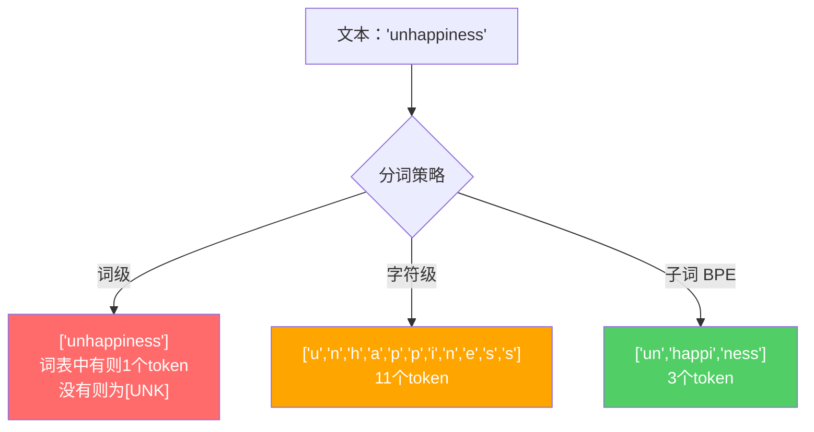
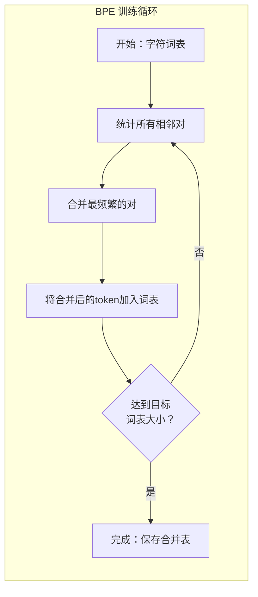
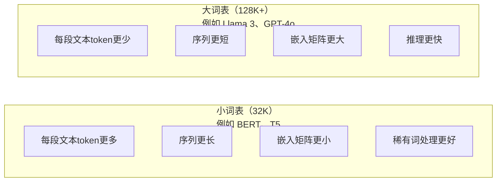

# 分词器：BPE、WordPiece、SentencePiece

> 你的 LLM 不读英文。它读数字。分词器决定了这些数字是携带意义还是浪费算力。

**类型：** 构建
**语言：** Python
**前置要求：** Phase 05（NLP 基础）
**时间：** 约 90 分钟

## 学习目标

- 从零实现 BPE、WordPiece 和 Unigram 分词算法，比较它们的合并策略
- 解释词表大小如何影响模型效率：太小产生长序列，太大浪费嵌入参数
- 分析跨语言和代码的分词结果，识别特定分词器失效的场景
- 使用 tiktoken 和 sentencepiece 库对文本进行分词，检查 token ID 输出

## 问题所在

你的 LLM 不读英文。它不读任何语言。它读数字。

从"Hello, world!"到 [15496, 11, 995, 0] 之间的差距就是分词器。每个单词、每个空格、每个标点符号都必须先转换为整数，模型才能处理它。这个转换不是中性的。它将假设烙印进模型，无法在之后撤销。

分词错误会导致模型在编码常用词时浪费容量。"unfortunately"变成四个 token 而不是一个。你的 128K 上下文窗口在多音节词密集的文本中直接缩水 75%。分词正确的话，同样的上下文窗口能容纳两倍的含义。"这个模型处理代码很好"和"这个模型在 Python 上卡住了"之间的区别，往往在于分词器是怎么训练的。

每次调用 GPT-4 或 Claude API 都按 token 计费。每个模型生成的 token 都有计算成本。表示输出所需的 token 越少，端到端推理就越快。分词不是预处理。它是架构的一部分。

## 概念

### 三种失败的方法（和一种成功的）

把文本转为数字有三种显然的方式。其中两种在大规模下不可行。

**词级分词** 按空格和标点分割。"The cat sat"变成 ["The", "cat", "sat"]。简单。但 "tokenization" 呢？或者 "GPT-4o"？或者德语复合词 "Geschwindigkeitsbegrenzung"？词级需要超大词表来覆盖所有语言的所有词。漏掉一个词就会出现可怕的 `[UNK]` token——模型的表达方式是"我完全不知道这是什么"。英语本身就有超过一百万种词形。加上代码、URL、科学记数法和 100 种其他语言，你需要无限大的词表。

**字符级分词** 走另一个极端。"hello"变成 ["h", "e", "l", "l", "o"]。词表极小（几百个字符）。永远不会出现未知 token。但序列变得极长。一句话如果词级是 10 个 token，字符级就变成 50 个。模型必须学习 "t"、"h"、"e" 合在一起意味着 "the"——将注意力容量浪费在三岁小孩就能学的事情上。

**子词分词** 找到了最佳平衡点。常用词保持完整："the" 是一个 token。稀有词分解成有意义的片段："unhappiness"变成 ["un", "happi", "ness"]。词表保持在可管理范围（30K 到 128K tokens）。序列保持短。未知 token 几乎消失，因为任何词都可以由子词片段构建。

每一种现代 LLM 都使用子词分词。GPT-2、GPT-4、BERT、Llama 3、Claude——全部都是。问题是选择哪种算法。



### BPE：字节对编码

BPE 是一个贪心压缩算法，被改造用于分词。想法简单到可以写在一张索引卡上。

从单个字符开始。统计训练语料中所有相邻对的频率。将最频繁的合并成一个新的 token。重复直到达到目标词表大小。

下面是在一个小语料上运行 BPE 的例子，词为 "lower"、"lowest" 和 "newest"：

```
语料（带词频）：
  "lower"  x5
  "lowest" x2
  "newest" x6

步骤 0 -- 从字符开始：
  l o w e r       (x5)
  l o w e s t     (x2)
  n e w e s t     (x6)

步骤 1 -- 统计相邻对：
  (e,s): 8    (s,t): 8    (l,o): 7    (o,w): 7
  (w,e): 13   (e,r): 5    (n,e): 6    ...

步骤 2 -- 合并最频繁的对 (w,e) -> "we"：
  l o we r        (x5)
  l o we s t      (x2)
  n e we s t      (x6)

步骤 3 -- 重新统计并合并 (e,s) -> "es"：
  l o we r        (x5)
  l o we s t      (x2)    <- 'es' only forms from 'e'+'s', not 'we'+'s'
  n e we s t      (x6)    <- wait, the 'e' before 'we' and 's' after 'we'

Actually tracking this precisely:
  After "we" merge, remaining pairs:
  (l,o): 7   (o,we): 7   (we,r): 5   (we,s): 8
  (s,t): 8   (n,e): 6    (e,we): 6

步骤 3 -- 合并 (we,s) -> "wes" 或 (s,t) -> "st" (8次打平，先取第一个)：
  合并 (we,s) -> "wes"：
  l o we r        (x5)
  l o wes t       (x2)
  n e wes t       (x6)

步骤 4 -- 合并 (wes,t) -> "west"：
  l o we r        (x5)
  l o west        (x2)
  n e west        (x6)

...continue until target vocab size reached.
```

合并表就是分词器。要编码新文本，按学习顺序应用合并。训练语料决定了存在哪些合并，而这个选择永久地塑造了模型看到的内容。



### 字节级 BPE（GPT-2、GPT-3、GPT-4）

标准 BPE 在 Unicode 字符上操作。字节级 BPE 在原始字节（0-255）上操作。这给你一个恰好 256 的基础词表，处理任何语言或编码，且永远不会产生未知 token。

GPT-2 引入了这种方法。基础词表覆盖每个可能的字节。BPE 合并在此基础上构建。OpenAI 的 tiktoken 库实现了字节级 BPE，词表大小如下：

- GPT-2: 50,257 tokens
- GPT-3.5/GPT-4: ~100,256 tokens (cl100k_base 编码)
- GPT-4o: 200,019 tokens (o200k_base 编码)

### WordPiece（BERT）

WordPiece 看起来和 BPE 类似，但选择合并的方式不同。不是原始频率，而是最大化训练数据的似然：

```
BPE 合并准则：      count(A, B)
WordPiece 合并准则： count(AB) / (count(A) * count(B))
```

BPE 问："哪对出现最多？" WordPiece 问："哪对比随机共现更频繁？"这个微妙差异产生了不同的词表。WordPiece 偏向共现出其不意的合并，而不仅仅是频繁的合并。

WordPiece 还使用 "##" 前缀表示后续子词：

```
"unhappiness" -> ["un", "##happi", "##ness"]
"embedding"   -> ["em", "##bed", "##ding"]
```

"##" 前缀告诉你这个片段延续了前一个 token。BERT 使用 WordPiece，词表为 30,522 tokens。每个 BERT 变体——DistilBERT、RoBERTa 的分词器其实是 BPE，但 BERT 本身是 WordPiece。

### SentencePiece（Llama、T5）

SentencePiece 将输入视为原始 Unicode 字符流，包括空格。没有预分词步骤。没有关于词边界的语言特定规则。这使其真正做到了语言无关——它对中文、日文、泰文等不以空格分词的语言同样有效。

SentencePiece 支持两种算法：
- **BPE 模式**：与标准 BPE 相同的合并逻辑，应用于原始字符序列
- **Unigram 模式**：从一个大型词表开始，迭代删除对整体似然影响最小的 token。与 BPE 相反——剪枝而不是合并

Llama 2 使用 SentencePiece BPE，词表 32,000 tokens。T5 使用 SentencePiece Unigram，词表 32,000 tokens。注意：Llama 3 切换到了基于 tiktoken 的字节级 BPE 分词器，词表 128,256。

### 词表大小权衡

这是一个有可衡量后果的真实工程决策。



具体数字。4,096 维嵌入的 128K 词表，嵌入矩阵单独就有 128,000 x 4,096 = 5.24 亿个参数。对于 32K 词表，是 1.31 亿参数。仅分词器选择就造成 4 亿参数差异。

但更大的词表压缩文本更激进。同样一段英文用 32K 词表需要 100 个 token，用 128K 词表可能只需 70 个。这意味着前向传递减少 30%。对于每天处理数百万请求的模型，这是直接降低计算成本。

趋势清晰：词表大小在增长。GPT-2 用 50,257。GPT-4 用 ~100K。Llama 3 用 128K。GPT-4o 用 200K。

| 模型 | 词表大小 | 分词器类型 | 每英文单词平均token数 |
|-------|-----------|----------------|---------------------------|
| BERT | 30,522 | WordPiece | ~1.4 |
| GPT-2 | 50,257 | 字节级 BPE | ~1.3 |
| Llama 2 | 32,000 | SentencePiece BPE | ~1.4 |
| GPT-4 | ~100,256 | 字节级 BPE | ~1.2 |
| Llama 3 | 128,256 | 字节级 BPE (tiktoken) | ~1.1 |
| GPT-4o | 200,019 | 字节级 BPE | ~1.0 |

### 多语言税

主要在英语上训练的分词器对其他语言是灾难性的。GPT-2 分词器中韩语文本平均每词 2-3 个 token。中文可能更糟。这意味着韩国用户实际拥有的上下文窗口只有英语用户的一半——同样的价格，更少的信息密度。

这就是 Llama 3 将词表从 32K 翻四倍到 128K 的原因。更多 token 专门用于非英文书写系统意味着更公平的语言压缩。

## 构建

### 步骤 1：字符级分词器

从基础开始。字符级分词器将每个字符映射到其 Unicode 码点。不需要训练。没有未知 token。只是一个直接映射。

```python
class CharTokenizer:
    def encode(self, text):
        return [ord(c) for c in text]

    def decode(self, tokens):
        return "".join(chr(t) for t in tokens)
```

"hello"变成 [104, 101, 108, 108, 111]。每个字符是自己的 token。这是我们改进的基线。

### 步骤 2：从零实现 BPE 分词器

真正的实现。我们在原始字节上训练（像 GPT-2），统计对，合并最频繁的，记录每次合并顺序。合并表就是分词器。

```python
from collections import Counter

class BPETokenizer:
    def __init__(self):
        self.merges = {}
        self.vocab = {}

    def _get_pairs(self, tokens):
        pairs = Counter()
        for i in range(len(tokens) - 1):
            pairs[(tokens[i], tokens[i + 1])] += 1
        return pairs

    def _merge_pair(self, tokens, pair, new_token):
        merged = []
        i = 0
        while i < len(tokens):
            if i < len(tokens) - 1 and tokens[i] == pair[0] and tokens[i + 1] == pair[1]:
                merged.append(new_token)
                i += 2
            else:
                merged.append(tokens[i])
                i += 1
        return merged

    def train(self, text, num_merges):
        tokens = list(text.encode("utf-8"))
        self.vocab = {i: bytes([i]) for i in range(256)}

        for i in range(num_merges):
            pairs = self._get_pairs(tokens)
            if not pairs:
                break
            best_pair = max(pairs, key=pairs.get)
            new_token = 256 + i
            tokens = self._merge_pair(tokens, best_pair, new_token)
            self.merges[best_pair] = new_token
            self.vocab[new_token] = self.vocab[best_pair[0]] + self.vocab[best_pair[1]]

        return self

    def encode(self, text):
        tokens = list(text.encode("utf-8"))
        for pair, new_token in self.merges.items():
            tokens = self._merge_pair(tokens, pair, new_token)
        return tokens

    def decode(self, tokens):
        byte_sequence = b"".join(self.vocab[t] for t in tokens)
        return byte_sequence.decode("utf-8", errors="replace")
```

训练循环是 BPE 的核心：统计对，合并赢家，重复。每一次合并减少总 token 数。经过 `num_merges` 轮后，词表从 256（基础字节）增长到 256 + num_merges。

编码按学习顺序精确应用合并。这很重要。如果合并 1 创建了 "th" 而合并 5 创建了 "the"，编码必须先应用合并 1，这样合并 5 时 "the" 才能从 "th" + "e" 形成。

解码是逆过程：在词表中查找每个 token ID，连接字节，解码为 UTF-8。

### 步骤 3：编码和解码往返测试

```python
corpus = (
    "The cat sat on the mat. The cat ate the rat. "
    "The dog sat on the log. The dog ate the frog. "
    "Natural language processing is the study of how computers "
    "understand and generate human language. "
    "Tokenization is the first step in any NLP pipeline."
)

tokenizer = BPETokenizer()
tokenizer.train(corpus, num_merges=40)

test_sentences = [
    "The cat sat on the mat.",
    "Natural language processing",
    "tokenization pipeline",
    "unhappiness",
]

for sentence in test_sentences:
    encoded = tokenizer.encode(sentence)
    decoded = tokenizer.decode(encoded)
    raw_bytes = len(sentence.encode("utf-8"))
    ratio = len(encoded) / raw_bytes
    print(f"'{sentence}'")
    print(f"  Tokens: {len(encoded)} (from {raw_bytes} bytes) -- ratio: {ratio:.2f}")
    print(f"  Roundtrip: {'PASS' if decoded == sentence else 'FAIL'}")
```

压缩比告诉你分词器有多有效。0.50 的比值意味着分词器将文本压缩到原始字节数的一半。越低越好。在训练语料上比值会很好。在分布外文本（如 "unhappiness"，不在语料中）上比值会更差——分词器退回到字符级编码来处理未见过的模式。

### 步骤 4：与 tiktoken 比较

```python
import tiktoken

enc = tiktoken.get_encoding("cl100k_base")

texts = [
    "The cat sat on the mat.",
    "unhappiness",
    "Hello, world!",
    "def fibonacci(n): return n if n < 2 else fibonacci(n-1) + fibonacci(n-2)",
    "Geschwindigkeitsbegrenzung",
]

for text in texts:
    our_tokens = tokenizer.encode(text)
    tiktoken_tokens = enc.encode(text)
    tiktoken_pieces = [enc.decode([t]) for t in tiktoken_tokens]
    print(f"'{text}'")
    print(f"  Our BPE:   {len(our_tokens)} tokens")
    print(f"  tiktoken:  {len(tiktoken_tokens)} tokens -> {tiktoken_pieces}")
```

tiktoken 使用完全相同的算法，但在数百 GB 文本上用 100,000 次合并训练。算法相同。区别是训练数据和合并数量。在一段文字上用 40 次合并训练的分词器无法与在海量语料上用 100K 合并的 tiktoken 竞争。但机制是一样的。

### 步骤 5：词表分析

```python
def analyze_vocabulary(tokenizer, test_texts):
    total_tokens = 0
    total_chars = 0
    token_usage = Counter()

    for text in test_texts:
        encoded = tokenizer.encode(text)
        total_tokens += len(encoded)
        total_chars += len(text)
        for t in encoded:
            token_usage[t] += 1

    print(f"Vocabulary size: {len(tokenizer.vocab)}")
    print(f"Total tokens across all texts: {total_tokens}")
    print(f"Total characters: {total_chars}")
    print(f"Avg tokens per character: {total_tokens / total_chars:.2f}")

    print(f"\nMost used tokens:")
    for token_id, count in token_usage.most_common(10):
        token_bytes = tokenizer.vocab[token_id]
        display = token_bytes.decode("utf-8", errors="replace")
        print(f"  Token {token_id:4d}: '{display}' (used {count} times)")

    unused = [t for t in tokenizer.vocab if t not in token_usage]
    print(f"\nUnused tokens: {len(unused)} out of {len(tokenizer.vocab)}")
```

这揭示了词表中的 Zipf 分布。少数 token 占主导（空格、"the"、"e"）。大多数 token 很少使用。生产分词器为此分布优化——常见模式获得短 token ID，稀有模式获得更长表示。

## 使用

你的自研 BPE 可用了。现在看看生产工具有什么。

### tiktoken（OpenAI）

```python
import tiktoken

enc = tiktoken.get_encoding("cl100k_base")

text = "Tokenizers convert text to integers"
tokens = enc.encode(text)
print(f"Tokens: {tokens}")
print(f"Pieces: {[enc.decode([t]) for t in tokens]}")
print(f"Roundtrip: {enc.decode(tokens)}")
```

tiktoken 用 Rust 编写，有 Python 绑定。它每秒编码数百万 tokens。同样的 BPE 算法，工业级实现。

### HuggingFace 分词器

```python
from tokenizers import Tokenizer
from tokenizers.models import BPE
from tokenizers.trainers import BpeTrainer
from tokenizers.pre_tokenizers import ByteLevel

tokenizer = Tokenizer(BPE())
tokenizer.pre_tokenizer = ByteLevel()

trainer = BpeTrainer(vocab_size=1000, special_tokens=["<pad>", "<eos>", "<unk>"])
tokenizer.train(["corpus.txt"], trainer)

output = tokenizer.encode("The cat sat on the mat.")
print(f"Tokens: {output.tokens}")
print(f"IDs: {output.ids}")
```

HuggingFace 分词器库底层也是 Rust。它在秒级时间内在大规模语料（GB 级别）上训练 BPE。这是训练自己的模型时使用的工具。

### 加载 Llama 的分词器

```python
from transformers import AutoTokenizer

tokenizer = AutoTokenizer.from_pretrained("meta-llama/Llama-3.1-8B")

text = "Tokenizers are the unsung heroes of LLMs"
tokens = tokenizer.encode(text)
print(f"Token IDs: {tokens}")
print(f"Tokens: {tokenizer.convert_ids_to_tokens(tokens)}")
print(f"Vocab size: {tokenizer.vocab_size}")

multilingual = ["Hello world", "Hola mundo", "Bonjour le monde"]
for text in multilingual:
    ids = tokenizer.encode(text)
    print(f"'{text}' -> {len(ids)} tokens")
```

Llama 3 的 128K 词表比 GPT-2 的 50K 词表对非英文文本压缩效果明显更好。你可以自己验证——用同样句子编码多种语言并统计 token 数。

## 交付

本课产生 `outputs/prompt-tokenizer-analyzer.md`——一个可复用的 prompt，用于分析任何文本和模型组合的分词效率。给它一个文本样本，它告诉你哪个模型的分词器处理得最好。

## 练习

1. 修改 BPE 分词器，打印每步合并后的词表。观察 "t" + "h" 如何变成 "th"，然后 "th" + "e" 如何变成 "the"。追踪常见英语单词如何逐步组装。

2. 给 BPE 分词器添加特殊 token（`<pad>`、`<eos>`、`<unk>`）。分配它们 ID 0、1、2 并相应地移动所有其他 token。实现一个预分词步骤，在运行 BPE 之前按空格分割。

3. 实现 WordPiece 合并准则（似然比而非频率）。在相同语料上用相同合并次数训练 BPE 和 WordPiece。比较产生的词表——哪个产生更多语言学上有意义的子词？

4. 构建多语言分词器效率基准。在英语、西班牙语、中文、韩语和阿拉伯语中取 10 个句子。用 tiktoken（cl100k_base）分词每个句子，测量每字符平均 token 数。量化每种语言的"多语言税"。

5. 在更大语料上训练你的 BPE 分词器（下载一篇 Wikipedia 文章）。调整合并次数，使在同一文本上达到 tiktoken 压缩比的 10% 以内。这强制你理解语料大小、合并数量和压缩质量之间的关系。

## 关键术语

| 术语 | 常见说法 | 实际含义 |
|------|----------------|----------------------|
| Token | "一个词" | 模型词表中的一个单元——可能是字符、子词、词或多词片段 |
| BPE | "某种压缩的东西" | 字节对编码——迭代合并最频繁的相邻 token 对，直到达到目标词表大小 |
| WordPiece | "BERT 的分词器" | 类似 BPE 但合并最大化了似然比 count(AB)/(count(A)*count(B)) 而非原始频率 |
| SentencePiece | "一个分词器库" | 一种语言无关的分词器，在原始 Unicode 上操作，无预分词，支持 BPE 和 Unigram 算法 |
| 词表大小 | "它认识多少词" | 唯一 token 总数：GPT-2 有 50,257，BERT 有 30,522，Llama 3 有 128,256 |
| Fertility | "不是分词器术语" | 每词平均 token 数——衡量跨语言分词效率（1.0 是完美的，3.0 意味着模型工作三倍辛苦） |
| 字节级 BPE | "GPT 的分词器" | 在原始字节（0-255）而非 Unicode 字符上操作的 BPE，保证任何输入都没有未知 token |
| 合并表 | "分词器文件" | 训练期间学习的成对合并有序列表——这就是分词器本身，顺序很重要 |
| 预分词 | "按空格分割" | 子词分词前应用的规则：空格分割、数字分离、标点处理 |
| 压缩比 | "分词器有多高效" | 产生的 token 数除以输入字节数——越低意味着压缩越好、推理越快 |

## 拓展阅读

- [Sennrich et al., 2016 -- "Neural Machine Translation of Rare Words with Subword Units"](https://arxiv.org/abs/1508.07909) -- 将 1994 年压缩算法引入 NLP 成为现代分词基础的论文
- [Kudo & Richardson, 2018 -- "SentencePiece: A simple and language independent subword tokenizer"](https://arxiv.org/abs/1808.06226) -- 使多语言模型实用化的语言无关分词
- [OpenAI tiktoken repository](https://github.com/openai/tiktoken) -- Rust BPE 实现，有 Python 绑定，GPT-3.5/4/4o 使用
- [HuggingFace Tokenizers documentation](https://huggingface.co/docs/tokenizers) -- 生产级分词器训练，Rust 性能