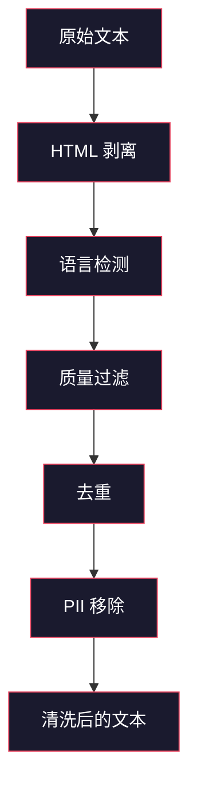
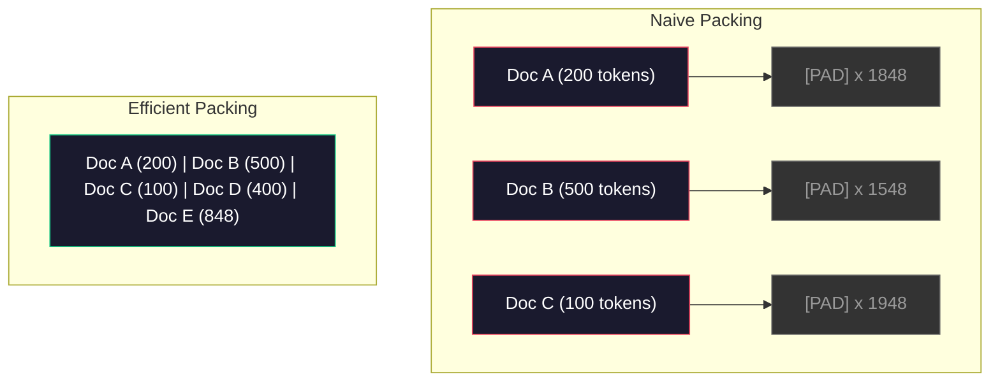

# 预训练数据流水线

> 模型是一面镜子。它反映你喂给它的任何东西。喂它垃圾，它完美流畅地反映垃圾。

**类型：** 构建
**语言：** Python
**前置要求：** Phase 10，第 01-02 课（分词器、构建分词器）
**时间：** 约 90 分钟

## 学习目标

- 构建流式数据流水线，在不完全加载内存的情况下对 TB 级文本进行分词、分块、打乱和批处理
- 实现真实预训练流水线中使用的数据质量过滤器（去重、语言检测、内容过滤）
- 创建具有正确注意力掩码和文档边界处理的固定长度训练序列
- 分析流水线吞吐量，确保 dataloader 跟得上 GPU 训练速度

## 问题所在

你有一个分词器。现在你需要数据。

不是数据集。不是 CSV 文件。是 TB 级文本——清洗过、去重、过滤质量、按固定长度分块、以随机批次提供，足够快以至于你的 8-GPU 集群永远不需等待下一批。

大多数人在想训练 LLM 是关于模型架构的。不是的。Llama 3 使用了 15.6 万亿 token。GPT-3 使用了 3000 亿。DeepSeek-V2 使用了 8.1 万亿。三个的架构大致相同：堆叠的 transformer 块，带注意力和前馈层。输出质量的差异压倒性地来自数据。

DeepMind 的 Chinchilla 论文将这一点精确化了。对于固定算力预算，模型参数与训练 token 数之间有最优比例。Chinchilla 表明 2022 年大多数模型严重训练不足——它们的参数太多而看到的数据太少。70B 参数模型在 1.4 万亿 token 上训练（Chinchilla 最优）优于在 3000 亿 token 上训练的 280B 模型（Gopher）。

你的数据流水线决定了模型是学习语言还是学习噪声。

## 概念

### 数据来自哪里

每个大型语言模型都训练自混合来源。确切成份是大多数实验室严格保密的，但我们足够了解以理解类别。

| 来源 | 大小 | 质量 | 使用者 |
|--------|------|---------|---------|
| Common Crawl | ~250 TB 原始 | 低（需要重度过滤） | GPT-3, Llama, 大多数开源模型 |
| Wikipedia | ~20 GB | 高 | 每个主要 LLM |
| GitHub 代码 | ~1 TB+ | 中（大量重复、死代码） | StarCoder, CodeLlama, DeepSeek-Coder |
| 书籍（BookCorpus, Pile） | ~100 GB | 高 | GPT-2, GPT-3, 早期模型 |
| 学术论文（arXiv, S2ORC） | ~100 GB | STEM 高 | Llama, Galactica |
| StackOverflow, Reddit | ~100 GB | 中 | Llama, Falcon |
| 策划网络（C4, RefinedWeb） | ~5 TB | 中高（预过滤） | T5, Falcon |

Llama 3 披露了其数据混合：约 50% 网络数据、25% 代码、13% 书籍和学术论文、8% 数学数据、4% 多语言网络数据。总计 15.6 万亿 token，来自超过 5 TB 原始文本的来源。

比例和总量一样重要。太多网络数据模型变成 Reddit 复读机。太少代码它不会编程。太少数学它推理失败。把这个混合调好是训练 LLM 最难的部分之一，没有公式——需要实验和评估。

### 数据清洗

原始网络数据是肮脏的。典型的 Common Crawl 转储包含：

- HTML 标签和 JavaScript
- 样板页眉、页脚、导航菜单
- 重复页面（精确和近似重复）
- 机器生成的垃圾邮件
- 个人身份信息（PII）
- 低质量文本（关键词列表、SEO 垃圾）
- 编码为文本的非文本内容

清洗不是可选的。它是区分生成连贯段落的模型和输出混有 HTML 标签与产品列表的模型之间的差异。



每个步骤消除一类噪声：

**HTML 剥离：** 删除所有标记。只保留可见文本内容。`trafilatura` 或 `readability` 等库提取文章内容同时丢弃导航、广告和样板。

**语言检测：** 使用 fastText 的语言识别模型（lid.176.bin）对每个文档分类。过滤到你的目标语言。置信度低于 0.8 的英文分类文档可能不是干净英文。

**质量过滤：** 这是有趣的地方。RefinedWeb（Falcon 数据集背后的数据集）使用基于困惑度的过滤器：在 Wikipedia 上训练一个小语言模型，然后对每个文档评分。高困惑度意味着文档不像 Wikipedia——可能是垃圾邮件、关键词列表或机器生成内容。困惑度超过阈值的文档被移除。

**去重：** 影响最大的单一清洗步骤。Common Crawl 包含大量重复页面——法律免责声明、cookie 通知、服务条款。在重复项上训练浪费算力，并可能导致模型逐字记忆和复述特定段落。

**PII 移除：** 姓名、邮箱地址、电话号码、社会安全号码。基于正则的检测用于结构化 PII，NER 模型用于上下文中的人名。

### 用 MinHash 去重

精确去重很简单：对每个文档哈希，移除重复项。但近似重复才是真正的问题。同一篇新闻文章的两个副本被周围略不同的广告包围是近似重复。内容 95% 相同，但字节不同。

MinHash + 局部敏感哈希（LSH）高效解决此问题。


想法：

1. **分片：** 将每个文档转换为一组 n-gram（例如 5-gram 单词或字符）。"the quick brown fox" 带 3-词分片变成 {"the quick brown", "quick brown fox"}。

2. **MinHash：** 对每个文档的分片集，计算 k 个哈希值。每个哈希值是所有分片在不同的哈希函数下的最小哈希。这创建了一个固定大小的"签名"，近似任意两个文档之间的 Jaccard 相似度。

3. **LSH：** 根据 MinHash 签名的 band 将文档分组到桶中。同一桶中的文档是近似重复候选。这避免每对比较——你只比较候选。

4. **验证：** 对每个候选对，计算精确 Jaccard 相似度。相似度超过阈值（通常 0.8）则移除一个副本。

Llama 团队报告通过去重移除了约 38% 的网络数据。这不是一个小的数字。超过三分之一的 Common Crawl 是重复或近似重复内容。

### 序列打包

你的模型期望固定长度输入序列。你的文档是变长度的。有些是 50 token。有些是 50,000 token。

朴素方法：将每个文档填充到最大序列长度。这在实际上不贡献学习的填充 token 上浪费大量算力。

更好的方法：将多个文档打包进单个序列，用序列结束 token 分隔。2048-token 的序列可能包含三个短文档，用 [EOS] token 连接。



注意力掩码必须正确设置。文档 A 的 token 不应该attend 到同一打包序列中文档 B 的 token。这需要一个块对角注意力掩码。

长文档被截断或在序列边界处分块。分切点很重要：在句子中间分切强迫模型看到不完整的思想。一些流水线在可能时对齐到段落或句子边界。

### Chinchilla 缩放定律

对于固定算力预算 C（以 FLOPs 计量），最优模型大小 N 和数据集大小 D 遵循：

```
N_opt ~ C^0.5
D_opt ~ C^0.5
```

在实践中，这意味着你应该大致等比缩放模型大小和数据集大小。10 倍参数的模型需要大约 10 倍多的训练 token 才能达到相同的损失。

| 模型 | 参数 | 训练 Token | Chinchilla 最优？ |
|-------|-----------|----------------|-------------------|
| GPT-3 | 175B | 3000 亿 | 否（训练不足 3-4 倍） |
| Chinchilla | 70B | 1.4 万亿 | 是（按设计） |
| Llama 2 | 70B | 2 万亿 | 过训练（故意） |
| Llama 3 | 70B | 15 万亿 | 严重过训练 |

Llama 3 故意违反 Chinchilla 定律。Meta 发现过训练更多数据——远超算力最优比例——产生更好的推理模型。一次性的额外训练成本，但较小的模型永远更便宜。这有时被称为"推理最优"缩放方法，自 2024 年以来已成为行业标准。

## 构建

### 步骤 1：文本清洗

剥离 HTML，规范空白，移除非文本内容。我们将使用公共领域文本（古登堡计划）作为小语料。

```python
import re

def clean_text(text):
    text = re.sub(r"<[^>]+>", "", text)
    text = re.sub(r"http\S+", "", text)
    text = re.sub(r"[^\x20-\x7E\n]", "", text)
    text = re.sub(r"\n{3,}", "\n\n", text)
    text = re.sub(r" {2,}", " ", text)
    return text.strip()

def quality_filter(text, min_words=50, max_ratio_caps=0.3, max_ratio_special=0.1):
    words = text.split()
    if len(words) < min_words:
        return False
    caps_ratio = sum(1 for w in words if w.isupper()) / len(words)
    if caps_ratio > max_ratio_caps:
        return False
    special_chars = sum(1 for c in text if not c.isalnum() and not c.isspace())
    if special_chars / max(len(text), 1) > max_ratio_special:
        return False
    return True
```

质量过滤器捕获 SEO 垃圾（全大写）、机器生成噪声（高特殊字符比）和 stub 页面（太短）。这三个检查单独就能从网络爬取中移除大量垃圾。

### 步骤 2：MinHash 去重

从零实现 MinHash。不需要外部库——只需 `hashlib`。

```python
import hashlib
from collections import defaultdict

def get_shingles(text, k=5):
    words = text.lower().split()
    if len(words) < k:
        return set()
    return {" ".join(words[i:i+k]) for i in range(len(words) - k + 1)}

def minhash_signature(shingles, num_hashes=128):
    signature = []
    for i in range(num_hashes):
        min_hash = float("inf")
        for shingle in shingles:
            h = int(hashlib.sha256(f"{i}:{shingle}".encode()).hexdigest(), 16)
            min_hash = min(min_hash, h)
        signature.append(min_hash)
    return signature

def lsh_buckets(signature, bands=16):
    rows_per_band = len(signature) // bands
    buckets = []
    for b in range(bands):
        start = b * rows_per_band
        band_data = tuple(signature[start:start + rows_per_band])
        bucket_hash = hashlib.md5(str(band_data).encode()).hexdigest()
        buckets.append((b, bucket_hash))
    return buckets

def deduplicate(documents, threshold=0.8, num_hashes=128, bands=16):
    signatures = []
    shingle_sets = []
    for doc in documents:
        shingles = get_shingles(doc)
        shingle_sets.append(shingles)
        signatures.append(minhash_signature(shingles, num_hashes))

    bucket_map = defaultdict(list)
    for doc_idx, sig in enumerate(signatures):
        for band_id, bucket_hash in lsh_buckets(sig, bands):
            bucket_map[(band_id, bucket_hash)].append(doc_idx)

    duplicate_pairs = set()
    for bucket_docs in bucket_map.values():
        if len(bucket_docs) < 2:
            continue
        for i in range(len(bucket_docs)):
            for j in range(i + 1, len(bucket_docs)):
                duplicate_pairs.add((bucket_docs[i], bucket_docs[j]))

    removed = set()
    for i, j in duplicate_pairs:
        if i in removed or j in removed:
            continue
        s1, s2 = shingle_sets[i], shingle_sets[j]
        if not s1 or not s2:
            continue
        jaccard = len(s1 & s2) / len(s1 | s2)
        if jaccard >= threshold:
            removed.add(j)

    return [doc for idx, doc in enumerate(documents) if idx not in removed], len(removed)
```

`num_hashes=128` 和 `bands=16` 参数控制精确度-召回权衡。更多哈希给出更准确的相似度估计。更多 band 增加召回（捕获更多重复）代价是更多假阳性。这些值对典型网络文本效果很好。

### 步骤 3：分词和打包序列

将清洗去重后的文本分词，打包成固定长度序列用于训练。

```python
def tokenize_corpus(documents, tokenizer):
    all_tokens = []
    for doc in documents:
        tokens = tokenizer.encode(doc)
        all_tokens.extend(tokens)
        all_tokens.append(tokenizer.eos_id)
    return all_tokens

def pack_sequences(token_ids, seq_length, pad_id=0):
    sequences = []
    attention_masks = []
    for i in range(0, len(token_ids), seq_length):
        seq = token_ids[i:i + seq_length]
        mask = [1] * len(seq)
        if len(seq) < seq_length:
            pad_count = seq_length - len(seq)
            seq = seq + [pad_id] * pad_count
            mask = mask + [0] * pad_count
        sequences.append(seq)
        attention_masks.append(mask)
    return sequences, attention_masks
```

### 步骤 4：训练用 DataLoader

生成随机化的打包序列批次。这是训练循环消费的内容。

```python
import random

class PreTrainingDataLoader:
    def __init__(self, sequences, attention_masks, batch_size, shuffle=True):
        self.sequences = sequences
        self.attention_masks = attention_masks
        self.batch_size = batch_size
        self.shuffle = shuffle

    def __len__(self):
        return (len(self.sequences) + self.batch_size - 1) // self.batch_size

    def __iter__(self):
        indices = list(range(len(self.sequences)))
        if self.shuffle:
            random.shuffle(indices)
        for start in range(0, len(indices), self.batch_size):
            batch_idx = indices[start:start + self.batch_size]
            batch_seqs = [self.sequences[i] for i in batch_idx]
            batch_masks = [self.attention_masks[i] for i in batch_idx]
            yield batch_seqs, batch_masks
```

### 步骤 5：数据集统计

计算重要的数字：总 token、唯一 token、压缩比、文档长度分布。

```python
from collections import Counter

def compute_statistics(documents, token_ids, sequences, tokenizer_vocab_size):
    total_chars = sum(len(d) for d in documents)
    total_tokens = len(token_ids)
    unique_tokens = len(set(token_ids))
    compression_ratio = total_chars / total_tokens

    doc_lengths = [len(d.split()) for d in documents]
    avg_doc_length = sum(doc_lengths) / max(len(doc_lengths), 1)
    max_doc_length = max(doc_lengths) if doc_lengths else 0
    min_doc_length = min(doc_lengths) if doc_lengths else 0

    token_counts = Counter(token_ids)
    top_tokens = token_counts.most_common(10)

    non_pad_tokens = sum(sum(1 for t in seq if t != 0) for seq in sequences)
    total_positions = sum(len(seq) for seq in sequences)
    utilization = non_pad_tokens / max(total_positions, 1)

    stats = {
        "total_documents": len(documents),
        "total_characters": total_chars,
        "total_tokens": total_tokens,
        "unique_tokens": unique_tokens,
        "vocab_utilization": unique_tokens / tokenizer_vocab_size,
        "compression_ratio": compression_ratio,
        "avg_doc_length_words": avg_doc_length,
        "max_doc_length_words": max_doc_length,
        "min_doc_length_words": min_doc_length,
        "num_sequences": len(sequences),
        "sequence_utilization": utilization,
        "top_10_tokens": top_tokens,
    }
    return stats
```

压缩比告诉你分词器在这个语料上的效率。英文文本通常压缩到约每 token 3-4 字符。如果你看到每 token 1.5 字符，你的分词器分割太激进。如果你看到 8+，它学到了非常领域特定的合并。

序列利用率告诉你打包序列中有多少是真实数据对填充。在 90% 以下意味着你的打包效率低下——你在填充 token 上浪费算力。

## 使用

### 与 HuggingFace 数据集比较

通过 HuggingFace 的 datasets 库加载相同语料，比较流水线速度。

```python
from datasets import load_dataset
from transformers import AutoTokenizer

ds = load_dataset("wikitext", "wikitext-2-raw-v1", split="train")
tokenizer = AutoTokenizer.from_pretrained("meta-llama/Meta-Llama-3-8B")

import time

start = time.time()
tokenized = ds.map(
    lambda x: tokenizer(x["text"], truncation=True, max_length=2048),
    batched=True,
    num_proc=4,
)
hf_time = time.time() - start
total_tokens = sum(len(t) for t in tokenized["input_ids"])
print(f"HuggingFace: {total_tokens:,} tokens in {hf_time:.2f}s ({total_tokens/hf_time:,.0f} tokens/sec)")
```

HuggingFace 流水线在底层使用 Rust 分词器并跨 4 核并行处理。你的纯 Python 流水线会慢 10-50 倍。这个差距就是为什么生产团队使用编译分词器的原因。算法相同。实现语言是区别。

## 交付

本课产生一个用于验证和调试 LLM 训练流水线数据质量的 prompt。见 `outputs/prompt-data-quality-checker.md`。

## 练习

1. **简单：** 在清洗流水线中添加语言检测，使用简单启发式方法（字符集分析）。过滤到仅英文文档并测量有多少文档被移除。

2. **中等：** 除了 MinHash 近似去重外，实现使用 SHA-256 哈希的精确去重。在网络爬取语料上比较每种方法捕获的重复数。

3. **困难：** 构建基于困惑度的质量过滤器。在 Wikipedia 文本上训练一个小二元语言模型，对每个文档评分，移除底部 20%。比较在过滤和未过滤数据上训练的模型输出质量。

## 关键术语

| 术语 | 常见说法 | 实际含义 |
|------|----------------|----------------------|
| Common Crawl | "互联网" | 每月爬取网络的无盈利组织——约 250TB 原始，是大多数 LLM 训练数据的起点 |
| MinHash | "某种哈希技巧" | 使用固定大小签名估计集合之间 Jaccard 相似度的技术——实现大规模近似重复检测 |
| LSH | "局部敏感哈希" | 将相似项分组到同一桶的方法——将成对比较从 O(n^2) 减少到近线性 |
| 序列打包 | "连接文档" | 用正确注意力掩码将多个文档装入固定长度序列——消除填充浪费 |
| Chinchilla 缩放 | "训练更多数据" | 对于固定算力预算，最优性能需要模型大小和训练 token 大致等比缩放 |
| Fertility | "每词 token 数" | 每词平均 token 数——GPT-4 英语为 1.3，非拉丁文字更高 |
| 数据混合 | "选择训练数据" | 代码 vs 文本 vs 数学 vs 多语言数据的比例——没有公式，需要实验 |
| 困惑度过滤器 | "质量评分" | 使用小语言模型对文档评分——高困惑度意味着文本不像干净参考数据 |
| 去重 | "移除副本" | 消除精确和近似重复文档——通常移除原始网络数据的 30-40% |
| 注意力掩码 | "哪些 token 看哪些" | 防止打包序列中文档边界注意力交叉的二进制掩码 |

## 拓展阅读

- [Hoffmann et al., 2022 -- Training Compute-Optimal Large Language Models (Chinchilla)](https://arxiv.org/abs/2203.15556) -- 改变我们对数据规模思考方式的论文
- [Penedo et al., 2023 -- The RefinedWeb Dataset for Falcon LLM](https://arxiv.org/abs/2306.01116) -- 如何过滤 Common Crawl 到高质量
- [Touvron et al., 2023 -- Llama 2: Open Foundation and Fine-Tuned Chat Models](https://arxiv.org/abs/2307.09288) -- Llama 2 数据流水线细节
- [Lee et al., 2022 -- Deduplicating Training Data Makes Language Models Better](https://arxiv.org/abs/2107.06499) -- 去重比你想象的更重要
- [Broder, 1997 -- On the Resemblance and Containment of Documents](https://ieeexplore.ieee.org/document/666900) -- 原始 MinHash 论文
- [Meta, 2024 -- Llama 3 Technical Report](https://arxiv.org/abs/2407.21783) -- 15.6T tokens，数据混合比例，过滤流水线