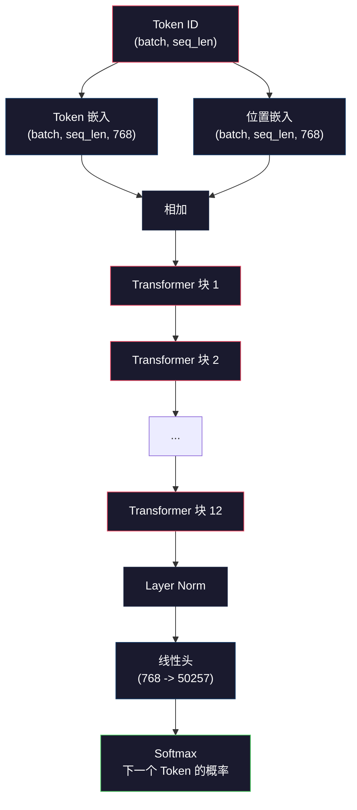
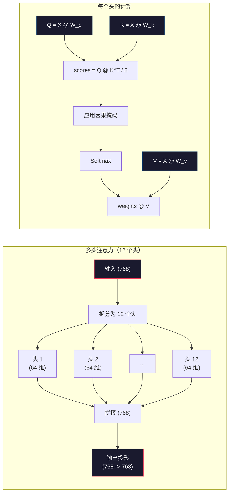
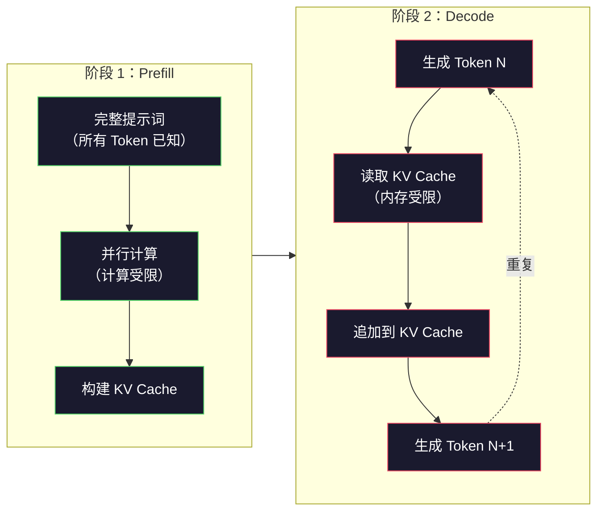

# 预训练 Mini GPT（124M 参数）

> GPT-2 Small 有 1.24 亿个参数。它包含 12 个 Transformer 层、12 个注意力头和 768 维嵌入向量。你可以在单块 GPU 上从头训练它，耗时几小时。大多数人从不这样做——他们直接使用预训练好的权重。但如果你不亲手训练一个，就无法真正理解你正在构建的产品里到底发生了什么。

**类型：** 构建
**语言：** Python（使用 numpy）
**先修内容：** Phase 10，课程 01-03（分词器、构建分词器、数据管道）
**学习时间：** 约 120 分钟

## 学习目标

- 从零实现完整的 GPT-2 架构（124M 参数）：Token 嵌入、位置嵌入、Transformer 块和语言模型头
- 使用下一个 Token 预测和交叉熵损失函数，在文本语料上训练 GPT 模型
- 实现带温度采样和 top-k/top-p 过滤的自回归文本生成
- 监控训练 loss 曲线，验证模型学会了连贯的语言模式

## 问题所在

你知道 Transformer 是什么。你看过那些图。你能背出"Attention is All You Need"，也能在白板上画出标着"Multi-Head Attention"的方框。

但这些都不代表你理解模型生成文本时内部发生了什么。

GPT-2 Small 有 124,438,272 个参数（使用权重共享）。每一个参数都是通过运行训练循环设置的：前向传播计算损失，反向传播更新权重。12 个 Transformer 块，每块 12 个注意力头，768 维的嵌入空间，50,257 个 Token 的词表。每次模型生成一个 Token，全部 1.24 亿个参数都参与计算——一次矩阵乘法链，将一串 Token ID 输入，输出下一个 Token 的概率分布。

如果你从未亲手构建过这件事，你就是在用一个黑盒子。你可以使用 API，可以微调。但当模型出现幻觉、重复自己、拒绝遵从指令时，你没有任何心理模型来理解*为什么*。

这节课从零构建 GPT-2 Small。不用 PyTorch，用 numpy。每一个矩阵乘法都是可见的。每一个梯度都是你的代码算出来的。你将亲眼看到这 1.24 亿个数字如何合谋预测下一个词。

## 核心概念

### GPT 架构

GPT 是自回归语言模型。"自回归"意味着它一次生成一个 Token，每个 Token 都以之前所有 Token 为条件。架构是一堆 Transformer 解码器块。

从 Token ID 到下一个 Token 概率的完整计算图如下：

1. 输入 Token ID。形状：(batch_size, seq_len)。
2. Token 嵌入查找。每个 ID 映射到一个 768 维向量。形状：(batch_size, seq_len, 768)。
3. 位置嵌入查找。每个位置（0, 1, 2, ...）映射到一个 768 维向量。形状相同。
4. Token 嵌入 + 位置嵌入。
5. 通过 12 个 Transformer 块。
6. 最终层归一化。
7. 线性投影到词表大小。形状：(batch_size, seq_len, vocab_size)。
8. Softmax 得到概率。

这就是整个模型。没有卷积，没有循环。只有嵌入、注意力、前馈网络和层归一化，堆叠 12 次。



### Transformer 块

12 个块每个都遵循相同的模式。Pre-norm 架构（GPT-2 使用 pre-norm，不同于原始 Transformer 的 post-norm）：

1. LayerNorm
2. 多头自注意力
3. 残差连接（将输入加回）
4. LayerNorm
5. 前馈网络（MLP）
6. 残差连接（将输入加回）

残差连接至关重要。没有它们，反向传播时梯度到达第 1 层时就已经消失了。有了它们，梯度可以通过"跳跃"路径直接从损失流向任意层。这就是为什么你可以堆叠 12、32 甚至 96 个块（据说 GPT-4 使用了 120 个）。

### 注意力：核心机制

自注意力让每个 Token 都能看到之前所有的 Token，并决定对每个 Token 的关注程度。以下是数学原理。

对每个 Token 位置，从输入中计算三个向量：
- **Query（查询 Q）**：我在找什么？
- **Key（键 K）**：我包含了什么信息？
- **Value（值 V）**：我携带了什么信息？

```
Q = input @ W_q    (768 -> 768)
K = input @ W_k    (768 -> 768)
V = input @ W_v    (768 -> 768)

attention_scores = Q @ K^T / sqrt(d_k)
attention_scores = mask(attention_scores)   # 因果掩码：未来位置设为 -inf
attention_weights = softmax(attention_scores)
output = attention_weights @ V
```

因果掩码使 GPT 具有自回归特性。位置 5 可以关注位置 0-5，但不能关注 6、7、8 等。这防止了模型在训练时"偷看"未来的 Token。

**多头注意力**将 768 维空间分成 12 个头，每个头 64 维。每个头学习不同的注意力模式。一个头可能追踪句法关系（主谓一致）。另一个可能追踪语义相似性（同义词）。还有一个可能追踪位置邻近性（相邻词）。12 个头的输出被拼接起来，再投影回 768 维。



除以 `sqrt(d_k)`——`sqrt(64) = 8`——是缩放。没有它，高维向量的点积会变得很大，使 softmax 进入梯度几乎为零的区域。这是原始"Attention Is All You Need"论文的关键洞察之一。

### KV Cache：推理为什么快

训练时，你同时处理整个序列。推理时，你一次生成一个 Token。没有优化的情况下，生成第 N 个 Token 需要重新计算前面 N-1 个 Token 的注意力。每个生成 Token 的复杂度是 O(N²)，长度为 N 的序列总体是 O(N³)。

KV Cache 解决了这个问题。计算每个 Token 的 K 和 V 后，将它们存储起来。生成第 N+1 个 Token 时，只需为新 Token 计算 Q，然后从之前所有 Token 的缓存中查找 K 和 V。这将每个 Token 的 K 和 V 计算复杂度从 O(N) 降低到 O(1)。注意力分数计算仍然是 O(N)，因为你需要关注所有之前的位置，但避免了输入上的冗余矩阵乘法。

对于有 12 层和 12 个头的 GPT-2，KV Cache 每个 Token 存储 2 × 12 层 × 12 头 × 64 维 = 18,432 个值。对于 1024 Token 的序列，这大约是 75MB（FP32）。对于有 128 层的 Llama 3 405B，单个序列的 KV Cache 可以超过 10GB。这就是为什么长上下文推理是内存受限的。

### Prefill 与 Decode：推理的两个阶段

当你向 LLM 发送提示词时，推理分为两个截然不同的阶段。

**Prefill** 并行处理你的整个提示词。所有 Token 都是已知的，所以模型可以同时计算所有位置的注意力。这个阶段是计算受限的——GPU 以满吞吐量做矩阵乘法。对于 A100 上的 1000 Token 提示词，prefill 大约需要 20-50ms。

**Decode** 一次生成一个 Token。每个新 Token 依赖于所有之前的 Token。这个阶段是内存受限的——瓶颈是从 GPU 内存读取模型权重和 KV Cache，而不是矩阵运算本身。GPU 的计算核心大部分时间都在闲置，等待内存读取。对于 GPT-2，每个解码步骤花费的时间大致相同，无论矩阵乘法需要多少 FLOPs，因为内存带宽才是约束条件。

这个区别对生产系统很重要。Prefill 吞吐量随 GPU 计算量扩展（更多 FLOPs = 更快 prefill）。Decode 吞吐量随内存带宽扩展（更快的内存 = 更快生成）。这就是为什么 NVIDIA 的 H100 比 A100 更注重内存带宽的提升——它直接加速 Token 生成。



### 训练循环

训练 LLM 就是预测下一个 Token。给定 Token [0, 1, 2, ..., N-1]，预测 Token [1, 2, 3, ..., N]。损失函数是模型预测的概率分布与实际下一个 Token 之间的交叉熵。

一个训练步骤：

1. **前向传播**：将批次通过所有 12 个块，得到每个位置的 logit（softmax 前的分数）。
2. **计算损失**：logit 与目标 Token（在输入序列中向后偏移一位）之间的交叉熵。
3. **反向传播**：使用反向传播计算所有 1.24 亿个参数的梯度。
4. **优化器步骤**：更新权重。GPT-2 使用 Adam 优化器，学习率预热后余弦退火。

学习率调度比你想象的更重要。GPT-2 在前 2000 步从 0 预热到峰值学习率，然后按余弦曲线衰减。一开始学习率过高会导致模型发散。保持高的恒定学习率会导致后期训练振荡。预热-后-衰减的模式被每个主要 LLM 采用。

### GPT-2 Small：关键数字

| 组件 | 形状 | 参数量 |
|-----------|-------|------------|
| Token 嵌入 | (50257, 768) | 38,597,376 |
| 位置嵌入 | (1024, 768) | 786,432 |
| 每块注意力（W_q, W_k, W_v, W_out） | 4 × (768, 768) | 2,359,296 |
| 每块 FFN（扩展 + 收缩） | (768, 3072) + (3072, 768) | 4,718,592 |
| 每块 LayerNorm（2个） | 2 × 768 × 2 | 3,072 |
| 最终 LayerNorm | 768 × 2 | 1,536 |
| **每块总计** | | **7,080,960** |
| **总计（12 个块）** | | **85,054,464 + 39,383,808 = 124,438,272** |

输出投影（logits 头）与 Token 嵌入矩阵共享权重。这叫做权重共享——它减少了 3800 万个参数，并改善了性能，因为它强制模型在输入和输出中使用相同的表示空间。

## 构建

### 步骤 1：嵌入层

Token 嵌入将 50,257 个可能的 Token 映射到 768 维向量。位置嵌入添加每个 Token 在序列中位置的信息。两者相加。

```python
import numpy as np

class Embedding:
    def __init__(self, vocab_size, embed_dim, max_seq_len):
        self.token_embed = np.random.randn(vocab_size, embed_dim) * 0.02
        self.pos_embed = np.random.randn(max_seq_len, embed_dim) * 0.02

    def forward(self, token_ids):
        seq_len = token_ids.shape[-1]
        tok_emb = self.token_embed[token_ids]
        pos_emb = self.pos_embed[:seq_len]
        return tok_emb + pos_emb
```

初始化的 0.02 标准差来自 GPT-2 论文。太大则初始前向传播产生极端值，破坏训练稳定性。太则小初始输出几乎相同，早期梯度信号无效。

### 步骤 2：带因果掩码的自注意力

先实现单头注意力。因果掩码在 softmax 之前将未来位置设为负无穷，确保每个位置只能关注自身及之前的位置。

```python
def attention(Q, K, V, mask=None):
    d_k = Q.shape[-1]
    scores = Q @ K.transpose(0, -1, -2 if Q.ndim == 4 else 1) / np.sqrt(d_k)
    if mask is not None:
        scores = scores + mask
    weights = np.exp(scores - scores.max(axis=-1, keepdims=True))
    weights = weights / weights.sum(axis=-1, keepdims=True)
    return weights @ V
```

Softmax 实现中，在指数运算前减去最大值。没有这个，`exp(大数字)` 会溢出到无穷。这是数值稳定性技巧，不改变输出，因为 `softmax(x - c) = softmax(x)` 对任意常数 c 成立。

### 步骤 3：多头注意力

将 768 维输入分成 12 个头，每头 64 维。每个头独立计算注意力。拼接结果并投影回 768 维。

```python
class MultiHeadAttention:
    def __init__(self, embed_dim, num_heads):
        self.num_heads = num_heads
        self.head_dim = embed_dim // num_heads
        self.W_q = np.random.randn(embed_dim, embed_dim) * 0.02
        self.W_k = np.random.randn(embed_dim, embed_dim) * 0.02
        self.W_v = np.random.randn(embed_dim, embed_dim) * 0.02
        self.W_out = np.random.randn(embed_dim, embed_dim) * 0.02

    def forward(self, x, mask=None):
        batch, seq_len, d = x.shape
        Q = (x @ self.W_q).reshape(batch, seq_len, self.num_heads, self.head_dim).transpose(0, 2, 1, 3)
        K = (x @ self.W_k).reshape(batch, seq_len, self.num_heads, self.head_dim).transpose(0, 2, 1, 3)
        V = (x @ self.W_v).reshape(batch, seq_len, self.num_heads, self.head_dim).transpose(0, 2, 1, 3)

        scores = Q @ K.transpose(0, 1, 3, 2) / np.sqrt(self.head_dim)
        if mask is not None:
            scores = scores + mask
        weights = np.exp(scores - scores.max(axis=-1, keepdims=True))
        weights = weights / weights.sum(axis=-1, keepdims=True)
        attn_out = weights @ V

        attn_out = attn_out.transpose(0, 2, 1, 3).reshape(batch, seq_len, d)
        return attn_out @ self.W_out
```

reshape-transpose-reshape 的操作是多头注意力中最难理解的部分。过程如下：(batch, seq_len, 768) 张量变为 (batch, seq_len, 12, 64)，再变为 (batch, 12, seq_len, 64)。现在 12 个头每个都有自己独立的 (seq_len, 64) 矩阵来运行注意力。注意力计算后，我们反转这个过程：(batch, 12, seq_len, 64) 变为 (batch, seq_len, 12, 64) 再变为 (batch, seq_len, 768)。

### 步骤 4：Transformer 块

一个完整的 Transformer 块：LayerNorm、带残差的多头注意力、LayerNorm、带残差的前馈网络。

```python
class LayerNorm:
    def __init__(self, dim, eps=1e-5):
        self.gamma = np.ones(dim)
        self.beta = np.zeros(dim)
        self.eps = eps

    def forward(self, x):
        mean = x.mean(axis=-1, keepdims=True)
        var = x.var(axis=-1, keepdims=True)
        return self.gamma * (x - mean) / np.sqrt(var + self.eps) + self.beta


class FeedForward:
    def __init__(self, embed_dim, ff_dim):
        self.W1 = np.random.randn(embed_dim, ff_dim) * 0.02
        self.b1 = np.zeros(ff_dim)
        self.W2 = np.random.randn(ff_dim, embed_dim) * 0.02
        self.b2 = np.zeros(embed_dim)

    def forward(self, x):
        h = x @ self.W1 + self.b1
        h = np.maximum(0, h)  # GELU 近似：这里用 ReLU 简化
        return h @ self.W2 + self.b2


class TransformerBlock:
    def __init__(self, embed_dim, num_heads, ff_dim):
        self.ln1 = LayerNorm(embed_dim)
        self.attn = MultiHeadAttention(embed_dim, num_heads)
        self.ln2 = LayerNorm(embed_dim)
        self.ffn = FeedForward(embed_dim, ff_dim)

    def forward(self, x, mask=None):
        x = x + self.attn.forward(self.ln1.forward(x), mask)
        x = x + self.ffn.forward(self.ln2.forward(x))
        return x
```

前馈网络将 768 维输入扩展到 3,072 维（4 倍），应用非线性，再投影回 768 维。这种扩展-收缩模式在每个位置给模型一个"更宽"的内部表示来工作。GPT-2 使用 GELU 激活函数，但这里为了简化使用 ReLU——对理解架构来说差异很小。

### 步骤 5：完整的 GPT 模型

堆叠 12 个 Transformer 块，在前面加上嵌入层，后面加上输出投影。

```python
class MiniGPT:
    def __init__(self, vocab_size=50257, embed_dim=768, num_heads=12,
                 num_layers=12, max_seq_len=1024, ff_dim=3072):
        self.embedding = Embedding(vocab_size, embed_dim, max_seq_len)
        self.blocks = [
            TransformerBlock(embed_dim, num_heads, ff_dim)
            for _ in range(num_layers)
        ]
        self.ln_f = LayerNorm(embed_dim)
        self.vocab_size = vocab_size
        self.embed_dim = embed_dim

    def forward(self, token_ids):
        seq_len = token_ids.shape[-1]
        mask = np.triu(np.full((seq_len, seq_len), -1e9), k=1)

        x = self.embedding.forward(token_ids)
        for block in self.blocks:
            x = block.forward(x, mask)
        x = self.ln_f.forward(x)

        logits = x @ self.embedding.token_embed.T
        return logits

    def count_parameters(self):
        total = 0
        total += self.embedding.token_embed.size
        total += self.embedding.pos_embed.size
        for block in self.blocks:
            total += block.attn.W_q.size + block.attn.W_k.size
            total += block.attn.W_v.size + block.attn.W_out.size
            total += block.ffn.W1.size + block.ffn.b1.size
            total += block.ffn.W2.size + block.ffn.b2.size
            total += block.ln1.gamma.size + block.ln1.beta.size
            total += block.ln2.gamma.size + block.ln2.beta.size
        total += self.ln_f.gamma.size + self.ln_f.beta.size
        return total
```

注意权重共享：`logits = x @ self.embedding.token_embed.T`。输出投影复用 Token 嵌入矩阵（转置后）。这不只是节省参数的技巧。它意味着模型在理解 Token（嵌入）和预测 Token（输出）时使用相同的向量空间。

### 步骤 6：训练循环

对于在 1.24 亿参数上真正训练，你需要 GPU 和 PyTorch。这个训练循环用纯 numpy 演示在小模型上的机制。我们使用一个微型模型（4 层、4 头、128 维）使其可行。

```python
def cross_entropy_loss(logits, targets):
    batch, seq_len, vocab_size = logits.shape
    logits_flat = logits.reshape(-1, vocab_size)
    targets_flat = targets.reshape(-1)

    max_logits = logits_flat.max(axis=-1, keepdims=True)
    log_softmax = logits_flat - max_logits - np.log(
        np.exp(logits_flat - max_logits).sum(axis=-1, keepdims=True)
    )

    loss = -log_softmax[np.arange(len(targets_flat)), targets_flat].mean()
    return loss


def train_mini_gpt(text, vocab_size=256, embed_dim=128, num_heads=4,
                   num_layers=4, seq_len=64, num_steps=200, lr=3e-4):
    tokens = np.array(list(text.encode("utf-8")[:2048]))
    model = MiniGPT(
        vocab_size=vocab_size, embed_dim=embed_dim, num_heads=num_heads,
        num_layers=num_layers, max_seq_len=seq_len, ff_dim=embed_dim * 4
    )

    print(f"模型参数: {model.count_parameters():,}")
    print(f"训练 Token 数: {len(tokens):,}")
    print(f"配置: {num_layers} 层, {num_heads} 头, {embed_dim} 维")
    print()

    for step in range(num_steps):
        start_idx = np.random.randint(0, max(1, len(tokens) - seq_len - 1))
        batch_tokens = tokens[start_idx:start_idx + seq_len + 1]

        input_ids = batch_tokens[:-1].reshape(1, -1)
        target_ids = batch_tokens[1:].reshape(1, -1)

        logits = model.forward(input_ids)
        loss = cross_entropy_loss(logits, target_ids)

        if step % 20 == 0:
            print(f"步骤 {step:4d} | Loss: {loss:.4f}")

    return model
```

Loss 从接近 `ln(vocab_size)` 的值开始——对于 256 Token 的字节级词表，`ln(256) = 5.55`。随机模型给每个 Token 分配相等概率。随着训练进行，Loss 下降，因为模型学会了预测常见模式："t" 后面接 "th"，句号后接空格，等等。

在生产中，你会使用带梯度累积、学习率预热和梯度裁剪的 Adam 优化器。前向-损失-反向-更新的循环是一样的，只是优化器更复杂。

### 步骤 7：文本生成

生成使用训练好的模型一次预测一个 Token。每个预测从输出分布中采样（或者贪婪地取 argmax）。

```python
def generate(model, prompt_tokens, max_new_tokens=100, temperature=0.8):
    tokens = list(prompt_tokens)
    seq_len = model.embedding.pos_embed.shape[0]

    for _ in range(max_new_tokens):
        context = np.array(tokens[-seq_len:]).reshape(1, -1)
        logits = model.forward(context)
        next_logits = logits[0, -1, :]

        next_logits = next_logits / temperature
        probs = np.exp(next_logits - next_logits.max())
        probs = probs / probs.sum()

        next_token = np.random.choice(len(probs), p=probs)
        tokens.append(int(next_token))

    return tokens
```

温度控制随机性。温度 1.0 使用原始分布。温度 0.5 使分布更尖锐（更确定性——模型更频繁地选择其首选选项）。温度 1.5 使分布更平坦（更随机——低概率 Token 得到更大机会）。温度 0.0 是贪婪解码（始终选择最高概率 Token）。

`tokens[-seq_len:]` 窗口是必要的，因为模型有最大上下文长度（GPT-2 为 1024）。一旦超过，就必须丢弃最老的 Token。这就是大家谈论的"上下文窗口"。

## 使用

### 完整训练和生成演示

```python
corpus = """The transformer architecture has revolutionized natural language processing.
Attention mechanisms allow the model to focus on relevant parts of the input.
Self-attention computes relationships between all pairs of positions in a sequence.
Multi-head attention splits the representation into multiple subspaces.
Each attention head can learn different types of relationships.
The feedforward network provides nonlinear transformations at each position.
Residual connections enable gradient flow through deep networks.
Layer normalization stabilizes training by normalizing activations.
Position embeddings give the model information about token ordering.
The causal mask ensures autoregressive generation during training.
Pre-training on large text corpora teaches the model general language understanding.
Fine-tuning adapts the pre-trained model to specific downstream tasks."""

model = train_mini_gpt(corpus, num_steps=200)

prompt = list("The transformer".encode("utf-8"))
output_tokens = generate(model, prompt, max_new_tokens=100, temperature=0.8)
generated_text = bytes(output_tokens).decode("utf-8", errors="replace")
print(f"\n生成结果: {generated_text}")
```

在小语料和小模型上，生成的文本最多是半连贯的。它会从训练文本中学习一些字节级模式，但无法像 GPT-2 用 40GB 训练数据和完整的 1.24 亿参数架构那样泛化。重点不是输出质量。重点是你可以追踪每一步：嵌入查找、注意力计算、前馈变换、logit 投影、softmax 和采样。每个操作都是可见的。

## 发货

这节课产出 `outputs/prompt-gpt-architecture-analyzer.md`——一个分析任何 GPT 风格模型架构选择的提示词。输入模型卡片或技术报告，它会分解参数分配、注意力设计和扩展决策。

## 练习

1. 修改模型，使用 24 层和 16 头而不是 12/12。数一数参数。将深度翻倍与将宽度翻倍（嵌入维度）相比如何？

2. 实现 GELU 激活函数（GELU(x) = x * 0.5 * (1 + erf(x / sqrt(2))) 并替换前馈网络中的 ReLU。用每种激活函数训练 500 步，比较最终的 loss。

3. 在生成函数中添加 KV Cache。在第一次前向传播后存储每层的 K 和 V 张量，并在后续 Token 中复用它们。测量加速：生成 200 个 Token，有和没有 Cache，比较墙上时钟时间。

4. 实现 top-k 采样（只考虑 k 个最高概率 Token）和 top-p 采样（核采样：考虑累积概率超过 p 的最小 Token 集合）。在温度 0.8 下比较 top-k=50 与 top-p=0.95 的输出质量。

5. 构建训练 loss 曲线绘制器。训练 1000 步，绘制 loss vs 步骤。识别三个阶段：快速初始下降（学习常见字节）、较慢的中期（学习字节模式）和平稳期（在小语料上过拟合）。无论你是训练 128 维模型还是 GPT-4，这条曲线的形状都是一样的。

## 关键术语

| 术语 | 人们怎么说 | 实际含义 |
|------|----------------|----------------------|
| 自回归 | 它一次生成一个词 | 每个输出 Token 以所有之前的 Token 为条件——模型预测 P(token_n \| token_0, ..., token_{n-1}) |
| 因果掩码 | 它看不到未来 | 一个上三角负无穷值矩阵，防止训练时关注未来位置 |
| 多头注意力 | 多种注意力模式 | 将 Q、K、V 拆分为并行头（例如 GPT-2 的 12 个头，每头 64 维），使每个头能学习不同类型的关系 |
| KV Cache | 缓存加速 | 存储之前 Token 的计算 Key 和 Value 张量，避免自回归生成时冗余计算 |
| Prefill | 处理提示词 | 第一个推理阶段，并行处理所有提示词 Token——在 GPU FLOPs 上计算受限 |
| Decode | 生成 Token | 第二个推理阶段，一次生成一个 Token——在 GPU 带宽上内存受限 |
| 权重共享 | 共享嵌入 | 输入 Token 嵌入和输出预测头使用相同矩阵——在 GPT-2 中节省 3800 万参数 |
| 残差连接 | 跳跃连接 | 将子层输入直接加到输出上（x + sublayer(x)）——使梯度能在深层网络中流动 |
| 层归一化 | 归一化激活值 | 在特征维度上归一化到均值 0 方差 1，带可学习的缩放和偏置参数 |
| 交叉熵损失 | 预测有多错误 | 正确下一个 Token 所获概率的负对数，在所有位置上平均——标准 LLM 训练目标 |

## 延伸阅读

- [Radford et al., 2019 -- "Language Models are Unsupervised Multitask Learners" (GPT-2)](https://cdn.openai.com/better-language-models/language_models_are_unsupervised_multitask_learners.pdf) -- GPT-2 论文，引入了 124M 到 1.5B 参数系列
- [Vaswani et al., 2017 -- "Attention Is All You Need"](https://arxiv.org/abs/1706.03762) -- 原始 Transformer 论文，包含缩放点积注意力和多头注意力
- [Llama 3 Technical Report](https://arxiv.org/abs/2407.21783) -- Meta 如何用 16K GPU 将 GPT 架构扩展到 405B 参数
- [Pope et al., 2022 -- "Efficiently Scaling Transformer Inference"](https://arxiv.org/abs/2211.05102) -- 正式定义了 prefill vs decode 和 KV Cache 分析