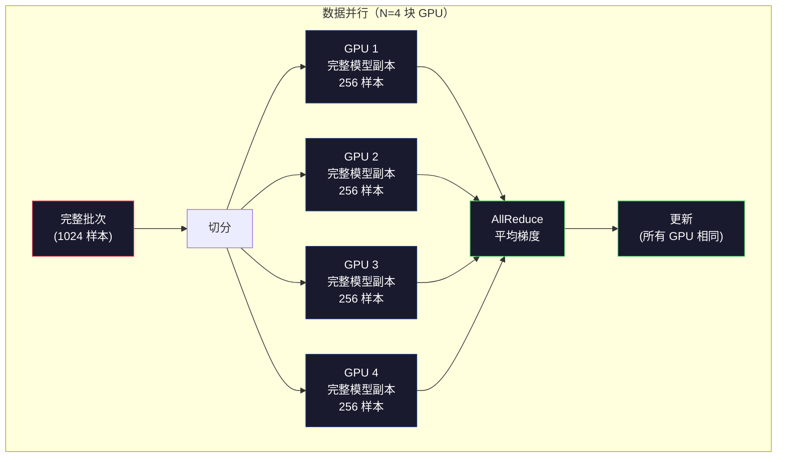
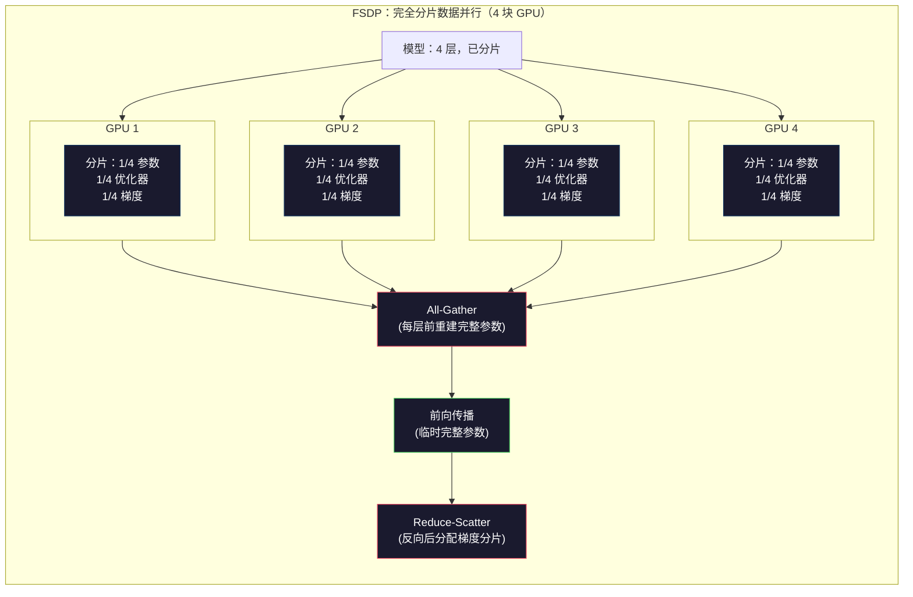
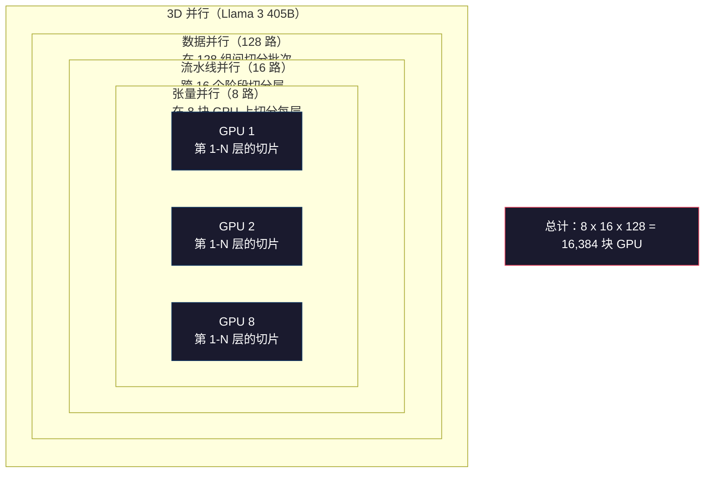

# 规模化：分布式训练、FSDP、DeepSpeed

> 你的 124M 模型在一块 GPU 上训练过。现在试试 70 亿参数。模型放不进显存。在单台机器上数据要跑几周。分布式训练在大规模下不是可选项——它是唯一的出路。

**类型：** 构建
**语言：** Python
**先修内容：** Phase 10，课程 04（预训练 Mini GPT）
**学习时间：** 约 120 分钟

## 学习目标

- 解释三种并行类型（数据并行、张量并行、流水线并行）及其基于模型和集群规模的必要性
- 使用 PyTorch DDP 实现数据并行训练，在多块 GPU 上同步梯度
- 计算给定模型大小的内存预算（权重 + 优化器状态 + 梯度 + 激活值），以确定最低硬件需求
- 配置 FSDP 或 DeepSpeed ZeRO 阶段，将模型状态分片到多块 GPU 上，使超出单卡内存的模型得以运行

## 问题所在

一个 FP16 的 7B 参数模型仅权重就需要 14GB。Adam 优化器为每个参数存储两个额外副本（一阶和二阶矩估计）。这又是 28GB。反向传播期间的梯度再加 14GB。在存储任何激活值之前，你已经用了 56GB。

一块 NVIDIA A100 有 80GB 显存。

56GB / 80GB 已消耗。剩余 24GB 用于激活值——前向传播期间计算的中间值，必须保持存活以供反向传播使用。对于 2048 Token 序列和 4096 维模型，单层激活值约使用 64MB。32 层需要每样本 2GB。Batch size 为 8 需要 16GB。你有 24GB。Batch size 为 12 就爆了。

现在试试 70B 参数。FP16 下仅权重：140GB。一块 GPU 放不下。你至少需要 2 块 A100（2 × 80GB = 160GB）才能放下权重。加上优化器状态和梯度，你远需要更多：最少 3+ 块 GPU，实际需要 8-16 块，取决于分片策略。

Llama 3 405B 在 16,384 块 NVIDIA H100 GPU 上训练。训练运行估计耗资 1 亿美元。DeepSeek V3 通过在架构上聪明设计（混合专家意味着每个 Token 只有一部分参数被激活）以约 560 万美元训练了一个可比的模型。

本课涵盖使大规模训练成为可能的四种策略：数据并行、张量并行、流水线并行和完全分片数据并行。你将在纯 Python 中模拟每一种，以便在接触任何分布式训练框架之前理解机制。

## 核心概念

### 为什么需要分布式

以下是真实模型的内存数学。每一个数字都是计算出来的，不是估计的。

| 模型 | 参数量 | 权重（FP16） | Adam 状态 | 梯度（FP16） | 总计（不含激活值） |
|-------|--------|----------------|-------------|------------------|----------------------|
| GPT-2 Small | 124M | 248 MB | 992 MB | 248 MB | 1.5 GB |
| Llama 3 8B | 8B | 16 GB | 64 GB | 16 GB | 96 GB |
| Llama 3 70B | 70B | 140 GB | 560 GB | 140 GB | 840 GB |
| Llama 3 405B | 405B | 810 GB | 3,240 GB | 810 GB | 4,860 GB |

"Adam 状态"列是杀手。Adam 为每个参数存储一个运行均值（m）和一个运行方差（v），均为 FP32。对于 70B 模型，这是 70B × 4 字节 × 2 = 560GB。优化器本身就需要七块 A100。

单块 H100 有 80GB。Llama 3 405B 最少需要 61 块 H100 来存放权重、优化器和梯度。加上激活值，数量还会增加。Meta 使用 16,384 块 GPU 不是因为他们想要——而是因为他们不得不。

### 数据并行

最简单的分布式策略。将整个模型复制到 N 块 GPU。将每个训练批次分成 N 等份。每块 GPU 在其数据分片上运行前向和反向传播。反向传播后，在所有 GPU 上平均梯度。每块 GPU 用相同的平均梯度更新其模型副本，保持所有副本同步。

**优点：** 线性吞吐量扩展。N 块 GPU 每步处理 N 倍数据。通信仅限于梯度平均，与计算重叠。

**缺点：** 每块 GPU 保存模型的完整副本、优化器状态和梯度。对于 70B 模型，每块 GPU 需要 840GB。数据并行不能减少单卡内存。它只是减少训练时间。

**数学：** 有效 batch size = per_gpu_batch_size × N。对于 N=64 块 GPU，每卡 batch 为 16，有效 batch 为 1,024。Llama 3 使用每步 1,600 万 Token 的有效 batch size。



### 张量并行

在各块 GPU 之间切分单独的层。单个矩阵乘法被分配到各块 GPU，每块计算部分结果。

考虑前馈层中形状为 (8192, 8192) 的权重矩阵。4 路张量并行下，每块 GPU 持有 (8192, 2048) 分片。每块 GPU 将输入乘以其分片，产生部分结果。部分结果被合并（通过 all-reduce 或 all-gather）以产生完整输出。

**优点：** 减少单卡模型权重内存。70B 模型分片到 8 块 GPU 意味着每块 GPU 持有约 8.75B 参数对应的权重。

**缺点：** 需要每层后快速 GPU 间通信。每次 matmul 后的 all-reduce 增加延迟。这在有 NVLink（同一节点 GPU 间 900 GB/s）的设备上效果良好，但在通过 InfiniBand（400 Gb/s，约 50 GB/s）连接跨节点时效果较差。张量并行几乎总是限制在单个节点内（8 块 GPU）。

**实际使用：** Megatron-LM 开创了张量并行。Llama 3 405B 在每个节点内使用 8 路张量并行。

### 流水线并行

按层分模型。GPU 1 运行第 1-8 层。GPU 2 运行第 9-16 层。GPU 3 运行第 17-24 层。GPU 4 运行第 25-32 层。数据通过流水线流动：GPU 1 计算其层并将激活值发送到 GPU 2，GPU 2 计算其层并发送到 GPU 3，以此类推。

**优点：** GPU 间通信最少——仅层边界的激活值，比梯度或权重小得多。跨节点工作良好，因为带宽需求低。

**缺点：** 流水线气泡。当 GPU 4 正在计算微批次 1 的前向传播时，GPU 1、2、3 空闲（它们已转发完各自的部分）。反向传播时模式反转。使用朴素流水线，N 个流水线阶段中 GPU 利用率仅为 1/N。

**GPipe 和 PipeDream** 通过将批次分成微批次解决气泡问题。GPU 1 一完成微批次 1 的前向就立即开始微批次 2。这重叠了流水线阶段之间的计算。M 个微批次和 N 个阶段，气泡比例降至 (N-1)/M。使用 M=16 个微批次和 N=4 个阶段，气泡为 3/16 = 18.75% 空闲时间。

### FSDP：完全分片数据并行

FSDP 将数据并行的可扩展性与分片的内存效率相结合。不是每块 GPU 持有模型的完整副本，而是每块 GPU 仅持有 1/N 的参数、梯度和优化器状态。

在层的反向传播之前，FSDP 运行一个 **all-gather** 从所有 GPU 收集完整参数到每块 GPU 的内存中。前向传播后，每块 GPU 丢弃非本地参数。在反向传播期间，all-gather 再次运行以重建用于梯度计算的参数。反向传播后，**reduce-scatter** 分配梯度分片，使每块 GPU 仅存储 1/N 的梯度。

**70B 模型在 8 块 GPU 上的数学：**

| 组件 | 不使用 FSDP | 使用 FSDP |
|-----------|-------------|-----------|
| 权重（FP16） | 140 GB / GPU | 17.5 GB / GPU |
| Adam 状态（FP32） | 560 GB / GPU | 70 GB / GPU |
| 梯度（FP16） | 140 GB / GPU | 17.5 GB / GPU |
| **总计** | **840 GB / GPU** | **105 GB / GPU** |

不使用 FSDP，你无法将 70B 模型放在单块 80GB GPU 上。使用 8 块 GPU 上的 FSDP，每块 GPU 使用 105GB——等等，这仍然放不下。你需要至少 16 块 GPU 才能降到每 GPU 80GB 以下，或者将 FSDP 与激活值检查点（反向时重新计算激活值而非存储）结合。

通信成本比朴素数据并行更高，因为每层前有 all-gather。但内存节省使以前不可能的训练运行成为可能。



### DeepSpeed ZeRO

DeepSpeed 的 ZeRO（零冗余优化器）与 FSDP 概念上相同，但由 Microsoft 独立开发。它定义三个阶段，每个阶段分片更激进：

| 阶段 | 分片内容 | 内存节省 | 通信量 |
|-------|--------|---------------|---------------|
| ZeRO-1 | 仅优化器状态 | 约 4 倍减少 | 与数据并行相同 |
| ZeRO-2 | + 梯度 | 约 8 倍减少 | 略多 |
| ZeRO-3 | + 参数 | 约 N 倍减少（N 块 GPU） | 每层 all-gather |

ZeRO-3 等同于 FSDP。命名不同，机制相同。PyTorch 在 DeepSpeed 证明这一概念后添加了 FSDP 作为原生实现。

DeepSpeed 还引入了 ZeRO-Offload（将优化器状态卸载到 CPU RAM，更便宜且更大）和 ZeRO-Infinity（卸载到 NVMe SSD）。这些以计算速度换取内存容量——卸载操作较慢但释放了 GPU 显存。

### 混合精度训练

现代训练同时使用多种浮点格式：

- **前向传播：** FP16 或 BF16（16 位）。FP32 一半的内存。Matmul 在张量核上运行快 2 倍。
- **主权重：** FP32（32 位）。由优化器在权重更新期间保持数值精度。
- **Loss 缩放：** 在反向传播前将 loss 乘以一个大常数，以防止 FP16 梯度下溢到零。在优化器步骤前除以相同常数。

BF16（Brain Float 16）与 FP32 有相同的指数范围（8 个指数位）但精度降低（7 个尾数位 vs FP32 的 23 个）。它很少需要 loss 缩放，因为它可以表示相同的值范围。FP16 有 5 个指数位和 10 个尾数位——可以表示精细值但在极端大小时会溢出/下溢。

Google 的 TPU 原生使用 BF16。NVIDIA 的 A100 和 H100 支持 FP16 和 BF16。业界已基本转向 BF16，因为它消除了 loss 缩放的麻烦。

**7B 模型的内存对比：**

| 精度 | 权重 | 优化器 | 梯度 | 总计 |
|-----------|---------|-----------|-----------|-------|
| FP32 处处 | 28 GB | 56 GB | 28 GB | 112 GB |
| 混合（BF16 + FP32 主） | 14 GB | 56 GB | 14 GB | 84 GB |

混合精度在该模型上节省 28GB。优化器状态保持 FP32 不变——这是内存的主要消耗。

### Megatron-LM 和 3D 并行

真实的大规模训练结合了所有三种并行：

- **数据并行** 在节点组之间（扩展 batch size）
- **张量并行** 在节点内（将层分片到 8 块 GPU）
- **流水线并行** 跨节点（将层组分配到各机器）

Llama 3 405B 在 16,384 块 H100 上：
- 每个节点内 8 路张量并行（每节点 8 块 GPU）
- 跨节点 16 路流水线并行（16 个流水线阶段）
- 剩余维度上 128 路数据并行（16,384 / 8 / 16 = 128）

这种 3D 分解（8 × 16 × 128 = 16,384）是你扩展到数千块 GPU 的方式。每块 GPU 看到不同的数据分片（数据并行），持有每层的一个切片（张量并行），计算不同的层集（流水线并行）。

DeepSeek V3 采取了不同方法。他们的混合专家架构每个 Token 仅激活 671B 参数中的 37B。这意味着每块 GPU 只需计算（并存储激活值）活跃参数。他们在 2,048 块 H800 GPU 上训练——不到 Meta GPU 数量的 1/8，耗资 560 万美元对比 Meta 的估计 1 亿美元。



## 构建

### 步骤 1：模拟数据并行

将批次分片到模拟的 GPU 上。每块 GPU 在其分片上计算前向传播。平均"梯度"（我们用 loss 值模拟）。

```python
import numpy as np

def simulate_data_parallelism(data, num_gpus, model_fn):
    batch_size = len(data)
    shard_size = batch_size // num_gpus
    remainder = batch_size % num_gpus

    gpu_losses = []
    gpu_gradients = []

    offset = 0
    for gpu_id in range(num_gpus):
        extra = 1 if gpu_id < remainder else 0
        shard = data[offset:offset + shard_size + extra]
        offset += shard_size + extra

        loss, grad = model_fn(shard)
        gpu_losses.append(loss)
        gpu_gradients.append(grad)

    avg_loss = np.mean(gpu_losses)
    avg_gradient = np.mean(gpu_gradients, axis=0)

    return avg_loss, avg_gradient
```

All-reduce 操作（平均梯度）是数据并行中唯一的通信。在实践中，这在 NVIDIA GPU 上使用 NCCL 库实现，NCCL 实现环形 all-reduce：每块 GPU 向邻居发送 1/N 的梯度，从另一邻居接收 1/N，经过 N-1 步后每块 GPU 都有完整的平均值。总通信量：2 × gradient_size × (N-1)/N，对大 N 趋近于 2 倍梯度大小。

### 步骤 2：模拟张量并行

将权重矩阵分片到 GPU 上。每块 GPU 计算部分矩阵乘法。合并结果。

```python
def simulate_tensor_parallelism(input_data, weight_matrix, num_gpus):
    d_in, d_out = weight_matrix.shape
    assert d_out % num_gpus == 0, f"d_out {d_out} not divisible by num_gpus {num_gpus}"
    shard_size = d_out // num_gpus

    partial_results = []
    for gpu_id in range(num_gpus):
        start = gpu_id * shard_size
        end = start + shard_size
        weight_shard = weight_matrix[:, start:end]

        partial = input_data @ weight_shard
        partial_results.append(partial)

    full_output = np.concatenate(partial_results, axis=-1)

    direct_output = input_data @ weight_matrix
    error = np.abs(full_output - direct_output).max()

    return full_output, error
```

误差应该恰好为零（或机器精度）。张量并行在数学上是精确的——它产生与在单块 GPU 上计算完整 matmul 相同的结果。按输出维度切分，所以每块 GPU 产生不同的列块，拼接重建完整结果。

对于列并行线性层（切分输出维度），你拼接。对于行并行（切分输入维度），你求和。在 Transformer FFN 中，第一个线性层（扩展）使用列并行，第二个线性层（收缩）使用行并行。这避免了两层之间的 all-reduce。

### 步骤 3：模拟流水线并行

将模型的层分片到虚拟 GPU 上。展示气泡问题——早期阶段在后期阶段计算时处于空闲状态。

```python
def simulate_pipeline_parallelism(num_layers, num_stages, num_microbatches):
    layers_per_stage = num_layers // num_stages

    timeline = {}
    clock = 0

    for mb in range(num_microbatches):
        for stage in range(num_stages):
            start_time = max(
                timeline.get((stage, mb - 1, "fwd"), (0, 0))[1] if mb > 0 else 0,
                timeline.get((stage - 1, mb, "fwd"), (0, 0))[1] if stage > 0 else 0,
            )
            end_time = start_time + layers_per_stage
            timeline[(stage, mb, "fwd")] = (start_time, end_time)

    last_fwd_end = max(v[1] for v in timeline.values())

    for mb in range(num_microbatches - 1, -1, -1):
        for stage in range(num_stages - 1, -1, -1):
            deps = [last_fwd_end]
            if mb < num_microbatches - 1 and (stage, mb + 1, "bwd") in timeline:
                deps.append(timeline[(stage, mb + 1, "bwd")][1])
            if stage < num_stages - 1 and (stage + 1, mb, "bwd") in timeline:
                deps.append(timeline[(stage + 1, mb, "bwd")][1])
            start_time = max(deps)
            end_time = start_time + layers_per_stage
            timeline[(stage, mb, "bwd")] = (start_time, end_time)

    total_time = max(v[1] for v in timeline.values())
    compute_time = num_microbatches * num_stages * layers_per_stage * 2
    bubble_fraction = 1.0 - compute_time / (total_time * num_stages)

    return timeline, total_time, bubble_fraction
```

4 个阶段和 1 个微批次，气泡比例是 75%——任何时刻四块 GPU 中三块空闲。16 个微批次，降至约 19%。消除气泡的代价是内存：你必须同时存储所有进行中微批次的激活值。

### 步骤 4：内存计算器

计算训练任何规模模型的精确内存需求。

```python
def memory_calculator(
    params_billions,
    precision_bytes=2,
    optimizer="adam",
    num_gpus=1,
    sharding="none",
    sequence_length=2048,
    batch_size_per_gpu=1,
    hidden_dim=None,
    num_layers=None,
):
    params = params_billions * 1e9

    weight_memory = params * precision_bytes

    if optimizer == "adam":
        optimizer_memory = params * 4 * 2
    elif optimizer == "sgd":
        optimizer_memory = params * 4
    else:
        optimizer_memory = 0

    gradient_memory = params * precision_bytes

    total_no_activation = weight_memory + optimizer_memory + gradient_memory

    if hidden_dim and num_layers:
        activation_per_layer = (
            sequence_length * batch_size_per_gpu * hidden_dim * precision_bytes * 4
        )
        activation_memory = activation_per_layer * num_layers
    else:
        activation_memory = params * precision_bytes * 0.5

    if sharding == "fsdp" or sharding == "zero3":
        weight_memory /= num_gpus
        optimizer_memory /= num_gpus
        gradient_memory /= num_gpus
    elif sharding == "zero2":
        optimizer_memory /= num_gpus
        gradient_memory /= num_gpus
    elif sharding == "zero1":
        optimizer_memory /= num_gpus

    per_gpu_total = weight_memory + optimizer_memory + gradient_memory + activation_memory

    return {
        "params_billions": params_billions,
        "weights_gb": weight_memory / 1e9,
        "optimizer_gb": optimizer_memory / 1e9,
        "gradients_gb": gradient_memory / 1e9,
        "activations_gb": activation_memory / 1e9,
        "per_gpu_total_gb": per_gpu_total / 1e9,
        "total_across_gpus_gb": per_gpu_total * num_gpus / 1e9,
        "fits_on_80gb": per_gpu_total / 1e9 <= 80,
        "num_gpus": num_gpus,
        "sharding": sharding,
    }
```

这个计算器回答每个 ML 工程师都会问的问题："我需要多少块 GPU？"输入模型大小，看它是否放得下。调整分片策略，直到每卡总量降到 80GB 以下。

### 步骤 5：混合精度模拟

比较 FP32、FP16 和混合精度训练之间的内存使用。

```python
def mixed_precision_comparison(params_billions):
    params = params_billions * 1e9

    fp32_weights = params * 4
    fp32_optimizer = params * 4 * 2
    fp32_gradients = params * 4
    fp32_total = fp32_weights + fp32_optimizer + fp32_gradients

    fp16_weights = params * 2
    fp16_master = params * 4
    fp16_optimizer = params * 4 * 2
    fp16_gradients = params * 2
    fp16_total = fp16_weights + fp16_master + fp16_optimizer + fp16_gradients

    mixed_weights = params * 2
    mixed_optimizer = params * 4 * 2
    mixed_gradients = params * 2
    mixed_total = mixed_weights + mixed_optimizer + mixed_gradients

    return {
        "fp32_total_gb": fp32_total / 1e9,
        "fp16_with_master_gb": fp16_total / 1e9,
        "mixed_bf16_gb": mixed_total / 1e9,
        "savings_vs_fp32": 1 - mixed_total / fp32_total,
    }
```

对大多数人来说最大的惊喜：混合精度不会将内存减半。优化器状态（Adam 的 m 和 v）无论精度如何都保持 FP32。对于 7B 模型，FP32 训练使用 112GB。混合精度使用 84GB。这是 25% 的减少，不是 50%。优化器占主导。

## 使用

### 运行所有模拟

```python
def run_all_demos():
    print("=" * 70)
    print("DATA PARALLELISM SIMULATION")
    print("=" * 70)

    np.random.seed(42)
    data = np.random.randn(64, 32)
    weight = np.random.randn(32, 16)

    def model_fn(batch):
        output = batch @ weight
        loss = np.mean(output ** 2)
        grad = 2 * batch.T @ (batch @ weight) / len(batch)
        return loss, grad

    for n_gpus in [1, 2, 4, 8]:
        loss, grad = simulate_data_parallelism(data, n_gpus, model_fn)
        print(f"  {n_gpus} GPUs: loss={loss:.4f}, grad_norm={np.linalg.norm(grad):.4f}")

    print()
    print("=" * 70)
    print("TENSOR PARALLELISM SIMULATION")
    print("=" * 70)

    x = np.random.randn(4, 8192)
    W = np.random.randn(8192, 8192)

    for n_gpus in [1, 2, 4, 8]:
        output, error = simulate_tensor_parallelism(x, W, n_gpus)
        print(f"  {n_gpus} GPUs: output_shape={output.shape}, max_error={error:.2e}")

    print()
    print("=" * 70)
    print("PIPELINE PARALLELISM SIMULATION")
    print("=" * 70)

    for n_mb in [1, 4, 8, 16, 32]:
        _, total_t, bubble = simulate_pipeline_parallelism(32, 4, n_mb)
        print(f"  {n_mb:2d} micro-batches: total_time={total_t:4d}, bubble={bubble:.1%}")

    print()
    print("=" * 70)
    print("MEMORY CALCULATOR")
    print("=" * 70)

    configs = [
        (7, "none", 1),
        (7, "fsdp", 8),
        (70, "none", 1),
        (70, "fsdp", 8),
        (70, "fsdp", 16),
        (405, "fsdp", 64),
        (405, "fsdp", 128),
    ]

    print(f"  {'Model':>8} {'Sharding':>8} {'GPUs':>5} {'Per-GPU':>10} {'Fits 80GB':>10}")
    print("  " + "-" * 50)
    for params, shard, gpus in configs:
        result = memory_calculator(params, num_gpus=gpus, sharding=shard)
        fits = "Yes" if result["fits_on_80gb"] else "No"
        print(f"  {params:>6}B {shard:>8} {gpus:>5} {result['per_gpu_total_gb']:>8.1f}GB {fits:>10}")

    print()
    print("=" * 70)
    print("MIXED PRECISION COMPARISON")
    print("=" * 70)

    for params_b in [7, 13, 70, 405]:
        result = mixed_precision_comparison(params_b)
        print(f"  {params_b}B: FP32={result['fp32_total_gb']:.0f}GB, "
              f"Mixed BF16={result['mixed_bf16_gb']:.0f}GB, "
              f"Savings={result['savings_vs_fp32']:.0%}")
```

## 发货

这节课产出 `outputs/prompt-distributed-training-planner.md`——一个接受模型大小和可用硬件，然后生成完整分布式训练计划的提示词：并行策略、内存预算、通信开销和预期吞吐量。

## 练习

1. 修改内存计算器以包含激活值检查点。启用检查点后，只在每隔 K 层存储激活值（典型 K=1，意味着重新计算所有）。展示检查点节省了多少内存，以及它使训练慢了多少（完全检查点约慢 33%）。

2. 扩展流水线并行模拟，实现 PipeDream 使用的 1F1B（一次前向、一次反向）调度。在 4 个阶段和 8 个微批次上比较气泡比例与朴素调度。1F1B 调度应有更小的峰值内存，因为它更早开始反向传播。

3. 实现梯度累积模拟器。不在每个微批次后 all-reduce，而是在本地累积 K 步的梯度，然后 all-reduce。展示这如何将通信减少 K 倍，同时产生相同的最终梯度（因此训练结果相同）。

4. 构建成本估算器。给定模型大小、目标 Token 数量、GPU 类型（A100 2美元/小时，H100 3.50美元/小时）和并行策略，估计总训练成本（美元）。与已知成本验证：Llama 3 405B 据说耗资约 1 亿美元，DeepSeek V3 耗资约 560 万美元。

5. 向内存计算器添加 ZeRO-Offload。假设每节点 CPU RAM 为 512GB，NVMe 为 2TB。展示将优化器状态卸载到 CPU 如何使 70B 模型能在 4 块 GPU 上训练而非 16 块，代价是优化器步骤慢 30-50%。

## 关键术语

| 术语 | 人们怎么说 | 实际含义 |
|------|----------------|----------------------|
| 数据并行 | "将模型复制到每块 GPU" | 每块 GPU 处理不同的数据分片；每步后通过 all-reduce 平均梯度 |
| 张量并行 | "在 GPU 间切分层" | 分区权重矩阵，使每块 GPU 计算部分 matmul；需要快速的 NVLink 互联 |
| 流水线并行 | "在 GPU 间切分层" | 每块 GPU 运行不同的层组；数据通过微批次流水线流动以减少气泡 |
| FSDP | "分片所有内容" | 完全分片数据并行——每块 GPU 持有 1/N 的权重、梯度和优化器状态；计算前 all-gather |
| ZeRO | "DeepSpeed 版 FSDP" | 零冗余优化器，有 3 个阶段：分片优化器（阶段 1）、+ 梯度（阶段 2）、+ 参数（阶段 3） |
| All-reduce | "跨 GPU 平均" | 集合操作，每块 GPU 最终获得所有 GPU 输入的总和（或平均值）——通常实现为环形 all-reduce |
| All-gather | "从所有 GPU 收集" | 集合操作，每块 GPU 最终获得所有 GPU 数据的拼接——用于 FSDP 重建完整参数 |
| Reduce-scatter | "求和并分配" | 对数据求和并将不同块分配给不同 GPU 的集合操作——用于 FSDP 梯度分片 |
| 混合精度 | "半精度训练" | 前向/反向使用 FP16/BF16，优化器状态使用 FP32——节省约 25% 内存而非 50%，因为优化器占主导 |
| 流水线气泡 | "流水线中的空闲时间" | GPU 在等待前一阶段数据时处于空闲的比例——通过使用更多微批次来减少 |

## 延伸阅读

- [Rajbhandari et al., 2020 -- "ZeRO: Memory Optimizations Toward Training Trillion Parameter Models"](https://arxiv.org/abs/1910.02054) -- 定义三个分片阶段的 DeepSpeed ZeRO 论文
- [Shoeybi et al., 2020 -- "Megatron-LM: Training Multi-Billion Parameter Language Models Using Model Parallelism"](https://arxiv.org/abs/1909.08053) -- NVIDIA 的 Transformer 张量并行
- [Narayanan et al., 2021 -- "Efficient Large-Scale Language Model Training on GPU Clusters Using Megatron-LM"](https://arxiv.org/abs/2104.04473) -- 结合数据、张量和流水线的 3D 并行
- [Zhao et al., 2023 -- "PyTorch FSDP: Experiences on Scaling Fully Sharded Data Parallel"](https://arxiv.org/abs/2304.11277) -- PyTorch 原生 FSDP 实现
- [Llama 3 Technical Report](https://arxiv.org/abs/2407.21783) -- 16,384 GPU 训练和 3D 并行细节
- [DeepSeek-V3 Technical Report](https://arxiv.org/abs/2412.19437) -- MoE 架构如何将训练成本降低一个数量级