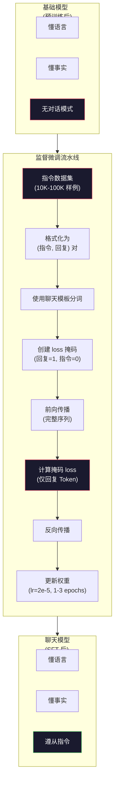

# 指令微调（SFT）

> 基础模型预测下一个 Token。就这样。它不会遵从指令，不会回答问题，不会拒绝有害请求。SFT 是从 Token 预测器到有用助手之间的桥梁。你对话过的每一个模型——Claude、GPT、Llama Chat——都经过了这一步。

**类型：** 构建
**语言：** Python（使用 numpy）
**先修内容：** Phase 10，课程 04（预训练 Mini GPT）
**学习时间：** 约 90 分钟

## 学习目标

- 实现监督微调（SFT），将基础语言模型转换为遵从指令的助手
- 使用带 system、user 和 assistant 角色的聊天模板格式化训练数据，并对非 assistant Token 进行 loss 遮蔽
- 解释为什么 SFT 是必要的：基础模型续写文本而不是回答问题
- 通过比较基础模型和微调模型在保留指令集上的响应来评估 SFT 质量

## 问题所在

你在课程 04 中训练了一个模型。它可以根据序列预测下一个 Token。输入"The transformer architecture"，它可能会续写"has revolutionized natural language processing."——对于下一个 Token 预测器来说这令人印象深刻。

现在试试这个：输入"What is the capital of France?" 基础模型不会回答"Paris."。它会续写文本。它可能产生"What is the capital of Germany? What is the capital of Spain?"，因为它从包含问题列表的文档中学习过。或者它可能产生"is a question that many people ask"，因为这是合理的下一个 Token 续写。模型没有*回答*的概念。它只知道*续写*。

这就是 GPT-3（基础模型，2020 年 6 月发布）和 ChatGPT（指令微调，2022 年 11 月发布）之间的差距。同样的架构。同样的预训练。区别在于 20,000 到 100,000 个精心设计的（指令，回复）对，教模型遵循对话模式。

Stanford Alpaca 证明你不需要数百万个例子。2023 年 3 月，他们仅用 52,000 个由 GPT-3.5 生成的指令-回复对微调 Llama 7B。总成本：600 美元。结果是一个可以遵从指令、回答问题并进行对话的聊天机器人。不如 ChatGPT，但考虑到 600 美元和几小时训练，惊人地接近。

Meta 的 Llama 2 Chat 初始 SFT 阶段只用了约 27,000 个高质量例子。关键洞察：质量比数量更重要。由熟练标注员编写的 27,000 个例子胜过了从互联网抓取的 100 万个噪声例子。

## 核心概念

### SFT 实际做什么

监督微调继续与预训练相同的训练循环——前向传播计算 loss、反向传播更新权重——但使用不同类型的数据。不是原始文本，而是在结构化对话上训练：

```json
{
  "system": "You are a helpful assistant.",
  "user": "What is the capital of France?",
  "assistant": "The capital of France is Paris."
}
```

模型已经在预训练中从维基百科、教科书和网页学到了 Paris 是法国的首都。SFT 不教模型新事实。它教模型一个新*行为*：当你看到问题时，产生答案。当你看到指令时，产生完成。当你看到有害请求时，产生拒绝。

可以这样理解：预训练给模型知识。SFT 给模型礼貌。

### 数据格式

三种格式主导行业。每个都将相同的信息——谁说了什么——用不同的分隔符编码。

**Alpaca 格式**（Stanford，2023 年 3 月）：

```json
{
  "instruction": "Summarize the following article in 3 sentences.",
  "input": "The European Central Bank raised interest rates...",
  "output": "The ECB increased rates by 25 basis points..."
}
```

简单且广泛使用。`input` 字段是可选的——许多指令不需要额外上下文。Stanford 以 600 美元成本发布了 52,000 个 GPT-3.5 生成的样例，格式如上。这开启了开源指令微调运动。

**ShareGPT 格式**（社区，2023 年）：

```json
{
  "conversations": [
    {"from": "system", "value": "You are a helpful assistant."},
    {"from": "human", "value": "What causes tides?"},
    {"from": "gpt", "value": "Tides are caused by the gravitational pull of the Moon..."},
    {"from": "human", "value": "How often do they occur?"},
    {"from": "gpt", "value": "Most coastal areas experience two high tides and two low tides per day..."}
  ]
}
```

支持多轮对话。"from" 字段按惯例使用"human"和"gpt"，无论实际模型是什么。Vicuna 在 70,000 个从用户共享的 ChatGPT 记录中抓取的 ShareGPT 对话上训练。

**ChatML 格式**（OpenAI，被许多开源模型使用）：

```
<|im_start|>system
You are a helpful assistant.<|im_end|>
<|im_start|>user
What is the capital of France?<|im_end|>
<|im_start|>assistant
The capital of France is Paris.<|im_end|>
```

使用特殊 Token（`<|im_start|>`, `<|im_end|>`）来分隔角色。这些 Token 在微调期间被添加到分词器的词表中。Qwen、Yi 和许多其他模型使用 ChatML。

三种格式实现相同目标：告诉模型"这是指令，这是回复，学习这个模式。"

### 为什么有效

模型已经从预训练中学会了语言。它见过数十亿个问题后面跟着答案、指令后面跟着完成的例子、会话模式。这些模式已经编码在权重中。

SFT 集中了这种潜在能力。不再需要模型从上下文中自己判断应该回答问题还是续写文档，SFT 明确地在对话模式上训练。经过几千个例子后，模型学会：当你看到 assistant 角色标记时，产生有用的回复。

这就是为什么 27,000 个例子就足够了。你不是在教模型英语。你不是在教它世界事实。你在教它一个简单的行为：回应指令。知识早已在那里。

### 掩码 Loss

这是 SFT 中最重要的技术细节，大多数教程都跳过了。

在预训练期间，你在每个 Token 上计算 loss。模型学会预测序列中每个下一个 Token。在 SFT 期间，你只对*回复* Token 计算 loss。指令 Token 作为上下文存在，但模型不会因为"错误预测"它们而受到惩罚。

为什么？因为你不希望模型学会*生成*指令。你希望它学会*回应*指令。如果你对指令 Token 计算 loss，你是在训练模型预测"What is the capital of France?"——好像它是提问者。这浪费了梯度信号，还会让模型对自己的角色产生困惑。

实际上，你创建一个 loss 掩码：回复 Token 为 1，指令 Token 为 0。在求平均前将每个 Token 的 loss 乘以这个掩码。

```
Token:    [SYS] You are helpful [USER] What is the capital? [ASST] Paris is the capital [EOS]
Loss mask:   0    0    0     0      0     0   0  0     0       1     1    1   1     1      1
```

只有 [ASST] 之后的 Token 贡献 loss。模型在前向传播时看到完整对话（它需要指令来产生正确回复），但只根据其预测回复的好坏来更新权重。

### 训练超参数

SFT 使用与预训练截然不同的超参数。你不是从头训练。你在调整一个已经能用的模型。

| 参数 | 预训练（Llama 2 7B） | SFT（Llama 2 Chat） |
|-----------|---------------------------|---------------------|
| 学习率 | 3e-4（峰值） | 2e-5 |
| Epoch 数 | 1（单次遍历数据） | 2 |
| Batch size | 4M Token | 64 个样例 |
| 预热步数 | 2,000 | 0-100 |
| 权重衰减 | 0.1 | 0.0-0.1 |
| 数据规模 | 2T Token | 27,000 个样例 |

SFT 的学习率低 15 倍。这很关键。在微调期间使用高学习率会破坏预训练知识。模型"遗忘"它学到的东西，在小的微调数据集上过拟合。这就是灾难性遗忘。

两个 epoch 意味着模型看到每个训练样例两次。在小数据集上训练超过 3 个 epoch 会导致记忆——模型开始逐字复制训练样例，而不是泛化。

### 灾难性遗忘

微调可以破坏通用能力。在指令遵从数据上训练太久，模型会失去写代码、做数学或产生创意文本的能力。它变得非常擅长训练数据的特定格式，而对其他一切都糟糕透顶。

三种缓解策略：

1. **低学习率。** 1e-5 到 5e-5。较小的更新意味着对预训练特征的破坏更少。

2. **短期训练。** 1-3 个 epoch。在模型过拟合前停止。

3. **混入预训练数据。** Llama 2 Chat 将少量（2-5%）原始预训练数据混入 SFT 数据集。这在模型学习新指令遵从行为时"提醒"它通用能力。

### 真实数字

在单块 NVIDIA A100 80GB GPU 上，用 10,000 个高质量指令对微调 7B 模型大约需要 1 小时。数学如下：

- 10,000 个样例 × 512 Token 平均 = 5.12M Token
- 2 个 epoch = 10.24M Token 总计
- A100 吞吐量，用于 7B 模型微调：约 3,000 Token/秒
- 10.24M / 3,000 = 约 3,400 秒 = 约 57 分钟

对于我们的 mini GPT（4 层，128 维），训练几乎是瞬间的。重点是理解机制，不是规模。



## 构建

### 步骤 1：指令数据集

创建一个合成指令数据集。在生产中，像 Scale AI 和 Anthropic 这样的公司雇佣人工标注员来编写这些。我们通过编程方式创建它们来演示格式。

```python
import numpy as np

INSTRUCTION_DATA = [
    {
        "instruction": "What is the capital of France?",
        "response": "The capital of France is Paris."
    },
    {
        "instruction": "Explain gravity in one sentence.",
        "response": "Gravity is the force that attracts objects with mass toward each other."
    },
    {
        "instruction": "Write a haiku about the ocean.",
        "response": "Waves crash on the shore, salt and foam beneath the sun, endless blue expanse."
    },
    {
        "instruction": "What is 15 multiplied by 7?",
        "response": "15 multiplied by 7 is 105."
    },
    {
        "instruction": "Name three programming languages.",
        "response": "Three programming languages are Python, Rust, and TypeScript."
    },
    {
        "instruction": "Summarize photosynthesis.",
        "response": "Photosynthesis converts sunlight, water, and carbon dioxide into glucose and oxygen."
    },
    {
        "instruction": "What year did World War II end?",
        "response": "World War II ended in 1945."
    },
    {
        "instruction": "Define machine learning.",
        "response": "Machine learning is a field where algorithms learn patterns from data to make predictions."
    },
]
```

8 个样例微不足道。Stanford Alpaca 用了 52,000 个。但无论你有 8 个还是 52,000 个，机制都是相同的：分词、掩码、仅在回复上计算 loss。

### 步骤 2：使用聊天模板分词

将指令-回复对转换为带特殊角色标记的 Token 序列。标记告诉模型指令在哪里结束、回复从哪里开始。

```python
SPECIAL_TOKENS = {
    "INST_START": 253,
    "INST_END": 254,
    "RESP_START": 255,
}


def tokenize_instruction_pair(instruction, response, vocab_size=256):
    inst_tokens = list(instruction.encode("utf-8"))
    resp_tokens = list(response.encode("utf-8"))

    inst_tokens = [min(t, vocab_size - 4) for t in inst_tokens]
    resp_tokens = [min(t, vocab_size - 4) for t in resp_tokens]

    tokens = (
        [SPECIAL_TOKENS["INST_START"]]
        + inst_tokens
        + [SPECIAL_TOKENS["INST_END"]]
        + [SPECIAL_TOKENS["RESP_START"]]
        + resp_tokens
    )

    return tokens


def create_loss_mask(tokens):
    mask = np.zeros(len(tokens), dtype=np.float32)
    in_response = False

    for i, token in enumerate(tokens):
        if token == SPECIAL_TOKENS["RESP_START"]:
            in_response = True
            continue
        if in_response:
            mask[i] = 1.0

    return mask
```

Loss 掩码在指令 Token 上全为零，在回复 Token 上全为一。`RESP_START` Token 本身的掩码为 0，因为它是一个分隔符，不是回复内容的一部分。

### 步骤 3：掩码交叉熵 Loss

标准交叉熵，但乘以 loss 掩码。只有回复 Token 贡献梯度。

```python
def masked_cross_entropy_loss(logits, targets, loss_mask):
    batch, seq_len, vocab_size = logits.shape
    logits_flat = logits.reshape(-1, vocab_size)
    targets_flat = targets.reshape(-1)
    mask_flat = loss_mask.reshape(-1)

    max_logits = logits_flat.max(axis=-1, keepdims=True)
    log_softmax = logits_flat - max_logits - np.log(
        np.exp(logits_flat - max_logits).sum(axis=-1, keepdims=True)
    )

    per_token_loss = -log_softmax[np.arange(len(targets_flat)), targets_flat]

    masked_loss = per_token_loss * mask_flat
    num_response_tokens = mask_flat.sum()
    if num_response_tokens == 0:
        return 0.0
    loss = masked_loss.sum() / num_response_tokens

    return loss
```

分母是 `num_response_tokens`，而不是 `seq_len`。如果你除以总序列长度，较长的指令会稀释梯度信号。除以回复 Token 数量确保无论指令长度如何，每个回复 Token 权重相等。

### 步骤 4：SFT 训练循环

复用课程 04 的 MiniGPT。训练循环看起来几乎与预训练相同，但带有指令格式化和掩码 loss。

```python
import sys
import os
sys.path.insert(0, os.path.join(os.path.dirname(__file__), "..", "..", "04-pre-training-mini-gpt", "code"))
from main import MiniGPT, LayerNorm, FeedForward, MultiHeadAttention, TransformerBlock, Embedding


def sft_train(model, dataset, num_epochs=2, lr=2e-5, seq_len=64):
    formatted_data = []
    for example in dataset:
        tokens = tokenize_instruction_pair(example["instruction"], example["response"])
        mask = create_loss_mask(tokens)
        formatted_data.append((tokens, mask))

    print(f"SFT Training: {len(formatted_data)} examples, {num_epochs} epochs, lr={lr}")
    print(f"Total tokens: {sum(len(t) for t, _ in formatted_data):,}")
    print()

    losses = []

    for epoch in range(num_epochs):
        epoch_loss = 0.0
        num_batches = 0

        indices = np.random.permutation(len(formatted_data))

        for idx in indices:
            tokens, mask = formatted_data[idx]

            if len(tokens) < 3:
                continue
            if len(tokens) > seq_len:
                tokens = tokens[:seq_len]
                mask = mask[:seq_len]

            input_ids = np.array(tokens[:-1]).reshape(1, -1)
            target_ids = np.array(tokens[1:]).reshape(1, -1)
            loss_mask = np.array(mask[1:]).reshape(1, -1)

            logits = model.forward(input_ids)
            loss = masked_cross_entropy_loss(logits, target_ids, loss_mask)

            batch_size, s_len, v_size = logits.shape
            probs = np.exp(logits - logits.max(axis=-1, keepdims=True))
            probs = probs / probs.sum(axis=-1, keepdims=True)
            dlogits = probs.copy()
            dlogits[np.arange(batch_size)[:, None], np.arange(s_len), target_ids] -= 1.0

            mask_expanded = loss_mask[:, :, np.newaxis]
            num_resp = loss_mask.sum()
            if num_resp > 0:
                dlogits = dlogits * mask_expanded / num_resp

            for block in model.blocks:
                block.ffn.W1 -= lr * np.random.randn(*block.ffn.W1.shape) * 0.01
                block.ffn.W2 -= lr * np.random.randn(*block.ffn.W2.shape) * 0.01
                block.ffn.b1 -= lr * np.random.randn(*block.ffn.b1.shape) * 0.01
                block.ffn.b2 -= lr * np.random.randn(*block.ffn.b2.shape) * 0.01

            epoch_loss += loss
            num_batches += 1
            losses.append(loss)

        avg_loss = epoch_loss / max(num_batches, 1)
        print(f"Epoch {epoch + 1}/{num_epochs} | Avg Loss: {avg_loss:.4f}")

    return model, losses
```

学习率是 2e-5，与 Llama 2 Chat 一致。与预训练使用的 3e-4 相比——小 15 倍。梯度被掩码：指令 Token 产生零梯度。只有回复 Token 推动权重。

### 步骤 5：比较基础模型与 SFT 模型

SFT 的全部意义在于行为变化。让我们通过检查模型如何响应指令格式化输入与原始文本续写来衡量。

```python
def generate_response(model, prompt_tokens, max_new_tokens=50, temperature=0.8):
    tokens = list(prompt_tokens)
    seq_len = model.embedding.pos_embed.shape[0]

    for _ in range(max_new_tokens):
        context = np.array(tokens[-seq_len:]).reshape(1, -1)
        logits = model.forward(context)
        next_logits = logits[0, -1, :]

        next_logits = next_logits / max(temperature, 1e-8)
        probs = np.exp(next_logits - next_logits.max())
        probs = probs / probs.sum()
        probs = np.clip(probs, 1e-10, 1.0)
        probs = probs / probs.sum()

        next_token = np.random.choice(len(probs), p=probs)
        tokens.append(int(next_token))

    return tokens


def evaluate_instruction_following(model, instructions):
    print("Evaluating instruction following:")
    print("-" * 50)

    for instruction in instructions:
        tokens = (
            [SPECIAL_TOKENS["INST_START"]]
            + [min(t, 252) for t in list(instruction.encode("utf-8"))]
            + [SPECIAL_TOKENS["INST_END"]]
            + [SPECIAL_TOKENS["RESP_START"]]
        )

        output = generate_response(model, tokens, max_new_tokens=30, temperature=0.6)
        response_start = len(tokens)
        response_tokens = output[response_start:]
        response_bytes = bytes([t for t in response_tokens if t < 128])
        response_text = response_bytes.decode("utf-8", errors="replace")

        print(f"  Q: {instruction}")
        print(f"  A: {response_text[:80]}")
        print()
```

在只有 8 个样例的小模型上，回复不会有意义。这是预期的。重点是*结构*：模型学会了在回复标记后产生输出，而不是继续生成更多指令。

### 步骤 6：测量灾难性遗忘

比较 SFT 前后模型预测下一个 Token 的能力。如果 SFT 损害了通用能力，原始文本上的 loss 会增加。

```python
def measure_forgetting(model, test_text, seq_len=64):
    tokens = np.array(list(test_text.encode("utf-8")[:512]))

    total_loss = 0.0
    num_windows = 0

    for start in range(0, len(tokens) - seq_len - 1, seq_len):
        input_ids = tokens[start:start + seq_len].reshape(1, -1)
        target_ids = tokens[start + 1:start + seq_len + 1].reshape(1, -1)

        logits = model.forward(input_ids)

        batch, s_len, vocab_size = logits.shape
        logits_flat = logits.reshape(-1, vocab_size)
        targets_flat = target_ids.reshape(-1)

        max_logits = logits_flat.max(axis=-1, keepdims=True)
        log_softmax = logits_flat - max_logits - np.log(
            np.exp(logits_flat - max_logits).sum(axis=-1, keepdims=True)
        )

        loss = -log_softmax[np.arange(len(targets_flat)), targets_flat].mean()
        total_loss += loss
        num_windows += 1

    return total_loss / max(num_windows, 1)
```

在真正的微调中，你会全程追踪这个指标。如果原始文本 loss 增加了超过 10-15%，你的 SFT 太激进了。降低学习率或减少 epoch 数。

## 使用

### 完整 SFT 流水线演示

```python
if __name__ == "__main__":
    np.random.seed(42)

    test_text = """The transformer architecture processes sequences through self-attention.
Each layer applies multi-head attention followed by a feedforward network.
Residual connections and layer normalization stabilize deep networks.
The model learns to predict the next token given all previous tokens."""

    print("=" * 70)
    print("INSTRUCTION TUNING (SFT) DEMO")
    print("=" * 70)
    print()

    model = MiniGPT(
        vocab_size=256, embed_dim=128, num_heads=4,
        num_layers=4, max_seq_len=128, ff_dim=512
    )
    print(f"Model: {model.count_parameters():,} parameters")
    print(f"Config: 4 layers, 4 heads, 128 dims (mini GPT from Lesson 04)")
    print()

    print("PRE-SFT: Measuring base model loss on raw text")
    base_loss = measure_forgetting(model, test_text)
    print(f"  Base model loss: {base_loss:.4f}")
    print()

    print("=" * 70)
    print("SFT TRAINING")
    print("=" * 70)

    model, losses = sft_train(
        model, INSTRUCTION_DATA, num_epochs=3, lr=2e-5, seq_len=128
    )

    print()
    print("POST-SFT: Measuring fine-tuned model loss on raw text")
    sft_loss = measure_forgetting(model, test_text)
    print(f"  SFT model loss: {sft_loss:.4f}")
    print(f"  Change: {((sft_loss - base_loss) / base_loss * 100):+.1f}%")
    if abs(sft_loss - base_loss) / base_loss < 0.15:
        print("  Minimal forgetting (< 15% change)")
    else:
        print("  Significant forgetting detected")
    print()

    print("=" * 70)
    print("INSTRUCTION FOLLOWING EVALUATION")
    print("=" * 70)
    print()

    test_instructions = [
        "What is the capital of France?",
        "Name a programming language.",
        "Define gravity.",
    ]
    evaluate_instruction_following(model, test_instructions)

    print("=" * 70)
    print("DATA FORMAT EXAMPLES")
    print("=" * 70)
    print()

    for i, example in enumerate(INSTRUCTION_DATA[:3]):
        tokens = tokenize_instruction_pair(example["instruction"], example["response"])
        mask = create_loss_mask(tokens)
        resp_count = int(mask.sum())
        total_count = len(tokens)
        print(f"  Example {i + 1}: {total_count} tokens, {resp_count} response tokens ({resp_count/total_count:.0%} of sequence)")
        print(f"    Instruction: {example['instruction']}")
        print(f"    Response: {example['response']}")
        print()

    print("=" * 70)
    print("TRAINING LOSS CURVE")
    print("=" * 70)
    print()

    if losses:
        window = max(1, len(losses) // 5)
        for i in range(0, len(losses), window):
            chunk = losses[i:i + window]
            avg = sum(chunk) / len(chunk)
            print(f"  Steps {i:3d}-{i + len(chunk) - 1:3d}: avg loss = {avg:.4f}")
```

## 发货

这节课产出 `outputs/prompt-sft-data-curator.md`——一个帮助你设计和策划 SFT 指令数据集的提示词。给定一个目标能力（代码生成、数学、对话），它产生一个数据收集计划，包含格式规范、质量标准和多样性要求。

## 练习

1. 添加系统提示支持。修改 `tokenize_instruction_pair` 以接受系统消息并将其加在指令之前。创建 5 个带有不同系统提示的样例（"You are a poet"、"You are a math tutor"），并验证模型在训练期间看到不同的系统提示。

2. 实现数据混合。创建一个函数，接收 SFT 数据集和原始文本语料，然后生成训练批次，其中 5% 是原始文本（无掩码），95% 是指令对（有掩码）。运行 3 个 epoch，并与纯 SFT 训练比较遗忘指标。

3. 构建数据质量评分器。对于每个指令-回复对，计算：(a) 回复 Token 长度，(b) 指令与回复比率，(c) 词汇多样性（独特 Token / 总 Token）。过滤掉回复长度 < 10 Token 或多样性 < 0.3 的样例。展示过滤如何影响最终 loss。

4. 实现多轮对话训练。扩展分词以处理 3 轮对话（user-assistant-user-assistant-user-assistant）。Loss 掩码应覆盖所有三个 assistant 轮次。通过打印一个样例的 Token-掩码对齐来验证掩码是否正确。

5. 比较学习率。用 lr=1e-4、lr=2e-5 和 lr=1e-6 训练同一模型三次。绘制 loss 曲线。1e-4 运行应显示快速初始下降但最终 loss 较高（过拟合）。1e-6 运行几乎没有移动。2e-5 运行应该是最佳点。

## 关键术语

| 术语 | 人们怎么说 | 实际含义 |
|------|----------------|----------------------|
| SFT | "在对话上进行微调" | 监督微调：在（指令，回复）对上继续训练，loss 仅在回复 Token 上计算 |
| 指令微调 | "教模型遵从指令" | 在明确的指令-回复对上训练，使基础模型学会对话模式而非新知识 |
| Loss 掩码 | "忽略提示词" | 将指令 Token 的 loss 设为零，使梯度仅从回复 Token 预测中流动 |
| ChatML | "聊天标记语言" | 一种使用 `<|im_start|>` 和 `<|im_end|>` 分隔符标记对话数据中说话者角色的 Token 格式 |
| Alpaca 格式 | "Stanford 的格式" | 带 instruction/input/output 字段的 JSON 格式，用于 52K 个 GPT-3.5 生成的样例，成本 600 美元 |
| 灾难性遗忘 | "模型变笨了" | 微调破坏预训练能力，因为梯度更新用任务特定模式覆盖了通用知识 |
| 权重共享 | "共享嵌入" | 对输入 Token 嵌入和输出预测头使用相同的矩阵，节省参数并提高一致性 |
| 聊天模板 | "格式化提示词的方式" | 构造对话供模型使用的特定 Token 序列（角色标记、分隔符） |

## 延伸阅读

- [Ouyang et al., 2022 -- "Training language models to follow instructions with human feedback" (InstructGPT)](https://arxiv.org/abs/2203.02155) -- 引入指令微调 + RLHF 的论文
- [Taori et al., 2023 -- "Stanford Alpaca: An Instruction-following LLaMA Model"](https://github.com/tatsu-lab/stanford_alpaca) -- 52K 个指令样例，成本 600 美元，证明了小数据集上 SFT 的可行性
- [Touvron et al., 2023 -- "Llama 2: Open Foundation and Fine-Tuned Chat Models"](https://arxiv.org/abs/2307.09288) -- Meta 的 SFT + RLHF 流水线，使用 27K 个高质量样例
- [Chiang et al., 2023 -- "Vicuna: An Open-Source Chatbot Impressing GPT-4"](https://lmsys.org/blog/2023-03-30-vicuna/) -- 在 70K ShareGPT 对话上训练
- [Zhou et al., 2023 -- "LIMA: Less Is More for Alignment"](https://arxiv.org/abs/2305.11206) -- 证明 1,000 个精心策划的样例可以匹配更大数据集上的 SFT