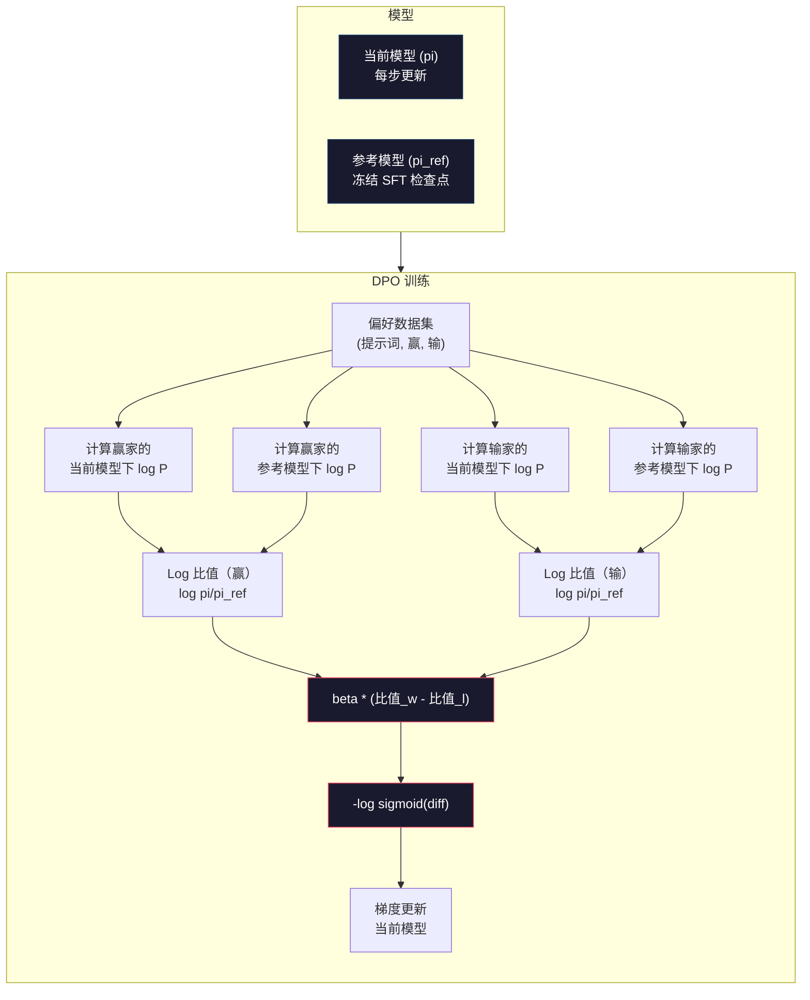

# DPO：直接偏好优化

> RLHF 有效。但它也需要训练三个模型（SFT、奖励模型、策略），处理 PPO 的不稳定性，并调优 KL 惩罚。DPO 问：能不能全部跳过？DPO 直接在偏好对上优化语言模型。不需要奖励模型。不需要 PPO。一次训练循环。结果相同。

**类型：** 构建
**语言：** Python（使用 numpy）
**先修内容：** Phase 10，课程 07（RLHF）
**学习时间：** 约 90 分钟

## 学习目标

- 实现 DPO 训练，直接在偏好对上优化语言模型，无需单独的奖励模型
- 推导 DPO 损失函数，解释它如何通过策略的 log 概率隐式表示奖励模型
- 在训练稳定性、计算成本和所需模型数量方面比较 DPO 与 RLHF
- 调优 beta 参数以控制训练后策略偏离参考模型的程度

## 问题所在

你在课程 07 中构建了 RLHF 流水线。三阶段。三模型。SFT 模型、奖励模型，以及用 PPO 优化的策略模型。仅奖励模型就需要数千个人类偏好对和单独的訓練循环。PPO 需要仔细调优 KL 系数、学习率、裁剪比例和 epoch 数。

实际上，PPO 训练以不稳定著称。小的超参数变化会导致训练发散。奖励模型是人类偏好的不完美代理，而策略会发现利用其弱点的方法。KL 惩罚有帮助，但它本身需要调优——太低会导致奖励黑客，太高模型几乎学不到东西。

这就是为什么在 InstructGPT 发布后多年，大多数开源模型都在 RLHF 上苦苦挣扎。三阶段流水线是脆弱的。每个阶段都有自己的失败模式，错误会累积。

2023 年 5 月，Stanford 的 Rafael Rafailov、Archit Sharma 及其同事发表了"Direct Preference Optimization: Your Language Model is Secretly a Reward Model"。关键洞察：你不需要单独的奖励模型。最优奖励函数由语言模型自身的 Token 概率数学决定。你可以完全跳过奖励模型，直接在偏好对上优化语言模型。

DPO 将 RLHF 简化为单个监督学习步骤。一模型。一损失函数。一训练循环。不需要强化学习。Zephyr-7B，首批大规模使用 DPO 的模型之一，在多个基准测试中匹配或击败了使用完整 RLHF 训练的模型。Meta 在 Llama 3 的对齐流水线中使用了 DPO。Anthropic 在其对齐研究中引用了 DPO 类方法。

## 核心概念

### 关键洞察

RLHF 优化此目标：

```
最大化: E[R(x, y)] - beta * KL(pi || pi_ref)
```

其中 R 是奖励模型，pi 是策略，pi_ref 是参考模型，beta 是 KL 系数。

DPO 论文证明此目标有闭式最优解。对于任何奖励函数 R，最优策略是：

```
pi*(y | x) = pi_ref(y | x) * exp(R(x, y) / beta) / Z(x)
```

其中 Z(x) 是归一化常数。重排：

```
R(x, y) = beta * log(pi*(y | x) / pi_ref(y | x)) + beta * log Z(x)
```

这是突破。奖励完全由策略模型的概率和参考模型的概率表示。你不需要训练单独的奖励模型。奖励*隐含*在概率比中。

代入 Bradley-Terry 偏好模型：

```
P(y_w > y_l | x) = sigmoid(R(x, y_w) - R(x, y_l))
                  = sigmoid(beta * (log pi(y_w|x)/pi_ref(y_w|x) - log pi(y_l|x)/pi_ref(y_l|x)))
```

Z(x) 项相互抵消，因为两个回复都以相同提示词 x 为条件。剩下的是一个函数，仅依赖于策略模型在优选和拒绝回复上的 log 概率与参考模型的 log 概率。

### DPO 损失

```
L_DPO = -log(sigmoid(beta * (log pi(y_w|x)/pi_ref(y_w|x) - log pi(y_l|x)/pi_ref(y_l|x))))
```

让我们分解每个部分：

- **y_w** = 优选（赢）回复
- **y_l** = 拒绝（输）回复
- **x** = 提示词
- **pi** = 当前模型（正在训练）
- **pi_ref** = 参考模型（冻结 SFT 检查点）
- **beta** = 温度参数，控制偏离参考的程度（通常 0.1 到 0.5）

比值 `log pi(y|x) / pi_ref(y|x)` 是 log 概率比。当正值时，当前模型比参考分配更高的概率给回复 y。当负值时，当前模型分配更低的概率。

DPO 损失推动模型增加优选回复的 log 概率比并降低拒绝回复的 log 概率比。Beta 参数控制模型偏离参考的激进程度——小 beta 允许大偏离，大 beta 保持模型接近参考。



### 为什么 DPO 更简单

| 方面 | RLHF（PPO） | DPO |
|--------|-----------|-----|
| 需训练的模型 | 3（SFT + 奖励 + 策略） | 1（仅策略） |
| 训练循环 | 3（SFT、RM 训练、PPO） | 2（SFT、DPO） |
| 超参数 | lr、KL 系数、裁剪比、RM lr、epoch ×3 | lr、beta、epoch |
| 奖励模型 | 需要（单独训练） | 隐含在模型概率中 |
| RL 算法 | PPO（复杂、不稳定） | 监督学习（稳定） |
| GPU 显存 | PPO 期间 3-4 个模型在内存中 | 2 个模型（当前 + 参考） |
| 训练稳定性 | 对超参数敏感 | 稳健，类似于 SFT |

DPO 在训练期间需要两个模型在内存中——当前模型和冻结参考。RLHF 需要三个或四个：策略、参考、奖励模型，以及可选的价值函数基线。对于 70B 模型，每份 FP16 需要 140GB。消除奖励模型带来的内存节省是相当可观的。

### DPO 何时优于 RLHF

**小数据集。** 有 5,000-20,000 个偏好对时，DPO 通常匹配或超过 RLHF。RLHF 中的奖励模型需要足够的数据来泛化——数据有限时会过拟合，产生不可靠的奖励信号。DPO 通过根本不需要奖励模型来绕过这个问题。

**计算资源有限。** DPO 需要大约三分之一的全 RLHF 计算量（一个训练循环而非三个）。对于没有大型 GPU 集群的团队，这是实际选择。

**快速迭代。** 想尝试 10 个不同的偏好数据集看哪个产生最佳模型？DPO 让你在几小时内运行每个实验。RLHF 需要为每个数据集重新训练奖励模型。

### RLHF 何时优于 DPO

**大规模训练。** 在 GPT-4 或 Claude 规模上，RLHF 的单独奖励模型可以捕捉更细微的偏好信号。奖励模型作为一个学习到的损失函数，可以适应复杂质量标准。

**复杂奖励信号。** 当"更好"涉及多个维度（有用性、无害性、诚实性）时，奖励模型可以学习这种多目标权衡。DPO 将每个偏好对视为二元信号——一个更好，一个更差——不建模原因。

**迭代对齐。** RLHF 流水线可以用当前策略生成新回复，让人类评分，然后重新训练奖励模型形成在线循环。DPO 在固定的偏好对数据集上工作。Constitutional AI（Anthropic 的方法）广泛使用 RLHF 的这个迭代特性。

### DPO 之外：KTO、ORPO、SimPO

DPO 激发了一族简化的对齐方法。

**KTO（Kahneman-Tversky 优化，2024）：** 你甚至不需要对。用非配对反馈就行——只需将每个回复标记为"好"或"坏"，无需与其他比较。这大大简化了数据收集。不向标注员展示两个回复问"哪个更好？"，而是展示一个回复问"这个好吗？"损失函数应用来自前景理论的损失厌恶：坏回复比好回复被惩罚得更多。

**ORPO（赔率比偏好优化，2024）：** 在单次训练步骤中结合 SFT 和对齐。不是先做 SFT 再做 DPO，而是修改 SFT 损失以包含偏好信号。损失有两个项：优选回复上标准下一 Token 预测损失，加上赔率比项增加优选和拒绝回复概率之间的差距。只需一次训练循环而非两次。

**SimPO（简单偏好优化，2024）：** 完全消除参考模型。不针对冻结参考计算 log 概率比，SimPO 使用回复的平均 log 概率（按长度归一化）作为隐含奖励。这节省内存（不需要参考模型）并简化训练。长度归一化防止模型偏爱更短的回复。

| 方法 | 年份 | 内存中模型数 | 需要对？ | 需要参考？ | 训练循环 |
|--------|------|-----------------|-------------|-----------------|----------------|
| RLHF | 2022 | 3-4 | 对（RM 用） | 是 | 3 |
| DPO | 2023 | 2 | 是 | 是 | 2 |
| KTO | 2024 | 2 | 否（非配对） | 是 | 2 |
| ORPO | 2024 | 1 | 是 | 否 | 1 |
| SimPO | 2024 | 1 | 是 | 否 | 1 |

趋势很清楚：每种方法都消除了一部分复杂性。RLHF 需要奖励模型和 PPO。DPO 消除了两者。KTO 消除了配对数据。ORPO 消除了单独的 SFT 阶段。SimPO 消除了参考模型。对齐税——从基础模型到对齐模型的额外计算和复杂性——不断下降。

### 真实 DPO 部署

**Zephyr-7B（HuggingFace，2023 年 10 月）：** Mistral 7B 基础，在 UltraChat（200K 样例）上 SFT，然后在 UltraFeedback（60K 偏好对）上 DPO。在 MT-Bench 上得分 6.47——当时最高的 7B 模型。作为比较，Llama 2 Chat 70B 得分 6.86，意味着 Zephyr 仅用 DPO 对齐就达到了 10 倍大小模型的 6% 差距。

**Llama 3（Meta，2024 年 4 月）：** 在初始 RLHF 阶段后使用 DPO。这种组合表明 DPO 和 RLHF 可以互补——RLHF 用于广泛对齐，DPO 用于针对性精炼。

**Neural Magic / nm-chat（2024）：** 将 DPO 应用于多个开源模型，始终显示在 SFT 基线上对齐基准提升 5-15%。

## 构建

### 步骤 1：偏好数据集

与 RLHF 相同格式——（提示词、优选、拒绝）三元组。DPO 直接消费此数据，无需中间奖励模型。

```python
import numpy as np
import sys
import os
sys.path.insert(0, os.path.join(os.path.dirname(__file__), "..", "..", "04-pre-training-mini-gpt", "code"))
from main import MiniGPT, LayerNorm, Embedding, TransformerBlock

PREFERENCE_DATA = [
    {
        "prompt": "What is the capital of France?",
        "preferred": "The capital of France is Paris.",
        "rejected": "France is a country in Europe. It has many cities. The capital is Paris. Paris is known for the Eiffel Tower.",
    },
    {
        "prompt": "Explain gravity in one sentence.",
        "preferred": "Gravity is the force that attracts objects with mass toward each other.",
        "rejected": "Gravity is something that makes things fall down when you drop them.",
    },
    {
        "prompt": "What is 15 times 7?",
        "preferred": "15 times 7 is 105.",
        "rejected": "Let me think about this. 15 times 7. Well, 10 times 7 is 70, and 5 times 7 is 35, so the answer might be around 105.",
    },
    {
        "prompt": "Name three programming languages.",
        "preferred": "Python, Rust, and TypeScript.",
        "rejected": "There are many programming languages. Some popular ones include various languages like Python and others.",
    },
    {
        "prompt": "What year did World War II end?",
        "preferred": "World War II ended in 1945.",
        "rejected": "World War II was a major global conflict. It involved many countries. The war ended in the mid-1940s, specifically in 1945.",
    },
    {
        "prompt": "Define machine learning.",
        "preferred": "Machine learning is a field where algorithms learn patterns from data to make predictions without being explicitly programmed.",
        "rejected": "Machine learning is a type of AI. AI stands for artificial intelligence. Machine learning uses data to learn.",
    },
]
```

### 步骤 2：序列 Log 概率

DPO 损失要求计算给定提示词的回复总 log 概率。这意味着在完整（提示词 + 回复）序列上运行模型并求和每个回复 Token 的 log 概率。

```python
def tokenize_sequence(text, vocab_size=256):
    return [min(t, vocab_size - 1) for t in list(text.encode("utf-8"))]


def compute_sequence_log_prob(model, prompt_tokens, response_tokens, max_seq_len=128):
    full_sequence = prompt_tokens + response_tokens
    if len(full_sequence) > max_seq_len:
        full_sequence = full_sequence[:max_seq_len]

    if len(full_sequence) < 2:
        return 0.0

    input_ids = np.array(full_sequence[:-1]).reshape(1, -1)
    target_ids = np.array(full_sequence[1:])

    logits = model.forward(input_ids)
    logits = logits[0]

    max_logits = logits.max(axis=-1, keepdims=True)
    log_probs = logits - max_logits - np.log(
        np.exp(logits - max_logits).sum(axis=-1, keepdims=True)
    )

    prompt_len = len(prompt_tokens)
    response_start = max(0, prompt_len - 1)
    response_end = len(target_ids)

    if response_start >= response_end:
        return 0.0

    response_log_probs = log_probs[response_start:response_end, :]
    response_targets = target_ids[response_start:response_end]

    total_log_prob = 0.0
    for i, target in enumerate(response_targets):
        total_log_prob += response_log_probs[i, target]

    return total_log_prob
```

此函数是 DPO 的核心工作部分。每个偏好对运行四次：模型在优选回复上、模型在拒绝回复上、参考在优选回复上、参考在拒绝回复上。每次训练样例 4 次前向传播，而 RLHF 需要生成 + 奖励评分 + 价值估计 + PPO 更新。更简单、更快、更稳定。

### 步骤 3：DPO 损失

论文核心代码。一函数。一损失。无奖励模型。

```python
def sigmoid(x):
    return np.where(
        x >= 0,
        1.0 / (1.0 + np.exp(-x)),
        np.exp(x) / (1.0 + np.exp(x))
    )


def dpo_loss(policy_logprob_preferred, policy_logprob_rejected,
             ref_logprob_preferred, ref_logprob_rejected, beta=0.1):
    preferred_ratio = policy_logprob_preferred - ref_logprob_preferred
    rejected_ratio = policy_logprob_rejected - ref_logprob_rejected

    logit = beta * (preferred_ratio - rejected_ratio)

    loss = -np.log(sigmoid(logit) + 1e-8)

    preferred_reward = beta * preferred_ratio
    rejected_reward = beta * rejected_ratio

    return loss, {
        "preferred_ratio": float(preferred_ratio),
        "rejected_ratio": float(rejected_ratio),
        "logit": float(logit),
        "implicit_preferred_reward": float(preferred_reward),
        "implicit_rejected_reward": float(rejected_reward),
        "reward_margin": float(preferred_reward - rejected_reward),
    }
```

`preferred_ratio` 和 `rejected_ratio` 是 DPO 推导中的 log 概率比。当当前模型比参考给优选回复更高概率（相对于参考）而给拒绝回复更低概率时，logit 为正，loss 较低。训练信号正是朝这个方向推动模型。

`implicit_preferred_reward` 和 `implicit_rejected_reward` 是 DPO 损失隐式分配的奖励。你可以提取它们来验证训练是否有效——优选和拒绝奖励之间的差距应随训练增加。

### 步骤 4：DPO 训练循环

标准监督训练循环。无 PPO。无奖励模型。只有前向传播和梯度更新。

```python
def copy_model_weights(source, target):
    target.embedding.token_embed = source.embedding.token_embed.copy()
    target.embedding.pos_embed = source.embedding.pos_embed.copy()
    target.ln_f.gamma = source.ln_f.gamma.copy()
    target.ln_f.beta = source.ln_f.beta.copy()
    for s_block, t_block in zip(source.blocks, target.blocks):
        t_block.attn.W_q = s_block.attn.W_q.copy()
        t_block.attn.W_k = s_block.attn.W_k.copy()
        t_block.attn.W_v = s_block.attn.W_v.copy()
        t_block.attn.W_out = s_block.attn.W_out.copy()
        t_block.ffn.W1 = s_block.ffn.W1.copy()
        t_block.ffn.W2 = s_block.ffn.W2.copy()
        t_block.ffn.b1 = s_block.ffn.b1.copy()
        t_block.ffn.b2 = s_block.ffn.b2.copy()
        t_block.ln1.gamma = s_block.ln1.gamma.copy()
        t_block.ln1.beta = s_block.ln1.beta.copy()
        t_block.ln2.gamma = s_block.ln2.gamma.copy()
        t_block.ln2.beta = s_block.ln2.beta.copy()


def dpo_train(policy_model, reference_model, preference_data,
              num_epochs=5, lr=5e-6, beta=0.1, max_seq_len=128):
    print(f"DPO Training: {len(preference_data)} pairs, {num_epochs} epochs, "
          f"lr={lr}, beta={beta}")
    print()

    losses = []
    margins = []

    for epoch in range(num_epochs):
        epoch_loss = 0.0
        epoch_margin = 0.0
        num_examples = 0

        indices = np.random.permutation(len(preference_data))

        for idx in indices:
            pair = preference_data[idx]

            prompt_tokens = tokenize_sequence(pair["prompt"])
            preferred_tokens = tokenize_sequence(pair["preferred"])
            rejected_tokens = tokenize_sequence(pair["rejected"])

            pi_logprob_w = compute_sequence_log_prob(
                policy_model, prompt_tokens, preferred_tokens, max_seq_len
            )
            pi_logprob_l = compute_sequence_log_prob(
                policy_model, prompt_tokens, rejected_tokens, max_seq_len
            )
            ref_logprob_w = compute_sequence_log_prob(
                reference_model, prompt_tokens, preferred_tokens, max_seq_len
            )
            ref_logprob_l = compute_sequence_log_prob(
                reference_model, prompt_tokens, rejected_tokens, max_seq_len
            )

            loss, metrics = dpo_loss(
                pi_logprob_w, pi_logprob_l,
                ref_logprob_w, ref_logprob_l, beta
            )

            update_direction = 1.0 if metrics["logit"] < 0 else -0.1
            for block in policy_model.blocks:
                block.ffn.W1 += lr * update_direction * np.random.randn(*block.ffn.W1.shape) * 0.01
                block.ffn.W2 += lr * update_direction * np.random.randn(*block.ffn.W2.shape) * 0.01

            epoch_loss += loss
            epoch_margin += metrics["reward_margin"]
            num_examples += 1
            losses.append(float(loss))
            margins.append(metrics["reward_margin"])

        avg_loss = epoch_loss / max(num_examples, 1)
        avg_margin = epoch_margin / max(num_examples, 1)

        print(f"  Epoch {epoch + 1}/{num_epochs} | Loss: {avg_loss:.4f} | "
              f"Avg Margin: {avg_margin:.4f}")

    return policy_model, losses, margins
```

与 RLHF 相比，训练循环简洁得令人耳目一新。对于每个偏好对：计算四个 log 概率（两模型、两回复）、代入 DPO 损失、计算梯度、更新策略。无生成步骤。无奖励模型推理。无优势估计。无裁剪。

### 步骤 5：比较 DPO 与 RLHF

测量隐含奖励差距和 log 概率变化，将 DPO 与课程 07 的 RLHF 模型进行比较。

```python
def evaluate_preference_accuracy(model, reference_model, preference_data, beta=0.1, max_seq_len=128):
    correct = 0
    total = 0

    for pair in preference_data:
        prompt_tokens = tokenize_sequence(pair["prompt"])
        preferred_tokens = tokenize_sequence(pair["preferred"])
        rejected_tokens = tokenize_sequence(pair["rejected"])

        pi_w = compute_sequence_log_prob(model, prompt_tokens, preferred_tokens, max_seq_len)
        pi_l = compute_sequence_log_prob(model, prompt_tokens, rejected_tokens, max_seq_len)
        ref_w = compute_sequence_log_prob(reference_model, prompt_tokens, preferred_tokens, max_seq_len)
        ref_l = compute_sequence_log_prob(reference_model, prompt_tokens, rejected_tokens, max_seq_len)

        preferred_reward = beta * (pi_w - ref_w)
        rejected_reward = beta * (pi_l - ref_l)

        if preferred_reward > rejected_reward:
            correct += 1
        total += 1

    return correct / max(total, 1)


def analyze_implicit_rewards(model, reference_model, preference_data, beta=0.1, max_seq_len=128):
    print("Implicit Reward Analysis:")
    print("-" * 65)
    print(f"  {'Prompt':<30} {'Pref Reward':>12} {'Rej Reward':>12} {'Margin':>10}")
    print("  " + "-" * 60)

    for pair in preference_data:
        prompt_tokens = tokenize_sequence(pair["prompt"])
        preferred_tokens = tokenize_sequence(pair["preferred"])
        rejected_tokens = tokenize_sequence(pair["rejected"])

        pi_w = compute_sequence_log_prob(model, prompt_tokens, preferred_tokens, max_seq_len)
        pi_l = compute_sequence_log_prob(model, prompt_tokens, rejected_tokens, max_seq_len)
        ref_w = compute_sequence_log_prob(reference_model, prompt_tokens, preferred_tokens, max_seq_len)
        ref_l = compute_sequence_log_prob(reference_model, prompt_tokens, rejected_tokens, max_seq_len)

        pref_reward = beta * (pi_w - ref_w)
        rej_reward = beta * (pi_l - ref_l)
        margin = pref_reward - rej_reward

        truncated = pair["prompt"][:28] + ".." if len(pair["prompt"]) > 30 else pair["prompt"]
        print(f"  {truncated:<30} {pref_reward:>12.4f} {rej_reward:>12.4f} {margin:>10.4f}")

    print()
```

### 步骤 6：Beta 敏感性分析

Beta 参数是 DPO 中 RLHF KL 系数的等价物。它控制模型可以偏离参考的程度。这个实验展示其效果。

```python
def beta_sensitivity_analysis(sft_model, preference_data, betas, max_seq_len=128):
    print("Beta Sensitivity Analysis")
    print("-" * 60)
    print(f"  {'Beta':>8} {'Final Loss':>12} {'Final Margin':>14} {'Accuracy':>10}")
    print("  " + "-" * 55)

    results = []

    for beta in betas:
        policy = MiniGPT(
            vocab_size=256, embed_dim=128, num_heads=4,
            num_layers=4, max_seq_len=max_seq_len, ff_dim=512
        )
        reference = MiniGPT(
            vocab_size=256, embed_dim=128, num_heads=4,
            num_layers=4, max_seq_len=max_seq_len, ff_dim=512
        )
        copy_model_weights(sft_model, policy)
        copy_model_weights(sft_model, reference)

        policy, losses, margins_list = dpo_train(
            policy, reference, preference_data,
            num_epochs=3, lr=5e-6, beta=beta, max_seq_len=max_seq_len
        )

        accuracy = evaluate_preference_accuracy(
            policy, reference, preference_data, beta, max_seq_len
        )

        final_loss = losses[-1] if losses else 0
        final_margin = margins_list[-1] if margins_list else 0

        print(f"  {beta:>8.3f} {final_loss:>12.4f} {final_margin:>14.4f} {accuracy:>10.1%}")
        results.append({
            "beta": beta,
            "final_loss": final_loss,
            "final_margin": final_margin,
            "accuracy": accuracy,
        })

        print()

    return results
```

小 beta（0.01）允许模型自由偏离参考——学习快但有退化解的风险。大 beta（1.0）保持模型接近参考——稳定但学习慢。大多数应用的最佳点是 0.1 到 0.3。

## 使用

### 完整 DPO 流水线演示

```python
if __name__ == "__main__":
    np.random.seed(42)

    print("=" * 70)
    print("DPO: DIRECT PREFERENCE OPTIMIZATION")
    print("=" * 70)
    print()

    print("STEP 1: Initialize SFT Model (from Lesson 06)")
    print("-" * 50)
    sft_model = MiniGPT(
        vocab_size=256, embed_dim=128, num_heads=4,
        num_layers=4, max_seq_len=128, ff_dim=512
    )
    print(f"  Parameters: {sft_model.count_parameters():,}")
    print()

    print("STEP 2: DPO Training")
    print("-" * 50)

    policy_model = MiniGPT(
        vocab_size=256, embed_dim=128, num_heads=4,
        num_layers=4, max_seq_len=128, ff_dim=512
    )
    reference_model = MiniGPT(
        vocab_size=256, embed_dim=128, num_heads=4,
        num_layers=4, max_seq_len=128, ff_dim=512
    )
    copy_model_weights(sft_model, policy_model)
    copy_model_weights(sft_model, reference_model)

    policy_model, losses, margins = dpo_train(
        policy_model, reference_model, PREFERENCE_DATA,
        num_epochs=5, lr=5e-6, beta=0.1
    )
    print()

    print("=" * 70)
    print("STEP 3: Evaluate")
    print("=" * 70)
    print()

    pre_accuracy = evaluate_preference_accuracy(
        sft_model, reference_model, PREFERENCE_DATA, beta=0.1
    )
    post_accuracy = evaluate_preference_accuracy(
        policy_model, reference_model, PREFERENCE_DATA, beta=0.1
    )

    print(f"  Preference accuracy (pre-DPO):  {pre_accuracy:.1%}")
    print(f"  Preference accuracy (post-DPO): {post_accuracy:.1%}")
    print()

    analyze_implicit_rewards(policy_model, reference_model, PREFERENCE_DATA, beta=0.1)

    print("=" * 70)
    print("STEP 4: Training Dynamics")
    print("=" * 70)
    print()

    if losses:
        print("  Loss curve:")
        window = max(1, len(losses) // 5)
        for i in range(0, len(losses), window):
            chunk = losses[i:i + window]
            avg = sum(chunk) / len(chunk)
            print(f"    Steps {i:3d}-{i + len(chunk) - 1:3d}: loss = {avg:.4f}")
        print()

    if margins:
        print("  Reward margin curve:")
        window = max(1, len(margins) // 5)
        for i in range(0, len(margins), window):
            chunk = margins[i:i + window]
            avg = sum(chunk) / len(chunk)
            print(f"    Steps {i:3d}-{i + len(chunk) - 1:3d}: margin = {avg:.4f}")
        print()

    print("=" * 70)
    print("STEP 5: Beta Sensitivity")
    print("=" * 70)
    print()

    beta_results = beta_sensitivity_analysis(
        sft_model, PREFERENCE_DATA, betas=[0.01, 0.1, 0.3, 1.0]
    )

    print("=" * 70)
    print("DPO vs RLHF COMPARISON")
    print("=" * 70)
    print()
    print("  DPO advantages:")
    print("    - 1 training loop (vs 3 for RLHF)")
    print("    - 2 models in memory (vs 3-4 for RLHF)")
    print("    - Supervised learning (vs RL, more stable)")
    print("    - No reward model to train or maintain")
    print()
    print("  RLHF advantages:")
    print("    - Separate reward model captures complex preferences")
    print("    - Online learning: generate, rate, retrain")
    print("    - Better for multi-objective alignment")
    print("    - Proven at largest scales (GPT-4, Claude)")
    print()
    print("  Practical guidance:")
    print("    - Start with DPO. It's simpler and often sufficient.")
    print("    - Switch to RLHF if DPO plateaus on your eval metrics.")
    print("    - Many production systems use both: RLHF first, DPO to refine.")
```

## 发货

这节课产出 `outputs/prompt-alignment-method-selector.md`——一个帮助你在正确对齐方法（SFT、RLHF、DTO、KTO、ORPO、SimPO）中选择的提示词。给定你的数据可用性、计算预算和对齐目标，它推荐一种方法和训练计划。

## 练习

1. 实现 KTO（Kahneman-Tversky 优化）。KTO 不需要对——只需将每个回复标记为"好"或"坏"。好回复的损失是 `-log(sigmoid(beta * log_ratio))`，坏回复的损失是 `-log(1 - sigmoid(beta * log_ratio))`，坏回复损失有损失厌恶乘数（通常 1.5 倍）。在相同数据上训练（将优选视为"好"、拒绝视为"坏"独立处理）并与 DPO 比较准确率。

2. 实现长度归一化 DPO。不是用原始 log 概率，而是除以回复 Token 数：`normalized_logprob = total_logprob / num_tokens`。这防止模型偏爱更短回复（总 log 概率更高）。比较有无归一化的隐含奖励差距。

3. 构建 ORPO 风格组合损失。在 DPO 损失上增加优选回复上的标准下一 Token 预测损失：`L = L_sft(preferred) + alpha * L_dpo`。尝试 alpha 值为 0.1、0.5 和 1.0。组合损失应产生既遵从指令（来自 SFT 项）又偏爱更好回复（来自 DPO 项）的模型，消除单独的 SFT 阶段。

4. 实现迭代 DPO。运行 DPO 3 个 epoch，然后用训练好的模型生成新回复，将它们与原始优选回复配对作为新偏好对，再次运行 DPO。这种"自对弈"过程的两轮。比较第 1 轮和第 2 轮后的偏好准确率，看迭代精炼是否有帮助。

5. 用不同参考模型比较 DPO。不是用 SFT 检查点作为参考，尝试：(a) 基础模型（SFT 前），(b) DPO 第 1 个 epoch 的检查点，(c) 策略模型的指数移动平均。报告哪个参考产生最高偏好准确率和最稳定的训练曲线。

## 关键术语

| 术语 | 人们怎么说 | 实际含义 |
|------|----------------|----------------------|
| DPO | "不需要 RL 的 RLHF" | 直接偏好优化：一种监督学习算法，在偏好对上直接优化语言模型，绕过奖励模型和 PPO |
| 隐含奖励 | "奖励在模型中" | 奖励函数由策略和参考模型之间的 log 概率比决定——不需要单独的奖励模型 |
| Beta（DPO） | "温度" | 控制策略可以偏离参考模型的程度——小 beta 允许大偏离，大 beta 保持模型接近 |
| Log 概率比 | "模型改变了多少" | log pi(y|x) - log pi_ref(y|x)——正值意味着当前模型比参考分配更高概率 |
| 参考模型 | "冻结检查点" | SFT 模型副本，其权重永不改变——用作计算概率比的锚点 |
| KTO | "不需要对的 DPO" | Kahneman-Tversky 优化：使用非配对"好"或"坏"标签而非需要偏好对 |
| ORPO | "一步对齐" | 赔率比偏好优化：通过在 SFT 损失中添加偏好项将 SFT 和对齐组合到单次训练循环中 |
| SimPO | "不需要参考" | 简单偏好优化：通过使用长度归一化平均 log 概率作为隐含奖励完全消除参考模型 |
| 对齐税 | "让模型安全的代价" | 从基础模型到对齐模型所需的额外计算、数据和复杂性——DPO 大幅降低了这个 |

## 延伸阅读

- [Rafailov et al., 2023 -- "Direct Preference Optimization: Your Language Model is Secretly a Reward Model"](https://arxiv.org/abs/2305.18290) -- 将对齐从 RLHF 简化为监督学习的 DPO 论文
- [Tunstall et al., 2023 -- "Zephyr: Direct Distillation of LM Alignment"](https://arxiv.org/abs/2310.16944) -- Zephyr-7B，展示 UltraFeedback 上的 DPO 在基准上匹配 RLHF
- [Ethayarajh et al., 2024 -- "KTO: Model Alignment as Prospect Theoretic Optimization"](https://arxiv.org/abs/2402.01306) -- 消除配对偏好的需要
- [Hong et al., 2024 -- "ORPO: Monolithic Preference Optimization without Reference Model"](https://arxiv.org/abs/2403.07691) -- 在一步中组合 SFT 和对齐
- [Meng et al., 2024 -- "SimPO: Simple Preference Optimization with a Reference-Free Reward"](https://arxiv.org/abs/2405.14734) -- 完全消除参考模型
- [Llama 3 Technical Report](https://arxiv.org/abs/2407.21783) -- Meta 结合 RLHF 和 DPO 的对齐流水线