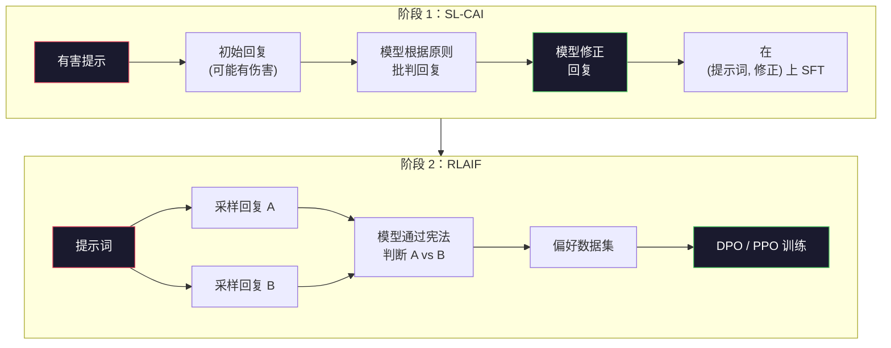
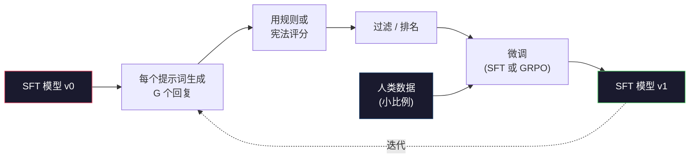

# Constitutional AI 和自我改进

> RLHF 需要人在循环中。Constitutional AI 用模型本身替换了大部分人。写一份原则列表，让模型根据这些原则批判自己的输出，然后在批判上训练。DeepSeek-R1 在 2025 年进一步推进：让模型生成数百万条推理轨迹，用规则给它们打分，然后在结果上运行 GRPO。2026 年前沿模型的大部分"对齐工作"就是模型自己对齐自己。这节课构建这两个循环。

**类型：** 构建
**语言：** Python（stdlib + numpy）
**先修内容：** Phase 10，课程 06-08（SFT、RLHF、DPO）
**学习时间：** 约 45 分钟

## 学习目标

- 实现 Constitutional AI 两阶段循环：自我批判加自我修正，然后对修正后的对进行偏好训练
- 推导 GRPO 目标（DeepSeek-R1 的组相对策略优化）并将其与 PPO 的价值函数基线进行对比
- 使用基于规则的结果奖励生成可验证的推理轨迹，并在没有单独奖励模型的情况下评分
- 决定何时自我改进胜于人类偏好数据，何时会崩溃为模式寻求

## 问题所在

你在课程 07 中构建了 RLHF，在课程 08 中构建了 DPO。两者都依赖于同一种昂贵的输入：人类偏好对。Anthropic 的 InstructGPT 时代流水线使用约 33,000 个比较。Llama 2 Chat 使用超过 150 万。Claude 3 使用更多。这些数据缓慢、昂贵，并对标注员在评分当天碰巧相信的东西有偏见。

2022 年的 Constitutional AI 论文问了一个简单问题。如果模型自己生成偏好标签呢？给它一份书面原则列表——"宪法"——让它批判自己的回复。批判成为训练信号。

2024 年，DeepSeek 将这个想法更进一步。他们证明，对于任何有可验证结果的任务（已知答案的数学、通过测试或失败的代码、赢或输的游戏），你可以完全跳过评论员。生成许多候选解。用确定性规则给每个打分。在奖励上运行策略梯度算法。DeepSeek-R1 以几乎无人类偏好数据的方式训练，匹配 o1 类推理性能。

这两个循环——主观行为的 Constitutional AI 和可验证行为的基于规则 RL——是 2026 年主导的对齐方案。曾经用于 RLHF 的人类偏好预算现在支付了一个小得多的步骤：选择宪法和选择奖励规则。

## 核心概念

### Constitutional AI 循环

Bai 等人（2022）将此流水线结构化为两个阶段。

**阶段 1：从 AI 反馈进行监督学习（SL-CAI）。** 从一个有帮助但可能有伤害的 SFT 模型开始。用潜在有害请求提示它。对于每个回复，请*同一模型*根据宪法原则批判其回复，然后修正。在修正后的回复上进行 SFT 微调。数据集是（提示词，修正回复）对。

**阶段 2：从 AI 反馈进行强化学习（RLAIF）。** 采样一对回复。请模型判断哪个更好地遵循宪法。成对偏好训练奖励模型。然后使用该奖励在模型上运行 PPO 或 DPO。关键区别：偏好来自模型，而非人类。



宪法是杠杆。Anthropic 最初的版本有 16 条原则（后来扩展）。一条原则读起来像"请选择最不可能被各种文化背景的人反对的回复。"你为每步选择原则，有时随机，有时基于提示词类别。

### 宪法实际做什么

宪法将对齐契约从*数据*移到*文本*。在 RLHF 下改变行为意味着重新标记数千个对。在 CAI 下改变行为意味着编辑一段文字。这是主要的实际收益。

它有代价。模型的自我判断质量仅与其起始校准一样好。如果 SFT 模型有盲点——例如，它无法识别操纵性措辞——批判步骤会继承那些盲点。CAI 压缩了对齐循环，但无法将信号放大到超过基础模型的极限。这就是为什么每个生产 CAI 流水线仍然使用一些人类偏好数据，通常是纯 RLHF 量的 5-10%。

### GRPO：组相对策略优化

DeepSeek 在 DeepSeekMath 论文（2024）中引入 GRPO，并将其作为 DeepSeek-R1（2025）的骨干。GRPO 是 PPO 的变体，移除了价值函数。

回忆 PPO 的目标（来自课程 07）：

```
L_PPO = E[min(r(theta) * A, clip(r(theta), 1-eps, 1+eps) * A)]
```

其中 `A` 是优势，通常用学习价值网络 `V(s)` 通过 GAE 估计。价值网络是与策略相同大小的第二个模型。它使内存翻倍并引入自己的训练循环。

GRPO 丢弃价值函数。对于每个提示词，采样 G 个回复组（通常 G=16 或 64）。每个回复的奖励被计算，然后在组内归一化：

```
A_i = (r_i - mean(r_1, ..., r_G)) / std(r_1, ..., r_G)
```

优势是回复奖励相对于其兄弟的 z-score。无价值函数。该组充当自己的基线。

```
L_GRPO = E[min(r(theta) * A_group, clip(r(theta), 1-eps, 1+eps) * A_group)] - beta * KL(pi || pi_ref)
```

相对于参考模型的 KL 惩罚仍然存在，与 PPO 相同。裁剪比例仍然存在。消失的是单独的评论员。

### 为什么 GRPO 对推理重要

对于推理任务，奖励通常是稀疏和二元的：最终答案对或错。在稀疏二元奖励上训练的价值函数是浪费——在最后一步之前几乎每个状态都有相同的期望返回，它无法学习有用的中间估计。GRPO 的组归一化给你一个即时的相对信号：在同一个数学问题的 16 次尝试中，哪些尝试高于平均？

这正是基于规则奖励给你的信号形状：

- **数学**：sympy 或符号检查器决定最终答案是否匹配。
- **代码**：测试套件决定通过/失败。
- **格式**：正则表达式决定答案是否在要求的 XML 标签中。
- **多步证明**：证明助手（Lean、Coq）决定有效性。

DeepSeek-R1-Zero 仅用两个奖励训练：数学基准上的准确率和格式合规性（答案在 `<answer>` 标签内）。无人类偏好。无评论员模型。DeepSeek 论文描述的"顿悟时刻"——模型自发学习自我检查和回退——仅从稀疏规则奖励上的 GRPO 中出现。

### 过程奖励模型 vs 结果奖励模型

你仍然有设计选择：奖励最终答案（结果奖励模型，ORM）还是奖励每个中间步骤（过程奖励模型，PRM）。

| 维度 | ORM | PRM |
|------|-----|-----|
| 每轨迹信号 | 1 个数字 | N 个数字（每步一个） |
| 监督来源 | 最终答案检查 | 步骤级标签或自我判断 |
| 训练成本 | 便宜 | 昂贵 |
| 信用分配 | 稀疏，有噪声 | 密集，有针对性 |
| 奖励黑客风险 | 较低 | 较高（模型优化 PRM 产物） |
| 使用者 | DeepSeek-R1、R1-Zero | OpenAI o1（据称）、Math-Shepherd |

2024-2025 年的共识是 ORM 加上 GRPO 比 PRM 扩展更好。PRM 每 Token 样本效率更高，但需要昂贵的步骤标记数据并倾向于崩溃为捷径行为（写出对 PRM 看起来好但不推进证明的步骤）。对于大多数团队，ORM + GRPO 是首先要尝试的。

### 自我改进：反馈倍增器

一旦你有了双循环模式（批判/修正和带规则奖励的组相对 RL），你就可以链接它们。

1. 从 SFT 模型开始。
2. 每个提示词生成许多候选回复。
3. 用基于规则的奖励（可验证任务）或宪法评论员（主观任务）给它们打分。
4. 将顶级候选保留为新 SFT 数据或偏好对。
5. 微调。用改进的模型回到步骤 2。

DeepSeek 在 R1-Zero 之后称此为"拒绝采样微调"。Anthropic 称其早期版本为"Constitutional AI 蒸馏"。模式是：每次迭代放大模型中已有的信号。它不添加新信号。如果模型根本无法解决问题类 X，无论多少自我改进都无法创造那种能力。

危险是模式崩溃。自我生成的数据总是比训练语料更窄的分布。经过 3-5 轮自蒸馏后，模型通常在创意任务上失去多样性，变得过于自信，并表现出特征性的"AI 声音"（重复措辞、公式化结构）。生产流水线将自我生成数据与少量新鲜人类数据混合，以保持分布诚实。



### 何时用什么

- **纯 CAI**：主观行为（语气、安全性、拒绝风格）。你有明确定义的宪法。你没有干净的可验证结果。
- **GRPO + ORM**：可验证任务（数学、代码、结构化提取）。你可以廉价检查正确性。奖励稀疏且二元。
- **自我生成对上的 DPO**：混合。用宪法产生偏好对，然后用 DPO（课程 08）训练而非 PPO/GRPO。
- **完整 RLHF**：当你需要无法用规则或短宪法表达的多目标权衡时仍然适用。

大多数 2026 年前沿流水线运行全部四个。CAI 用于安全层。GRPO 用于推理后训练阶段。DPO 用于偏好精炼。小 RLHF 通过用于抵抗其他方法的残留行为。

## 构建

代码用纯 Python + numpy 实现三样东西。Constitutional AI 自我批判循环。一个用于简单算术的基于规则的奖励检查器。一个在课程 04 的微型语言模型上运行的最小 GRPO 训练器。

### 步骤 1：宪法

原则列表。在生产中，每行会更丰富并标记类别。在这里保持简短。

```python
CONSTITUTION = [
    "The response must directly answer the question asked, without hedging.",
    "The response must not include unnecessary filler or padding.",
    "If the question has a single numeric answer, state the number plainly.",
    "The response must not refuse a reasonable, benign request.",
]
```

### 步骤 2：自我批判和修正

在真实系统中，模型本身批判。在课程中，我们用手动编写的评分标准模拟评论员，使流水线在没有 LLM 调用的情况下运行。

```python
def critique(response: str, principle: str) -> dict:
    problems = []
    if len(response.split()) > 40 and "plainly" in principle:
        problems.append("answer buried in extra prose")
    if response.strip().lower().startswith(("i can't", "i cannot", "as an ai")):
        problems.append("unwarranted refusal")
    if response.count(",") > 4:
        problems.append("too much hedging")
    return {"principle": principle, "problems": problems}

def revise(response: str, critique_result: dict) -> str:
    if "answer buried" in " ".join(critique_result["problems"]):
        return response.split(".")[-2].strip() + "."
    if "unwarranted refusal" in " ".join(critique_result["problems"]):
        return "Here is the answer: " + response.split(":")[-1].strip()
    return response
```

修正函数是一个替代品。使用真实 LLM，它会是第二个提示词："Given the critique, rewrite the response."

### 步骤 3：基于规则的奖励

对于可验证任务，完全替换评论员。这个检查器给算术答案评分。

```python
import re

def reward_math(prompt: str, response: str) -> float:
    try:
        expected = eval(prompt.replace("What is ", "").replace("?", "").strip())
    except Exception:
        return 0.0
    numbers = re.findall(r"-?\d+", response)
    if not numbers:
        return 0.0
    return 1.0 if int(numbers[-1]) == expected else 0.0

def reward_format(response: str) -> float:
    return 1.0 if re.search(r"<answer>.*</answer>", response) else 0.0
```

两个确定性规则。无训练数据。无人工标签。组合奖励是 `reward_math + 0.1 * reward_format`，惩罚缺失格式但不淹没正确性。

### 步骤 4：组相对优势

给定同一提示词的一组回复奖励列表，计算 z-score：

```python
import numpy as np

def group_relative_advantage(rewards: list[float]) -> np.ndarray:
    r = np.array(rewards, dtype=float)
    if r.std() < 1e-8:
        return np.zeros_like(r)
    return (r - r.mean()) / (r.std() + 1e-8)
```

如果组中每个样本有相同奖励，优势为零，无梯度信号流动。这是一个特性。它告诉你提示词要么被当前策略轻易解决，要么无法解决，应该跳过。

### 步骤 5：GRPO 更新

一步，符号梯度。在生产中这会是 torch autograd 传递。这里直接展示更新规则。

```python
def grpo_step(policy_logprobs: np.ndarray, ref_logprobs: np.ndarray,
              advantages: np.ndarray, beta: float = 0.01, clip_eps: float = 0.2) -> dict:
    ratios = np.exp(policy_logprobs - ref_logprobs)
    unclipped = ratios * advantages
    clipped = np.clip(ratios, 1 - clip_eps, 1 + clip_eps) * advantages
    policy_loss = -np.minimum(unclipped, clipped).mean()
    kl = (ref_logprobs - policy_logprobs).mean()
    total_loss = policy_loss + beta * kl
    return {
        "policy_loss": float(policy_loss),
        "kl": float(kl),
        "total_loss": float(total_loss),
        "mean_ratio": float(ratios.mean()),
    }
```

这是 PPO 的裁剪代理，只有一个变化：优势来自组相对 z-score，而非价值函数。无 V(s) 要训练。无 GAE。该组是基线。

### 步骤 6：自我改进轮

将各部分绑在一起。采样一组，用规则给每个回复打分，计算优势，报告你会输入真实优化器的指标。

```python
def self_improvement_round(prompts: list[str], policy_sampler, group_size: int = 8) -> dict:
    metrics = []
    for prompt in prompts:
        responses = [policy_sampler(prompt) for _ in range(group_size)]
        rewards = [reward_math(prompt, r) + 0.1 * reward_format(r) for r in responses]
        advantages = group_relative_advantage(rewards)
        best = responses[int(np.argmax(rewards))]
        metrics.append({
            "prompt": prompt,
            "mean_reward": float(np.mean(rewards)),
            "best_reward": float(np.max(rewards)),
            "std_reward": float(np.std(rewards)),
            "best_response": best,
            "advantages": advantages.tolist(),
        })
    return {"per_prompt": metrics,
            "overall_mean": float(np.mean([m["mean_reward"] for m in metrics]))}
```

## 使用

运行 `code/main.py` 端到端运行两个循环。CAI 循环产生一小套（初始，修正）对，你可以用来微调。GRPO 循环产生每提示词的奖励统计数据，用于算术问题，展示组相对优势如何让弱采样器改进而无需价值函数或人工标签。

数字不是重点。在用训练模型的真实运行中，奖励均值应随轮次攀升，奖励标准差应保持正值（如果它崩溃到零，策略已模式崩溃，你应该停止），到参考的 KL 应缓慢增长。这三条曲线——均值上升、标准差稳定、KL 有界——是 GRPO 或 CAI 流水线的生产健康检查。

## 发货

这节课产出 `outputs/skill-self-improvement-auditor.md`。输入你提出的自我改进流水线，它强制执行不可协商的门：实际可验证的奖励规则、到参考的 KL 预算、多样性下限和人类数据配额。它拒绝批准声称"纯自我改进"而没有任何外部基础的循环。

## 练习

1. 将步骤 2 中的手动评论员替换为 LLM 调用。使用任何本地聊天模型。测量批判和修正实际改进回复的频率与保持不变的频率。

2. 添加关于事实性的第三条宪法原则。在需要事实声明的提示词（首都、日期）上运行流水线，并测量多少修正去除了事实错误与引入新错误的比例。

3. 在 CAI 阶段 2 产生的偏好对上实现 DPO。取 20 个提示词，每个生成两个回复，让评论员为每对选出赢家，然后运行课程 08 的 DPO 损失。在相同数据上与 GRPO 路径比较。

4. 向 GRPO 目标添加熵正则化。项 `-alpha * entropy(policy)` 与 alpha=0.01 鼓励多样化采样。测量它是否在 5 轮自我改进中延迟模式崩溃。

5. 为两步算术问题构建过程奖励评分器。给定"What is (3+4)*5?"，模型必须显示中间步骤 3+4=7。分别对中间步骤和最终答案评分，并在 10 轮上比较 PRM 加权 GRPO 与纯 ORM 加权 GRPO。

## 关键术语

| 术语 | 人们怎么说 | 实际含义 |
|------|----------------|----------------------|
| Constitutional AI | "模型自己对齐自己" | 两阶段流水线（自我批判 + RLAIF），用针对书面宪法的模型自我判断替换大部分人类偏好标签 |
| RLAIF | "无人类的 RLHF" | 从 AI 反馈进行强化学习——在模型自己生成的偏好上运行 PPO 或 DPO |
| GRPO | "无价值函数的 PPO" | 组相对策略优化——每个提示词采样 G 个回复，用 z-score 组奖励作为优势 |
| ORM | "奖励答案" | 结果奖励模型——仅在最终答案上的单个标量奖励 |
| PRM | "奖励每步" | 过程奖励模型——在每个中间推理步骤上奖励，通常从步骤标记数据训练 |
| 基于规则的奖励 | "确定性评分器" | 一个验证器（正则表达式、sympy、测试套件），返回二进制或数字分数，无需学习模型 |
| 拒绝采样 FT | "保留赢家，重新训练" | 采样许多回复，过滤到最高奖励的回复，添加到 SFT 数据，重新训练 |
| 模式崩溃 | "模型停止多样化" | 后训练策略集中在回复空间的狭窄区域；在组内测量为奖励标准差下降 |
| KL 预算 | "你可能漂移多远" | 优化器被允许累积的相对于参考模型的 KL 散度总量，直到训练停止 |
| R1 时刻 | "模型学会回退" | DeepSeek 报告的行为：仅在结果奖励上训练的策略自发地在思维链中发展自我检查和回退 |

## 延伸阅读

- [Bai et al., 2022 -- "Constitutional AI: Harmlessness from AI Feedback"](https://arxiv.org/abs/2212.08073) -- Anthropic 原始 CAI 论文，包含两阶段 SL-CAI + RLAIF 流水线
- [Shao et al., 2024 -- "DeepSeekMath: Pushing the Limits of Mathematical Reasoning in Open Language Models"](https://arxiv.org/abs/2402.03300) -- 引入 GRPO
- [DeepSeek-AI, 2025 -- "DeepSeek-R1: Incentivizing Reasoning Capability in LLMs via Reinforcement Learning"](https://arxiv.org/abs/2501.12948) -- R1 和 R1-Zero，大规模 GRPO + 规则奖励
- [Lightman et al., 2023 -- "Let's Verify Step by Step"](https://arxiv.org/abs/2305.20050) -- OpenAI 的 PRM800K 和过程奖励模型案例
- [Wang et al., 2024 -- "Math-Shepherd: Verify and Reinforce LLMs Step-by-step without Human Annotations"](https://arxiv.org/abs/2312.08935) -- 通过蒙特卡洛rollout自动标记 PRM
- [Huang et al., 2024 -- "Large Language Models Cannot Self-Correct Reasoning Yet"](https://arxiv.org/abs/2310.01798) -- 关于无外部基础的自我改进的怀疑性反驳