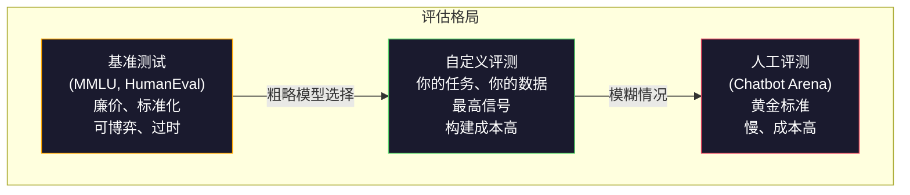
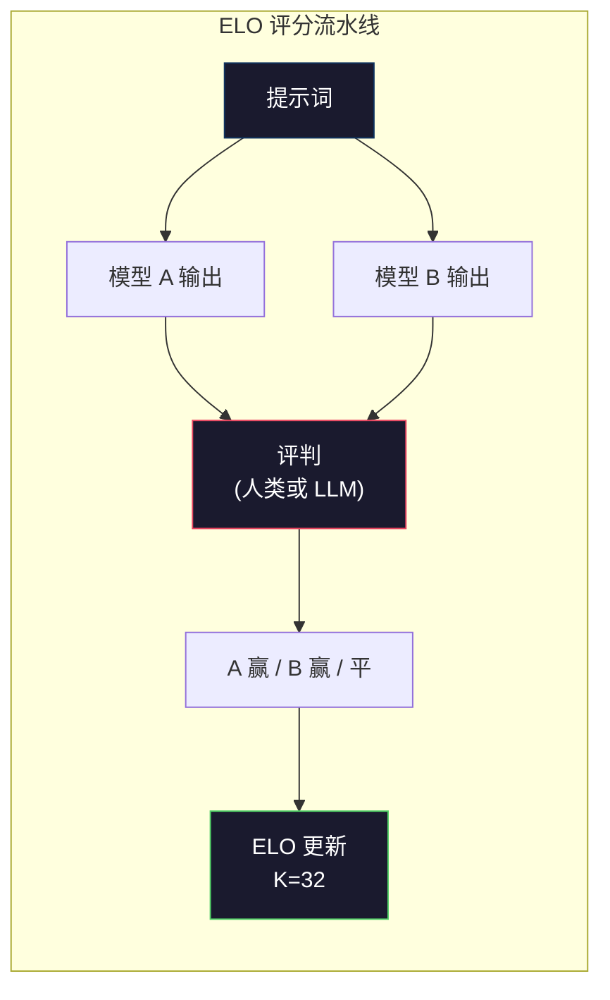

# 评估：基准测试、评测、LM Harness

> Goodhart 定律：当一个指标变成目标时，它就不再是一个好的指标。每个前沿实验室都在博弈基准测试。MMLU 分数在涨，而模型仍然无法可靠地数出"strawberry"中 R 的数量。唯一重要的评测是你自己的评测——在你自己任务上，用你自己的数据。

**类型：** 构建
**语言：** Python
**先修内容：** Phase 10，课程 01-05（从零构建 LLM）
**学习时间：** 约 90 分钟

## 学习目标

- 构建自定义评测框架，对语言模型运行多选题和开放题基准测试
- 解释标准基准测试（MMLU、HumanEval）饱和且无法区分前沿模型的原因
- 实现任务特定评测及其正确指标：精确匹配、F1、BLEU 和 LLM-as-judge 评分
- 设计针对你特定用例的自定义评测套件，而非仅依赖公共排行榜

## 问题所在

MMLU 于 2020 年发布，包含 15,908 个问题，涵盖 57 个学科。三年内，前沿模型就已饱和。GPT-4 得分 86.4%。Claude 3 Opus 得分 86.8%。Llama 3 405B 得分 88.6%。排行榜压缩到 3 分范围内，差异是统计噪声，不是真实能力差距。

与此同时，这些模型在 10 岁孩子无需思考就能处理的任务上失败了。Claude 3.5 Sonnet 在 MMLU 上得分 88.7%，最初却无法数出"strawberry"中的字母——这个任务不需要世界知识，不需要推理，只需要字符级迭代。HumanEval 用 164 个问题测试代码生成。模型得分 90% 以上，同时仍然产生任何初级开发人员都会注意到的边界情况崩溃的代码。

基准测试性能和真实世界可靠性之间的差距是 LLM 评估的核心问题。基准测试告诉你模型在基准测试上的表现。它们几乎无法告诉你该模型在你特定任务上、用你特定数据、在你特定失败模式下的表现。如果你构建客户支持机器人，MMLU 无关紧要。如果你构建代码助手，HumanEval 只覆盖函数级生成——对调试、重构或跨文件解释代码毫无帮助。

你需要自定义评测。不是因为基准测试无用——它们对粗略模型选择有用——而是因为最终评估必须完全匹配你的部署条件。

## 核心概念

### 评估格局

评估有三类，各有不同成本和信号质量。

**基准测试**是标准化测试套件。MMLU、HumanEval、SWE-bench、MATH、ARC、HellaSwag。你用模型运行基准测试并获得分数。优点：每个人都使用相同测试，所以你可以比较模型。缺点：模型和训练数据越来越多地污染这些基准测试。实验室在包含基准测试问题的数据上训练。分数上涨。能力可能没有。

**自定义评测**是你为特定用例构建的测试套件。你定义输入、期望输出和评分函数。法律文档摘要器在法律文档上评估。SQL 生成器在你的数据库模式上评估。这些创建成本高昂，但它们是预测生产性能的唯一评估。

**人工评测**使用付费标注员根据有用性、正确性、流畅性和安全性等标准评判模型输出。对于自动化评分失败的开放式任务，它是黄金标准。Chatbot Arena 收集了 100 多个模型上超过 200 万个人类偏好投票。缺点：成本（每次判断 0.10-2.00 美元）和速度（数小时到数天）。



### 为什么基准测试失效

三种机制导致基准测试分数停止反映真实能力。

**数据污染。** 训练语料抓取互联网。基准测试问题存在于互联网上。模型在训练期间看到答案。这不是传统意义上的作弊——实验室不会故意包含基准测试数据。但网络规模抓取使排除几乎不可能。

**应试教学。** 实验室针对基准测试性能优化训练混合物。如果训练混合物中有 5% 是 MMLU 风格的多选题，模型学习格式和答案分布。MMLU 是 4 选 1。模型学习到答案在 A/B/C/D 中大致均匀分布，这即使在模型不知道答案时也有帮助。

**饱和。** 当每个前沿模型在基准测试上得分 85-90% 时，基准测试停止区分。剩余 10-15% 的问题可能是模糊的、标签错误的或需要晦涩领域知识的。从 MMLU 的 87% 提高到 89% 可能意味着模型记住了两个更晦涩的问题，而不是它变聪明了。

### 困惑度：快速健康检查

困惑度衡量模型对一个 Token 序列的惊讶程度。形式上，它是指数化的平均负对数似然：

```
PPL = exp(-1/N * sum(log P(token_i | context)))
```

困惑度为 10 意味着模型在每个 Token 位置上平均等同于在 10 个选项中均匀选择的确定性。越低越好。GPT-2 在 WikiText-103 上困惑度约 30。GPT-3 约 20。Llama 3 8B 约 7。

困惑度可用于在相同测试集上比较模型，但它有盲点。模型可以通过擅长预测常见模式而获得低困惑度，同时在罕见但重要的模式上表现糟糕。它也不涉及指令遵从、推理或事实准确性。将其用作合理性检查，而非最终裁决。

### LLM-as-Judge

用强模型评估弱模型的输出。想法很简单：要求 GPT-4o 或 Claude Sonnet 在正确性、有用性和安全性上以 1-5 分给回复评分。使用 GPT-4o-mini 每次判断成本约 0.01 美元，与人类判断的相关性出人意料地好——在大多数任务上约 80% 一致性。

评分提示比模型更重要。模糊提示（"Rate this response"）产生嘈杂分数。带有评分标准的结构化提示（"5 分：答案事实正确且引用来源；4 分：正确但未引用；3 分：部分正确..."）产生一致、可复现的分数。

失败模式：评判模型表现出位置偏置（在成对比较中偏好第一个回复）、冗长偏置（偏好更长回复）和自我偏好（GPT-4 给 GPT-4 输出比等效 Claude 输出更高的分数）。缓解措施：随机化顺序、按长度归一化、使用与被评估模型不同的评判模型。

### 从成对比较计算 ELO 评分

Chatbot Arena 的方法。将来自不同模型的同一提示词的两种回复展示给用户。人类（或 LLM 评判）选择更好的一个。从数千个这些比较中，计算每个模型的 ELO 评分——与国际象棋中使用的相同系统。

ELO 优势：相对排名比绝对评分更可靠，优雅处理平局，与独立评分每个输出相比用更少的比较收敛。截至 2026 年初，Chatbot Arena 排行榜显示 GPT-4o、Claude 3.5 Sonnet 和 Gemini 1.5 Pro 在顶部相差不到 20 ELO 点。



### 评估框架

**lm-evaluation-harness**（EleutherAI）：标准开源评估框架。支持 200+ 基准测试。用一条命令对任何 Hugging Face 模型运行 MMLU、HellaSwag、ARC 等。被 Open LLM 排行榜使用。

**RAGAS**：专为 RAG 流水线设计的评估框架。衡量忠实度（答案是否与检索到的上下文匹配？）、相关性（检索到的上下文与问题相关吗？）和答案正确性。

**promptfoo**：用于提示工程的配置驱动评估。用 YAML 定义测试用例，针对多个模型运行，获得通过/失败报告。对回归测试提示很有用——确保提示更改不会破坏现有测试用例。

### 构建自定义评测

对生产来说唯一重要的评测。流程：

1. **定义任务。** 模型确切应该做什么？要精确。"回答问题"太模糊。"给定客户投诉邮件，提取产品名称、问题类别和情感"是一个你可以评估的任务。

2. **创建测试用例。** 原型评测最少 50 个，生产 200+。每个测试用例是一个（输入，期望输出）对。包括边界情况：空输入、对抗性输入、模糊输入、其他语言的输入。

3. **定义评分。** 结构化输出的精确匹配。文本相似性的 BLEU/ROUGE。开放式质量的 LLM-as-judge。提取任务的 F1。用权重组合多个指标。

4. **自动化。** 每个评测用一条命令运行。无手动步骤。以允许随时间比较的格式存储结果。

5. **随时间追踪。** 孤立的评测分数毫无意义。你需要趋势线。上次提示更改后分数提高了吗？切换模型后回归了吗？与提示一起对你的评测进行版本管理。

| 评测类型 | 每次判断成本 | 与人类一致性 | 最适合 |
|-----------|------------------|----------------------|----------|
| 精确匹配 | ~$0 | 100%（适用时） | 结构化输出、分类 |
| BLEU/ROUGE | ~$0 | ~60% | 翻译、摘要 |
| LLM-as-judge | ~$0.01 | ~80% | 开放式生成 |
| 人工评测 | $0.10-$2.00 | N/A（是地面真相） | 模糊、高风险任务 |

## 构建

### 步骤 1：最小评估框架

定义核心抽象。评测用例有输入、期望输出和可选元数据字典。评分器获取预测和参考并返回 0 到 1 之间的分数。

```python
import json
from collections import Counter

class EvalCase:
    def __init__(self, input_text, expected, metadata=None):
        self.input_text = input_text
        self.expected = expected
        self.metadata = metadata or {}

class EvalSuite:
    def __init__(self, name, cases, scorers):
        self.name = name
        self.cases = cases
        self.scorers = scorers

    def run(self, model_fn):
        results = []
        for case in self.cases:
            prediction = model_fn(case.input_text)
            scores = {}
            for scorer_name, scorer_fn in self.scorers.items():
                scores[scorer_name] = scorer_fn(prediction, case.expected)
            results.append({
                "input": case.input_text,
                "expected": case.expected,
                "prediction": prediction,
                "scores": scores,
            })
        return results
```

### 步骤 2：评分函数

构建精确匹配、Token F1 和模拟 LLM-as-judge 评分器。

```python
def exact_match(prediction, expected):
    return 1.0 if prediction.strip().lower() == expected.strip().lower() else 0.0

def token_f1(prediction, expected):
    pred_tokens = set(prediction.lower().split())
    exp_tokens = set(expected.lower().split())
    if not pred_tokens or not exp_tokens:
        return 0.0
    common = pred_tokens & exp_tokens
    precision = len(common) / len(pred_tokens)
    recall = len(common) / len(exp_tokens)
    if precision + recall == 0:
        return 0.0
    return 2 * (precision * recall) / (precision + recall)

def llm_judge_simulated(prediction, expected):
    pred_words = set(prediction.lower().split())
    exp_words = set(expected.lower().split())
    if not exp_words:
        return 0.0
    overlap = len(pred_words & exp_words) / len(exp_words)
    length_penalty = min(1.0, len(prediction) / max(len(expected), 1))
    return round(overlap * 0.7 + length_penalty * 0.3, 3)
```

### 步骤 3：ELO 评分系统

实现带 ELO 更新的成对比较。这正是 Chatbot Arena 用于排名模型使用的系统。

```python
class ELOTracker:
    def __init__(self, k=32, initial_rating=1500):
        self.ratings = {}
        self.k = k
        self.initial_rating = initial_rating
        self.history = []

    def _ensure_player(self, name):
        if name not in self.ratings:
            self.ratings[name] = self.initial_rating

    def expected_score(self, rating_a, rating_b):
        return 1 / (1 + 10 ** ((rating_b - rating_a) / 400))

    def record_match(self, player_a, player_b, outcome):
        self._ensure_player(player_a)
        self._ensure_player(player_b)

        ea = self.expected_score(self.ratings[player_a], self.ratings[player_b])
        eb = 1 - ea

        if outcome == "a":
            sa, sb = 1.0, 0.0
        elif outcome == "b":
            sa, sb = 0.0, 1.0
        else:
            sa, sb = 0.5, 0.5

        self.ratings[player_a] += self.k * (sa - ea)
        self.ratings[player_b] += self.k * (sb - eb)

        self.history.append({
            "a": player_a, "b": player_b,
            "outcome": outcome,
            "rating_a": round(self.ratings[player_a], 1),
            "rating_b": round(self.ratings[player_b], 1),
        })

    def leaderboard(self):
        return sorted(self.ratings.items(), key=lambda x: -x[1])
```

### 步骤 4：困惑度计算

使用 Token 概率计算困惑度。在实践中你会从模型的 logit 中获取这些。这里用概率分布模拟。

```python
import numpy as np

def perplexity(log_probs):
    if not log_probs:
        return float("inf")
    avg_neg_log_prob = -np.mean(log_probs)
    return float(np.exp(avg_neg_log_prob))

def token_log_probs_simulated(text, model_quality=0.8):
    np.random.seed(hash(text) % 2**31)
    tokens = text.split()
    log_probs = []
    for i, token in enumerate(tokens):
        base_prob = model_quality
        if len(token) > 8:
            base_prob *= 0.6
        if i == 0:
            base_prob *= 0.7
        prob = np.clip(base_prob + np.random.normal(0, 0.1), 0.01, 0.99)
        log_probs.append(float(np.log(prob)))
    return log_probs
```

### 步骤 5：聚合结果

计算评测运行中的汇总统计：均值、中位数、阈值通过率，以及按指标分类。

```python
def summarize_results(results, threshold=0.8):
    all_scores = {}
    for r in results:
        for metric, score in r["scores"].items():
            all_scores.setdefault(metric, []).append(score)

    summary = {}
    for metric, scores in all_scores.items():
        arr = np.array(scores)
        summary[metric] = {
            "mean": round(float(np.mean(arr)), 3),
            "median": round(float(np.median(arr)), 3),
            "std": round(float(np.std(arr)), 3),
            "min": round(float(np.min(arr)), 3),
            "max": round(float(np.max(arr)), 3),
            "pass_rate": round(float(np.mean(arr >= threshold)), 3),
            "n": len(scores),
        }
    return summary

def print_summary(summary, suite_name="Eval"):
    print(f"\n{'=' * 60}")
    print(f"  {suite_name} Summary")
    print(f"{'=' * 60}")
    for metric, stats in summary.items():
        print(f"\n  {metric}:")
        print(f"    Mean:      {stats['mean']:.3f}")
        print(f"    Median:    {stats['median']:.3f}")
        print(f"    Std:       {stats['std']:.3f}")
        print(f"    Range:     [{stats['min']:.3f}, {stats['max']:.3f}]")
        print(f"    Pass rate: {stats['pass_rate']:.1%} (threshold >= 0.8)")
        print(f"    N:         {stats['n']}")
```

### 步骤 6：运行完整流水线

将所有内容连接起来。定义任务，创建测试用例，模拟两个模型，运行评测，从成对比较计算 ELO，并打印排行榜。

```python
def demo_model_good(prompt):
    responses = {
        "What is the capital of France?": "Paris",
        "What is 2 + 2?": "4",
        "Who wrote Hamlet?": "William Shakespeare",
        "What language is PyTorch written in?": "Python and C++",
        "What is the boiling point of water?": "100 degrees Celsius",
    }
    return responses.get(prompt, "I don't know")

def demo_model_bad(prompt):
    responses = {
        "What is the capital of France?": "Paris is the capital city of France",
        "What is 2 + 2?": "The answer is four",
        "Who wrote Hamlet?": "Shakespeare",
        "What language is PyTorch written in?": "Python",
        "What is the boiling point of water?": "212 Fahrenheit",
    }
    return responses.get(prompt, "Unknown")

cases = [
    EvalCase("What is the capital of France?", "Paris"),
    EvalCase("What is 2 + 2?", "4"),
    EvalCase("Who wrote Hamlet?", "William Shakespeare"),
    EvalCase("What language is PyTorch written in?", "Python and C++"),
    EvalCase("What is the boiling point of water?", "100 degrees Celsius"),
]

suite = EvalSuite(
    name="General Knowledge",
    cases=cases,
    scorers={
        "exact_match": exact_match,
        "token_f1": token_f1,
        "llm_judge": llm_judge_simulated,
    },
)

results_good = suite.run(demo_model_good)
results_bad = suite.run(demo_model_bad)

print_summary(summarize_results(results_good), "Model A (concise)")
print_summary(summarize_results(results_bad), "Model B (verbose)")
```

"好"模型给出确切答案。"坏"模型给出冗长解释。精确匹配严厉惩罚冗长模型。Token F1 和 LLM-as-judge 更宽容。这说明为什么指标选择很重要：同一个模型根据评分方式看起来好或糟。

### 步骤 7：ELO 锦标赛

在多轮中对模型进行成对比较。

```python
elo = ELOTracker(k=32)

for case in cases:
    pred_a = demo_model_good(case.input_text)
    pred_b = demo_model_bad(case.input_text)

    score_a = token_f1(pred_a, case.expected)
    score_b = token_f1(pred_b, case.expected)

    if score_a > score_b:
        outcome = "a"
    elif score_b > score_a:
        outcome = "b"
    else:
        outcome = "tie"

    elo.record_match("model_a_concise", "model_b_verbose", outcome)

print("\nELO Leaderboard:")
for name, rating in elo.leaderboard():
    print(f"  {name}: {rating:.0f}")
```

### 步骤 8：困惑度比较

比较不同质量级别"模型"的困惑度。

```python
test_text = "The quick brown fox jumps over the lazy dog in the garden"

for quality, label in [(0.9, "Strong model"), (0.7, "Medium model"), (0.4, "Weak model")]:
    log_probs = token_log_probs_simulated(test_text, model_quality=quality)
    ppl = perplexity(log_probs)
    print(f"  {label} (quality={quality}): perplexity = {ppl:.2f}")
```

## 使用

### lm-evaluation-harness（EleutherAI）

在任何模型上运行基准测试的标准工具。

```python
# pip install lm-eval
# Command line:
# lm_eval --model hf --model_args pretrained=meta-llama/Llama-3.1-8B --tasks mmlu --batch_size 8

# Python API:
# import lm_eval
# results = lm_eval.simple_evaluate(
#     model="hf",
#     model_args="pretrained=meta-llama/Llama-3.1-8B",
#     tasks=["mmlu", "hellaswag", "arc_easy"],
#     batch_size=8,
# )
# print(results["results"])
```

### promptfoo

用于提示工程的配置驱动评估。在 YAML 中定义测试并针对多个提供商运行。

```yaml
# promptfoo.yaml
providers:
  - openai:gpt-4o-mini
  - anthropic:claude-3-haiku

prompts:
  - "Answer in one word: {{question}}"

tests:
  - vars:
      question: "What is the capital of France?"
    assert:
      - type: contains
        value: "Paris"
  - vars:
      question: "What is 2 + 2?"
    assert:
      - type: equals
        value: "4"
```

### RAGAS 用于 RAG 评估

```python
# pip install ragas
# from ragas import evaluate
# from ragas.metrics import faithfulness, answer_relevancy, context_precision
#
# result = evaluate(
#     dataset,
#     metrics=[faithfulness, answer_relevancy, context_precision],
# )
# print(result)
```

RAGAS 衡量通用评测遗漏的内容：模型的答案是否基于检索到的上下文，而不仅仅是抽象意义上的"正确"。

## 发货

这节课产出 `outputs/prompt-eval-designer.md`——一个可重用的提示词，为任何任务设计自定义评测套件。给它一个任务描述，它会生成测试用例、评分函数和通过/失败阈值建议。

它还产出 `outputs/skill-llm-evaluation.md`——一个决策框架，用于根据任务类型、预算和延迟要求选择正确的评估策略。

## 练习

1. 添加"一致性"评分器，通过模型运行相同输入 5 次，测量输出匹配的频率。在确定性输入上不一致的答案揭示了脆弱的提示或高温度设置。

2. 扩展 ELO 追踪器以支持多个评判函数（精确匹配、F1、LLM-as-judge）并加权。当你对精确匹配加权重与对 F1 加权重时，比较排行榜如何变化。

3. 为特定任务构建评测套件：将电子邮件分类为 5 个类别。创建 100 个包含多样化示例（包括边界情况）的测试用例——可属于多个类别的电子邮件、空电子邮件、其他语言的电子邮件。测量不同"模型"（基于规则的、关键词匹配的、模拟 LLM）的性能。

4. 实现污染检测：给定一组评测问题和训练语料，检查评测问题（或近似改写）在训练数据中出现百分比。这是研究人员审计基准有效性的方法。

5. 构建"模型差异"工具。给定两个模型版本的评测结果，突出显示哪些具体测试用例改进了，哪些退化了，哪些保持不变。这是评测版的代码 diff——对于理解更改是否有帮助或有害至关重要。

## 关键术语

| 术语 | 人们怎么说 | 实际含义 |
|------|----------------|----------------------|
| MMLU | "基准测试" | 大规模多任务语言理解——15,908 个多选题，涵盖 57 个学科，2025 年在 88% 以上饱和 |
| HumanEval | "代码评测" | OpenAI 的 164 个 Python 函数补全问题，仅测试独立函数生成 |
| SWE-bench | "真实编码评测" | 来自 12 个 Python 仓库的 2,294 个 GitHub 问题，测量端到端错误修复，包括测试生成 |
| 困惑度 | "模型有多困惑" | exp(-avg(log P(token_i given context)))——越低意味着模型对实际 Token 分配的概率越高 |
| ELO 评分 | "模型国际象棋排名" | 从成对胜负记录计算的相对技能评分，被 Chatbot Arena 用于排名 100+ 模型 |
| LLM-as-judge | "用 AI 给 AI 评分" | 强模型根据评分标准给弱模型输出评分，与人类判断约 80% 一致性，每次判断约 $0.01 |
| 数据污染 | "模型看到了测试" | 训练数据包含基准测试问题，在不提高真实能力的情况下提高分数 |
| 评测套件 | "一堆测试" | 测量特定能力的版本化（输入、期望输出、评分器）三元组集合 |
| 通过率 | "正确百分比" | 得分超过阈值的评测用例比例——比平均分更可行，因为它衡量可靠性 |
| Chatbot Arena | "模型排名网站" | LMSYS 平台，拥有 2M+ 人类偏好投票，通过 ELO 评分产生最受信赖的真实世界 LLM 排行榜 |

## 延伸阅读

- [Hendrycks et al., 2021 -- "Measuring Massive Multitask Language Understanding"](https://arxiv.org/abs/2009.03300) -- MMLU 论文，尽管饱和但仍是被引用最多的 LLM 基准测试
- [Chen et al., 2021 -- "Evaluating Large Language Models Trained on Code"](https://arxiv.org/abs/2107.03374) -- OpenAI 的 HumanEval 论文，建立了代码生成评估方法论
- [Zheng et al., 2023 -- "Judging LLM-as-a-Judge"](https://arxiv.org/abs/2306.05685) -- 系统分析使用 LLMs 评估 LLMs，包括位置偏置和冗长偏置发现
- [LMSYS Chatbot Arena](https://chat.lmsys.org/) -- 众包模型比较平台，拥有 2M+ 投票，通过 ELO 评分产生最受信赖的真实世界 LLM 排名