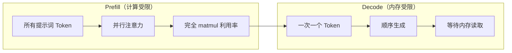
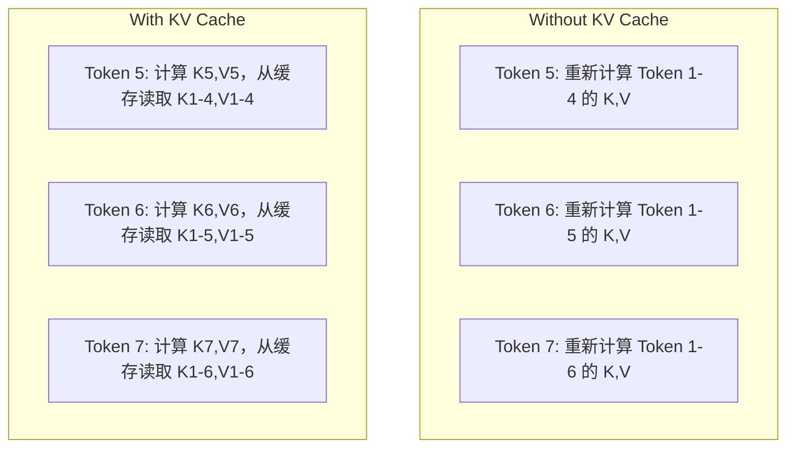
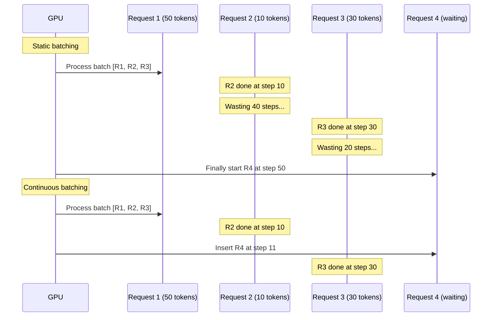
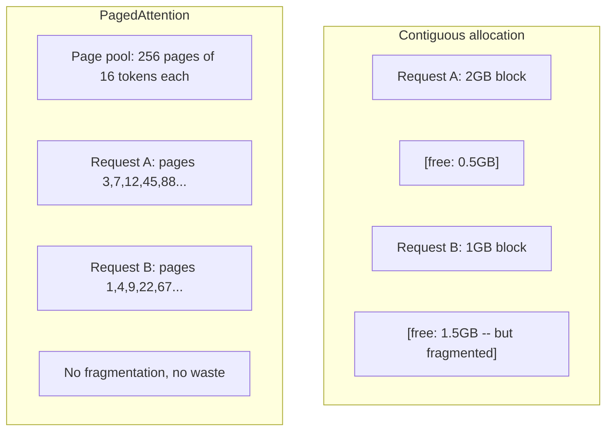
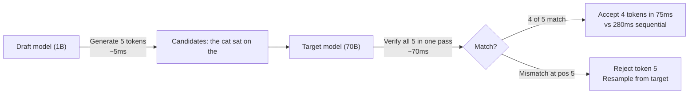

# 推理优化

> 两个阶段定义 LLM 推理。Prefill 并行处理你的提示词——计算受限。Decode 一次生成一个 Token——内存受限。每个优化都针对其中一个或两个。

**类型：** 构建
**语言：** Python
**先修内容：** Phase 10，课程 01-08（Transformer 架构、注意力）
**学习时间：** 约 120 分钟

## 学习目标

- 实现 KV 缓存以消除自回归 Token 生成期间的冗余计算
- 解释 LLM 推理的 prefill 和 decode 阶段及其不同瓶颈（计算受限 vs 内存受限）
- 实现连续批处理和 PagedAttention 概念以在并发请求下最大化 GPU 利用率
- 比较推理优化技术（KV 缓存、推测解码、Flash Attention）及其吞吐量/延迟权衡

## 问题所在

你在 4 块 A100 GPU 上部署 Llama 3 70B。单用户获得约 50 Token/秒。感觉很快。然后 100 个用户同时访问端点。吞吐量降至 3 Token/秒/用户。你每月 25,000 美元的 GPU 账单服务回复比人打字还慢。

模型本身在 1 个用户和 100 个用户之间不变化。相同权重、相同架构、相同数学。变化的是你调度工作的方式。朴素推理浪费 90%+ 可用的 GPU 计算。等待第 47 个 Token 的用户在整个批次槽打开时让 GPU 内存总线在 matmul 之间空闲。同时，新用户的 2,000 Token 提示词可以用有用的计算填充那段空闲时间。

这不是扩展问题。这是调度问题。这节课中的技术——KV 缓存、连续批处理、PagedAttention、推测解码、前缀缓存——是将每月 25,000 美元推理账单与每月 5,000 美元账单分开的原因，服务相同流量。

vLLM 在 4 块 A100-80GB GPU 上服务 Llama 3 70B，在低并发下实现约 50 Token/秒/用户，在 100 并发请求下维持 15-25 TPS/用户，通过连续批处理和 PagedAttention。没有这些优化，相同硬件在该并发下服务 5 TPS/用户。相同 GPU、相同模型、4 倍吞吐量。

## 核心概念

### Prefill vs Decode

每个 LLM 推理请求有两个截然不同的阶段。

**Prefill** 处理整个输入提示词。所有 Token 都已知，所以注意力可以跨完整序列并行计算。这是一个大型矩阵乘法——GPU 核心保持忙碌。瓶颈是计算：硬件每秒能提供多少 FLOP。A100 提供 312 TFLOPS（BF16）。在单块 A100 上，70B 模型 4,096 Token 提示词的 prefill 约需 400ms。

**Decode** 一次生成一个输出 Token。每个新 Token 关注所有之前的 Token，但每次前向传播只产生一个 Token。权重矩阵与 prefill 期间大小相同，但你用单个向量而非矩阵相乘。GPU 核心在微秒内完成，然后等待下一批权重从内存到达。瓶颈是内存带宽：从 HBM 到计算单元能以多快速度流送模型权重。A100 有 2 TB/s 带宽。FP16 中的 70B 模型是 140 GB。读完整模型一次需要 70ms——这是单步 decode 的下限。



**ops:byte 比**（也称为算术强度）捕捉这种权衡。它衡量每从内存加载一字节你执行多少次运算。

```
ops:byte 比 = 每 Token FLOPs / 从内存读取的字节数
```

在批处理 4,096 Token 的 prefill 期间，你对加载的每个权重执行约 4,096 次乘累加操作。比值很高——你计算受限。在 batch=1 的 decode 期间，你对加载的每个权重执行约 1 次操作。比值很低——你内存受限。

根本洞察：*decode 是内存受限的因为你读整个模型来产生一个 Token*。下面的每个优化要么减少你读的内容，要么增加每次读取处理的 Token 批，要么完全避免读取。

### KV 缓存

在注意力期间，每个 Token 的查询关注每个之前 Token 的键和值向量。没有缓存，生成 Token N 需要重新计算前面 N-1 个 Token 的键和值投影。Token 1 在生成 Token 2 时被投影，然后在 Token 3 时再次投影，然后在 Token 4 时再次投影。到 Token 1,000，你已经投影了 Token 1 总共 999 次。

KV 缓存存储所有之前 Token 的键和值投影。生成 Token N 时，你只计算 Token N 的键和值，然后与 Token 1 到 N-1 的缓存 K/V 连接。



**KV 缓存的内存公式：**

```
KV 缓存大小 = 2 * num_layers * num_kv_heads * head_dim * seq_len * bytes_per_param
```

对于 Llama 3 70B（80 层，8 个 KV 头与 GQA，head_dim=128，BF16）：

```
每 Token: 2 * 80 * 8 * 128 * 2 字节 = 327,680 字节 = 320 KB
4,096 Token: 320 KB * 4,096 = 1.28 GB
128K Token: 320 KB * 131,072 = 40 GB
```

Llama 3 70B 的单个 128K 上下文对话消耗 40 GB KV 缓存——半块 A100 的显存。100 个 4K Token 的并发用户仅 KV 缓存就需要 128 GB。这就是 KV 缓存管理是推理优化核心挑战的原因。

### 连续批处理

静态批处理等待 N 个请求批次到达，一起处理它们，等待*所有*完成才接受新请求。如果一个请求需要 500 Token，另一个需要 10，短请求在完成后 490 步空闲。

连续批处理（也称为迭代级批处理）在任何请求完成时立即将新请求插入批次。每步 decode 后重新评估批次。10 Token 后完成的请求立即被等待请求替换。



吞吐量改进取决于输出长度差异程度。在均匀长度下，连续批处理匹配静态批处理。在可变长度（常见情况）下，连续批处理可提供 2-5 倍更高吞吐量，因为 GPU 槽永远不会空。

### PagedAttention

每个请求的 KV 缓存是一个连续的内存块。随着请求到来和离开，内存碎片——就像操作系统中的 RAM 碎片化。4K Token 请求需要 1.28 GB 连续。即使你有 2 GB 空闲总计，你可能没有 1.28 GB *连续的*。你要么浪费内存要么拒绝请求。

PagedAttention（来自 vLLM）将操作系统风格的虚拟内存应用于 KV 缓存。不是为每个请求分配一个连续块，而是分配固定大小的"页"（通常每页 16 Token）。页可以在物理 GPU 内存的任何位置。页表将每个请求的逻辑序列位置映射到物理页位置。



PagedAttention 还为共享前缀启用**写时复制**。如果 50 个请求共享相同的系统提示词，该系统提示词的 KV 缓存页存储一次并被所有 50 个请求引用。只有当请求发散（不同的用户消息）时它才获得自己的页。这大大减少共享系统提示的应用的内存使用。

vLLM 报告通过 PagedAttention 实现近零内存浪费（约 4% vs 朴素分配下约 60-80%）。

### 推测解码

Decode 慢因为它是顺序的——你生成一个 Token，喂回去，生成下一个。但如果你能廉价地猜测下 5 个 Token，然后一次验证它们全部呢？

推测解码使用小型快速**草稿模型**生成 K 个候选 Token。然后大型**目标模型**在单次前向传播中处理所有 K 个候选（这看起来像 prefill——并行、计算受限、高效）。如果目标模型同意草稿模型的预测，你在一次目标前向传播的时间内接受所有 K 个 Token。如果它在位置 j 不同意，你接受 Token 1 到 j-1 并丢弃其余。



加速取决于**接受率**——草稿模型预测与目标匹配的频率。对于 Llama 3 8B 草稿 Llama 3 70B，在自然语言上典型接受率为 70-85%。这转化为 2-3 倍 decode 加速。

三种推测解码方法：

| 方法 | 草稿来源 | 接受率 | 开销 |
|--------|-------------|-----------------|----------|
| 草稿-目标（Leviathan et al.） | 单独的小模型 | 70-85% | 草稿模型内存 |
| EAGLE（Li et al.）| 目标模型上的轻量级头 | 75-90% | ~1% 额外参数 |
| N-gram 查找 | Token n-gram 表 | 40-60% | 可忽略 |

**EAGLE** 在目标模型隐藏状态之上训练一个小型的自回归头。它使用目标模型的倒数第二层特征预测下一个 Token 的嵌入。由于它操作目标模型自己的表示（非单独模型），以最小额外内存实现更高接受率。EAGLE-2 添加动态草稿树，根据上下文调整候选数量。

**N-gram 推测解码** 维护当前上下文或预建语料库中 n-gram 延续的表。如果草稿与同一对话中之前出现的内容匹配（重复模式、代码、结构化输出），它以零神经网络开销触发。平均接受率较低但每次推测的成本基本免费。

推测解码*在数学上是精确的*——输出分布与目标模型分布相同。它不是近似。验证步骤确保每个接受的 Token 恰好具有目标模型会分配的概率。

### 前缀缓存

许多请求共享相同前缀。聊天机器人系统提示。RAG 上下文块。Few-shot 示例集。没有前缀缓存，每个请求从头开始重新计算这些共享 Token 的 KV 缓存。

前缀缓存存储常见前缀的 KV 缓存并跨请求重用。当具有已知前缀的新请求到达时，系统复制（或引用）缓存的 KV 条目，只计算独特后缀的 KV。

对于跨所有请求共享的 2,000 Token 系统提示，前缀缓存消除每个请求约 400ms 的 prefill。在 100 请求/秒时，这节省了每秒 40 秒的 GPU 计算——超过一块 GPU 的工作量。

SGLang 的 RadixAttention 实现带_radix 树（前缀树）的前缀缓存，按 Token 内容索引前缀。任何匹配存储前缀的请求免费获得其 KV 缓存。该树支持部分前缀匹配——如果你与缓存条目共享 2,000 个前缀 Token 中的 1,500 个，你复用那 1,500 并仅重新计算 500。

### 推理引擎

三个引擎主导生产 LLM 服务：

| 引擎 | 关键创新 | 最佳用于 |
|--------|---------------|----------|
| vLLM | PagedAttention、连续批处理 | 通用服务、最高兼容性 |
| SGLang | RadixAttention（前缀缓存）、结构化生成 | 多轮聊天机器人、受限解码 |
| TensorRT-LLM | NVIDIA 内核融合、FP8 量化 | NVIDIA 硬件上最高单 GPU 吞吐量 |

**vLLM** 是默认起点。它支持最广泛的模型范围，在任何 GPU 供应商（NVIDIA、AMD、Intel）上运行，通过 PagedAttention + 连续批处理实现强劲吞吐量。OpenAI 兼容 API 意味着你可以将其作为任何 OpenAI API 调用的替代品。

**SGLang** 在 vLLM 相同基础上构建，但添加了 RadixAttention 用于前缀缓存和用于结构化 LLM 程序的领域特定语言。如果你的工作负载涉及多轮对话、工具使用或受限解码（JSON 输出、正则引导生成），SGLang 通常通过前缀重用以 2-5 倍优于 vLLM。

**TensorRT-LLM** 将模型编译为优化的 NVIDIA GPU 内核。它融合操作（注意力 + 线性 + 激活在一个内核中），在 H100 GPU 上使用 FP8，并与 NVIDIA Triton Inference Server 集成进行生产部署。它在 NVIDIA 硬件上实现最高单 GPU 吞吐量，但需要更多设置且仅适用于 NVIDIA GPU。

Llama 3 70B 的真实世界数字（4xA100-80GB，BF16）：

| 指标 | vLLM | SGLang | TensorRT-LLM |
|--------|------|--------|---------------|
| 吞吐量（1 用户） | ~50 TPS | ~55 TPS | ~65 TPS |
| 吞吐量（100 用户） | ~2,500 总 TPS | ~3,200 总 TPS | ~3,000 总 TPS |
| 首个 Token 时间 | ~400ms | ~300ms（前缀命中） | ~350ms |
| 最大上下文 | 128K | 128K | 128K |

### Ops:Byte 框架

你无法优化你无法衡量的东西。ops:byte 比告诉你你是计算受限还是内存受限，这决定了哪些优化重要。

```
Compute roof: peak FLOPS of the GPU
Memory roof:  peak bandwidth * ops:byte ratio
```

当 ops:byte 低（decode、小批次）时，你碰到内存带宽上限。添加更多计算（更高时钟、更多核心）没有帮助。你需要减少内存读取（量化、KV 缓存压缩）或增加批次大小以在更多有用工作上摊销读取。

当 ops:byte 高（prefill、大批次）时，你碰到计算上限。内存带宽优化没有帮助。你需要更快的 GPU、内核融合或降低精度以挤出更多 FLOP。

| 场景 | ops:byte | 受限 | 用以下优化 |
|----------|----------|-------|---------------|
| Prefill, batch=1 | ~4,096 | 计算 | 内核融合、FP8 |
| Decode, batch=1 | ~1 | 内存 | 量化、KV 压缩 |
| Decode, batch=32 | ~32 | 内存 | 更大批次、连续批处理 |
| Decode, batch=256 | ~256 | 过渡中 | 两者都重要 |
| Decode, batch=1024 | ~1,024 | 计算 | 内核融合、张量并行 |

A100 上的交叉点在 ops:byte ≈ 156（312 TFLOPS / 2 TB/s）。低于 156，你是内存受限的。高于 156，你是计算受限的。连续批处理通过在每次迭代打包更多 Token 将 decode 推向这个交叉点。

## 构建

### 步骤 1：从零构建 KV 缓存

我们构建一个多头 KV 缓存，存储每层、每头和每头的键和值投影，并展示内存增长模式。

```python
import numpy as np

class KVCache:
    def __init__(self, num_layers, num_heads, head_dim, max_seq_len, dtype=np.float16):
        self.num_layers = num_layers
        self.num_heads = num_heads
        self.head_dim = head_dim
        self.max_seq_len = max_seq_len
        self.dtype = dtype

        self.k_cache = np.zeros(
            (num_layers, num_heads, max_seq_len, head_dim), dtype=dtype
        )
        self.v_cache = np.zeros(
            (num_layers, num_heads, max_seq_len, head_dim), dtype=dtype
        )
        self.seq_len = 0

    def update(self, layer_idx, new_keys, new_values):
        num_new = new_keys.shape[1]
        end = self.seq_len + num_new
        self.k_cache[layer_idx, :, self.seq_len:end, :] = new_keys
        self.v_cache[layer_idx, :, self.seq_len:end, :] = new_values
        return (
            self.k_cache[layer_idx, :, :end, :],
            self.v_cache[layer_idx, :, :end, :]
        )

    def advance(self, num_tokens):
        self.seq_len += num_tokens

    def memory_bytes(self):
        return self.k_cache.nbytes + self.v_cache.nbytes

    def used_bytes(self):
        per_token = 2 * self.num_layers * self.num_heads * self.head_dim * np.dtype(self.dtype).itemsize
        return per_token * self.seq_len
```

### 步骤 2：带 KV 缓存的注意力

一个简化多头注意力，在 decode 步骤中使用 KV 缓存。

```python
def scaled_dot_product_attention(query, keys, values):
    head_dim = query.shape[-1]
    scores = np.matmul(query, keys.transpose(0, 1, 3, 2)) / np.sqrt(head_dim)
    seq_len_q = scores.shape[-2]
    seq_len_k = scores.shape[-1]
    if seq_len_q > 1:
        mask = np.triu(np.ones((seq_len_q, seq_len_k), dtype=np.float32), k=seq_len_k - seq_len_q + 1)
        scores = scores + mask * (-1e9)
    max_scores = np.max(scores, axis=-1, keepdims=True)
    exp_scores = np.exp(scores - max_scores)
    attn_weights = exp_scores / np.sum(exp_scores, axis=-1, keepdims=True)
    return np.matmul(attn_weights, values)


class MultiHeadAttention:
    def __init__(self, d_model, num_heads):
        self.num_heads = num_heads
        self.head_dim = d_model // num_heads
        scale = np.sqrt(2.0 / d_model)
        self.W_q = np.random.randn(d_model, d_model).astype(np.float32) * scale
        self.W_k = np.random.randn(d_model, d_model).astype(np.float32) * scale
        self.W_v = np.random.randn(d_model, d_model).astype(np.float32) * scale
        self.W_o = np.random.randn(d_model, d_model).astype(np.float32) * scale

    def forward(self, x, kv_cache=None, layer_idx=0):
        batch, seq_len, d_model = x.shape
        Q = np.matmul(x, self.W_q).reshape(batch, seq_len, self.num_heads, self.head_dim).transpose(0, 2, 1, 3)
        K = np.matmul(x, self.W_k).reshape(batch, seq_len, self.num_heads, self.head_dim).transpose(0, 2, 1, 3)
        V = np.matmul(x, self.W_v).reshape(batch, seq_len, self.num_heads, self.head_dim).transpose(0, 2, 1, 3)

        if kv_cache is not None:
            K_full, V_full = kv_cache.update(layer_idx, K[0], V[0])
            K = K_full[np.newaxis, :, :, :]
            V = V_full[np.newaxis, :, :, :]
            if seq_len == 1:
                kv_cache.advance(1)

        attn_out = scaled_dot_product_attention(Q, K, V)
        attn_out = attn_out.transpose(0, 2, 1, 3).reshape(batch, -1, d_model)
        return np.matmul(attn_out, self.W_o)
```

### 步骤 3：连续批处理模拟器

这模拟静态批处理和连续批处理之间的调度差异。

```python
import heapq

class Request:
    def __init__(self, request_id, prompt_tokens, output_tokens, arrival_step):
        self.request_id = request_id
        self.prompt_tokens = prompt_tokens
        self.output_tokens = output_tokens
        self.arrival_step = arrival_step
        self.tokens_generated = 0
        self.start_step = None
        self.end_step = None

    def is_done(self):
        return self.tokens_generated >= self.output_tokens


def simulate_static_batching(requests, batch_size):
    step = 0
    completed = []
    queue = list(requests)
    queue.sort(key=lambda r: r.arrival_step)

    while queue:
        batch = []
        while queue and len(batch) < batch_size:
            r = queue.pop(0)
            r.start_step = max(step, r.arrival_step)
            batch.append(r)

        if batch:
            step = max(step, max(r.start_step for r in batch))
            max_output = max(r.output_tokens for r in batch)
            for r in batch:
                r.tokens_generated = r.output_tokens
                r.end_step = step + max_output
            step += max_output
            completed.extend(batch)

    return completed


def simulate_continuous_batching(requests, batch_size):
    step = 0
    completed = []
    queue = sorted(requests, key=lambda r: r.arrival_step)
    queue_idx = 0
    active = []
    waiting = []

    while queue_idx < len(queue) or active or waiting:
        while queue_idx < len(queue) and queue[queue_idx].arrival_step <= step:
            waiting.append(queue[queue_idx])
            queue_idx += 1

        while waiting and len(active) < batch_size:
            r = waiting.pop(0)
            r.start_step = step
            active.append(r)

        if not active:
            if waiting:
                step += 1
                continue
            elif queue_idx < len(queue):
                step = queue[queue_idx].arrival_step
                continue
            else:
                break

        for r in active:
            r.tokens_generated += 1

        done = [r for r in active if r.is_done()]
        for r in done:
            r.end_step = step + 1
            completed.append(r)
        active = [r for r in active if not r.is_done()]

        step += 1

    return completed


def batching_stats(completed):
    latencies = [r.end_step - r.arrival_step for r in completed]
    total_time = max(r.end_step for r in completed) - min(r.arrival_step for r in completed)
    total_tokens = sum(r.output_tokens for r in completed)
    return {
        "avg_latency": np.mean(latencies),
        "p50_latency": np.median(latencies),
        "p99_latency": np.percentile(latencies, 99),
        "total_time": total_time,
        "throughput": total_tokens / total_time if total_time > 0 else 0,
    }
```

### 步骤 4：前缀缓存

基于 trie 的前缀缓存，存储共享前缀的 KV 条目。

```python
class TrieNode:
    def __init__(self):
        self.children = {}
        self.kv_data = None
        self.hit_count = 0


class PrefixCache:
    def __init__(self, max_entries=1000):
        self.root = TrieNode()
        self.max_entries = max_entries
        self.total_entries = 0
        self.hits = 0
        self.misses = 0

    def _walk(self, token_ids):
        node = self.root
        depth = 0
        for tid in token_ids:
            if tid not in node.children:
                break
            node = node.children[tid]
            depth += 1
        return node, depth

    def lookup(self, token_ids):
        node, depth = self._walk(token_ids)
        if depth > 0:
            self.hits += 1
            current = self.root
            for tid in token_ids[:depth]:
                current = current.children[tid]
                current.hit_count += 1
            kv_entries = []
            current = self.root
            for tid in token_ids[:depth]:
                current = current.children[tid]
                if current.kv_data is not None:
                    kv_entries.append(current.kv_data)
            return depth, kv_entries
        self.misses += 1
        return 0, []

    def insert(self, token_ids, kv_per_token):
        node = self.root
        for i, tid in enumerate(token_ids):
            if tid not in node.children:
                if self.total_entries >= self.max_entries:
                    return i
                node.children[tid] = TrieNode()
                self.total_entries += 1
            node = node.children[tid]
            if i < len(kv_per_token):
                node.kv_data = kv_per_token[i]
        return len(token_ids)

    def hit_rate(self):
        total = self.hits + self.misses
        return self.hits / total if total > 0 else 0.0
```

### 步骤 5：推测解码模拟器

我们用可配置接受率模拟草稿-目标推测解码。

```python
class DraftModel:
    def __init__(self, vocab_size, acceptance_rate=0.8):
        self.vocab_size = vocab_size
        self.acceptance_rate = acceptance_rate

    def generate(self, context, num_tokens):
        tokens = np.random.randint(0, self.vocab_size, size=num_tokens)
        return tokens

    def get_probs(self, context, token):
        probs = np.random.dirichlet(np.ones(self.vocab_size))
        return probs


class TargetModel:
    def __init__(self, vocab_size):
        self.vocab_size = vocab_size

    def get_probs(self, context, tokens=None):
        if tokens is not None:
            return [np.random.dirichlet(np.ones(self.vocab_size)) for _ in tokens]
        return np.random.dirichlet(np.ones(self.vocab_size))


def speculative_decode(draft_model, target_model, context, num_speculative=5,
                       draft_cost=1.0, target_cost=10.0, verify_cost=12.0):
    total_tokens = 0
    total_cost = 0.0
    accepted_counts = []
    context = list(context)

    max_tokens = 100

    while total_tokens < max_tokens:
        draft_tokens = draft_model.generate(context, num_speculative)
        total_cost += draft_cost * num_speculative

        target_probs = target_model.get_probs(context, draft_tokens)
        total_cost += verify_cost

        accepted = 0
        for i, token in enumerate(draft_tokens):
            draft_p = draft_model.get_probs(context + list(draft_tokens[:i]), token)
            target_p = target_probs[i]

            r = np.random.random()
            acceptance_prob = min(1.0, target_p[token] / (draft_p[token] + 1e-10))

            if r < draft_model.acceptance_rate:
                accepted += 1
                context.append(token)
                total_tokens += 1
            else:
                new_token = np.random.choice(draft_model.vocab_size, p=target_p)
                context.append(new_token)
                total_tokens += 1
                break

        accepted_counts.append(accepted)

        if accepted == num_speculative:
            bonus_probs = target_model.get_probs(context)
            bonus_token = np.random.choice(draft_model.vocab_size, p=bonus_probs)
            context.append(bonus_token)
            total_tokens += 1

    sequential_cost = total_tokens * target_cost
    return {
        "total_tokens": total_tokens,
        "speculative_cost": total_cost,
        "sequential_cost": sequential_cost,
        "speedup": sequential_cost / total_cost if total_cost > 0 else 1.0,
        "avg_accepted": np.mean(accepted_counts),
        "acceptance_rate": np.mean(accepted_counts) / num_speculative,
    }


def compare_speculation_strategies(vocab_size=1000, num_trials=20):
    results = {}

    for name, acceptance_rate, spec_tokens in [
        ("Draft-target (8B->70B)", 0.78, 5),
        ("EAGLE", 0.85, 6),
        ("N-gram", 0.50, 4),
        ("No speculation", 0.0, 0),
    ]:
        if spec_tokens == 0:
            results[name] = {
                "speedup": 1.0,
                "acceptance_rate": 0.0,
                "avg_accepted": 0.0,
            }
            continue

        trial_results = []
        for _ in range(num_trials):
            draft = DraftModel(vocab_size, acceptance_rate=acceptance_rate)
            target = TargetModel(vocab_size)
            context = list(np.random.randint(0, vocab_size, size=10))
            result = speculative_decode(draft, target, context, num_speculative=spec_tokens)
            trial_results.append(result)

        results[name] = {
            "speedup": np.mean([r["speedup"] for r in trial_results]),
            "acceptance_rate": np.mean([r["acceptance_rate"] for r in trial_results]),
            "avg_accepted": np.mean([r["avg_accepted"] for r in trial_results]),
        }

    return results
```

### 步骤 6：KV 缓存内存分析器

计算真实模型配置的 KV 缓存内存需求。

```python
MODEL_CONFIGS = {
    "Llama-3-8B": {
        "num_layers": 32, "num_kv_heads": 8, "head_dim": 128,
        "model_params_b": 8, "gqa": True,
    },
    "Llama-3-70B": {
        "num_layers": 80, "num_kv_heads": 8, "head_dim": 128,
        "model_params_b": 70, "gqa": True,
    },
    "Llama-3-405B": {
        "num_layers": 126, "num_kv_heads": 8, "head_dim": 128,
        "model_params_b": 405, "gqa": True,
    },
    "Mistral-7B": {
        "num_layers": 32, "num_kv_heads": 8, "head_dim": 128,
        "model_params_b": 7, "gqa": True,
    },
    "GPT-4-est": {
        "num_layers": 120, "num_kv_heads": 96, "head_dim": 128,
        "model_params_b": 1800, "gqa": False,
    },
}


def kv_cache_memory(config, seq_len, dtype_bytes=2):
    per_token = 2 * config["num_layers"] * config["num_kv_heads"] * config["head_dim"] * dtype_bytes
    total = per_token * seq_len
    return {
        "per_token_bytes": per_token,
        "per_token_kb": per_token / 1024,
        "total_bytes": total,
        "total_mb": total / (1024 ** 2),
        "total_gb": total / (1024 ** 3),
    }


def memory_budget(config, gpu_memory_gb, model_dtype_bytes=2, kv_dtype_bytes=2):
    model_memory_gb = config["model_params_b"] * 1e9 * model_dtype_bytes / (1024 ** 3)
    overhead_gb = gpu_memory_gb * 0.1
    available_for_kv = gpu_memory_gb - model_memory_gb - overhead_gb

    if available_for_kv <= 0:
        return {"error": "Model does not fit in GPU memory", "model_memory_gb": model_memory_gb}

    per_token = 2 * config["num_layers"] * config["num_kv_heads"] * config["head_dim"] * kv_dtype_bytes
    max_tokens = int(available_for_kv * (1024 ** 3) / per_token)

    return {
        "gpu_memory_gb": gpu_memory_gb,
        "model_memory_gb": round(model_memory_gb, 1),
        "overhead_gb": round(overhead_gb, 1),
        "available_for_kv_gb": round(available_for_kv, 1),
        "max_total_tokens": max_tokens,
        "max_users_at_2k": max_tokens // 2048,
        "max_users_at_4k": max_tokens // 4096,
        "max_users_at_32k": max_tokens // 32768,
    }
```

## 使用

使用 vLLM：

```python
from vllm import LLM, SamplingParams

llm = LLM(
    model="meta-llama/Llama-3-70B-Instruct",
    tensor_parallel_size=4,
    enable_prefix_caching=True,
    max_model_len=8192,
    gpu_memory_utilization=0.9,
)

params = SamplingParams(temperature=0.7, max_tokens=256)
outputs = llm.generate(["Explain inference optimization in one paragraph."], params)
```

使用 SGLang 用于前缀缓存 + 结构化输出：

```python
import sglang as sgl

@sgl.function
def classify(s, text):
    s += sgl.system("You are a classifier. Output JSON only.")
    s += sgl.user(f"Classify this text: {text}")
    s += sgl.assistant(sgl.gen("result", regex=r'\{"label": "(positive|negative|neutral)"\}'))

runtime = sgl.Runtime(model_path="meta-llama/Llama-3-70B-Instruct", tp_size=4)
sgl.set_default_backend(runtime)

results = classify.run_batch([
    {"text": "This product is amazing!"},
    {"text": "Terrible experience."},
    {"text": "It was okay I guess."},
])
```

使用 TensorRT-LLM：

```python
import tensorrt_llm
from tensorrt_llm.runtime import ModelRunner

runner = ModelRunner.from_dir("./llama-70b-trt-engine/", rank=0)

outputs = runner.generate(
    batch_input_ids=[tokenizer.encode("Explain KV caching.")],
    max_new_tokens=256,
    temperature=0.7,
)
```

## 发货

这节课产出：
- `outputs/skill-inference-optimization.md`——用于诊断和优化 LLM 推理服务的技能

## 练习

1. 修改 KV 缓存分析器以比较 FP16 vs FP8 vs INT4 KV 缓存量化。对于 4K 上下文的 Llama 3 70B，计算每种方法在 4xA100-80GB 上最大并发用户数。KV 量化到 INT4 应大约使容量翻 4 倍。

2. 扩展连续批处理模拟器以追踪 GPU 利用率（每步填充的批次槽比例）。绘制 50 个请求在静态和连续批处理下随时间的利用率，输出长度服从 Pareto 分布（shape=1.5, scale=20）。连续批处理应保持 >80% 利用率。

3. 实现分组查询注意力（GQA）版本的 KV 缓存，其中 `num_kv_heads < num_query_heads`。Llama 3 70B 使用 64 个查询头但只有 8 个 KV 头。计算与完整多头注意力相比的内存节省（KV 缓存大小减少 8 倍）。

4. 构建使用 LRU 驱逐的前缀缓存。将 max_entries 设置为 500 并生成 1,000 个请求，其中 60% 共享 5 个常见前缀之一。测量命中率并与无限缓存比较。在良好驱逐下，命中率应保持在 55% 以上。

5. 扩展推测解码模拟器以实现基于树的推测（EAGLE-2 风格）。不是单个 K 草稿 Token 链，而是生成候选树（例如每层 2 个分支 × 3 层 = 8 个叶候选）。比较每次验证轮与线性推测接受的总 Token 数。

## 关键术语

| 术语 | 人们怎么说 | 实际含义 |
|------|----------------|----------------------|
| Prefill | "处理提示词" | 并行计算所有输入 Token 上的注意力——计算受限，因为完整矩阵乘法让 GPU 核心保持忙碌 |
| Decode | "生成 Token" | 每次前向传播产生一个 Token，每次从内存读取完整模型权重——内存受限，因为计算在下一批权重到达前完成 |
| KV 缓存 | "缓存注意力状态" | 存储所有之前 Token 的键和值投影，以便在每步 decode 不重新计算——用内存换计算 |
| 连续批处理 | "动态批处理" | 在任何请求完成时立即将新请求插入运行中的批次，在每次 decode 迭代评估而非等待整批完成 |
| PagedAttention | "KV 缓存的虚拟内存" | 以固定大小页而非连续块分配 KV 缓存，消除内存碎片并为共享前缀启用写时复制 |
| 推测解码 | "草稿并验证" | 使用快速草稿模型提议多个 Token，然后在一次目标模型前向传播中验证它们——数学上精确，2-3 倍加速 |
| EAGLE | "自我推测解码" | 一种推测解码变体，在目标模型自己的隐藏状态上训练轻量级头，实现比单独草稿模型更高的接受率 |
| 前缀缓存 | "重用系统提示 KV" | 存储常见前缀（系统提示、few-shot 示例）的计算 KV 缓存条目并在请求间重用以跳过冗余 prefill |
| Ops:byte 比 | "算术强度" | 计算操作数与从内存读取的字节数之比——决定工作负载是计算受限（高比值）还是内存受限（低比值） |
| 首个 Token 时间 | "TTFT" | 从接收到请求到产生第一个输出 Token 的延迟——由长提示的 prefill 时间主导 |

## 延伸阅读

- Kwon et al., "Efficient Memory Management for Large Language Model Serving with PagedAttention" (2023) -- vLLM 论文，引入了分页 KV 缓存管理，现已成为推理服务行业标准
- Leviathan et al., "Fast Inference from Transformers via Speculative Decoding" (2023) -- 基础论文，证明草稿-验证推测产生精确目标模型分布同时实现 2-3 倍加速
- Li et al., "EAGLE: Speculative Sampling Requires Rethinking Feature Uncertainty" (2024) -- 通过在目标模型自己的特征上训练头实现比使用单独草稿模型更高的接受率
- Zheng et al., "SGLang: Efficient Execution of Structured Language Model Programs" (2024) -- 引入 RadixAttention 用于前缀缓存和多调用 LLM 程序的编程模型
- Williams et al., "Roofline: An Insightful Visual Performance Model for Multicore Architectures" (2009) -- 原始 roofline 论文，将 ops:byte 框架形式化用于推理计算与内存瓶颈