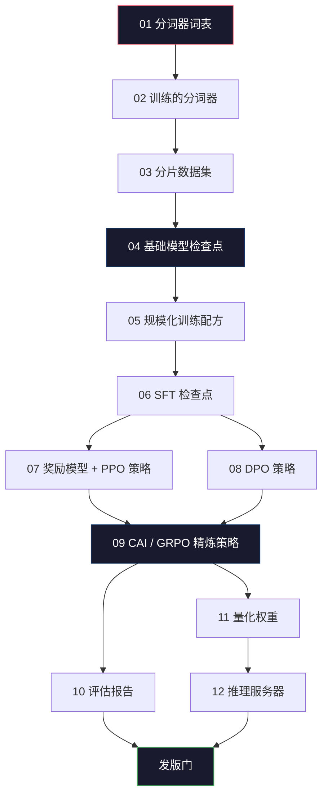
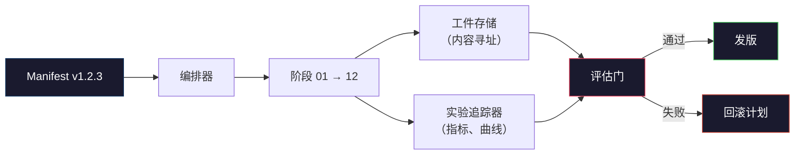

# 构建完整 LLM 流水线

> 课程 01 到 12 的一切是一个流水线的阶段。这节课是脚手架，将这些阶段变成单一端到端运行：分词、预训练、规模化、SFT、对齐、评估、量化、服务。你不会在笔记本电脑上训练 70B 模型。你会产出编排层、清单、评估门和回滚计划，2026 年前沿团队用它们决定什么可以发版。这是顶点项目。

**类型：** 构建
**语言：** Python（stdlib）
**先修内容：** 所有 Phase 10 课程 01-12
**学习时间：** 约 120 分钟

## 学习目标

- 将前 11 课（分词器、数据、预训练、规模化、SFT、RLHF、DPO、CAI、评估、量化、推理）组合成单一可重现流水线规格
- 定义阶段之间的工件契约：每个阶段消费什么、产生什么，下一阶段如何验证输入
- 构建编排器追踪实验、哈希工件，并根据评估阈值控制发版决策
- 设计回滚计划：哪些工件便宜可重跑、哪些昂贵、损坏的检查点代价是什么

## 问题所在

之前的课程每个都能工作。分词器训练了。小型 GPT 预训练了。SFT 数据集组装了。奖励模型训练了。DPO 运行了。评估测量了。量化权重导出了。推理服务器启动了。每个都是笔记本。每个都有自己的约定、自己的输出路径、自己的随机种子。

前沿训练运行不是笔记本。Llama 3 405B 在约 54 天内消耗了 3000 万 H100 小时。DeepSeek-V3 使用了约 280 万 H800 小时。在此期间，一个损坏的检查点、一次数据污染、一次评估回归可以让团队损失一周的墙上时间和一个月的 GPU 预算。团队存活的方式是流水线卫生：每个阶段有确定性输入、确定性输出、清单、哈希和门。

这是顶点项目。你不会在笔记本电脑上端到端运行流水线。你会编写协调阶段的编排器、描述运行的清单、控制发版决策的验证器，以及让第三方从单个文件重跑工作的重放计划。代码很小；纪律很大。

模式从 100M 到 1T 参数不变。相同的四个组件——清单、编排器、评估门、工件存储——运行 Llama 3 也运行你的 hobby GPT。区别是每个阶段配置内的数字大小，不是流水线的形状。

## 核心概念

### 十二个阶段

每个 Phase 10 课程是一个阶段。以下是完整依赖图。



阶段 07 和 08 可以并行运行。其他都是硬依赖。阶段 02（分词器）的变化使每个下游工件失效。阶段 10（评估）的变化仅使发版决策无效。

### 清单

清单是一个文件，完全描述运行足以重放它。流水线产生的任何东西都不应依赖清单中不存在状态。这些字段乏味但强制。

```
pipeline_version: 1.2.3
seed: 42
git_commit: a1b2c3d4
stages:
  01_tokenizer:
    recipe: bpe_32k
    input_hash: sha256:...
    output_hash: sha256:...
    wall_clock_sec: 3600
    cost_usd: 12
```

阶段 N 的输出哈希是阶段 N+1 的输入哈希。任何偏差流水线停止。这就是你尽早捕获数据损坏的方式。这也是不同大陆的队友验证他们重放产生与你相同工件的方式。

实践中团队使用小型 YAML 模式加清单检查器与之前成功运行 diff。任何预期字段（成本、墙上时钟）外的增量都是红旗。

### 工件类型

每个阶段的输出是类型化工件。不是目录 blob，不是 pickle，而是具有已知模式的有名称类型。

| 阶段 | 工件类型 | 关键字段 |
|-------|--------------|-----------|
| 01-02 | 分词器 | vocab.json, merges.txt, config.json, hash |
| 03 | 数据集 | shards[], row count, token count, dedup stats |
| 04-05 | 检查点 | weights.safetensors, config.json, optimizer state, step count |
| 06 | SFT 模型 | checkpoint + SFT recipe + data mix |
| 07 | 奖励模型 | RM checkpoint + preference data hash |
| 08-09 | 策略 | checkpoint + reference hash + beta + KL budget consumed |
| 10 | 评估报告 | benchmark scores + regression diffs + eval data hash |
| 11 | 量化模型 | quantized weights + calibration data + accuracy delta vs FP16 |
| 12 | 服务器规格 | endpoint + model hash + config + observability hooks |

类型化防止最常见的失败模式：用阶段 08 输出作为阶段 06 输入，通过 SFT 路径发版 DPO 训练模型。类型化工件和类型化阶段签名使这些错误成为编译时失败，而非第五天的失败。

### 评估门

发版不是"训练完成"。发版是"训练完成且评估门通过"。门在运行开始前定义。

```
gates:
  mmlu:      >= baseline + 0.5   # 无回归
  humaneval: >= baseline + 1.0
  truthfulqa: >= baseline         # 无下降
  safety_refusal_rate: <= 0.05
  kl_from_reference: <= 25.0
  cost_total_usd: <= 50000
```

每个门都是数字阈值。无"看起来不错"门。无主观签收。如果每个门都通过，工件被标记为可发版。如果任何门失败，运行被搁置等待命名审查员的明确覆盖，自身记录在清单中。

两个门捕获大多数灾难。*回归*门（新模型必须在核心基准上至少与之前一样好）捕获训练 bug。*KL 预算*门（对齐策略不得偏离其参考超过 X）捕获对齐过度烹饪。每个生产流水线都有这两个。

### 编排器

一段小代码，读取清单、分派阶段、追踪工件并在任何契约违规时停止。不是 Airflow。不是 Kubeflow。对于流水线卫生，你需要你自己写的无聊的东西。

编排器的工作很窄：

1. 从清单解析 DAG。
2. 对于每个阶段，检查预期输出是否已存在于正确哈希（如果是则跳过）。
3. 运行阶段，捕获 stdout/stderr，测量墙上时钟和成本。
4. 验证输出哈希与下游阶段的预期输入哈希。
5. 失败时，写入带有精确失败阶段的局部清单并以非零退出。

那是 200 行 Python。它看起来像这节课 `code/main.py` 中的文件。在底层，真实流水线使用 `torchrun` 或 `ray` 在集群上执行各个阶段，但编排器本身在单个盒子上运行。

### 实验追踪和工件存储

两个外部系统锚定流水线。

**实验追踪器（wandb、neptune、mlflow）。** 记录每个阶段的 loss 曲线、评估指标、系统遥测。追踪器是你三周后需要比较运行 A 与运行 B 时去的地方。团队几乎总是使用托管追踪器——写你自己的会失去应该花在训练上的时间。

**工件存储（S3、R2、GCS）。** 用于检查点、数据集、分词器、评估报告的不可变对象存储。工件按哈希寻址，而非文件名。像 `latest.pt` 这样的文件名是隐患；`ckpt-7b-step-20000-sha256:abc123.safetensors` 是契约。

编排器写入两者。追踪器供查看图表的人类使用。工件存储供下一阶段查找输入使用。

### 成本

前沿运行附有美元数字。预算纪律发生在两个地方。

**运行前估算。** 从清单计算预期 FLOPs（预训练：6 × params × tokens）、预期 GPU 小时（FLOPs / 峰值吞吐量 / 利用率）以及按当前租赁率的美元成本。如果估算超过预算门，流水线拒绝启动。

**运行中追踪。** 每个阶段的墙上时钟和成本记录到清单。每阶段后检查剩余预算。如果阶段超支，下一阶段门用新的剩余预算评估。你不会在 VC 来电话时才发现没钱了。

Llama 3 报告成本 6100 万美元。DeepSeek-V3 报告主预训练运行 560 万美元。比率主要是硬件效率加混合专家——但具体成本是可见的，因为两队都按阶段追踪，而非按运行。

### 可重现性 vs 确定性

这些不一样。*可重现*意味着相同清单加相同代码加相同基础设施产生具有等效下游指标的检查点。*确定性*意味着位级相同的输出。

现代 LLM 训练可重现但不确定。分布式训练的 reduce 顺序、GPU 内核不确定性（cuBLAS、flash-attn）和混合精度舍入组合产生在运行之间以 1e-5 级别不同的浮点数。这对最终指标没问题，它们不动。但对用位级 diff 调试是致命的。治愈方法是记录每个阶段的输入哈希、输出哈希和头条指标——如果这些匹配，运行就是"重现的"，即使权重不是位级相同。



### 回滚计划

在运行开始前，写下每个阶段失败时会发生什么。三类。

- **便宜可重跑**（小时）：分词器、评估、量化、推理服务器。重跑就是。
- **中等**（天）：SFT、DPO、CAI。保留基础模型；仅重跑对齐阶段。
- **昂贵**（周和数百万美元）：预训练。这里的回滚计划不是"重跑"。而是"使用最后一个好检查点，用修订数据重跑下游便宜阶段"。

因为阶段依赖是类型化和哈希的，编排器可以自动计算回滚集：使失败阶段加每个后代失效。阶段 06（SFT）失败使 06、07、08、09、10、11、12 失效。阶段 11（量化）仅使 11 和 12 失效。提前命名这个避免团队凌晨 4 点精疲力竭时临时凑合。

### 2026 年观察到的生产配方

大多数前沿团队收敛到相同骨架。

- 分词器：128k BPE 带字节回退。在小的、平衡的多语言切片上训练。
- 预训练：10-20T Token，主要是网络加代码加合成。Muon 或 AdamW 优化器。FSDP2 或 DeepSpeed ZeRO-3。梯度检查点。BF16 权重，FP32 主。
- SFT：500k-2M 指令对，混合人工和合成，严格去重针对评估集。
- 对齐：DPO 或 CAI + GRPO。仅在偏好信号对 DPO 太复杂多维度时使用 RLHF。
- 评估：MMLU-Pro、MATH、HumanEval+、GPQA、SWE-Bench Verified、LiveBench，加上公众永远不会看到的私人保留集。
- 量化：GPTQ 或 AWQ 4 位用于服务，8 位用于精度差异重要的安全评估。
- 服务：vLLM、TensorRT-LLM 或内部。连续批处理。推测解码。KV 缓存驱逐。

数字每六个月变化一次。骨架不变。

## 构建

这节课的代码是编排器和清单检查器，不是十二个训练脚本。每个阶段用占位符模拟，生成具有正确形状和哈希的输出工件。端到端运行编排器证明流水线管道工作正常，在燃烧 GPU 金钱在真实阶段之前。

见 `code/main.py` 获取完整实现。关键部分：

- `Manifest` 数据类：流水线版本、种子、git 提交、阶段、门。
- `Stage` 数据类：名称、类型、输入（哈希）、输出（哈希）、墙上时钟、成本。
- `Orchestrator.run()`：解析 DAG、分派阶段、验证哈希、更新清单。
- `EvalGate.check()`：读取阈值、比较最新评估报告、返回通过/失败。
- `ArtifactStore`（内存存根）：按哈希 put/get，模拟 S3。
- `CostTracker`：每阶段和累计，在超支时停止。

`main.py` 中的流水线运行十二个占位符阶段，生成清单，并练习失败的评估门以展示搁置运行的样子。将每个占位符替换为对应课程的真实训练脚本，你就有了真实前沿流水线使用的骨架。

## 使用

规范工作流有三个命令。

```
python code/main.py plan    # 验证清单，计算成本估算，打印 DAG
python code/main.py run     # 执行阶段，写入 manifest.out.yaml
python code/main.py gate    # 读取 manifest.out.yaml，应用评估门，发版或搁置
```

每次先运行 `plan`。大多数流水线 bug 在 plan 时出现——缺失的门阈值、过时哈希、预算超支。运行 `plan` 是免费的。运行 `run` 是昂贵的。在便宜的一侧捕获 bug 省钱。

`gate` 的输出是 `SHIP` 或 `HOLD: <reason>`。搁置运行不是失败；是决策点。命名审查员要么覆盖（覆盖被记录），要么批准回滚。

## 发货

这节课产出 `outputs/skill-llm-pipeline-reviewer.md`。输入你提出的流水线清单，它检查所有契约：阶段类型、哈希链、门、回滚计划、成本估算。它拒绝批准缺少评估门、无界 KL 预算或混合评估和训练数据的清单。

## 练习

1. 扩展编排器以支持阶段 07 和 08 的并行执行。使用 stdlib `concurrent.futures` 模块。确认最终清单记录两个阶段的输出，且阶段 09 的输入哈希是两个输出的确定性组合。

2. 添加"污染检查"门。给定评估数据集哈希和训练数据集分片，计算重叠（精确字符串匹配或 13-gram 匹配）。如果重叠超过 0.1% 门失败。用污染训练集喂入并确认门搁置运行。

3. 从第一性原理实现成本估算器。对于阶段 04（预训练），估算 FLOPs 为 6 × params × tokens，假设 H100 上 40% MFU（模型 FLOPs 利用率）at 989 TFLOPs BF16，成本 $2.50/GPU 小时。报告 2T Token 上训练的 7B 模型估算。与已发布 Llama 2 数字比较。

4. 构建部分回滚。模拟阶段 09（CAI）失败，然后重跑阶段 09-12 同时保留 01-08 缓存。编排器应通过哈希检测缓存工件并跳过它们。测量与完全重跑相比节省的墙上时钟。

5. 添加可观测性。为每个阶段发出 OpenTelemetry 跨度，属性包括 params、seen tokens、loss 和 cost。将跨度传送到本地收集器。要点不是仪表板；要点是每个阶段的健康状况可从单个追踪 ID 追溯。

## 关键术语

| 术语 | 人们怎么说 | 实际含义 |
|------|----------------|----------------------|
| 清单 | "配方文件" | YAML 或 JSON 描述流水线版本、种子、每阶段配置和门阈值——足以重放运行 |
| 内容寻址 | "按哈希而非名称" | 按内容 SHA-256 存储工件，所以你永远不会混淆版本 A 与版本 B |
| 评估门 | "发版标准" | 基准指标和安全分数上的数字阈值，必须在工件被标记为可发版前通过 |
| KL 预算 | "对齐漂移多远" | 对齐阶段累积的 KL(policy || reference) 上限，作为门强制执行 |
| MFU | "你用了多少 GPU" | 模型 FLOPs 利用率——实现 FLOPs 除以理论峰值。70B 规模约 40%，7B 约 55% |
| 回滚计划 | "坏了我们做什么" | 每个阶段失败时的预写操作集：重跑、回退、用修订输入重新训练 |
| 编排器 | "指挥者" | 读取清单、分派阶段、验证哈希、在任何契约违规时停止的过程 |
| 工件存储 | "权重版本化 S3" | 不可变内容寻址对象存储——检查点、数据集、评估报告的唯一真实来源 |
| 可重现 | "重放时相同指标" | 位级不同权重但等效下游指标——分布式 LLM 训练的现实目标 |
| 成本门 | "你不能超过 X" | 运行前成本估算加运行中追踪器——如果估算超过预算流水线拒绝启动 |

## 延伸阅读

- [Dubey et al., 2024 -- "The Llama 3 Herd of Models"](https://arxiv.org/abs/2407.21783) -- 最详细的公开前沿流水线描述，包括数据、训练、对齐、评估
- [DeepSeek-AI, 2024 -- "DeepSeek-V3 Technical Report"](https://arxiv.org/abs/2412.19437) -- 约 Llama 3 类训练成本 1/10 的效率优先流水线
- [Kaplan et al., 2020 -- "Scaling Laws for Neural Language Models"](https://arxiv.org/abs/2001.08361) -- 原始计算-数据-参数缩放关系
- [Hoffmann et al., 2022 -- "Training Compute-Optimal Large Language Models (Chinchilla)"](https://arxiv.org/abs/2203.15556) -- 对 Kaplan 的修正，重校准现代数据预算
- [PyTorch FSDP2 documentation](https://pytorch.org/docs/stable/fsdp.html) -- 在 PyTorch 2.4+ 中替换 FSDP1 的分布式训练原语
- [Weights & Biases LLM Reports](https://wandb.ai/site/llms) -- 开源 LLM 运行的真实清单和实验追踪器输出，可用作可抄袭模板