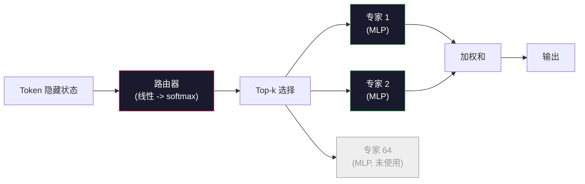

# 开源模型：架构详解

> 你在课程 04 从零写了 GPT-2 Small。2026 年的前沿开源模型是同一个家族，只有五六个具体变化。RMSNorm 替代 LayerNorm。SwiGLU 替代 GELU。RoPE 替代学习位置。GQA 或 MLA 替代完整 MHA。大规模混合专家。你已知的数学覆盖了其中 95%。这节课将 Llama 3、DeepSeek-V3、Mixtral、Qwen 和 Gemma 并排阅读，指出每个架构分叉的确切行。

**类型：** 学习
**语言：** Python（stdlib）
**先修内容：** Phase 10，课程 04、05、12（预训练、规模化、推理）
**学习时间：** 约 45 分钟

## 学习目标

- 阅读 Llama 3、Mistral、Mixtral、Gemma 2、Qwen 2.5 和 DeepSeek-V3 的 config.json 并解释每个字段
- 命名每个模型相对 GPT-2 Small 的具体架构变化并从第一性原理解释它
- 仅从 config 计算任何开源模型的参数量、KV 缓存大小和激活内存
- 根据延迟、内存和能力约束为部署目标选择正确的开源模型

## 问题所在

你在课程 04 写了 350 行 numpy，有了一个 GPT-2 形状的模型。Llama 3 405B 有一份 200 页的技术报告。你的本能是觉得它们是不同的野兽。其实不是。200 页描述的是同一个对象，加了五六个有充分动机的修改，加上一千个关于规模化的实现细节。骨架——嵌入、Transformer 块、注意力、MLP、norm、头——不变。

这节课是一个 diff。对于每个主要开源模型家族，我们列出相对 GPT-2 的确切变化、为什么变化以及代价是什么。当你完成后，你可以读一份新模型卡并将其心理映射回 GPT-2 基线。

实际收益是当 Meta 发布 Llama 5 或 DeepSeek 发布 V4 时，你不需要新的心理模型。你看配置，看到哪些知名旋钮移动了，就知道下游影响是什么。2026 年架构是一个有限工具箱。每个新模型选择不同子集。

## 核心概念

### 不变核心

所有自回归开源模型共享：

- Token 嵌入矩阵（vocab_size × hidden_dim）。
- N 个解码器块堆叠：norm、自注意力、残差、norm、MLP、残差。
- 最终 norm 和投影到 vocab_size 的线性头（通常与嵌入权重共享）。
- 因果掩码，下一个 Token 交叉熵损失。

那是形状。其余都是旋钮。

### 实际移动的六个旋钮

在每个 2024-2026 前沿开源模型上，相同的六个设计选择被反复挑选：

1. **归一化。** LayerNorm → RMSNorm。
2. **位置编码。** 学习绝对 → RoPE（加变体：YaRN、NTK）。
3. **激活。** GELU → SwiGLU（或 GeGLU）。
4. **注意力头共享。** MHA → GQA → MQA → MLA。
5. **密集 vs 稀疏 MLP。** 密集 → 混合专家。
6. **Pre-norm 放置。** Pre-norm 保留。Post-norm 消失。

其他一切（学习率调度、数据混合、批次大小、上下文长度）在训练配置中，不在架构中。六个旋钮。

### 旋钮 1：RMSNorm

LayerNorm 减去均值，除以标准差，缩放并偏移。RMSNorm 只保留缩放：

```
RMSNorm(x) = x / sqrt(mean(x^2) + eps) * gamma
```

无均值减去。无偏置。每 Token 少一个 matmul。Zhang 和 Sennrich（2019）认为它在机器翻译上匹配 LayerNorm，同时快 10%。每个现代开源模型都运行它。

代价：无。收益：小吞吐量赢，代码更简单。

### 旋钮 2：RoPE

GPT-2 中的学习位置嵌入是 1024 槽查找表。上下文 1025 超出表尾。模型无法外推到训练长度之外。

旋转位置嵌入（RoPE，Su et al. 2021）通过在注意力点积前旋转每对 Q 和 K 向量来注入位置。旋转角度是位置的确定性函数，所以没有要学习的东西，也没有要超出跑的东西。通过缩放技巧（NTK 感知插值、YaRN），在 8k 上下文上训练的模型可以在推理时扩展到 128k，精度损失适中。

```
q_rotated = rotate(q, angle(pos))
k_rotated = rotate(k, angle(pos))
score = q_rotated . k_rotated
```

每个 Llama、Mistral、Qwen、DeepSeek 和 Gemma 都使用 RoPE。Gemma 2 使用混合（大多数层 RoPE，其他层局部滑动窗口注意力）。

### 旋钮 3：SwiGLU

GPT-2 的 MLP 是 `x -> gelu(xW1 + b1) -> (...)W2 + b2`。SwiGLU（Shazeer 2020）用门控乘积替换激活：

```
SwiGLU(x) = (xW1) * sigmoid(xW1) * xV
```

两个并行投影而非一个，由 Swish 激活门控。经验上每参数困惑度更强。Llama 2 采用了它，大家跟进。MLP 的隐藏大小通常设置使总参数量匹配原始密集 MLP：如果 GPT-2 使用 `ff_dim = 4 * hidden`，SwiGLU 使用 `ff_dim = (2/3) * 4 * hidden = 8/3 * hidden`。

### 旋钮 4：注意力头共享

GPT-2 使用**多头注意力（MHA）**：每个头有自己的 Q、K、V 投影。

**多查询注意力（MQA，Shazeer 2019）** 在所有头上共享一个 K 和一个 V。将 KV 缓存削减 num_heads，这在典型模型上是 12x 到 32x 减少。精度在困难基准上略有下降。

**分组查询注意力（GQA，Ainslie et al. 2023）** 是中间地带：G 组 Q 头共享一个 K 和一个 V。Llama 3 8B 使用 GQA，32 个 Q 头和 8 个 KV 头（G=8），所以 KV 缓存相对完整 MHA 缩小 4 倍。

**多头潜在注意力（MLA，DeepSeek 2024）** 将 K 和 V 压缩到共享低秩潜在，在每头解压。在保持每头表达能力的同时进一步减少 KV 缓存。DeepSeek-V2 和 V3 依赖它来实现长上下文性能。

| 方案 | KV 头数 | KV 缓存 | 精度 |
|--------|----------|----------|----------|
| MHA    | num_heads | 完整 | 最好 |
| GQA    | num_groups (G < num_heads) | num_heads / G 减少 | 接近 MHA |
| MQA    | 1 | num_heads 减少 | 小损失 |
| MLA    | 潜在，每头解压 | 比 MQA 更小 | 接近 MHA |

对于任何 ~13B 参数以上的模型，GQA 或 MLA 实际上是强制的。规模上的完整 MHA 是 KV 缓存灾难。

### 旋钮 5：混合专家

密集 MLP 为每个 Token 激活所有参数。MoE MLP 每个块有 K 个专家，路由器为每个 Token 选择 top-k 专家（通常 top-2）。只有那些专家的权重对该 Token 看到前向传播。

```
router_logits = xW_r
indices, weights = top_k(router_logits, k=2)
output = sum_i weights[i] * expert[indices[i]](x)
```

吸引力：你可以有 64 个各 7B 大小的专家（所以总参数量巨大），同时每个 Token 只运行其中 2 个（所以每 Token 计算匹配密集 7B 模型）。Mixtral 8x7B 总参数 47B 但每个 Token 只激活 13B。DeepSeek-V3 总参数 671B 但每个 Token 只激活 37B。



优点：相同计算，更多参数，更好容量。缺点：专家内存仍然需要在某处（所以服务需要比密集等价物更多 VRAM），路由器负载均衡困难，对齐期间微调路由器本身就是研究领域。

### 旋钮 6：Pre-norm 保留

原始 transformer 在每个子层后应用层归一化。自 GPT-2 以来每个开源模型将其放在*前*每个子层。Pre-norm 在深度上严格更容易训练。没什么可争辩的。

### 模型逐模型 Diff

这是使所有这些具体的表格。

| 模型 | 年份 | 总参数 | 激活参数 | 归一化 | 激活 | 位置 | 注意力 | MoE | 上下文 |
|-------|------|-------------|---------------|------|-----------|----------|-----------|-----|---------|
| GPT-2 Small | 2019 | 124M | 124M | LayerNorm | GELU | 学习 | MHA (12 头) | 无 | 1k |
| Llama 3 8B | 2024 | 8B | 8B | RMSNorm | SwiGLU | RoPE | GQA (32/8) | 无 | 128k |
| Llama 3 70B | 2024 | 70B | 70B | RMSNorm | SwiGLU | RoPE | GQA (64/8) | 无 | 128k |
| Llama 3 405B | 2024 | 405B | 405B | RMSNorm | SwiGLU | RoPE | GQA (128/16) | 无 | 128k |
| Mistral 7B | 2023 | 7.2B | 7.2B | RMSNorm | SwiGLU | RoPE | GQA | 无 | 32k |
| Mixtral 8x7B | 2023 | 47B | 13B | RMSNorm | SwiGLU | RoPE | GQA | 是 (8 专家, top-2) | 32k |
| Gemma 2 9B | 2024 | 9B | 9B | RMSNorm (pre+post) | GeGLU | RoPE + 滑动 | GQA | 无 | 8k |
| Qwen 2.5 72B | 2024 | 72B | 72B | RMSNorm | SwiGLU | RoPE (YaRN) | GQA (64/8) | 无 | 128k |
| DeepSeek V2 236B | 2024 | 236B | 21B | RMSNorm | SwiGLU | RoPE | MLA | 是 (160 专家, top-6) | 128k |
| DeepSeek V3 | 2024 | 671B | 37B | RMSNorm | SwiGLU | RoPE | MLA | 是 (256 专家, top-8) | 128k |

扫描列。RMSNorm 是通用的。SwiGLU 或其 GeGLU 表亲是通用的。RoPE 是通用的。GQA 在 7B 以上是通用的，MLA 替代时除外。MoE 是顶端差异化因素。

### 阅读 config.json

Llama 3 8B 配置：

```
{
  "hidden_size": 4096,
  "intermediate_size": 14336,
  "num_hidden_layers": 32,
  "num_attention_heads": 32,
  "num_key_value_heads": 8,
  "max_position_embeddings": 131072,
  "rope_theta": 500000.0,
  "rms_norm_eps": 1e-5,
  "vocab_size": 128256
}
```

每个字段对应你已实现的东西。

- `hidden_size`：嵌入维度。
- `intermediate_size`：MLP 隐藏大小（3.5x hidden——SwiGLU 数学）。
- `num_hidden_layers`：堆叠深度。
- `num_attention_heads`：Q 头。
- `num_key_value_heads`：KV 头（GQA）。
- `max_position_embeddings`：训练上下文长度。
- `rope_theta`：RoPE 基频。Meta 从默认 10k 缩放到 500k 用于长上下文外推。
- `rms_norm_eps`：数值稳定性。
- `vocab_size`：Token 数。

仅凭这些你就可以计算总参数、KV 缓存和峰值激活内存。见 `code/main.py` 获取确切公式。

### 激活内存预算

在数十亿参数以上，激活主导训练内存。预训练（带梯度检查点）的经验法则：

```
activation_mem ~ batch_size * seq_len * hidden_size * num_layers * bytes_per_element
```

对于 Llama 3 8B 在 batch 1，seq 8192，BF16，32 层，hidden 4096：仅激活值约 8 GB（带检查点），无检查点 40 GB。这就是 FlashAttention 和 Ring-Attention 重要的原因——它们重写注意力计算使激活值放得下。

### KV 缓存预算

在最大上下文推理时：

```
kv_cache = 2 * num_layers * num_kv_heads * head_dim * max_seq_len * bytes_per_element
```

Llama 3 8B 在 128k 上下文，BF16，head_dim = hidden / num_heads = 128：
`2 * 32 * 8 * 128 * 131072 * 2 = 17.2 GB` 每序列。

8B 权重在 BF16 是 16 GB。单条 128k 序列的 KV 缓存比权重还大。这就是推动 GQA、MLA 和 KV 缓存量化研究的内存压力。

### 何时哪个模型胜出

- **单块 80GB GPU，无 MoE**：Llama 3 8B、Mistral 7B、Gemma 2 9B。易服务，工具宽。
- **单节点（8x80GB），大容量**：Llama 3 70B、Qwen 2.5 72B。最高密集开源能力。
- **最大开源能力，接受 MoE 复杂性**：DeepSeek V3、Mixtral 8x22B。每激活 FLOP 最佳能力。
- **长上下文需求**：Llama 3（RoPE 缩放 128k）、DeepSeek（MLA 优势）。
- **低延迟服务**：Gemma 2 9B（滑动窗口削减长上下文计算）。

## 构建

这节课的代码是一个计算器。给定任何 config.json，它打印每组件参数量、最大上下文 KV 缓存、SwiGLU MLP 比率，以及架构简短判定（密集 / GQA / MLA / MoE）。

```python
config = {
    "hidden_size": 4096, "intermediate_size": 14336,
    "num_hidden_layers": 32, "num_attention_heads": 32,
    "num_key_value_heads": 8, "vocab_size": 128256,
    "max_position_embeddings": 131072,
}
```

脚本逐字段走架构，计算嵌入、注意力（带 GQA 减少）、MLP（带 SwiGLU 扩展）、layernorms 和头的参数量。然后计算在所述上下文长度上的 KV 缓存并打印摘要。

见 `code/main.py` 获取实现。

## 使用

在脚本捆绑的 Llama 3 8B、Mistral 7B、Mixtral 8x7B 和 DeepSeek V3 配置上运行计算器。比较参数分解。注意 MoE 模型总参数量超过密集模型但激活参数量通常更小。注意 DeepSeek V3 的 KV 缓存比 Llama 3 405B 更小，尽管总参数更多——那是 MLA 在起作用。

然后在你本地的任何模型上插入配置，读摘要，决定它是否适合你的 GPU。

## 发货

这节课产出 `outputs/skill-open-model-picker.md`。给定部署目标（GPU 类型、VRAM、上下文长度、延迟预算）和任务画像（聊天、代码、推理、长上下文），它推荐一个开源模型、来自课程 11 的量化方案和来自课程 12 的推理栈，明确推理关于六个架构旋钮。

## 练习

1. 从 HuggingFace 阅读 Qwen 2.5 72B 配置。从头计算总参数。与 HF 报告值比较并识别任何差异来源（头维度舍入、KV 共享因子等）。

2. DeepSeek V3 使用 256 个专家 top-8 路由。计算激活专家与总专家的比率并与 Mixtral 8x7B 的 top-2 of 8 比较。从稀疏（25%）到更密集稀疏（3%）的转变对每 FLOP 容量意味着什么？

3. 在 FP8 和 BF16 上计算 Llama 3 405B 在 128k 上下的 KV 缓存。FP8 是一半 BF16 数字。在单块 8xH100 节点（各 80GB = 总计 640GB，减权重内存）上你能服务多少并行序列？

4. Gemma 2 交替全注意力和滑动窗口注意力层。写当一半层使用 4096 Token 滑动窗口而非完整上下文时 KV 缓存的数学。在 8k 总上下文下这节省了多少内存？

5. 找一个在这节课编写后发布的近期前沿开源模型。识别它选择了六个旋钮中的哪些，以及它是否引入了第七个旋钮。课程在新型架构发布时会感觉过时——目标是更新你的表格而不重建你的心理模型。

## 关键术语

| 术语 | 人们怎么说 | 实际含义 |
|------|----------------|----------------------|
| RMSNorm | "不带均值的 LayerNorm" | 仅用均方根归一化，加学习缩放——比 LayerNorm 更便宜且相当 |
| RoPE | "旋转位置" | 以取决于位置的 2D 对旋转每个 Q 和 K 向量——通过缩放技巧外推到训练长度之外 |
| SwiGLU | "新 MLP 激活" | 带 Swish 的门控线性单元：`(xW1) * sigmoid(xW1) * xV`——每个 2024+ 开源模型的标准 |
| GQA | "中间注意力" | 分组查询注意力：G 组 Q 头共享一个 K 和一个 V 头——在不牺牲 MQA 精度的情况下缩小 KV 缓存 |
| MLA | "DeepSeek 的注意力" | 多头潜在注意力：将 K/V 压缩到共享低秩潜在，每头解压——大模型最小 KV 缓存 |
| MoE | "稀疏专家" | 混合专家：每块 N 个 MLP，路由器为每个 Token 选择 top-k——巨大总参数，小激活参数 |
| Top-k 路由 | "每个 Token 选择 k 个专家" | 路由器计算每个专家的分数并激活最高的 k 个——典型 k 是 2（Mixtral）到 8（DeepSeek） |
| YaRN | "拉伸 RoPE" | 又一个 RoPE 扩展——在推理时将旋转角度插值从 8k 扩展到 128k+ |
| 滑动窗口注意力 | "不关注所有内容" | 每个 Token 只关注最后 W 个 Token——将每 Token 注意力成本上限设为 O(W)，用于 Gemma 2 和早期 Mistral |
| 激活参数 | "每个 Token 运行什么 | 对于 MoE 模型，每个 Token 前向传播看到的参数量（远小于总参数）——管理每 Token FLOPs |

## 延伸阅读

- [Dubey et al., 2024 -- "The Llama 3 Herd of Models"](https://arxiv.org/abs/2407.21783) -- 密集 Llama 3 家族的架构和训练参考
- [DeepSeek-AI, 2024 -- "DeepSeek-V3 Technical Report"](https://arxiv.org/abs/2412.19437) -- MLA 加无辅助损失负载均衡加 671B MoE
- [Jiang et al., 2024 -- "Mixtral of Experts"](https://arxiv.org/abs/2401.04088) -- 规范 MoE 开源模型论文
- [Su et al., 2021 -- "RoFormer: Enhanced Transformer with Rotary Position Embedding"](https://arxiv.org/abs/2104.09864) -- RoPE 论文
- [Shazeer, 2020 -- "GLU Variants Improve Transformer"](https://arxiv.org/abs/2002.05202) -- SwiGLU、GeGLU 及同类
- [Ainslie et al., 2023 -- "GQA: Training Generalized Multi-Query Transformer Models"](https://arxiv.org/abs/2305.13245) -- GQA 论文
- [Gemma 2 Team, 2024 -- "Gemma 2: Improving Open Language Models at a Practical Size"](https://arxiv.org/abs/2408.00118) -- 混合全+滑动注意力、pre+post-norm
- [Qwen Team, 2024 -- "Qwen 2.5 Technical Report"](https://arxiv.org/abs/2412.15115) -- YaRN 上下文扩展和长上下文训练配方