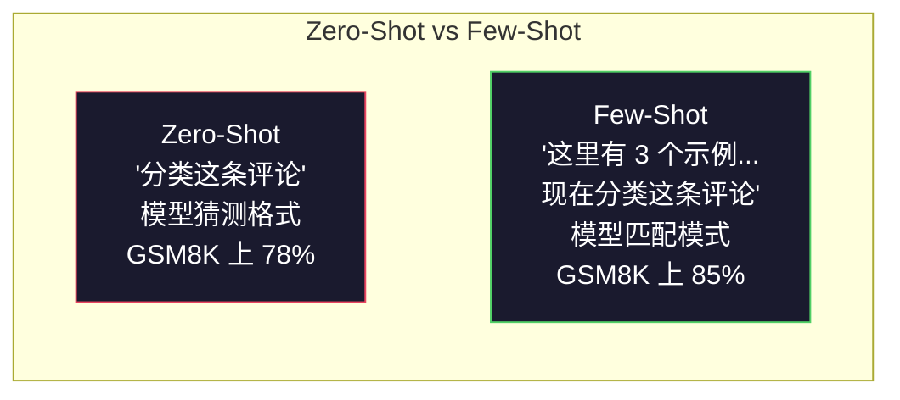
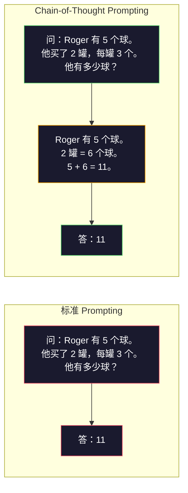
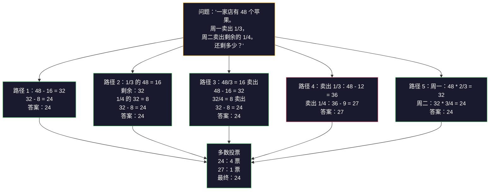
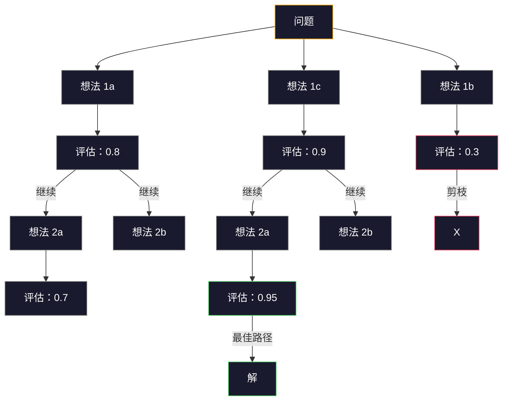

# Few-Shot, Chain-of-Thought, Tree-of-Thought

> 告诉模型做什么是 prompting。展示如何思考是 engineering。在同一模型、同一任务、同一数据上，78% 和 91% 准确率之间的差距不是更好的模型，而是更好的推理策略。

**类型:** 构建
**语言:** Python
**前置知识:** Phase 11 · 01（Prompt Engineering）
**时间:** 约 45 分钟

## 学习目标

- 通过选择和格式化最大化任务准确性的示例演示来实现 few-shot prompting
- 应用 chain-of-thought（CoT）推理来提高数学应用题等多步问题的准确性
- 构建一个探索多个推理路径并选择最佳路径的 tree-of-thought prompt
- 在标准基准上测量 zero-shot vs few-shot vs CoT 的准确性改进

## 问题

你构建了一个数学辅导应用。你的 prompt 说："解这道应用题。" GPT-5 在 GSM8K（标准小学数学基准）上正确率 94%。你以为已经到顶了，其实没有——chain-of-thought 仍然能提升 3-4 分。

加五个字——"让我们逐步思考"——准确率跳到 91%。加几个有解答过程的示例，达到 95%。同一模型，同一温度，同一 API 成本。唯一的区别是你给了模型一张草稿纸。

这不是黑科技，是推理的工作原理。人类不会在一跃中解决多步问题。Transformer 也不会。当你强制模型生成中间 token 时，那些 token 成为下一个 token 的上下文。每个推理步骤喂给下一个。模型literally算出了答案。

但"逐步思考"只是开始，不是结束。如果你采样五个推理路径然后取多数票呢？如果你让模型探索一棵树的可能性，评估和剪枝分支呢？如果你将推理与工具使用交织呢？这些不是假设。它们是已发表的、有测量改进的技术，你将在本课中构建所有这些。

## 概念

### Zero-Shot vs Few-Shot：示例何时胜出指令

Zero-shot prompting 给模型一个任务然后什么都不给。Few-shot prompting 先给示例。

Wei et al. (2022) 在 8 个基准上测量了这个。对于简单任务如情感分类，zero-shot 和 few-shot 性能相差在 2% 以内。对于复杂任务如多步算术和符号推理，few-shot 将准确性提高了 10-25%。

直觉：示例是压缩的指令。不要描述输出格式，你展示它。不要解释推理过程，你演示它。模型在示例上进行 pattern-match 比解释抽象指令更可靠。



**few-shot 胜出的时机：** 格式敏感任务、分类、结构化提取、领域特定术语、任何模型需要匹配特定模式的任务。

**zero-shot 胜出的时机：** 简单事实问题、示例约束创造力的创意任务、找到好示例比写好指令更难的任务。

### 示例选择：相似胜过随机

并非所有示例都相等。选择与目标输入相似的示例在分类任务上比随机选择优 5-15%（Liu et al., 2022）。三个原则：

1. **语义相似性**：在嵌入空间中选与输入最近的示例
2. **标签多样性**：在示例中覆盖所有输出类别
3. **难度匹配**：匹配目标问题的复杂程度

大多数任务的最佳示例数量是 3-5。低于 3，模型没有足够信号提取模式。高于 5，收益递减并浪费 context window token。对于多标签分类，每个标签用一个示例。

### Chain-of-Thought：给模型草稿纸

Chain-of-Thought（CoT）prompting 由 Google Brain 的 Wei et al. (2022) 引入。思想很简单：不要只问模型答案，先让它展示推理步骤。



为什么这在机制上有效？transformer 生成的每个 token 成为下一个 token 的上下文。没有 CoT，模型必须将所有推理压缩到单次前向传播的隐藏状态。有了 CoT，模型将中间计算外部化为 token。每个推理 token 延伸有效计算深度。

**GSM8K 基准（小学数学，8500 道题）：**

| 模型 | Zero-Shot | Zero-Shot CoT | Few-Shot CoT |
|-------|-----------|---------------|--------------|
| GPT-4o | 78% | 91% | 95% |
| GPT-5 | 94% | 97% | 98% |
| o4-mini (reasoning) | 97% | — | — |
| Claude Opus 4.7 | 93% | 97% | 98% |
| Gemini 3 Pro | 92% | 96% | 98% |
| Llama 4 70B | 80% | 89% | 94% |
| DeepSeek-V3.1 | 89% | 94% | 96% |

**关于推理模型的说明。** 像 OpenAI 的 o 系列（o3、o4-mini）和 DeepSeek-R1 这样的模型在发出答案之前内部运行 chain-of-thought。在推理模型上添加"Let's think step by step"是多余的，有时适得其反——它们已经做到了。

两种 CoT：

**Zero-shot CoT**：在 prompt 后附加"让我们逐步思考"。不需要示例。Kojima et al. (2022) 证明这单句话在算术、常识和符号推理任务上提高了准确性。

**Few-shot CoT**：提供包含推理步骤的示例。比 zero-shot CoT 更有效，因为模型能看到你期望的确切推理格式。

**CoT 有害的时机：** 简单事实回忆（"法国首都是哪里？"）、单步分类、速度比准确性更重要的任务。CoT 每个查询增加 50-200 token 的推理开销。对于高吞吐、低复杂度的任务，这是浪费的成本。

### Self-Consistency：采样多个，投票一次

Wang et al. (2023) 引入了 self-consistency。洞察：单个 CoT 路径可能包含推理错误。但如果你用 temperature > 0 采样 N 个独立推理路径并在最终答案上取多数票，错误会抵消。



Self-consistency 将原始 PaLM 540B 实验中 GSM8K 准确性从 56.5%（单 CoT）提高到 74.4%（N=40）。在 GPT-5 上改进很小（97% 到 98%），因为基础准确性已经饱和。这项技术在基础 CoT 准确性 60-85% 的模型上表现最好——这是单路径错误频繁但不系统的最佳点。对于推理模型（o 系列、R1），self-consistency 被内置的内部采样吸收。

权衡：N 个样本意味着 N 倍 API 成本和延迟。实际上，N=5 捕获大部分收益。N=3 是有意义投票的最小值。N > 10 对大多数任务收益递减。

### Tree-of-Thought：分支探索

Yao et al. (2023) 引入了 Tree-of-Thought（ToT）。CoT 遵循一个线性推理路径，ToT 探索多个分支并在继续之前评估哪些最有前景。



ToT 有三个组成部分：

1. **想法生成**：产生多个候选下一步
2. **状态评估**：对每个候选评分（可以用 LLM 本身作为评估器）
3. **搜索算法**：通过树进行 BFS 或 DFS，剪枝低分分支

在 Game of 24 任务（用算术组合 4 个数字得 24）上，GPT-4 标准 prompting 解决 7.3% 的问题。用 CoT，4.0%（CoT 在这里实际上有害，因为搜索空间宽）。用 ToT，74%。

ToT 很贵。树中每个节点需要一次 LLM 调用。分支因子 3、深度 3 的树最多需要 39 次 LLM 调用。只在搜索空间大但可评估的问题上使用——规划、谜题解决、有限制的创意问题解决。

### ReAct：思考 + 行动

Yao et al. (2022) 将推理轨迹与动作结合。模型在思考（生成推理）和行动（调用工具、搜索、计算）之间交替。


ReAct 在知识密集型任务上优于纯 CoT，因为它可以将其推理扎根于真实数据。在 HotpotQA（多跳问答）上，ReAct 加 GPT-4 达到 35.1% exact match，而 CoT 单独只有 29.4%。真正的力量是推理错误被观察纠正——模型可以在执行中间更新计划。

ReAct 是现代 AI agent 的基础。每个 agent 框架（LangChain、CrewAI、AutoGen）都实现了一些 Thought-Action-Observation 循环的变体。你将在 Phase 14 构建完整 agent。本课涵盖 prompting 模式。

### 结构化 Prompting：XML 标签、分隔符、标题

随着 prompt 变复杂，结构防止模型混淆各部分。三种方法：

**XML 标签**（对 Claude 效果最好，其他也可用）：
```
<context>
你在审查一个 pull request。
代码库使用 TypeScript 和 React。
</context>

<task>
审查以下 diff 中的 bug、安全问题和样式违规。
</task>

<diff>
{diff_content}
</diff>

<output_format>
列出每个问题：文件、行号、严重程度（critical/warning/info）、描述。
</output_format>
```

**Markdown 标题**（通用）：
```
## Role
A fintech company 的高级安全工程师。

## Task
分析此 API 端点的漏洞。

## Input
{api_code}

## Rules
- 聚焦 OWASP Top 10
- 每个发现评级：critical、high、medium、low
- 包括修复步骤
```

**分隔符**（简洁但有效）：
```
---INPUT---
{user_text}
---END INPUT---

---INSTRUCTIONS---
用 3 个要点总结上文。
---END INSTRUCTIONS---
```

### Prompt Chaining：顺序分解

有些任务对单个 prompt 太复杂。Prompt chaining 将它们分解为步骤，其中一个 prompt 的输出成为下一个的输入。


Chaining 胜过单 prompt 有三个原因：

1. **每步更简单**：模型处理一个聚焦任务而不是同时处理所有事
2. **中间输出可检查**：你可以在步骤之间验证和纠正
3. **不同步骤可以用不同模型**：用便宜模型提取，用贵的模型推理

### 性能比较

| 技术 | 最适合 | GSM8K 准确性（GPT-5）| API 调用 | Token 开销 | 复杂度 |
|-----------|----------|------------------------|-----------|----------------|------------|
| Zero-Shot | 简单任务 | 94% | 1 | 无 | trivial |
| Few-Shot | 格式匹配 | 96% | 1 | 200-500 token | 低 |
| Zero-Shot CoT | 快速推理提升 | 97% | 1 | 50-200 token | trivial |
| Few-Shot CoT | 最大单次调用准确性 | 98% | 1 | 300-600 token | 低 |
| Self-Consistency (N=5) | 高风险推理 | 98.5% | 5 | 5x token 成本 | 中 |
| Reasoning model (o4-mini) | drop-in CoT 替代 | 97% | 1 | 隐藏（内部 2-10x）| trivial |
| Tree-of-Thought | 搜索/规划问题 | N/A（Game of 24 上 74%）| 10-40+ | 10-40x token 成本 | 高 |
| ReAct | 知识扎根推理 | N/A（HotpotQA 上 35.1%）| 3-10+ | 可变 | 高 |
| Prompt Chaining | 复杂多步任务 | 96%（pipeline）| 2-5 | 2-5x token 成本 | 中 |

正确技术取决于三个因素：准确性要求、延迟预算和成本容忍度。对于大多数生产系统，few-shot CoT 加 3 样本 self-consistency 后备覆盖 90% 的用例。

## 构建

我们将构建一个将 few-shot prompting、chain-of-thought 推理和 self-consistency 投票组合到一个 pipeline 的数学问题求解器。然后为难题添加 tree-of-thought。

完整实现在 `code/advanced_prompting.py` 中。以下是关键组件。

### 第 1 步：Few-Shot 示例存储

第一个组件管理 few-shot 示例，并为给定问题选择最相关的示例。

```python
GSM8K_EXAMPLES = [
    {
        "question": "Janet's ducks lay 16 eggs per day. She eats three for breakfast every morning and bakes muffins for her friends every day with four. She sells every egg at the farmers' market for $2. How much does she make every day at the farmers' market?",
        "reasoning": "Janet's ducks lay 16 eggs per day. She eats 3 and bakes 4, using 3 + 4 = 7 eggs. So she has 16 - 7 = 9 eggs left. She sells each for $2, so she makes 9 * 2 = $18 per day.",
        "answer": "18"
    },
    ...
]
```

每个示例有三部分：问题、推理链和最终答案。推理链是将普通 few-shot 示例转换为 CoT few-shot 示例的关键。

### 第 2 步：Chain-of-Thought Prompt 构建器

Prompt 构建器将 system message、带有推理链的 few-shot 示例和目标问题组装成单个 prompt。

```python
def build_cot_prompt(question, examples, num_examples=3):
    system = (
        "You are a math problem solver. "
        "For each problem, show your step-by-step reasoning, "
        "then give the final numerical answer on the last line "
        "in the format: 'The answer is [number]'."
    )

    example_text = ""
    for ex in examples[:num_examples]:
        example_text += f"Q: {ex['question']}\n"
        example_text += f"A: {ex['reasoning']} The answer is {ex['answer']}.\n\n"

    user = f"{example_text}Q: {question}\nA:"
    return system, user
```

格式约束（"The answer is [number]"）至关重要。没有它，self-consistency 无法跨样本提取和比较答案。

### 第 3 步：Self-Consistency 投票

采样 N 个推理路径并取多数答案。

```python
def self_consistency_solve(question, examples, client, model, n_samples=5):
    system, user = build_cot_prompt(question, examples)

    answers = []
    reasonings = []
    for _ in range(n_samples):
        response = client.chat.completions.create(
            model=model,
            messages=[
                {"role": "system", "content": system},
                {"role": "user", "content": user}
            ],
            temperature=0.7
        )
        text = response.choices[0].message.content
        reasonings.append(text)
        answer = extract_answer(text)
        if answer is not None:
            answers.append(answer)

    vote_counts = Counter(answers)
    best_answer = vote_counts.most_common(1)[0][0] if vote_counts else None
    confidence = vote_counts[best_answer] / len(answers) if best_answer else 0

    return best_answer, confidence, reasonings, vote_counts
```

Temperature 0.7 很重要。在 temperature 0.0，所有 N 个样本将相同，破坏目的。你需要足够的随机性用于多样推理路径，但不能太多导致模型产生胡言乱语。

### 第 4 步：Tree-of-Thought 求解器

对于线性推理失败的难题，ToT 探索多个方法并评估哪个方向最有前景。

```python
def tree_of_thought_solve(question, client, model, breadth=3, depth=3):
    thoughts = generate_initial_thoughts(question, client, model, breadth)
    scored = [(t, evaluate_thought(t, question, client, model)) for t in thoughts]
    scored.sort(key=lambda x: x[1], reverse=True)

    for current_depth in range(1, depth):
        next_thoughts = []
        for thought, score in scored[:2]:
            extensions = extend_thought(thought, question, client, model, breadth)
            for ext in extensions:
                ext_score = evaluate_thought(ext, question, client, model)
                next_thoughts.append((ext, ext_score))
        scored = sorted(next_thoughts, key=lambda x: x[1], reverse=True)

    best_thought = scored[0][0] if scored else ""
    return extract_answer(best_thought), best_thought
```

评估器本身是一个 LLM 调用。你问模型："在 0.0 到 1.0 的范围内，这个推理路径对解决这个问题的前景如何？"这是 ToT 的关键洞察——模型评估自己的部分解。

### 第 5 步：完整 Pipeline

Pipeline 将所有技术与升级策略组合。

```python
def solve_with_escalation(question, examples, client, model):
    system, user = build_cot_prompt(question, examples)
    single_response = call_llm(client, model, system, user, temperature=0.0)
    single_answer = extract_answer(single_response)

    sc_answer, confidence, _, _ = self_consistency_solve(
        question, examples, client, model, n_samples=5
    )

    if confidence >= 0.8:
        return sc_answer, "self_consistency", confidence

    tot_answer, _ = tree_of_thought_solve(question, client, model)
    return tot_answer, "tree_of_thought", None
```

升级逻辑：先尝试便宜的（单 CoT）。如果 self-consistency 置信度低于 0.8（少于 5 个样本中的 4 个一致），升级到 ToT。这平衡了成本和准确性——大多数问题被便宜解决，难题获得更多计算。

## 使用

### 使用 LangChain

LangChain 提供内置支持 prompt 模板和输出解析，简化 few-shot 和 CoT 模式：

```python
from langchain_core.prompts import FewShotPromptTemplate, PromptTemplate
from langchain_openai import ChatOpenAI

example_prompt = PromptTemplate(
    input_variables=["question", "reasoning", "answer"],
    template="Q: {question}\nA: {reasoning} The answer is {answer}."
)

few_shot_prompt = FewShotPromptTemplate(
    examples=examples,
    example_prompt=example_prompt,
    suffix="Q: {input}\nA: Let's think step by step.",
    input_variables=["input"]
)

llm = ChatOpenAI(model="gpt-4o", temperature=0.7)
chain = few_shot_prompt | llm
result = chain.invoke({"input": "If a train travels 120 km in 2 hours..."})
```

LangChain 还有用于语义相似度选择的 `ExampleSelector` 类：

```python
from langchain_core.example_selectors import SemanticSimilarityExampleSelector
from langchain_openai import OpenAIEmbeddings

selector = SemanticSimilarityExampleSelector.from_examples(
    examples,
    OpenAIEmbeddings(),
    k=3
)
```

### 使用 DSPy

DSPy 将 prompting 策略视为可优化的模块。不是手工制作 CoT prompt，而是定义一个签名，让 DSPy 优化 prompt：

```python
import dspy

dspy.configure(lm=dspy.LM("openai/gpt-4o", temperature=0.7))

class MathSolver(dspy.Module):
    def __init__(self):
        self.solve = dspy.ChainOfThought("question -> answer")

    def forward(self, question):
        return self.solve(question=question)

solver = MathSolver()
result = solver(question="Janet's ducks lay 16 eggs per day...")
```

DSPy 的 `ChainOfThought` 自动添加推理轨迹。`dspy.majority` 实现 self-consistency：

```python
result = dspy.majority(
    [solver(question=q) for _ in range(5)],
    field="answer"
)
```

### 比较：从头 vs 框架

| 特性 | 从头（本课）| LangChain | DSPy |
|---------|--------------------------|-----------|------|
| prompt 格式控制 | 完全 | 基于模板 | 自动 |
| Self-consistency | 手动投票 | 手动 | 内置（`dspy.majority`）|
| 示例选择 | 自定义逻辑 | `ExampleSelector` | `dspy.BootstrapFewShot` |
| Tree-of-Thought | 自定义树搜索 | 社区 chains | 非内置 |
| Prompt 优化 | 手动迭代 | 手动 | 自动编译 |
| 最适合 | 学习、自定义 pipeline | 标准工作流 | 研究、优化 |

## 交付

本课产生两个工件。

**1. 推理链 Prompt**（`outputs/prompt-reasoning-chain.md`）：用于 few-shot CoT 加 self-consistency 的生产就绪 prompt 模板。插入你的示例和问题领域。

**2. CoT 模式选择 Skill**（`outputs/skill-cot-patterns.md`）：一个决策框架，用于根据任务类型、准确性要求和成本约束选择正确的推理技术。

## 练习

1. **测量差距**：取 10 道 GSM8K 题。用 zero-shot、few-shot、zero-shot CoT 和 few-shot CoT 各解一道。记录每个的准确性。哪个技术给你的模型最大提升？

2. **示例选择实验**：对于相同的 10 道题，比较随机示例选择与手工挑选的相似示例。测量准确性差异。在什么时候示例质量比示例数量更重要？

3. **Self-consistency 成本曲线**：在 20 道 GSM8K 题上用 N=1、3、5、7、10 运行 self-consistency。绘制准确性 vs 成本（总 token）。对于你的模型，曲线的拐点在哪里？

4. **构建 ReAct 循环**：用计算器工具扩展 pipeline。当模型生成数学表达式时，用 Python 的 `eval()`（在沙箱中）执行它并将结果反馈。测量工具扎根推理是否优于纯 CoT。

5. **ToT 用于创意任务**：将 Tree-of-Thought 求解器适配创意写作任务："写一个既有趣又悲伤的 6 词故事。"用 LLM 作为评估器。分支探索是否比单次生成产生更好的创意输出？

## 关键术语

| 术语 | 人们说的 | 实际含义 |
|------|----------------|----------------------|
| Few-shot prompting | "给一些示例" | 在 prompt 中包含输入-输出演示以锚定模型的输出格式和行为 |
| Chain-of-Thought | "让它逐步思考" | 引出中间推理 token，在产生最终答案之前延伸模型的有限计算 |
| Self-Consistency | "运行它多次" | 在 temperature > 0 时采样 N 个多样推理路径，并通过多数票选择最常见的最终答案 |
| Tree-of-Thought | "让它探索选项" | 在推理分支上进行结构化搜索，其中每个部分解被评估，只有有前景的路径被扩展 |
| ReAct | "思考 + 工具使用" | 在 Thought-Action-Observation 循环中将推理轨迹与外部动作（搜索、计算、API 调用）交织 |
| Prompt chaining | "分解成步骤" | 将复杂任务分解为顺序 prompts，其中每个输出成为下一个输入 |
| Zero-shot CoT | "只加'逐步思考'" | 在 prompt 后附加推理触发短语而不需要任何示例，依赖模型的潜在推理能力 |

## 扩展阅读

- [Chain-of-Thought Prompting Elicits Reasoning in Large Language Models](https://arxiv.org/abs/2201.11903) —— Wei et al. 2022。Google Brain 的原始 CoT 论文。读第 2-3 节了解核心结果。
- [Self-Consistency Improves Chain of Thought Reasoning in Language Models](https://arxiv.org/abs/2203.11171) —— Wang et al. 2023。Self-consistency 论文。表 1 有你需要的所有数字。
- [Tree of Thoughts: Deliberate Problem Solving with Large Language Models](https://arxiv.org/abs/2305.10601) —— Yao et al. 2023。ToT 论文。第 4 节的 Game of 24 结果是亮点。
- [ReAct: Synergizing Reasoning and Acting in Language Models](https://arxiv.org/abs/2210.03629) —— Yao et al. 2022。现代 AI agent 的基础。第 3 节解释 Thought-Action-Observation 循环。
- [Large Language Models are Zero-Shot Reasoners](https://arxiv.org/abs/2205.11916) —— Kojima et al. 2022。"让我们逐步思考"论文。简单但出奇地有效。
- [DSPy: Compiling Declarative Language Model Calls into Self-Improving Pipelines](https://arxiv.org/abs/2310.03714) —— Khattab et al. 2023。将 prompting 视为编译问题。如果你想超越手工 prompt engineering 就读它。
- [OpenAI — Reasoning models guide](https://platform.openai.com/docs/guides/reasoning) —— 供应商指导，说明 chain-of-thought 何时成为内部的、按 token 计费的"reasoning"模式而非 prompt 级技巧。
- [Lightman et al., "Let's Verify Step by Step" (2023)](https://arxiv.org/abs/2305.20050) —— 过程奖励模型（PRM），对 chain 的每步进行评分；推理监督信号优于仅结果奖励。
- [Snell et al., "Scaling LLM Test-Time Compute Optimally" (2024)](https://arxiv.org/abs/2408.03314) —— CoT 长度、self-consistency 采样和 MCTS 的系统研究；当准确性比延迟更重要时，"逐步思考"何去何从。