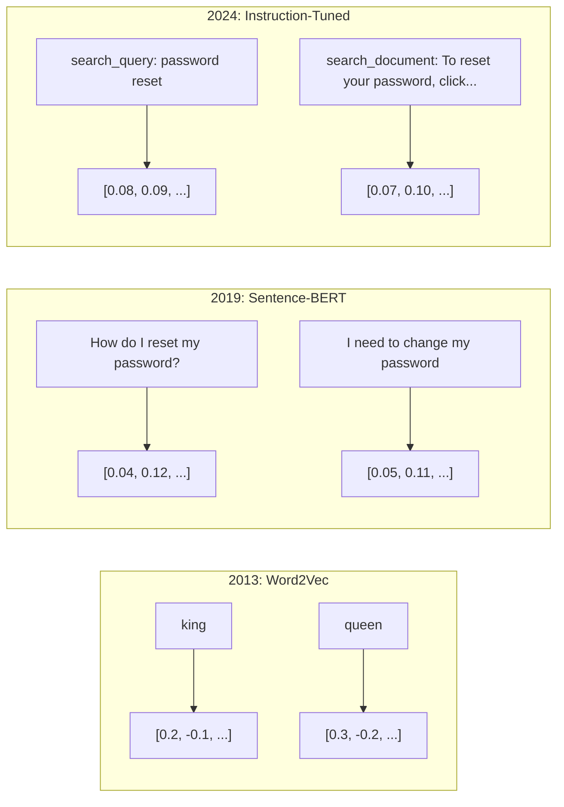
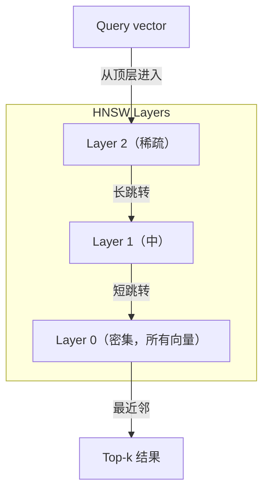

# Embeddings & Vector Representations

> 文本是离散的。数学是连续的。每次你让 LLM 找到"相似"文档、比较含义或搜索关键词以外的内容，你都依赖于连接这两个世界的桥梁。那座桥是一个 embedding。如果你不懂 embeddings，你就不懂现代 AI。你只是使用它。

**类型:** 构建
**语言:** Python
**前置知识:** Phase 11 · 01（Prompt Engineering）
**时间:** 约 75 分钟
**相关:** Phase 5 · 22（Embedding Models Deep Dive）涵盖 dense vs sparse vs multi-vector、Matryoshka 截断和每轴模型选择。本课聚焦生产 pipeline（向量 DB、HNSW、相似度数学）。选择模型前先读 Phase 5 · 22。

## 学习目标

- 使用 API 供应商和开源模型生成文本 embeddings，并计算它们之间的余弦相似度
- 解释为什么 embeddings 解决了 keyword search 无法处理的词汇不匹配问题
- 构建一个通过含义而非精确关键词匹配检索文档的语义搜索索引
- 使用检索基准（precision@k、recall）评估 embedding 质量，并为你的任务选择正确的 embedding 模型

## 问题

你有 10,000 个支持工单。客户写道"我的付款没通过"。你需要找到相似的过去工单。Keyword search 找到包含"payment"和"didn't go through"的工单。它错过了"transaction failed"、"charge was declined"和"billing error"。这些工单用完全不同的词语描述完全相同的问题。

这是词汇不匹配问题。人类语言有几十种方式说同一件事。Keyword search 将每个词视为独立的符号，没有含义。它无法知道"declined"和"didn't go through"指的是同一概念。

你需要文本的表示，其中含义而非拼写决定相似性。你需要一种方式让"my payment didn't go through"和"transaction was declined"在某个数学空间中靠得很近，同时将"my payment arrived on time"推得很远，尽管它们共享"payment"这个词。

那种表示就是 embedding。

## 概念

### 什么是 Embedding？

Embedding 是一个密集的浮点数向量，表示文本的含义。"dense"很重要——每个维度都携带信息，不像稀疏表示（词袋、TF-IDF）那样大多数维度为零。

"The cat sat on the mat" 变成类似 `[0.023, -0.041, 0.087, ..., 0.012]` —— 根据模型不同，768 到 3072 个数字的列表。这些数字编码含义。你从不直接检查它们。你比较它们。

### Word2Vec 突破

2013 年，Tomas Mikolov 和 Google 的同事发表了 Word2Vec。核心洞察：训练一个神经网络从邻居预测一个词（或从词预测邻居），隐藏层权重成为有意义的向量表示。

著名的结果：

```
king - man + woman = queen
```

词 embeddings 上的向量算术捕捉语义关系。"man"到"woman"的方向与"king"到"queen"的方向大致相同。这是该领域意识到几何可以编码含义的时刻。

Word2Vec 生成 300 维向量。每个词获得一个向量，不考虑上下文。"river bank"和"bank account"中的"Bank"有相同的 embedding。这个限制推动了下一个十年的研究。

### 从词到句子

词 embeddings 表示单个 token。生产系统需要嵌入整个句子、段落或文档。出现了四种方法：

**平均化**：取句子中所有词向量的均值。便宜，有损，短期内出奇地好。完全丢失词序——"dog bites man"和"man bites dog"获得相同的 embedding。

**CLS token**：transformer 模型（BERT，2018）输出一个特殊的 [CLS] token embedding，表示整个输入。比平均化好，但 [CLS] token 是为下一句预测训练的，不是为相似性训练的。

**对比学习**：训练模型明确地将相似对推近，将不同对推远。Sentence-BERT（Reimers & Gurevych，2019）使用这种方法，成为现代 embedding 模型的基础。对于"How do I reset my password?"和"I need to change my password"，模型学习这些应该有几乎相同的向量。

**指令微调 embeddings**：最新方法。像 E5 和 GTE 这样的模型接受任务前缀（"search_query:"、"search_document:"）告诉模型生成什么样的 embedding。这让一个模型服务多个任务。



### 现代 Embedding 模型

市场已经收敛到一些生产级选项（MTEB 2026 年初分数，MTEB v2）：

| 模型 | 供应商 | 维度 | MTEB | Context | 成本 / 100 万 token |
|-------|----------|-----------|------|---------|------------------|
| Gemini Embedding 2 | Google | 3072（Matryoshka）| 67.7（retrieval）| 8192 | $0.15 |
| embed-v4 | Cohere | 1024（Matryoshka）| 65.2 | 128K | $0.12 |
| voyage-4 | Voyage AI | 1024/2048（Matryoshka）| 66.8 | 32K | $0.12 |
| text-embedding-3-large | OpenAI | 3072（Matryoshka）| 64.6 | 8192 | $0.13 |
| text-embedding-3-small | OpenAI | 1536（Matryoshka）| 62.3 | 8192 | $0.02 |
| BGE-M3 | BAAI | 1024（dense+sparse+ColBERT）| 63.0 multilingual | 8192 | 开源权重 |
| Qwen3-Embedding | Alibaba | 4096（Matryoshka）| 66.9 | 32K | 开源权重 |
| Nomic-embed-v2 | Nomic | 768（Matryoshka）| 63.1 | 8192 | 开源权重 |

MTEB（Massive Text Embedding Benchmark）v2 覆盖 100+ 任务，涵盖检索、分类、聚类、重排序和摘要。越高越好。到 2026 年，开源权重模型（Qwen3-Embedding、BGE-M3）在大多数轴上匹配或超越闭源托管模型。Gemini Embedding 2 领先纯检索；Voyage/Cohere 领先特定领域（金融、法律、代码）。在承诺前始终在自己的查询上基准测试。

### 相似度指标

给定两个 embedding 向量，三种方法测量它们的相似程度：

**余弦相似度**：两个向量之间夹角的余弦。范围从 -1（相反）到 1（相同方向）。忽略幅度——一个 10 词的句子和一个 500 词的文档如果方向相同可以得 1.0。这是 90% 用例的默认值。

```
cosine_sim(a, b) = dot(a, b) / (||a|| * ||b||)
```

**点积**：两个向量的原始内积。当向量已归一化（单位长度）时与余弦相同。计算更快。OpenAI 的 embeddings 已归一化，所以点积和余弦给出相同的排名。

```
dot(a, b) = sum(a_i * b_i)
```

**欧几里得（L2）距离**：向量空间中的直线距离。越小 = 越相似。对幅度差异敏感。当绝对位置在空间中重要而不仅仅是方向时使用。

```
L2(a, b) = sqrt(sum((a_i - b_i)^2))
```

何时使用哪个：

| 指标 | 何时使用 | 何时避免 |
|--------|----------|------------|
| 余弦相似度 | 比较不同长度的文本；大多数检索任务 | 幅度携带信息 |
| 点积 | Embedding 已归一化；最大速度 | 向量幅度不同 |
| 欧几里得距离 | 聚类；空间最近邻问题 | 比较长度差异大的文档 |

### Vector Databases 和 HNSW

暴力相似度搜索将查询与每个存储的向量比较。在 100 万向量、1536 维度下，每次查询是 15 亿次乘加运算。太慢了。

Vector databases 用近似最近邻（ANN）算法解决这个问题。主导算法是 HNSW（Hierarchical Navigable Small World）：

1. 构建向量的多层图
2. 顶层稀疏——遥远簇之间的长距离连接
3. 底层密集——附近向量之间的细粒度连接
4. 搜索从顶层开始，贪婪下降细化
5. 以 O(log n) 时间返回近似 top-k 结果，而不是 O(n)

HNSW 以少量精度损失（通常 95-99% recall）换取巨大速度提升。在 1000 万向量上，暴力需要秒。HNSW 需要毫秒。



生产选项：

| 数据库 | 类型 | 最适合 | 最大规模 |
|----------|------|----------|-----------|
| Pinecone | 托管 SaaS | 零运维生产 | 十亿级 |
| Weaviate | 开源 | 自托管、混合搜索 | 1 亿+ |
| Qdrant | 开源 | 高性能、过滤 | 1 亿+ |
| ChromaDB | 嵌入式 | 原型、本地开发 | 100 万 |
| pgvector | Postgres 扩展 | 已用 Postgres | 1000 万 |
| FAISS | 库 | 进程内、研究 | 10 亿+ |

### Chunking 策略

文档太长无法作为单个向量嵌入。50 页 PDF 涵盖数十个主题——它的 embedding 成为一切的均值，与任何具体内容都不相似。你将文档分割成 chunks 并嵌入每个。

**固定大小 chunking**：每 N token 分裂，M token 重叠。简单且可预测。当文档没有清晰结构时效果良好。512 token chunk，50 token 重叠：chunk 1 是 token 0-511，chunk 2 是 token 462-973。

**基于句子的 chunking**：在句子边界分割，将句子分组直到达到 token 限制。每个 chunk 至少是一个完整句子。比固定大小好，因为你永远不会把一个想法切成两半。

**递归 chunking**：首先尝试在最大边界（章节标题）分割。如果仍然太大，尝试段落边界。然后句子边界。然后字符限制。这是 LangChain 的 `RecursiveCharacterTextSplitter`，对混合格式语料库效果良好。

**语义 chunking**：嵌入每个句子，然后将连续句子分组，其 embedding 相似。当 embedding 相似度低于阈值时，开始一个新 chunk。昂贵（需要单独嵌入每个句子）但产生最连贯的 chunks。

| 策略 | 复杂度 | 质量 | 最适合 |
|----------|-----------|---------|----------|
| 固定大小 | 低 | 尚可 | 非结构化文本、日志 |
| 基于句子 | 低 | 好 | 文章、邮件 |
| 递归 | 中 | 好 | Markdown、HTML、混合文档 |
| 语义 | 高 | 最好 | 关键检索质量 |

大多数系统的最佳点：256-512 token chunks，50 token 重叠。

### Bi-Encoders vs Cross-Encoders

Bi-encoder 独立嵌入查询和文档，然后比较向量。快——你嵌入查询一次并与预计算的文档 embedding 比较。这是你用于检索的。

Cross-encoder 将查询和文档作为单个输入并输出相关性分数。慢——它通过完整模型处理每个查询-文档对。但更准确，因为它可以同时跨查询和文档 token 注意力。

生产模式：bi-encoder 检索 top-100 候选项，cross-encoder 将它们重排序到 top-10。这是 retrieve-then-rerank pipeline。


重排序模型：Cohere Rerank 3.5（$2/1000 查询）、BGE-reranker-v2（免费、开源）、Jina Reranker v2（免费、开源）。

### Matryoshka Embeddings

传统 embeddings 是全有或全无。1536 维向量使用 1536 个浮点数。你无法截断到 256 维而不重新训练。

Matryoshka Representation Learning（Kusupati et al., 2022）修复了这个。模型被训练为前 N 维捕获最重要信息，就像一个俄罗斯套娃。截断 1536 维 Matryoshka embedding 到 256 维会丢失一些准确性但保持功能性。

OpenAI 的 text-embedding-3-small 和 text-embedding-3-large 支持通过 `dimensions` 参数进行 Matryoshka 截断。请求 256 维而不是 1536 维将存储减少 6 倍，MTEB 基准上精度损失约 3-5%。

### Binary Quantization

1536 维 embedding 存储为 float32 使用 6144 字节。乘以 1000 万文档：仅向量就需要 61 GB。

Binary quantization 将每个浮点数转换为单个比特：正值变为 1，负值变为 0。存储从 6144 字节减少到 192 字节——32 倍减少。相似度使用汉明距离（计算不同比特数）计算，CPU 可以用一条指令完成。

精度损失约为检索 recall 的 5-10%。常见模式：第一遍搜索对数百万向量使用 binary quantization，然后用全精度向量重新评分 top-1000。这以 32 倍更少内存获得 95%+ 全精度精度。

## 构建

我们从零构建一个语义搜索引擎。无 vector database。无外部 embedding API。使用纯 Python 和 numpy 做数学。

### 第 1 步：文本 Chunking

```python
def chunk_text(text, chunk_size=200, overlap=50):
    words = text.split()
    chunks = []
    start = 0
    while start < len(words):
        end = start + chunk_size
        chunk = " ".join(words[start:end])
        chunks.append(chunk)
        start += chunk_size - overlap
    return chunks


def chunk_by_sentences(text, max_chunk_tokens=200):
    sentences = text.replace("\n", " ").split(".")
    sentences = [s.strip() + "." for s in sentences if s.strip()]
    chunks = []
    current_chunk = []
    current_length = 0
    for sentence in sentences:
        sentence_length = len(sentence.split())
        if current_length + sentence_length > max_chunk_tokens and current_chunk:
            chunks.append(" ".join(current_chunk))
            current_chunk = []
            current_length = 0
        current_chunk.append(sentence)
        current_length += sentence_length
    if current_chunk:
        chunks.append(" ".join(current_chunk))
    return chunks
```

### 第 2 步：从零构建 Embeddings

我们使用 TF-IDF 和 L2 归一化实现一个简单的 dense embedding。这不是神经 embedding，但它遵循相同的契约：文本输入，固定大小向量输出，相似文本产生相似向量。

```python
import math
import numpy as np
from collections import Counter

class SimpleEmbedder:
    def __init__(self):
        self.vocab = []
        self.idf = []
        self.word_to_idx = {}

    def fit(self, documents):
        vocab_set = set()
        for doc in documents:
            vocab_set.update(doc.lower().split())
        self.vocab = sorted(vocab_set)
        self.word_to_idx = {w: i for i, w in enumerate(self.vocab)}
        n = len(documents)
        self.idf = np.zeros(len(self.vocab))
        for i, word in enumerate(self.vocab):
            doc_count = sum(1 for doc in documents if word in doc.lower().split())
            self.idf[i] = math.log((n + 1) / (doc_count + 1)) + 1

    def embed(self, text):
        words = text.lower().split()
        count = Counter(words)
        total = len(words) if words else 1
        vec = np.zeros(len(self.vocab))
        for word, freq in count.items():
            if word in self.word_to_idx:
                tf = freq / total
                vec[self.word_to_idx[word]] = tf * self.idf[self.word_to_idx[word]]
        norm = np.linalg.norm(vec)
        if norm > 0:
            vec = vec / norm
        return vec
```

### 第 3 步：相似度函数

```python
def cosine_similarity(a, b):
    dot = np.dot(a, b)
    norm_a = np.linalg.norm(a)
    norm_b = np.linalg.norm(b)
    if norm_a == 0 or norm_b == 0:
        return 0.0
    return float(dot / (norm_a * norm_b))


def dot_product(a, b):
    return float(np.dot(a, b))


def euclidean_distance(a, b):
    return float(np.linalg.norm(a - b))
```

### 第 4 步：向量索引与暴力搜索

```python
class VectorIndex:
    def __init__(self):
        self.vectors = []
        self.texts = []
        self.metadata = []

    def add(self, vector, text, meta=None):
        self.vectors.append(vector)
        self.texts.append(text)
        self.metadata.append(meta or {})

    def search(self, query_vector, top_k=5, metric="cosine"):
        scores = []
        for i, vec in enumerate(self.vectors):
            if metric == "cosine":
                score = cosine_similarity(query_vector, vec)
            elif metric == "dot":
                score = dot_product(query_vector, vec)
            elif metric == "euclidean":
                score = -euclidean_distance(query_vector, vec)
            else:
                raise ValueError(f"Unknown metric: {metric}")
            scores.append((i, score))
        scores.sort(key=lambda x: x[1], reverse=True)
        results = []
        for idx, score in scores[:top_k]:
            results.append({
                "text": self.texts[idx],
                "score": score,
                "metadata": self.metadata[idx],
                "index": idx
            })
        return results

    def size(self):
        return len(self.vectors)
```

### 第 5 步：语义搜索引擎

```python
class SemanticSearchEngine:
    def __init__(self, chunk_size=200, overlap=50):
        self.embedder = SimpleEmbedder()
        self.index = VectorIndex()
        self.chunk_size = chunk_size
        self.overlap = overlap

    def index_documents(self, documents, source_names=None):
        all_chunks = []
        all_sources = []
        for i, doc in enumerate(documents):
            chunks = chunk_text(doc, self.chunk_size, self.overlap)
            all_chunks.extend(chunks)
            name = source_names[i] if source_names else f"doc_{i}"
            all_sources.extend([name] * len(chunks))
        self.embedder.fit(all_chunks)
        for chunk, source in zip(all_chunks, all_sources):
            vec = self.embedder.embed(chunk)
            self.index.add(vec, chunk, {"source": source})
        return len(all_chunks)

    def search(self, query, top_k=5, metric="cosine"):
        query_vec = self.embedder.embed(query)
        return self.index.search(query_vec, top_k, metric)

    def search_with_scores(self, query, top_k=5):
        results = self.search(query, top_k)
        return [
            {
                "text": r["text"][:200],
                "source": r["metadata"].get("source", "unknown"),
                "score": round(r["score"], 4)
            }
            for r in results
        ]
```

### 第 6 步：比较相似度指标

```python
def compare_metrics(engine, query, top_k=3):
    results = {}
    for metric in ["cosine", "dot", "euclidean"]:
        hits = engine.search(query, top_k=top_k, metric=metric)
        results[metric] = [
            {"score": round(h["score"], 4), "preview": h["text"][:80]}
            for h in hits
        ]
    return results
```

## 使用

使用生产 embedding API，架构保持不变。只有 embedder 改变：

```python
from openai import OpenAI

client = OpenAI()

def openai_embed(texts, model="text-embedding-3-small", dimensions=None):
    kwargs = {"model": model, "input": texts}
    if dimensions:
        kwargs["dimensions"] = dimensions
    response = client.embeddings.create(**kwargs)
    return [item.embedding for item in response.data]
```

OpenAI 的 Matryoshka 截断——相同模型，更少维度，更低存储：

```python
full = openai_embed(["semantic search query"], dimensions=1536)
compact = openai_embed(["semantic search query"], dimensions=256)
```

256 维向量使用 6 倍更少存储。对于 1000 万文档，那是 10 GB vs 61 GB。标准基准上的精度损失约 3-5%。

用于 Cohere 重排序：

```python
import cohere

co = cohere.ClientV2()

results = co.rerank(
    model="rerank-v3.5",
    query="What is the refund policy?",
    documents=["Full refund within 30 days...", "No refunds after 90 days..."],
    top_n=3
)
```

用于无 API 依赖的本地 embeddings：

```python
from sentence_transformers import SentenceTransformer

model = SentenceTransformer("BAAI/bge-small-en-v1.5")
embeddings = model.encode(["semantic search query", "another document"])
```

我们构建的 VectorIndex 类适用于任何这些。换 embedding 函数，保留搜索逻辑。

## 交付

本课产生：
- `outputs/prompt-embedding-advisor.md` —— 选择 embedding 模型和策略的 prompt，用于特定用例
- `outputs/skill-embedding-patterns.md` —— 教 agent 如何在生产中有效使用 embeddings 的 skill

## 练习

1. **指标比较**：使用余弦相似度、点积和欧几里得距离对相同 5 个查询运行示例文档。记录每个的 top-3 结果。对于哪些查询指标不一致？为什么？

2. **Chunk 大小实验**：用 50、100、200 和 500 词的 chunk 大小索引示例文档。对于每个，运行 5 个查询并记录 top-1 相似度分数。绘制 chunk 大小与检索质量之间的关系。找到更大 chunks 开始伤害的点。

3. **Matryoshka 模拟**：构建一个产生 500 维向量的 SimpleEmbedder。截断到 50、100、200 和 500 维。测量每个截断级别的检索 recall 如何降解。这模拟 Matryoshka 行为而无需真实训练技巧。

4. **Binary quantization**：取搜索引擎的 embeddings，转换为二进制（正为 1，负为 0），并实现汉明距离搜索。将 top-10 结果与全精度余弦相似度比较。测量重叠百分比。

5. **基于句子的 chunking**：用 `chunk_by_sentences` 替换固定大小 chunking。运行相同查询并比较检索分数。尊重句子边界是否改善了结果？

## 关键术语

| 术语 | 人们说的 | 实际含义 |
|------|----------------|----------------------|
| Embedding | "文本转数字" | 一个密集向量，其中几何接近度编码语义相似性 |
| Word2Vec | "OG embedding" | 2013 年通过预测上下文词学习词向量的模型；证明了向量算术编码含义 |
| 余弦相似度 | "两个向量多相似" | 向量之间夹角的余弦；1 = 同方向，0 = 正交，-1 = 相反 |
| HNSW | "快速向量搜索" | Hierarchical Navigable Small World 图——多层结构实现 O(log n) 近似最近邻搜索 |
| Bi-encoder | "分开嵌入，快速比较" | 独立编码查询和文档为向量；支持预计算和快速检索 |
| Cross-encoder | "慢但准确的重排序器" | 通过完整模型联合处理查询-文档对；更高准确性，无预计算 |
| Matryoshka embeddings | "可截断向量" | Embeddings 训练为前 N 维捕获最重要信息，支持可变大小存储 |
| Binary quantization | "1-bit embeddings" | 将浮点向量转换为二进制（仅符号位）以实现 32 倍存储减少和汉明距离搜索 |
| Chunking | "分割文档用于嵌入" | 将文档分解为 256-512 token 段，使每个可以独立嵌入和检索 |
| Vector database | "Embeddings 的搜索引擎" | 优化存储向量和大规模执行近似最近邻搜索的数据存储 |
| Contrastive learning | "通过比较训练" | 训练方法将相似对 embedding 推近，将不同对 embedding 推远 |
| MTEB | "Embedding 基准" | Massive Text Embedding Benchmark——56 个数据集跨 8 个任务；比较 embedding 模型的标准 |

## 扩展阅读

- Mikolov et al., "Efficient Estimation of Word Representations in Vector Space" (2013) —— Word2Vec 论文，用 king-queen 类比开始了 embedding 革命
- Reimers & Gurevych, "Sentence-BERT: Sentence Embeddings using Siamese BERT-Networks" (2019) —— 如何训练用于句子级相似度的 bi-encoders，现代 embedding 模型的基础
- Kusupati et al., "Matryoshka Representation Learning" (2022) —— OpenAI 采用用于 text-embedding-3 的可变维度 embeddings 背后的技术
- Malkov & Yashunin, "Efficient and Robust Approximate Nearest Neighbor using Hierarchical Navigable Small World Graphs" (2018) —— HNSW 论文，大多数生产向量搜索背后的算法
- OpenAI Embeddings Guide (platform.openai.com/docs/guides/embeddings) —— text-embedding-3 模型的实际参考，包括 Matryoshka 维度减少
- MTEB Leaderboard (huggingface.co/spaces/mteb/leaderboard) —— 实时基准，比较所有 embedding 模型跨任务和语言
- [Muennighoff et al., "MTEB: Massive Text Embedding Benchmark" (EACL 2023)](https://arxiv.org/abs/2210.07316) —— 定义 8 个任务类别（分类、聚类、配对分类、重排序、检索、STS、摘要、双语挖掘）的基准，leaderboard 报告；信任任何单一 MTEB 分数前阅读。
- [Sentence Transformers documentation](https://www.sbert.net/) —— bi-encoder vs cross-encoder、池化策略和 ingest-split-embed-store RAG pipeline 的规范参考，本课实现。