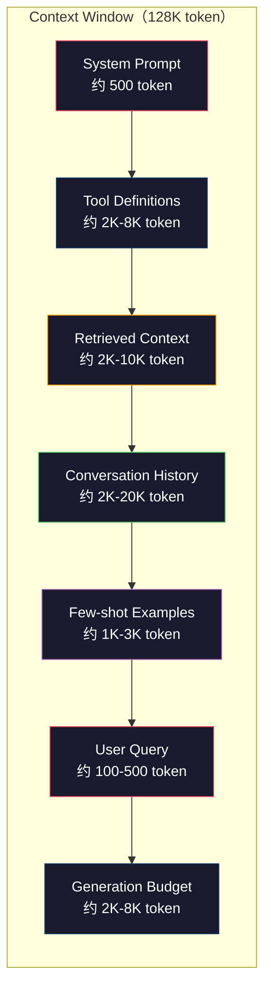
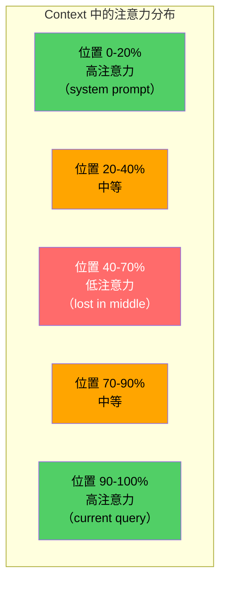
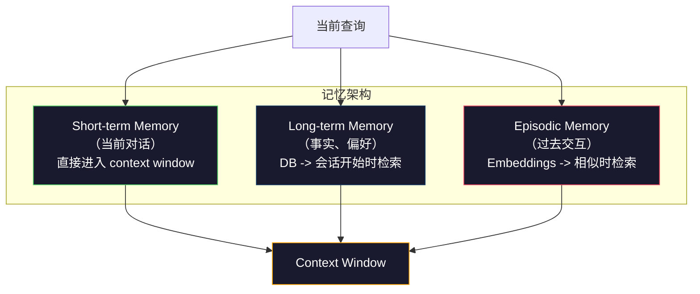

# Context Engineering: Windows, Budgets, Memory, and Retrieval

> Prompt engineering 是一个子集。Context engineering 是整盘棋。A prompt 是你输入的字符串。Context 是进入模型窗口的一切：system 指令、检索的文档、工具定义、对话历史、few-shot 示例，以及 prompt 本身。2026 年最好的 AI 工程师是 context 工程师。他们决定什么进入、什么排除、以什么顺序。

**类型:** 构建
**语言:** Python
**前置知识:** Phase 10（从头学 LLM）、Phase 11 · 01-02
**时间:** 约 90 分钟
**相关:** Phase 11 · 15（Prompt Caching）—— cache-friendly 布局是 context engineering 的扩展。Phase 5 · 28（Long-Context Evaluation）讲解如何用 NIAH/RULER 测量 lost-in-the-middle。

## 学习目标

- 计算所有 context window 组件的 token 预算（system prompt、工具、历史、检索文档、生成 headroom）
- 实现 context window 管理策略：对话历史的截断、摘要和滑动窗口
- 优先排序和排序 context 组件以最大化模型对最相关信息注意力
- 构建一个基于查询类型和可用窗口空间动态分配 token 的 context  assembler

## 问题

Claude Opus 4.7 有 200K token 窗口（1M beta）。GPT-5 有 400K。Gemini 3 Pro 有 2M。Llama 4 声称 10M。这些数字听起来巨大，直到你填满它们。

这是编码助手的真实分解。System prompt：500 token。50 个工具的工具定义：8,000 token。检索文档：4,000 token。对话历史（10 轮）：6,000 token。当前用户查询：200 token。生成预算（最大输出）：4,000 token。总计：22,700 token。这只是 128K 窗口的 18%。

但注意力不随 context 长度线性扩展。128K token context 的模型支付二次注意力成本（vanilla transformer 中 O(n^2)，尽管大多数生产模型使用高效注意力变体）。更重要的是，检索准确性下降。"Needle in a Haystack" 测试显示模型在长 context 中间放置的信息上挣扎。Liu et al. (2023) 的研究表明，LLM 在长 context 开始和结束处检索信息准确性接近完美，但中间位置（context 的 40-70%）的信息准确性下降 10-20%。这个"lost-in-the-middle"效应因模型而异，但影响所有当前架构。

实际教训：200K token 可用不意味着使用 200K token 有效。一个精心策划的 10K token context 通常胜过倾倒的 100K token context。Context engineering 是最大化 context window 内信噪比的学科。

你放入窗口的每个 token 都取代了可能携带更多相关信息的 token。每个不相关的工具定义、每个陈旧的对话轮次、每段不回答问题的检索文本——每个都让模型在任务上稍微变差。

## 概念

### Context Window 是稀缺资源

将 context window 视为 RAM，不是磁盘。它快速且可直接访问，但有限。你不能容纳一切。你必须选择。



每个组件争夺空间。添加更多工具定义意味着对话历史空间更少。添加更多检索 context 意味着 few-shot 示例空间更少。Context engineering 是在这个预算中分配以最大化任务性能的 art。

### Lost-in-the-Middle

Context engineering 中最重要的经验发现。模型对 context 开始和结束的信息注意力更好。中间的信息获得更低的注意力分数，更可能被忽略。

Liu et al. (2023) 系统地测试了这个。他们在一堆不相关文档中放置相关文档，测量答案准确性。当相关文档是第一或最后时，准确性是 85-90%。当在中间（20 个中的第 10 个）时，准确性下降到 60-70%。

这有直接的工程含义：

- 首先放置最重要信息（system prompt、关键指令）
- 最后放置当前查询和最相关 context（近因偏差有帮助）
- 将 context 中间视为最低优先级区域
- 如果必须在中间包含信息，在末尾重复关键点



### Context 组件

**System prompt**：设置 persona、约束和行为规则。这放在首位，跨轮次保持不变。Claude Code 的 system prompt 包括工具定义和行为指令约 6,000 token。保持精简。system prompt 中的每个词在每次 API 调用中重复。

**Tool definitions**：每个工具增加 50-200 token（名称、描述、参数 schema）。50 个工具 × 每个 150 token = 7,500 token 在任何对话发生之前。动态工具选择——只包括与当前查询相关的工具——可以减少 60-80%。

**Retrieved context**：来自向量数据库的文档、搜索结果、文件内容。检索质量直接决定响应质量。糟糕的检索比没有检索更差——它用噪声填充窗口并主动误导模型。

**Conversation history**：每个之前的用户消息和 assistant 响应。随对话长度线性增长。50 轮对话 × 每轮 200 token = 10,000 token 历史。其中大部分与当前查询无关。

**Few-shot examples**：演示期望行为的输入/输出对。两个到三个精心挑选的示例通常比数千 token 的指令更能提高输出质量。但它们消耗空间。

**Generation budget**：为模型响应保留的 token。如果你将窗口填充到容量，模型没有空间回答。至少保留 2,000-4,000 token 用于生成。

### Context 压缩策略

**历史摘要**：不要保持所有先前轮次逐字，而是在周期性总结对话。"我们讨论了 X，决定了 Y，用户想要 Z"，100 token 替换了占用 2,000 token 的 10 轮。当历史超过阈值（例如 5,000 token）时运行摘要。

**相关性过滤**：对每个检索文档针对当前查询评分，放弃阈值以下的文档。如果你检索了 10 个 chunks 但只有 3 个相关，丢弃其他 7 个。3 个高相关 chunks 优于 10 个平庸 ones。

**工具修剪**：分类用户查询意图，只包括与该意图相关的工具。代码问题不需要日历工具。调度问题不需要文件系统工具。这可以将工具定义从 8,000 token 减少到 1,000。

**递归摘要**：对于非常长的文档，分阶段摘要。首先摘要每个部分，然后摘要摘要。50 页文档变成捕获关键点的 500 token 摘要。

### 记忆系统

Context engineering 跨越三个时间范围。

**短期记忆**：当前对话。直接存储在 context window 中。每轮增长。通过摘要和截断管理。

**长期记忆**：跨对话持续存在的事实和偏好。"用户偏好 TypeScript。""项目使用 PostgreSQL。"存储在数据库中，在会话开始时检索。Claude Code 将此存储在 CLAUDE.md 文件中。ChatGPT 将其存储在其 memory 功能中。

**情景记忆**：可能相关的特定过去交互。"上周二，我们在 auth 模块中调试了一个类似问题。"存储为 embeddings，在当前对话匹配过去情节时检索。



### 动态 Context Assembly

关键洞察：不同查询需要不同 context。静态 system prompt + 静态工具 + 静态历史 是浪费。最好的系统动态组装每个查询的 context。

1. 分类查询意图
2. 选择相关工具（不是所有工具）
3. 检索相关文档（不是固定集合）
4. 包括相关历史轮次（不是所有历史）
5. 添加匹配任务类型的 few-shot 示例
6. 按重要性排序一切：关键优先，重要最后，可选在中间

这是区分好 AI 应用和伟大 AI 应用的东西。模型是一样的。Context 是差异化的。

## 构建

### 第 1 步：Token 计数器

你无法预算你无法衡量的东西。构建一个简单的 token 计数器（使用空白分割的近似值，因为确切计数取决于 tokenizer）。

```python
import json
import numpy as np
from collections import OrderedDict

def count_tokens(text):
    if not text:
        return 0
    return int(len(text.split()) * 1.3)

def count_tokens_json(obj):
    return count_tokens(json.dumps(obj))
```

### 第 2 步：Context Budget Manager

核心抽象。预算管理器跟踪每个组件使用多少 token 并强制限制。

```python
class ContextBudget:
    def __init__(self, max_tokens=128000, generation_reserve=4000):
        self.max_tokens = max_tokens
        self.generation_reserve = generation_reserve
        self.available = max_tokens - generation_reserve
        self.allocations = OrderedDict()

    def allocate(self, component, content, max_tokens=None):
        tokens = count_tokens(content)
        if max_tokens and tokens > max_tokens:
            words = content.split()
            target_words = int(max_tokens / 1.3)
            content = " ".join(words[:target_words])
            tokens = count_tokens(content)

        used = sum(self.allocations.values())
        if used + tokens > self.available:
            allowed = self.available - used
            if allowed <= 0:
                return None, 0
            words = content.split()
            target_words = int(allowed / 1.3)
            content = " ".join(words[:target_words])
            tokens = count_tokens(content)

        self.allocations[component] = tokens
        return content, tokens

    def remaining(self):
        used = sum(self.allocations.values())
        return self.available - used

    def utilization(self):
        used = sum(self.allocations.values())
        return used / self.max_tokens

    def report(self):
        total_used = sum(self.allocations.values())
        lines = []
        lines.append(f"Context Budget Report ({self.max_tokens:,} token 窗口)")
        lines.append("-" * 50)
        for component, tokens in self.allocations.items():
            pct = tokens / self.max_tokens * 100
            bar = "#" * int(pct / 2)
            lines.append(f"  {component:<25} {tokens:>6} token ({pct:>5.1f}%) {bar}")
        lines.append("-" * 50)
        lines.append(f"  {'Used':<25} {total_used:>6} token ({total_used/self.max_tokens*100:.1f}%)")
        lines.append(f"  {'Generation reserve':<25} {self.generation_reserve:>6} token")
        lines.append(f"  {'Remaining':<25} {self.remaining():>6} token")
        return "\n".join(lines)
```

### 第 3 步：Lost-in-the-Middle 重排序

实现重排序策略：最重要的项放在首位和末位，最不重要的放在中间。

```python
def reorder_lost_in_middle(items, scores):
    paired = sorted(zip(scores, items), reverse=True)
    sorted_items = [item for _, item in paired]

    if len(sorted_items) <= 2:
        return sorted_items

    first_half = sorted_items[::2]
    second_half = sorted_items[1::2]
    second_half.reverse()

    return first_half + second_half

def score_relevance(query, documents):
    query_words = set(query.lower().split())
    scores = []
    for doc in documents:
        doc_words = set(doc.lower().split())
        if not query_words:
            scores.append(0.0)
            continue
        overlap = len(query_words & doc_words) / len(query_words)
        scores.append(round(overlap, 3))
    return scores
```

### 第 4 步：对话历史压缩器

总结旧对话轮次以回收 token 预算。

```python
class ConversationManager:
    def __init__(self, max_history_tokens=5000):
        self.turns = []
        self.summaries = []
        self.max_history_tokens = max_history_tokens

    def add_turn(self, role, content):
        self.turns.append({"role": role, "content": content})
        self._compress_if_needed()

    def _compress_if_needed(self):
        total = sum(count_tokens(t["content"]) for t in self.turns)
        if total <= self.max_history_tokens:
            return

        while total > self.max_history_tokens and len(self.turns) > 4:
            old_turns = self.turns[:2]
            summary = self._summarize_turns(old_turns)
            self.summaries.append(summary)
            self.turns = self.turns[2:]
            total = sum(count_tokens(t["content"]) for t in self.turns)

    def _summarize_turns(self, turns):
        parts = []
        for t in turns:
            content = t["content"]
            if len(content) > 100:
                content = content[:100] + "..."
            parts.append(f"{t['role']}: {content}")
        return "Previous: " + " | ".join(parts)

    def get_context(self):
        parts = []
        if self.summaries:
            parts.append("[Conversation Summary]")
            for s in self.summaries:
                parts.append(s)
        parts.append("[Recent Conversation]")
        for t in self.turns:
            parts.append(f"{t['role']}: {t['content']}")
        return "\n".join(parts)

    def token_count(self):
        return count_tokens(self.get_context())
```

### 第 5 步：动态工具选择器

只包括与当前查询相关的工具。分类意图，然后过滤。

```python
TOOL_REGISTRY = {
    "read_file": {
        "description": "Read contents of a file",
        "tokens": 120,
        "categories": ["code", "files"],
    },
    "write_file": {
        "description": "Write content to a file",
        "tokens": 150,
        "categories": ["code", "files"],
    },
    "search_code": {
        "description": "Search for patterns in codebase",
        "tokens": 130,
        "categories": ["code"],
    },
    "run_command": {
        "description": "Execute a shell command",
        "tokens": 140,
        "categories": ["code", "system"],
    },
    "create_calendar_event": {
        "description": "Create a new calendar event",
        "tokens": 180,
        "categories": ["calendar"],
    },
    "list_emails": {
        "description": "List recent emails",
        "tokens": 160,
        "categories": ["email"],
    },
    "send_email": {
        "description": "Send an email message",
        "tokens": 200,
        "categories": ["email"],
    },
    "web_search": {
        "description": "Search the web for information",
        "tokens": 140,
        "categories": ["research"],
    },
    "query_database": {
        "description": "Run a SQL query on the database",
        "tokens": 170,
        "categories": ["code", "data"],
    },
    "generate_chart": {
        "description": "Generate a chart from data",
        "tokens": 190,
        "categories": ["data", "visualization"],
    },
}

def classify_intent(query):
    query_lower = query.lower()

    intent_keywords = {
        "code": ["code", "function", "bug", "error", "file", "implement", "refactor", "debug", "test"],
        "calendar": ["meeting", "schedule", "calendar", "appointment", "event"],
        "email": ["email", "mail", "send", "inbox", "message"],
        "research": ["search", "find", "what is", "how does", "explain", "look up"],
        "data": ["data", "query", "database", "chart", "graph", "analytics", "sql"],
    }

    scores = {}
    for intent, keywords in intent_keywords.items():
        score = sum(1 for kw in keywords if kw in query_lower)
        if score > 0:
            scores[intent] = score

    if not scores:
        return ["code"]

    max_score = max(scores.values())
    return [intent for intent, score in scores.items() if score >= max_score * 0.5]

def select_tools(query, token_budget=2000):
    intents = classify_intent(query)
    relevant = {}
    total_tokens = 0

    for name, tool in TOOL_REGISTRY.items():
        if any(cat in intents for cat in tool["categories"]):
            if total_tokens + tool["tokens"] <= token_budget:
                relevant[name] = tool
                total_tokens += tool["tokens"]

    return relevant, total_tokens
```

### 第 6 步：完整 Context Assembly Pipeline

连接一切。给定一个查询，动态组装最优 context。

```python
class ContextEngine:
    def __init__(self, max_tokens=128000, generation_reserve=4000):
        self.budget = ContextBudget(max_tokens, generation_reserve)
        self.conversation = ConversationManager(max_history_tokens=5000)
        self.system_prompt = (
            "You are a helpful AI assistant. You have access to tools for "
            "code editing, file management, web search, and data analysis. "
            "Use the appropriate tools for each task. Be concise and accurate."
        )
        self.knowledge_base = [
            "Python 3.12 introduced type parameter syntax for generic classes using bracket notation.",
            "The project uses PostgreSQL 16 with pgvector for embedding storage.",
            "Authentication is handled by Supabase Auth with JWT tokens.",
            "The frontend is built with Next.js 15 using the App Router.",
            "API rate limits are set to 100 requests per minute per user.",
            "The deployment pipeline uses GitHub Actions with Docker multi-stage builds.",
            "Test coverage must be above 80% for all new modules.",
            "The codebase follows the repository pattern for data access.",
        ]

    def assemble(self, query):
        self.budget = ContextBudget(self.budget.max_tokens, self.budget.generation_reserve)

        system_content, _ = self.budget.allocate("system_prompt", self.system_prompt, max_tokens=1000)

        tools, tool_tokens = select_tools(query, token_budget=2000)
        tool_text = json.dumps(list(tools.keys()))
        tool_content, _ = self.budget.allocate("tools", tool_text, max_tokens=2000)

        relevance = score_relevance(query, self.knowledge_base)
        threshold = 0.1
        relevant_docs = [
            doc for doc, score in zip(self.knowledge_base, relevance)
            if score >= threshold
        ]

        if relevant_docs:
            doc_scores = [s for s in relevance if s >= threshold]
            reordered = reorder_lost_in_middle(relevant_docs, doc_scores)
            doc_text = "\n".join(reordered)
            doc_content, _ = self.budget.allocate("retrieved_context", doc_text, max_tokens=3000)

        history_text = self.conversation.get_context()
        if history_text.strip():
            history_content, _ = self.budget.allocate("conversation_history", history_text, max_tokens=5000)

        query_content, _ = self.budget.allocate("user_query", query, max_tokens=500)

        return self.budget

    def chat(self, query):
        self.conversation.add_turn("user", query)
        budget = self.assemble(query)
        response = f"[Response to: {query[:50]}...]"
        self.conversation.add_turn("assistant", response)
        return budget


def run_demo():
    print("=" * 60)
    print("  Context Engineering Pipeline Demo")
    print("=" * 60)

    engine = ContextEngine(max_tokens=128000, generation_reserve=4000)

    print("\n--- Query 1: Code task ---")
    budget = engine.chat("Fix the bug in the authentication module where JWT tokens expire too early")
    print(budget.report())

    print("\n--- Query 2: Research task ---")
    budget = engine.chat("What is the best approach for implementing vector search in PostgreSQL?")
    print(budget.report())

    print("\n--- Query 3: After conversation history builds up ---")
    for i in range(8):
        engine.conversation.add_turn("user", f"Follow-up question number {i+1} about the implementation details of the system")
        engine.conversation.add_turn("assistant", f"Here is the response to follow-up {i+1} with technical details about the architecture")

    budget = engine.chat("Now implement the changes we discussed")
    print(budget.report())

    print("\n--- Tool Selection Examples ---")
    test_queries = [
        "Fix the bug in auth.py",
        "Schedule a meeting with the team for Tuesday",
        "Show me the database query performance stats",
        "Search for best practices on error handling",
    ]

    for q in test_queries:
        tools, tokens = select_tools(q)
        intents = classify_intent(q)
        print(f"\n  Query: {q}")
        print(f"  Intents: {intents}")
        print(f"  Tools: {list(tools.keys())} ({tokens} token)")

    print("\n--- Lost-in-the-Middle Reordering ---")
    docs = ["Doc A (most relevant)", "Doc B (somewhat relevant)", "Doc C (least relevant)",
            "Doc D (relevant)", "Doc E (moderately relevant)"]
    scores = [0.95, 0.60, 0.20, 0.80, 0.50]
    reordered = reorder_lost_in_middle(docs, scores)
    print(f"  Original order: {docs}")
    print(f"  Scores:         {scores}")
    print(f"  Reordered:      {reordered}")
    print(f"  (Most relevant at start and end, least relevant in middle)")
```

## 使用

### Claude Code 的 Context 策略

Claude Code 用分层方法管理 context。System prompt 包括行为规则和工具定义（~6K token）。当你打开一个文件时，其内容作为 context 注入。当你搜索时，结果被添加。旧对话轮次被摘要。CLAUDE.md 提供跨会话持续存在的长期记忆。

关键工程决策：Claude Code 不将整个代码库转储到 context。它按需检索相关文件。这是 context engineering 的实践。

### Cursor 的动态 Context 加载

Cursor 将整个代码库索引为 embeddings。当你输入查询时，它使用向量相似度检索最相关的文件和代码块。只有那些 pieces 进入 context window。500K 行代码库被压缩到 5-10 个最相关的代码块中。

这是模式：嵌入一切，按需检索，只包括重要的。

### ChatGPT Memory

ChatGPT 将用户偏好和事实存储为长期记忆。在每次对话开始时，检索相关记忆并包含在 system prompt 中。"用户偏好 Python"花费 5 token 但在跨对话重复指令中节省数百 token。

### RAG 作为 Context Engineering

检索增强生成是 formalize 的 context engineering。不是将知识塞进模型权重（训练）或 system prompt（静态 context），而是在查询时检索相关文档并注入 context window。整个 RAG pipeline——chunking、embedding、retrieval、reranking——存在来解决一个问题：在 context window 中放置正确信息。

## 交付

本课产生 `outputs/prompt-context-optimizer.md` —— 一个可复用的 prompt，审核 context assembly 策略并推荐优化。输入你的 system prompt、工具数量、平均历史长度和检索策略，它识别 token 浪费并建议改进。

还产生 `outputs/skill-context-engineering.md` —— 一个决策框架，用于基于任务类型、context window 大小和延迟预算设计 context assembly pipelines。

## 练习

1. 在 ContextBudget 类中添加一个"token 浪费检测器"。它应该标记使用超过 30% 预算的组件，并建议针对每个组件类型的特定压缩策略（摘要历史、修剪工具、重排序文档）。

2. 实现检索 context 的语义去重。如果两个检索文档超过 80% 相似（通过词重叠或它们 embedding 的余弦相似度），只保留得分较高的一个。测量这回收了多少 token 预算。

3. 构建一个"context replay"工具。给定对话记录，通过 ContextEngine 重放它并可视化预算分配如何逐轮变化。绘制每个组件随时间的 token 使用情况。识别 context 开始被压缩的轮次。

4. 实现基于优先级的工具选择器。不是二元包含/排除，而是为每个工具分配与当前查询的相关性分数。按降序包括工具直到工具预算耗尽。用 5、10、20 和 50 个包含的工具比较任务性能。

5. 构建多策略 context 压缩器。实现三种压缩策略（截断、摘要、关键句子提取）并在 20 个文档集上基准测试。测量压缩率与信息保留之间的权衡（压缩版本是否仍然包含问题的答案？）。

## 关键术语

| 术语 | 人们说的 | 实际含义 |
|------|----------------|----------------------|
| Context window | "模型能读多少" | 模型在单次前向传播中处理的最大 token 数（输入 + 输出）—— GPT-5 为 400K，Claude Opus 4.7 为 200K（1M beta），Gemini 3 Pro 为 2M |
| Context engineering | "高级 prompt engineering" | 决定什么进入 context window、以什么顺序、以什么优先级的学科——涵盖检索、压缩、工具选择和记忆管理 |
| Lost-in-the-middle | "模型忘记中间的东西" | 经验发现 LLMs 对 context 开始和结束注意力更好，中间放置的信息准确性下降 10-20% |
| Token budget | "你还剩多少 token" | 跨组件（system prompt、工具、历史、检索、生成）的 context window 容量显式分配，每个组件有 per-component 限制 |
| Dynamic context | "动态加载内容" | 基于意图分类、相关工具选择和检索结果为每个查询不同地组装 context window |
| History summarization | "压缩对话" | 用简洁摘要替换逐字旧对话轮次，减少 token 成本同时保留关键信息 |
| Tool pruning | "只包括相关工具" | 分类查询意图并只包括匹配的 tool definitions，将工具 token 成本减少 60-80% |
| Long-term memory | "跨会话记忆" | 存储在数据库中并在会话开始时检索的事实和偏好——CLAUDE.md、ChatGPT Memory 和类似系统 |
| Episodic memory | "记忆特定过去事件" | 存储为 embeddings 的过去交互，当当前查询类似于过去对话时检索 |
| Generation budget | "答案的空间" | 为模型输出保留的 token——如果 context 完全填满窗口，模型没有空间响应 |

## 扩展阅读

- [Liu et al., 2023 -- "Lost in the Middle: How Language Models Use Long Contexts"](https://arxiv.org/abs/2307.03172) —— 关于位置依赖注意力的确定性研究，显示模型在长 context 中间挣扎于信息
- [Anthropic's Contextual Retrieval blog post](https://www.anthropic.com/news/contextual-retrieval) —— Anthropic 如何处理上下文感知 chunk 检索，将检索失败减少 49%
- [Simon Willison's "Context Engineering"](https://simonwillison.net/2025/Jun/27/context-engineering/) —— 命名该学科并将其与 prompt engineering 区别的博客文章
- [LangChain documentation on RAG](https://python.langchain.com/docs/tutorials/rag/) —— 作为 context engineering 模式的检索增强生成的实际实现
- [Greg Kamradt's Needle in a Haystack test](https://github.com/gkamradt/LLMTest_NeedleInAHaystack) —— 在所有主要模型上揭示位置依赖检索失败的基准
- [Pope et al., "Efficiently Scaling Transformer Inference" (2022)](https://arxiv.org/abs/2211.05102) —— 为什么 context 长度驱动内存和延迟，以及 KV cache、MQA 和 GQA 如何改变预算计算。
- [Agrawal et al., "SARATHI: Efficient LLM Inference by Piggybacking Decodes with Chunked Prefills" (2023)](https://arxiv.org/abs/2308.16369) —— 使长 prompt 在 TTFT 昂贵但在 TPOT 便宜的两个推理阶段；context-packing 权衡背后的真相。
- [Ainslie et al., "GQA: Training Generalized Multi-Query Transformer Models from Multi-Head Checkpoints" (EMNLP 2023)](https://arxiv.org/abs/2305.13245) —— 分组查询注意力论文，在生产解码器中无质量损失地削减 8 倍 KV 内存。