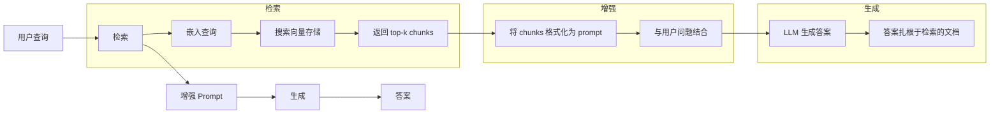
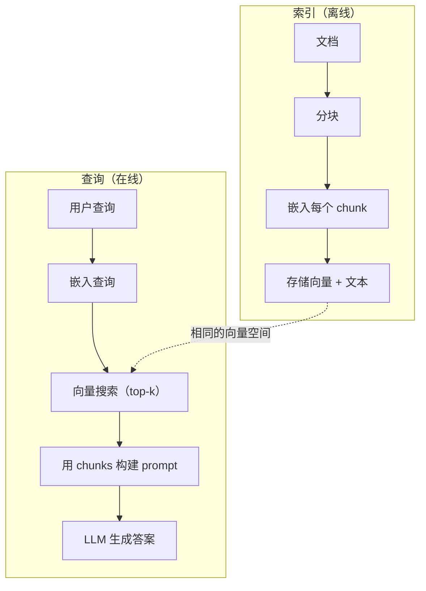

# RAG (Retrieval-Augmented Generation)

> 你的 LLM 知道训练截止日期之前的一切。它不知道你公司文档、代码库或上周的会议记录。RAG 通过检索相关文档并将它们塞进 prompt 来解决这个问题。它是生产 AI 中部署最多的模式。如果你从本课程构建一个东西，就构建一个 RAG pipeline。

**类型:** 构建
**语言:** Python
**前置知识:** Phase 10（从头学 LLM），Phase 11 · 01-05
**时间:** 约 90 分钟
**相关:** Phase 5 · 23（RAG 的 Chunking 策略）涵盖六种 chunking 算法及各自适用场景。Phase 5 · 22（Embedding Models Deep Dive）讲解选择 embedder。Phase 11 · 07（Advanced RAG）涵盖混合搜索、重排序和查询转换。

## 学习目标

- 构建完整的 RAG pipeline：文档加载、分块、嵌入、向量存储、检索和生成
- 使用向量数据库（ChromaDB、FAISS 或 Pinecone）实现语义搜索并正确索引
- 解释为什么 RAG 优于微调用于知识接地应用（成本、新鲜度、可归因性）
- 使用检索指标（precision、recall）和生成指标（faithfulness、relevance）评估 RAG 质量

## 问题

你为公司构建了一个聊天机器人。客户问："企业计划的退款政策是什么？"LLM 用关于典型 SaaS 退款政策的通用答案回复。实际政策埋在一份 200 页的内部 wiki 中，说企业客户有 60 天窗口期并按比例退款。LLM 从未见过这份文档。它无法知道它没有被训练过的内容。

微调是一个解决方案。拿 LLM，用你的内部文档训练它，然后部署更新的模型。这有效但有严重问题。微调成本数千美元的计算。文档一改变，模型就过时了。你无法知道模型从哪个来源获取答案。如果公司下个月收购另一条产品线，你又要微调。

RAG 是另一个解决方案。保持模型不变。当问题进来时，搜索你的文档存储库找相关段落，在问题之前将它们粘贴到 prompt 中，让模型使用那些段落作为上下文来回答。文档存储库可以在几分钟内更新。你可以准确看到检索了哪些文档。模型本身从不改变。这就是为什么 RAG 是生产中的主导模式：更便宜、更新鲜、更可审计，而且适用于任何 LLM。

## 概念

### RAG 模式

整个模式分为四步：



查询 -> 检索 -> 增强 prompt -> 生成。每个 RAG 系统都遵循这个模式。生产 RAG 系统之间的差异在于每个步骤的细节：如何分块、如何嵌入、如何搜索以及如何构建 prompt。

### 为什么 RAG 优于 Fine-tuning

| 关注点 | Fine-tuning | RAG |
|---------|------------|-----|
| 成本 | 每次训练运行 $1,000-$100,000+ | $0.01-$0.10 每查询（嵌入 + LLM）|
| 新鲜度 | 重新训练前过时 | 通过重新索引文档在几分钟内更新 |
| 可审计性 | 无法追踪答案到来源 | 可以显示精确检索的段落 |
| 幻觉 | 仍然自由地产生幻觉 | 扎根于检索的文档 |
| 数据隐私 | 训练数据烘入权重 | 文档保留在你的向量存储中 |

Fine-tuning 永久改变模型权重。RAG 临时改变模型上下文。对于大多数应用，临时上下文正是你想要的。

Fine-tuning 唯一胜出的情况：当需要模型采用特定的风格、语气或推理模式，而通过 prompting 无法实现时。对于事实知识检索，RAG 每次都胜出。

### Embedding 模型

Embedding 模型将文本转换为密集向量。相似文本在這個高维空间中产生靠近的向量。"How do I reset my password?" 和 "I need to change my password" 产生几乎相同的向量，尽管共享很少的词。"The cat sat on the mat" 产生一个非常不同的向量。

常见 embedding 模型（2026 阵容——见 Phase 5 · 22 获取完整分析）：

| 模型 | 维度 | 供应商 | 备注 |
|-------|-----------|----------|-------|
| text-embedding-3-small | 1536（Matryoshka）| OpenAI | 大多数用例的最佳性价比 |
| text-embedding-3-large | 3072（Matryoshka）| OpenAI | 更高准确性，可截断到 256/512/1024 |
| Gemini Embedding 2 | 3072（Matryoshka）| Google | 顶级 MTEB 检索；8K context |
| voyage-4 | 1024/2048（Matryoshka）| Voyage AI | 领域变体（code、finance、law）|
| Cohere embed-v4 | 1024（Matryoshka）| Cohere | 强多语言，128K context |
| BGE-M3 | 1024（dense + sparse + ColBERT）| BAAI（开源权重）| 一个模型三种视图 |
| Qwen3-Embedding | 4096（Matryoshka）| Alibaba（开源权重）| 顶级开源权重检索分数 |
| all-MiniLM-L6-v2 | 384 | 开源权重（Sentence Transformers）| 原型基线 |

本课中，我们使用 TF-IDF 构建自己的简单 embedding。不是因为生产系统使用 TF-IDF，而是因为它使概念具体化：文本进入，向量出来，相似文本产生相似向量。

### 向量相似度

给定两个向量，如何测量相似度？三个选项：

**余弦相似度**：两个向量之间夹角的余弦。范围从 -1（相反）到 1（相同）。忽略幅度，只关心方向。这是 RAG 的默认值。

```
cosine_sim(a, b) = dot(a, b) / (||a|| * ||b||)
```

**点积**：原始内积。更大的向量获得更高的分数。当幅度携带信息时有用（更长的文档可能更相关）。

```
dot(a, b) = sum(a_i * b_i)
```

**L2（欧几里得）距离**：向量空间中的直线距离。距离越小 = 越相似。对幅度差异敏感。

```
L2(a, b) = sqrt(sum((a_i - b_i)^2))
```

余弦相似度是标准。它优雅地处理不同长度的文档，因为它按幅度归一化。当有人说"向量搜索"，几乎总是指余弦相似度。

### Chunking 策略

文档太长无法作为单个向量嵌入。50 页 PDF 可能产生糟糕的 embedding，因为它包含数十个主题。相反，你将文档分割成 chunks 并分别嵌入每个 chunk。

**固定大小 chunking**：每 N token 分割。简单且可预测。512 token chunk，50 token 重叠意味着 chunk 1 是 token 0-511，chunk 2 是 token 462-973，等等。重叠确保你不会在不幸的边界处分割一个句子。

**语义 chunking**：在自然边界分割。段落、章节或 markdown 标题。每个 chunk 是一个连贯的意义单元。更复杂但产生更好的检索。

**递归 chunking**：首先尝试在最大边界（章节标题）分割。如果一个 section 仍然太大，在段落边界分割。如果段落仍然太大，在句子边界分割。这是 LangChain RecursiveCharacterTextSplitter 方法，在实践中效果良好。

Chunk 大小比人们想象的更重要：

- 太小（64-128 token）：每个 chunk 缺乏上下文。"它上季度增加了 15%"如果没有上下文（"它"指什么）毫无意义。
- 太大（2048+ token）：每个 chunk 涵盖多个主题，稀释相关性。当你搜索收入数据时，你得到一个 chunk，10% 关于收入，90% 关于员工数。
- 最佳点（256-512 token）：足够的上下文自包含，足够聚焦以相关。

大多数生产 RAG 系统使用 256-512 token chunks，50 token 重叠。Anthropic 的 RAG 指南推荐这个范围。

### Vector Databases

一旦你有了 embeddings，你需要地方存储和搜索它们。选项：

| 数据库 | 类型 | 最适合 |
|----------|------|----------|
| FAISS | 库（进程内）| 原型、中小数据集 |
| Chroma | 轻量级 DB | 本地开发、小部署 |
| Pinecone | 托管服务 | 生产无 ops 开销 |
| Weaviate | 开源 DB | 自托管生产 |
| pgvector | Postgres 扩展 | 已用 Postgres |
| Qdrant | 开源 DB | 高性能自托管 |

本课中，我们构建一个简单的内存向量存储。它在列表中存储向量并进行暴力余弦相似度搜索。这相当于 FAISS 与 flat index。它可以扩展到约 100,000 个向量，然后变慢。生产系统使用近似最近邻（ANN）算法如 HNSW 在毫秒内搜索数百万个向量。

### 完整 Pipeline



索引阶段每个文档运行一次（或文档更新时）。查询阶段在每个用户请求上运行。在生产中，索引可能需要数小时处理数百万文档。查询必须在秒内响应。

### 真实数字

大多数生产 RAG 系统使用这些参数：

- **k = 5 到 10** 每个查询检索的 chunks
- **Chunk 大小 = 256 到 512 token**，50 token 重叠
- **Context 预算**：每个查询 2,500-5,000 token 检索内容
- **总 prompt**：~8,000-16,000 token（system prompt + 检索 chunks + 对话历史 + 用户查询）
- **Embedding 维度**：384-3072 取决于模型
- **索引吞吐量**：使用 API embeddings 每秒 100-1,000 个文档
- **查询延迟**：检索 50-200ms，生成 500-3000ms

## 构建

### 第 1 步：文档 Chunking

```python
def chunk_text(text, chunk_size=200, overlap=50):
    words = text.split()
    chunks = []
    start = 0
    while start < len(words):
        end = start + chunk_size
        chunk = " ".join(words[start:end])
        chunks.append(chunk)
        start += chunk_size - overlap
    return chunks
```

### 第 2 步：TF-IDF Embeddings

我们构建一个简单的 embedding 函数。TF-IDF（词频-逆文档频）不是神经 embedding，但它以捕获词重要性的方式将文本转换为向量。文档中的常见词获得更高 TF。语料库中的罕见词获得更高 IDF。乘积给出一个向量，其中重要、独特的词具有高值。

```python
import math
from collections import Counter

def build_vocabulary(documents):
    vocab = set()
    for doc in documents:
        vocab.update(doc.lower().split())
    return sorted(vocab)

def compute_tf(text, vocab):
    words = text.lower().split()
    count = Counter(words)
    total = len(words)
    return [count.get(word, 0) / total for word in vocab]

def compute_idf(documents, vocab):
    n = len(documents)
    idf = []
    for word in vocab:
        doc_count = sum(1 for doc in documents if word in doc.lower().split())
        idf.append(math.log((n + 1) / (doc_count + 1)) + 1)
    return idf

def tfidf_embed(text, vocab, idf):
    tf = compute_tf(text, vocab)
    return [t * i for t, i in zip(tf, idf)]
```

### 第 3 步：余弦相似度搜索

```python
def cosine_similarity(a, b):
    dot = sum(x * y for x, y in zip(a, b))
    norm_a = math.sqrt(sum(x * x for x in a))
    norm_b = math.sqrt(sum(x * x for x in b))
    if norm_a == 0 or norm_b == 0:
        return 0.0
    return dot / (norm_a * norm_b)

def search(query_embedding, stored_embeddings, top_k=5):
    scores = []
    for i, emb in enumerate(stored_embeddings):
        sim = cosine_similarity(query_embedding, emb)
        scores.append((i, sim))
    scores.sort(key=lambda x: x[1], reverse=True)
    return scores[:top_k]
```

### 第 4 步：Prompt 构建

这就是 RAG 中"augmented"发生的地方。获取检索的 chunks，将它们格式化为 prompt，并要求 LLM 基于提供的上下文回答。

```python
def build_rag_prompt(query, retrieved_chunks):
    context = "\n\n---\n\n".join(
        f"[Source {i+1}]\n{chunk}"
        for i, chunk in enumerate(retrieved_chunks)
    )
    return f"""Answer the question based ONLY on the following context.
If the context doesn't contain enough information, say "I don't have enough information to answer that."

Context:
{context}

Question: {query}

Answer:"""
```

### 第 5 步：完整 RAG Pipeline

```python
class RAGPipeline:
    def __init__(self):
        self.chunks = []
        self.embeddings = []
        self.vocab = []
        self.idf = []

    def index(self, documents):
        all_chunks = []
        for doc in documents:
            all_chunks.extend(chunk_text(doc))
        self.chunks = all_chunks
        self.vocab = build_vocabulary(all_chunks)
        self.idf = compute_idf(all_chunks, self.vocab)
        self.embeddings = [
            tfidf_embed(chunk, self.vocab, self.idf)
            for chunk in all_chunks
        ]

    def query(self, question, top_k=5):
        query_emb = tfidf_embed(question, self.vocab, self.idf)
        results = search(query_emb, self.embeddings, top_k)
        retrieved = [(self.chunks[i], score) for i, score in results]
        prompt = build_rag_prompt(
            question, [chunk for chunk, _ in retrieved]
        )
        return prompt, retrieved
```

### 第 6 步：生成（模拟）

在生产中，这是你调用 LLM API 的地方。对于本课，我们通过从检索上下文提取最相关的句子来模拟生成。

```python
def simple_generate(prompt, retrieved_chunks):
    query_words = set(prompt.lower().split("question:")[-1].split())
    best_sentence = ""
    best_score = 0
    for chunk in retrieved_chunks:
        for sentence in chunk.split("."):
            sentence = sentence.strip()
            if not sentence:
                continue
            words = set(sentence.lower().split())
            overlap = len(query_words & words)
            if overlap > best_score:
                best_score = overlap
                best_sentence = sentence
    return best_sentence if best_sentence else "I don't have enough information."
```

## 使用

使用真实 embedding 模型和 LLM，代码几乎没有变化：

```python
from openai import OpenAI

client = OpenAI()

def embed(text):
    response = client.embeddings.create(
        model="text-embedding-3-small",
        input=text
    )
    return response.data[0].embedding

def generate(prompt):
    response = client.chat.completions.create(
        model="gpt-4o-mini",
        messages=[{"role": "user", "content": prompt}],
        temperature=0
    )
    return response.choices[0].message.content
```

或使用 Anthropic：

```python
import anthropic

client = anthropic.Anthropic()

def generate(prompt):
    response = client.messages.create(
        model="claude-sonnet-4-20250514",
        max_tokens=1024,
        messages=[{"role": "user", "content": prompt}]
    )
    return response.content[0].text
```

Pipeline 是一样的。换 embedding 函数。换生成函数。检索逻辑、分块、prompt 构建——无论你使用哪个模型都完全相同。

对于大规模向量存储，用正确的向量数据库替换暴力搜索：

```python
import chromadb

client = chromadb.Client()
collection = client.create_collection("my_docs")

collection.add(
    documents=chunks,
    ids=[f"chunk_{i}" for i in range(len(chunks))]
)

results = collection.query(
    query_texts=["What is the refund policy?"],
    n_results=5
)
```

Chroma 在内部处理 embedding（默认使用 all-MiniLM-L6-v2）并将向量存储在本地数据库中。相同的模式，不同的管道。

## 交付

本课产生：
- `outputs/prompt-rag-architect.md` —— 用于为特定用例设计 RAG 系统的 prompt
- `outputs/skill-rag-pipeline.md` —— 教 agent 如何构建和调试 RAG pipeline 的 skill

## 练习

1. 用简单的词袋方法（二进制：词存在为 1，不存在为 0）替换 TF-IDF embeddings。在示例文档上比较检索质量。TF-IDF 应该优于，因为它对罕见词权重更高。

2. 用 chunk 大小 50、100、200 和 500 在相同文档集上实验。对于每个大小，运行相同 5 个查询并计算 top-3 中返回相关 chunk 的比例。找到检索质量达到峰值的最佳点。

3. 向每个 chunk 添加元数据（源文档名称、chunk 位置）。修改 prompt 模板以包含源归属，让 LLM 引用其来源。

4. 实现一个简单评估：给定 10 个问答对，运行每个问题通过 RAG pipeline，测量检索的 chunks 中包含答案的百分比。这是 k 处的检索召回率。

5. 构建一个支持对话的 RAG pipeline：维护最后 3 个交换的历史，并在 prompt 中与检索的 chunks 一起包含它们。用后续问题如"企业呢？"在询问定价后测试。

## 关键术语

| 术语 | 人们说的 | 实际含义 |
|------|----------------|----------------------|
| RAG | "读取文档的 AI" | 检索相关文档，将它们粘贴到 prompt 中，并生成扎根于这些文档的答案 |
| Embedding | "文本转数字" | 文本的密集向量表示，其中相似含义产生相似向量 |
| Vector database | "AI 的搜索引擎" | 优化存储向量并通过相似度找到最近邻的数据存储 |
| Chunking | "将文档分割成块" | 将文档分解为更小的段（通常 256-512 token），以便每个可以独立嵌入和检索 |
| 余弦相似度 | "两个向量多相似" | 两个向量之间夹角的余弦；1 = 同方向，0 = 正交，-1 = 相反 |
| Top-k 检索 | "获取 k 个最佳匹配" | 从向量存储中返回与查询最相似的 k 个 chunks |
| Context window | "LLM 能看到多少文本" | LLM 可以在单次请求中处理的最大 token 数；检索的 chunks 必须适合这个 |
| Augmented generation | "使用给定上下文回答" | 使用检索的文档作为上下文生成响应，而不是仅依赖训练知识 |
| TF-IDF | "词重要性评分" | 词频乘以逆文档频；在语料库中加权词的独特性 |
| Indexing | "准备文档用于搜索" | 离线过程：分块、嵌入和存储文档，以便在查询时可以搜索 |

## 扩展阅读

- Lewis et al., "Retrieval-Augmented Generation for Knowledge-Intensive NLP Tasks" (2020) —— Facebook AI Research 的原始 RAG 论文，将 retrieve-then-generate 模式形式化
- Anthropic's RAG documentation (docs.anthropic.com) —— chunk 大小、prompt 构建和评估的实际指南
- Pinecone Learning Center, "What is RAG?" —— 带有生产考虑因素的 RAG pipeline 的清晰可视化解释
- Sentence-BERT: Reimers & Gurevych (2019) —— all-MiniLM embedding 模型背后的论文，展示了如何训练 bi-encoders 用于语义相似度
- [Karpukhin et al., "Dense Passage Retrieval for Open-Domain Question Answering" (EMNLP 2020)](https://arxiv.org/abs/2004.04906) —— DPR 论文，证明 dense bi-encoder 检索在开放域 QA 上优于 BM25，并为现代 RAG 检索器设定了模式。
- [LlamaIndex High-Level Concepts](https://docs.llamaindex.ai/en/stable/getting_started/concepts.html) —— 构建 RAG pipeline 时需要知道的主要概念：数据加载器、节点解析器、索引、检索器、响应合成器。
- [LangChain RAG tutorial](https://python.langchain.com/docs/tutorials/rag/) —— 相反风格的编排器；相同 retrieve-then-generate 模式的 chain-of-runnables 视图。