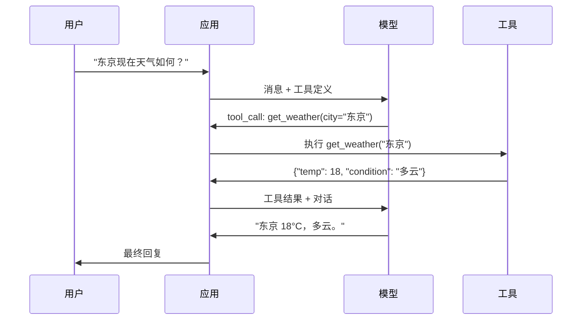

# Function Calling 与工具使用

> LLMs 什么都做不了。它们只能生成文本。这就是它的全部能力。它们不能查天气、查数据库、发邮件、运行代码或读文件。你见过的每一个"AI Agent"都是 LLM 生成 JSON 说明要调用哪个函数——然后你的代码去实际调用它。模型是大脑。工具是双手。Function Calling 是连接它们的神经系统。

**类型：** 构建
**语言：** Python
**前置要求：** Phase 11 Lesson 03（结构化输出）
**时间：** 约 75 分钟
**相关内容：** Phase 11 · 14 (Model Context Protocol) —— 当一个工具在多个主机间共享时，从内联 function-calling 升级到 MCP server。本课涵盖内联情况；MCP 涵盖协议情况。

## 学习目标

- 实现 function calling 循环：定义工具 schema、解析模型的 tool-call JSON、执行函数并返回结果
- 设计有清晰描述和类型化参数的 tool schema，使模型能够可靠地调用
- 构建多轮 Agent 循环，将多个 function call 链接起来回答复杂查询
- 处理 function calling 的边界情况：并行工具调用、错误传播、防止无限工具循环

## 问题背景

你做了一个聊天机器人。用户问："东京现在天气怎么样？"

模型回复："我无法访问实时天气数据，但根据季节，东京现在大约 15 摄氏度……"

那是穿着免责声明外衣的幻觉。模型不知道天气。它永远不会知道。天气每小时都在变。模型的训练数据是几个月前的。

正确答案需要调用 OpenWeatherMap API，获取当前温度，返回真实数字。模型不能调用 API。你的代码可以。缺失的一环：一种结构化协议，让模型说"我需要用这些参数调用天气 API"，让你的代码执行它并将结果反馈回去。

这就是 function calling。模型输出结构化 JSON，描述要调用哪个函数及参数。你的应用执行该函数。结果回到对话中。模型用它来产生最终答案。

没有 function calling，LLM 是百科全书。有了它，它们成为 Agent。

## 核心概念

### Function Calling 循环

每个工具使用交互都遵循相同的 5 步循环。



第一步：用户发送消息。第二步：模型收到消息和工具定义（描述可用函数的 JSON Schema）。第三步：模型不输出文本，而是输出一个 tool call——一个结构化 JSON 对象，包含函数名和参数。第四步：你的代码执行函数并捕获结果。第五步：结果返回给模型，模型现在有了真实数据来产生最终答案。

模型从不执行任何东西。它只决定调用什么、用什么参数。你的代码是执行者。

### 工具定义：JSON Schema 契约

每个工具由一个 JSON Schema 定义，告诉模型函数做什么、接受什么参数、参数是什么类型。

```json
{
  "type": "function",
  "function": {
    "name": "get_weather",
    "description": "获取城市当前天气。返回摄氏温度和天气状况。",
    "parameters": {
      "type": "object",
      "properties": {
        "city": {
          "type": "string",
          "description": "城市名称，例如 '东京' 或 '旧金山'"
        },
        "units": {
          "type": "string",
          "enum": ["celsius", "fahrenheit"],
          "description": "温度单位"
        }
      },
      "required": ["city"]
    }
  }
}
```

`description` 字段至关重要。模型阅读它们来决定何时及如何使用工具。像"获取天气"这样模糊的描述会比"获取城市当前天气。返回摄氏温度和天气状况。"产生更差的工具选择。description 是工具选择的 prompt。

### 主要提供商对比

每个主要提供商都支持 function calling，但 API 表面有所不同。

| 提供商 | API 参数 | 工具调用格式 | 并行调用 | 强制调用 |
|--------|---------|------------|---------|---------|
| OpenAI (GPT-5, o4) | `tools` | `tool_calls[].function` | 是（每轮多个） | `tool_choice="required"` |
| Anthropic (Claude 4.6/4.7) | `tools` | `content[].type="tool_use"` | 是（多个块） | `tool_choice={"type":"any"}` |
| Google (Gemini 3) | `function_declarations` | `functionCall` | 是 | `function_calling_config` |
| 开源模型 (Llama 4, Qwen3, DeepSeek-V3) | Llama 4 原生 `tools`；其他用 Hermes 或 ChatML | 混合 | 模型相关 | Prompt 或 `tool_choice` |

到 2026 年，三大闭源提供商的格式已近乎统一为基于 JSON Schema 的格式。Llama 4 自带与 OpenAI 形状匹配的原生 `tools` 字段。开权重微调仍然各异——Hermes 格式（NousResearch）是第三方微调中最常见的。对于跨主机的共享工具，优先使用 MCP（Phase 11 · 14）而非内联 function-calling——服务器对所有客户端都一样。

### 工具选择：自动、必需、指定

你控制模型何时使用工具。

**自动**（默认）：模型决定是否调用工具或直接回复。"2+2 等于多少？"——直接回复。"天气如何？"——调用工具。

**必需**：模型必须至少调用一个工具。当你知道用户意图需要工具时使用此选项。防止模型猜测而不是查找真实数据。

**指定函数**：强制模型调用特定函数。`tool_choice={"type":"function", "function": {"name": "get_weather"}}` 保证调用天气工具，无论查询内容如何。用于路由——当前置逻辑已确定需要哪个工具时。

### 并行 Function Calling

GPT-4o 和 Claude 可以在单轮中调用多个函数。用户问："东京和纽约的天气如何？"模型同时输出两个工具调用：

```json
[
  {"name": "get_weather", "arguments": {"city": "东京"}},
  {"name": "get_weather", "arguments": {"city": "纽约"}}
]
```

你的代码并行执行两者（理想情况下），返回两个结果，模型综合为单一回复。这将往返次数从 2 减少到 1。对于每个查询有 5-10 个工具调用的 Agent，并行调用可将延迟降低 60-80%。

### 结构化输出 vs Function Calling

Lesson 03 涵盖了结构化输出。Function calling 使用相同的 JSON Schema 机制，但目的不同。

**结构化输出**：强制模型以特定形状生成数据。输出是最终产品。示例：从文本中提取产品信息为 `{name, price, in_stock}`。

**Function calling**：模型声明要执行一个动作的意图。输出是一个中间步骤。示例：`get_weather(city="东京")`——模型请求一个动作，而非产生最终答案。

需要数据提取时使用结构化输出。需要模型与外部系统交互时使用 function calling。

### 安全：不可妥协的规则

Function calling 是你能给 LLM 的最危险的能力。模型选择执行什么。如果你的工具集包含数据库查询，模型会构造查询。如果包含 shell 命令，模型会写它们。

**规则 1：永远不要将模型生成的 SQL 直接传递给数据库。** 模型可以并且会生成 DROP TABLE、UNION 注入或返回每行的查询。始终参数化。始终验证。始终使用操作白名单。

**规则 2：工具函数要白名单化。** 模型只能调用你明确定义的函数。永远不要构建通用的"按名称执行任何函数"的工具。如果你有 50 个内部函数，只暴露用户需要的 5 个。

**规则 3：验证参数。** 模型可能会传入 `"; DROP TABLE users; --"` 这样的城市名。在执行前根据预期类型、范围和格式验证每个参数。

**规则 4：清理工具结果。** 如果工具返回敏感数据（API 密钥、PII、内部错误），在发回给模型前过滤它。模型会原封不动地将工具结果包含在回复中。

**规则 5：限制工具调用频率。** 循环中的模型可以调用数百次工具。设置上限（每轮对话 10-20 次调用是合理的）。打破无限循环。

### 错误处理

工具会失败。API 会超时。数据库会宕机。文件不存在。模型需要知道工具何时失败及原因。

返回结构化工具结果作为错误，而非异常：

```json
{
  "error": true,
  "message": "未找到城市 'Toky'。您是指 '东京' 吗？",
  "code": "CITY_NOT_FOUND"
}
```

模型阅读此信息，调整参数并重试。模型善于从结构化错误消息中自我修正。它们不善于从空回复或泛化的"出了点问题"错误中恢复。

### MCP：模型上下文协议

MCP 是 Anthropic 的开放工具互操作性标准。不是每个应用都定义自己的工具，MCP 提供了一个通用协议：工具由 MCP server 提供，被 MCP client（如 Claude Code、Cursor 或你的应用）消费。

一个 MCP server 可以向任何兼容 client 暴露工具。一个 Postgres MCP server 给予任何 MCP 兼容 Agent 数据库访问权限。一个 GitHub MCP server 给予任何 Agent 仓库访问权限。工具只需定义一次，任何地方都能用。

MCP 之于 function calling，相当于 HTTP 之于网络。它标准化了传输层，使工具变得可移植。

## 构建

### 第一步：定义工具注册表

构建一个注册表存储工具定义及其实现。每个工具有一个 JSON Schema 定义（模型看到的）和一个 Python 函数（你的代码执行的）。

```python
import json
import math
import time
import hashlib


TOOL_REGISTRY = {}


def register_tool(name, description, parameters, function):
    TOOL_REGISTRY[name] = {
        "definition": {
            "type": "function",
            "function": {
                "name": name,
                "description": description,
                "parameters": parameters,
            },
        },
        "function": function,
    }
```

### 第二步：实现 5 个工具

构建一个计算器、天气查询、Web 搜索模拟器、文件读取器和代码运行器。

```python
def calculator(expression, precision=2):
    allowed = set("0123456789+-*/.() ")
    if not all(c in allowed for c in expression):
        return {"error": True, "message": f"表达式中含有无效字符: {expression}"}
    try:
        result = eval(expression, {"__builtins__": {}}, {"math": math})
        return {"result": round(float(result), precision), "expression": expression}
    except Exception as e:
        return {"error": True, "message": str(e)}


WEATHER_DB = {
    "tokyo": {"temp_c": 18, "condition": "多云", "humidity": 72, "wind_kph": 14},
    "new york": {"temp_c": 22, "condition": "晴", "humidity": 45, "wind_kph": 8},
    "london": {"temp_c": 12, "condition": "雨", "humidity": 88, "wind_kph": 22},
    "san francisco": {"temp_c": 16, "condition": "雾", "humidity": 80, "wind_kph": 18},
    "sydney": {"temp_c": 25, "condition": "晴", "humidity": 55, "wind_kph": 10},
}


def get_weather(city, units="celsius"):
    key = city.lower().strip()
    if key not in WEATHER_DB:
        suggestions = [c for c in WEATHER_DB if c.startswith(key[:3])]
        return {
            "error": True,
            "message": f"未找到城市 '{city}'。",
            "suggestions": suggestions,
            "code": "CITY_NOT_FOUND",
        }
    data = WEATHER_DB[key].copy()
    if units == "fahrenheit":
        data["temp_f"] = round(data["temp_c"] * 9 / 5 + 32, 1)
        del data["temp_c"]
    data["city"] = city
    return data


SEARCH_DB = {
    "python function calling": [
        {"title": "OpenAI Function Calling 指南", "url": "https://platform.openai.com/docs/guides/function-calling", "snippet": "了解如何将 LLM 连接到外部工具。"},
        {"title": "Anthropic Tool Use", "url": "https://docs.anthropic.com/en/docs/tool-use", "snippet": "Claude 可以与外部工具和 API 交互。"},
    ],
    "MCP protocol": [
        {"title": "Model Context Protocol", "url": "https://modelcontextprotocol.io", "snippet": "将 AI 模型连接到数据源的开放标准。"},
    ],
    "weather API": [
        {"title": "OpenWeatherMap API", "url": "https://openweathermap.org/api", "snippet": "提供当前、预报和历史数据的免费天气 API。"},
    ],
}


def web_search(query, max_results=3):
    key = query.lower().strip()
    for db_key, results in SEARCH_DB.items():
        if db_key in key or key in db_key:
            return {"query": query, "results": results[:max_results], "total": len(results)}
    return {"query": query, "results": [], "total": 0}


FILE_SYSTEM = {
    "data/config.json": '{"model": "gpt-4o", "temperature": 0.7, "max_tokens": 4096}',
    "data/users.csv": "name,email,role\nAlice,alice@example.com,admin\nBob,bob@example.com,user",
    "README.md": "# My Project\n一个从头构建的工具使用 Agent。",
}


def read_file(path):
    if ".." in path or path.startswith("/"):
        return {"error": True, "message": "不允许路径遍历。", "code": "FORBIDDEN"}
    if path not in FILE_SYSTEM:
        available = list(FILE_SYSTEM.keys())
        return {"error": True, "message": f"未找到文件 '{path}'。", "available_files": available, "code": "NOT_FOUND"}
    content = FILE_SYSTEM[path]
    return {"path": path, "content": content, "size_bytes": len(content), "lines": content.count("\n") + 1}


def run_code(code, language="python"):
    if language != "python":
        return {"error": True, "message": f"不支持语言 '{language}'。仅支持 'python'。"}
    forbidden = ["import os", "import sys", "import subprocess", "exec(", "eval(", "__import__", "open("]
    for pattern in forbidden:
        if pattern in code:
            return {"error": True, "message": f"禁止操作: {pattern}", "code": "SECURITY_VIOLATION"}
    try:
        local_vars = {}
        exec(code, {"__builtins__": {"print": print, "range": range, "len": len, "str": str, "int": int, "float": float, "list": list, "dict": dict, "sum": sum, "min": min, "max": max, "abs": abs, "round": round, "sorted": sorted, "enumerate": enumerate, "zip": zip, "map": map, "filter": filter, "math": math}}, local_vars)
        result = local_vars.get("result", None)
        return {"success": True, "result": result, "variables": {k: str(v) for k, v in local_vars.items() if not k.startswith("_")}}
    except Exception as e:
        return {"error": True, "message": f"{type(e).__name__}: {e}"}
```

### 第三步：注册所有工具

```python
def register_all_tools():
    register_tool(
        "calculator", "计算数学表达式。支持 +、-、*、/、括号和小数。返回数值结果。",
        {"type": "object", "properties": {"expression": {"type": "string", "description": "数学表达式，例如 '(10 + 5) * 3'"}, "precision": {"type": "integer", "description": "结果小数位数", "default": 2}}, "required": ["expression"]},
        calculator,
    )
    register_tool(
        "get_weather", "获取城市当前天气。返回温度、天气状况、湿度和风速。",
        {"type": "object", "properties": {"city": {"type": "string", "description": "城市名称，例如 '东京' 或 '旧金山'"}, "units": {"type": "string", "enum": ["celsius", "fahrenheit"], "description": "温度单位，默认为摄氏"}}, "required": ["city"]},
        get_weather,
    )
    register_tool(
        "web_search", "在网上搜索信息。返回包含标题、URL 和摘要的结果列表。",
        {"type": "object", "properties": {"query": {"type": "string", "description": "搜索查询"}, "max_results": {"type": "integer", "description": "返回的最大结果数", "default": 3}}, "required": ["query"]},
        web_search,
    )
    register_tool(
        "read_file", "读取文件内容。返回文件内容、大小和行数。",
        {"type": "object", "properties": {"path": {"type": "string", "description": "相对文件路径，例如 'data/config.json'"}}, "required": ["path"]},
        read_file,
    )
    register_tool(
        "run_code", "在沙箱环境中执行 Python 代码。设置 'result' 变量以返回输出。",
        {"type": "object", "properties": {"code": {"type": "string", "description": "要执行的 Python 代码"}, "language": {"type": "string", "enum": ["python"], "description": "编程语言"}}, "required": ["code"]},
        run_code,
    )
```

### 第四步：构建 Function Calling 循环

这是核心引擎。它模拟模型决定调用哪个工具，执行工具，并将结果反馈回去。

```python
def simulate_model_decision(user_message, tools, conversation_history):
    msg = user_message.lower()

    if any(word in msg for word in ["weather", "temperature", "forecast"]):
        cities = []
        for city in WEATHER_DB:
            if city in msg:
                cities.append(city)
        if not cities:
            for word in msg.split():
                if word.capitalize() in [c.title() for c in WEATHER_DB]:
                    cities.append(word)
        if not cities:
            cities = ["tokyo"]
        calls = []
        for city in cities:
            calls.append({"name": "get_weather", "arguments": {"city": city.title()}})
        return calls

    if any(word in msg for word in ["calculate", "compute", "math", "what is", "how much"]):
        for token in msg.split():
            if any(c in token for c in "+-*/"):
                return [{"name": "calculator", "arguments": {"expression": token}}]
        if "+" in msg or "-" in msg or "*" in msg or "/" in msg:
            expr = "".join(c for c in msg if c in "0123456789+-*/.() ")
            if expr.strip():
                return [{"name": "calculator", "arguments": {"expression": expr.strip()}}]
        return [{"name": "calculator", "arguments": {"expression": "0"}}]

    if any(word in msg for word in ["search", "find", "look up", "google"]):
        query = msg.replace("search for", "").replace("look up", "").replace("find", "").strip()
        return [{"name": "web_search", "arguments": {"query": query}}]

    if any(word in msg for word in ["read", "file", "open", "cat", "show"]):
        for path in FILE_SYSTEM:
            if path.split("/")[-1].split(".")[0] in msg:
                return [{"name": "read_file", "arguments": {"path": path}}]
        return [{"name": "read_file", "arguments": {"path": "README.md"}}]

    if any(word in msg for word in ["run", "execute", "code", "python"]):
        return [{"name": "run_code", "arguments": {"code": "result = 'Hello from the sandbox!'", "language": "python"}}]

    return []


def execute_tool_call(tool_call):
    name = tool_call["name"]
    args = tool_call["arguments"]

    if name not in TOOL_REGISTRY:
        return {"error": True, "message": f"未知工具: {name}", "code": "UNKNOWN_TOOL"}

    tool = TOOL_REGISTRY[name]
    func = tool["function"]
    start = time.time()

    try:
        result = func(**args)
    except TypeError as e:
        result = {"error": True, "message": f"参数无效: {e}"}

    elapsed_ms = round((time.time() - start) * 1000, 2)
    return {"tool": name, "result": result, "execution_time_ms": elapsed_ms}


def run_function_calling_loop(user_message, max_iterations=5):
    conversation = [{"role": "user", "content": user_message}]
    tool_definitions = [t["definition"] for t in TOOL_REGISTRY.values()]
    all_tool_results = []

    for iteration in range(max_iterations):
        tool_calls = simulate_model_decision(user_message, tool_definitions, conversation)

        if not tool_calls:
            break

        results = []
        for call in tool_calls:
            result = execute_tool_call(call)
            results.append(result)

        conversation.append({"role": "assistant", "content": None, "tool_calls": tool_calls})

        for result in results:
            conversation.append({"role": "tool", "content": json.dumps(result["result"]), "tool_name": result["tool"]})

        all_tool_results.extend(results)
        break

    return {"conversation": conversation, "tool_results": all_tool_results, "iterations": iteration + 1 if tool_calls else 0}
```

### 第五步：参数验证

构建一个验证器，在执行前根据 JSON Schema 检查工具调用参数。

```python
def validate_tool_arguments(tool_name, arguments):
    if tool_name not in TOOL_REGISTRY:
        return [f"未知工具: {tool_name}"]

    schema = TOOL_REGISTRY[tool_name]["definition"]["function"]["parameters"]
    errors = []

    if not isinstance(arguments, dict):
        return [f"参数必须是对象，获得 {type(arguments).__name__}"]

    for required_field in schema.get("required", []):
        if required_field not in arguments:
            errors.append(f"缺少必需参数: {required_field}")

    properties = schema.get("properties", {})
    for arg_name, arg_value in arguments.items():
        if arg_name not in properties:
            errors.append(f"未知参数: {arg_name}")
            continue

        prop_schema = properties[arg_name]
        expected_type = prop_schema.get("type")

        type_checks = {"string": str, "integer": int, "number": (int, float), "boolean": bool, "array": list, "object": dict}
        if expected_type in type_checks:
            if not isinstance(arg_value, type_checks[expected_type]):
                errors.append(f"参数 '{arg_name}'：预期 {expected_type}，获得 {type(arg_value).__name__}")

        if "enum" in prop_schema and arg_value not in prop_schema["enum"]:
            errors.append(f"参数 '{arg_name}'：'{arg_value}' 不在 {prop_schema['enum']} 中")

    return errors
```

### 第六步：运行演示

```python
def run_demo():
    register_all_tools()

    print("=" * 60)
    print("  Function Calling 与工具使用演示")
    print("=" * 60)

    print("\n--- 已注册工具 ---")
    for name, tool in TOOL_REGISTRY.items():
        desc = tool["definition"]["function"]["description"][:60]
        params = list(tool["definition"]["function"]["parameters"].get("properties", {}).keys())
        print(f"  {name}: {desc}...")
        print(f"    params: {params}")

    print(f"\n--- 参数验证 ---")
    validation_tests = [
        ("get_weather", {"city": "东京"}, "有效调用"),
        ("get_weather", {}, "缺少必需参数"),
        ("get_weather", {"city": "东京", "units": "kelvin"}, "无效枚举值"),
        ("calculator", {"expression": 123}, "类型错误（整型而非字符串）"),
        ("unknown_tool", {"x": 1}, "未知工具"),
    ]
    for tool_name, args, label in validation_tests:
        errors = validate_tool_arguments(tool_name, args)
        status = "VALID" if not errors else f"ERRORS: {errors}"
        print(f"  {label}: {status}")

    print(f"\n--- 工具执行 ---")
    direct_tests = [
        {"name": "calculator", "arguments": {"expression": "(10 + 5) * 3 / 2"}},
        {"name": "get_weather", "arguments": {"city": "东京"}},
        {"name": "get_weather", "arguments": {"city": "火星"}},
        {"name": "web_search", "arguments": {"query": "python function calling"}},
        {"name": "read_file", "arguments": {"path": "data/config.json"}},
        {"name": "read_file", "arguments": {"path": "../etc/passwd"}},
        {"name": "run_code", "arguments": {"code": "result = sum(range(1, 101))"}},
        {"name": "run_code", "arguments": {"code": "import os; os.system('rm -rf /')"}},
    ]
    for call in direct_tests:
        result = execute_tool_call(call)
        print(f"\n  {call['name']}({json.dumps(call['arguments'])})")
        print(f"    -> {json.dumps(result['result'], indent=None)[:100]}")
        print(f"    time: {result['execution_time_ms']}ms")

    print(f"\n--- 完整 Function Calling 循环 ---")
    test_queries = [
        "东京的天气怎么样？",
        "计算 (100 + 250) * 0.15",
        "搜索 MCP protocol",
        "读取配置文件",
        "运行一些 Python 代码",
        "讲个笑话",
    ]
    for query in test_queries:
        print(f"\n  用户: {query}")
        result = run_function_calling_loop(query)
        if result["tool_results"]:
            for tr in result["tool_results"]:
                print(f"    工具: {tr['tool']} ({tr['execution_time_ms']}ms)")
                print(f"    结果: {json.dumps(tr['result'], indent=None)[:90]}")
        else:
            print(f"    [未调用工具 -- 直接回复]")
        print(f"    迭代次数: {result['iterations']}")

    print(f"\n--- 并行工具调用 ---")
    multi_city_query = "东京和伦敦的天气怎么样？"
    print(f"  用户: {multi_city_query}")
    result = run_function_calling_loop(multi_city_query)
    print(f"  调用的工具数: {len(result['tool_results'])}")
    for tr in result["tool_results"]:
        city = tr["result"].get("city", "unknown")
        temp = tr["result"].get("temp_c", "N/A")
        print(f"    {city}: {temp}°C, {tr['result'].get('condition', 'N/A')}")

    print(f"\n--- 安全检查 ---")
    security_tests = [
        ("read_file", {"path": "../../etc/passwd"}),
        ("run_code", {"code": "import subprocess; subprocess.run(['ls'])"}),
        ("calculator", {"expression": "__import__('os').system('ls')"}),
    ]
    for tool_name, args in security_tests:
        result = execute_tool_call({"name": tool_name, "arguments": args})
        blocked = result["result"].get("error", False)
        print(f"  {tool_name}({list(args.values())[0][:40]}): {'BLOCKED' if blocked else 'ALLOWED'}")
```

## 使用

### OpenAI Function Calling

```python
# from openai import OpenAI
#
# client = OpenAI()
#
# tools = [{
#     "type": "function",
#     "function": {
#         "name": "get_weather",
#         "description": "获取城市当前天气",
#         "parameters": {
#             "type": "object",
#             "properties": {
#                 "city": {"type": "string"},
#                 "units": {"type": "string", "enum": ["celsius", "fahrenheit"]}
#             },
#             "required": ["city"]
#         }
#     }
# }]
#
# response = client.chat.completions.create(
#     model="gpt-4o",
#     messages=[{"role": "user", "content": "东京天气如何？"}],
#     tools=tools,
#     tool_choice="auto",
# )
#
# tool_call = response.choices[0].message.tool_calls[0]
# args = json.loads(tool_call.function.arguments)
# result = get_weather(**args)
#
# final = client.chat.completions.create(
#     model="gpt-4o",
#     messages=[
#         {"role": "user", "content": "东京天气如何？"},
#         response.choices[0].message,
#         {"role": "tool", "tool_call_id": tool_call.id, "content": json.dumps(result)},
#     ],
# )
# print(final.choices[0].message.content)
```

OpenAI 将工具调用作为 `response.choices[0].message.tool_calls` 返回。每个调用有一个返回结果时必须包含的 `id`。模型用这个 ID 将结果与调用匹配。GPT-4o 可以在单次回复中返回多个工具调用——遍历并执行所有。

### Anthropic 工具使用

```python
# import anthropic
#
# client = anthropic.Anthropic()
#
# response = client.messages.create(
#     model="claude-sonnet-4-20250514",
#     max_tokens=1024,
#     tools=[{
#         "name": "get_weather",
#         "description": "获取城市当前天气",
#         "input_schema": {
#             "type": "object",
#             "properties": {
#                 "city": {"type": "string"},
#                 "units": {"type": "string", "enum": ["celsius", "fahrenheit"]}
#             },
#             "required": ["city"]
#         }
#     }],
#     messages=[{"role": "user", "content": "东京天气如何？"}],
# )
#
# tool_block = next(b for b in response.content if b.type == "tool_use")
# result = get_weather(**tool_block.input)
#
# final = client.messages.create(
#     model="claude-sonnet-4-20250514",
#     max_tokens=1024,
#     tools=[...],
#     messages=[
#         {"role": "user", "content": "东京天气如何？"},
#         {"role": "assistant", "content": response.content},
#         {"role": "user", "content": [{"type": "tool_result", "tool_use_id": tool_block.id, "content": json.dumps(result)}]},
#     ],
# )
```

Anthropic 将工具调用作为 `type: "tool_use"` 的内容块返回。工具结果作为 `type: "tool_result"` 的用户消息放回。注意关键区别：Anthropic 用 `input_schema` 定义工具参数，而 OpenAI 用 `parameters`。

### MCP 集成

```python
# MCP server 通过标准化协议暴露工具。
# 任何 MCP 兼容的 client 都可以发现和调用这些工具。
#
# 示例：连接到一个 Postgres MCP server
#
# from mcp import ClientSession, StdioServerParameters
# from mcp.client.stdio import stdio_client
#
# server_params = StdioServerParameters(
#     command="npx",
#     args=["-y", "@modelcontextprotocol/server-postgres", "postgresql://localhost/mydb"],
# )
#
# async with stdio_client(server_params) as (read, write):
#     async with ClientSession(read, write) as session:
#         await session.initialize()
#         tools = await session.list_tools()
#         result = await session.call_tool("query", {"sql": "SELECT count(*) FROM users"})
```

MCP 将工具实现与工具消费解耦。Postgres server 懂 SQL。GitHub server 懂 API。你的 Agent 只需发现和调用工具——不需要为每个集成写特定于提供商的代码。

## 上线

本课产出 `outputs/prompt-tool-designer.md` —— 一个用于设计工具定义的可复用 prompt 模板。给它一个工具要做什么的描述，它会生成完整的 JSON Schema 定义，包含描述、类型和约束。

还产出 `outputs/skill-function-calling-patterns.md` —— 一个在生产环境中实现 function calling 的决策框架，涵盖工具设计、错误处理、安全性和特定于提供商的模式。

## 练习

1. **添加第 6 个工具：数据库查询。** 实现一个模拟 SQL 工具，带内存表。工具接受表名和过滤条件（非原始 SQL）。验证表名在白名单中，过滤操作符仅限于 `=`、`>`、`<`、`>=`、`<=`。以 JSON 形式返回匹配行。

2. **实现带错误反馈的重试。** 当工具调用失败时（例如城市未找到），将错误消息反馈给模型决策函数，让它修正参数。跟踪每次调用花了多少次重试。每个工具调用最多重试 3 次。

3. **构建多步 Agent。** 某些查询需要链接工具调用："读取配置文件，告诉我配置了哪个模型，然后搜索该模型的定价。" 实现一个循环，运行直到模型决定不再需要工具，将累积结果传递到每个决策步骤。限制为 10 次迭代以防止无限循环。

4. **测量工具选择准确率。** 创建 30 个带预期工具名的测试查询。在所有 30 个上运行决策函数，测量它选择正确工具的百分比。识别哪些查询在工具之间造成最多混淆。

5. **实现工具调用缓存。** 如果相同工具在 60 秒内以相同参数被调用，返回缓存结果而不是重新执行。用 `(tool_name, frozenset(args.items()))` 作为键的字典。以 20 个查询的对话测量缓存命中率。

## 关键术语

| 术语 | 常见说法 | 实际含义 |
|------|---------|---------|
| Function calling | "工具使用" | 模型输出结构化 JSON 描述要调用的函数及参数——你的代码执行它，不是模型 |
| 工具定义 | "函数 schema" | 描述工具名称、用途、参数和类型的 JSON Schema 对象——模型阅读它来决定何时及如何使用工具 |
| 工具选择 | "调用模式" | 控制模型是否必须调用工具（必需）、可以调用工具（自动）还是必须调用特定工具（指定） |
| 并行调用 | "多工具" | 模型在单轮中输出多个工具调用，减少往返次数——GPT-4o 和 Claude 都支持 |
| 工具结果 | "函数输出" | 执行工具的返回值，作为消息发回给模型，以便它在回复中使用真实数据 |
| 参数验证 | "输入检查" | 在执行工具前验证模型生成的参数是否符合预期类型、范围和约束 |
| MCP | "工具协议" | Model Context Protocol——Anthropic 的开放标准，通过 server 向任何兼容 client 暴露工具 |
| Agent 循环 | "ReAct 循环" | 模型决定工具→代码执行工具→结果反馈的迭代循环，直到模型有足够信息回复 |
| 工具污染 | "通过工具的 prompt 注入" | 工具结果包含操纵模型行为的隐藏指令的攻击——清理所有工具输出 |
| 频率限制 | "调用预算" | 设置每轮对话的最大工具调用次数，防止无限循环和失控的 API 成本 |

## 扩展阅读

- [OpenAI Function Calling 指南](https://platform.openai.com/docs/guides/function-calling) —— GPT-4o 工具使用的权威参考，包括并行调用、强制调用和结构化参数
- [Anthropic 工具使用指南](https://docs.anthropic.com/en/docs/tool-use) —— Claude 的工具使用实现，包含 input_schema、多工具回复和 tool_choice 配置
- [Model Context Protocol 规范](https://modelcontextprotocol.io) —— AI 应用间工具互操作性的开放标准，包含 server/client 架构
- [Schick et al., 2023 -- "Toolformer: Language Models Can Teach Themselves to Use Tools"](https://arxiv.org/abs/2302.04761) —— 训练 LLM 决定何时及如何调用外部工具的开创性论文
- [Patil et al., 2023 -- "Gorilla: Large Language Model Connected with Massive APIs"](https://arxiv.org/abs/2305.15334) —— 在 1,645 个 API 上微调 LLM 进行准确 API 调用，减少幻觉
- [Berkeley Function Calling Leaderboard](https://gorilla.cs.berkeley.edu/leaderboard.html) —— 实时基准比较 GPT-4o、Claude、Gemini 和开源模型的 function calling 准确率
- [Yao et al., "ReAct: Synergizing Reasoning and Acting in Language Models" (ICLR 2023)](https://arxiv.org/abs/2210.03629) —— Thought-Action-Observation 循环，是每个工具调用的外部 Agent 循环；本课结束的地方，Phase 14 接着讲
- [Anthropic -- Building effective agents (Dec 2024)](https://www.anthropic.com/research/building-effective-agents) —— 五个可组合模式（prompt chaining、routing、parallelization、orchestrator-workers、evaluator-optimizer），由单一工具使用原语构建