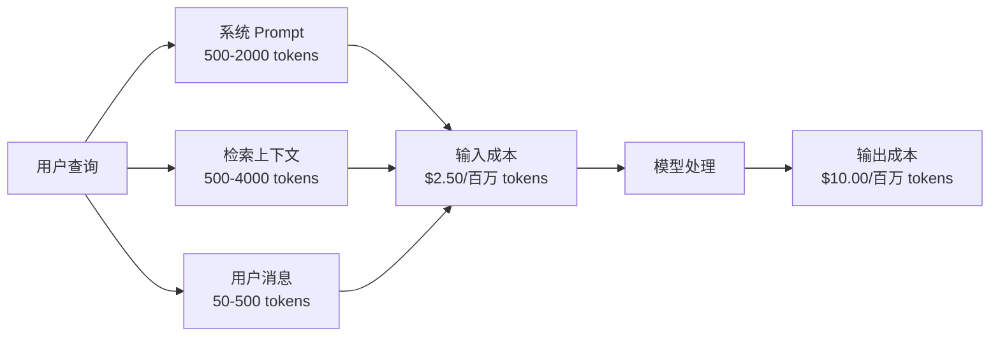
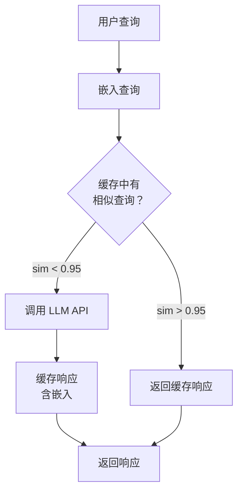
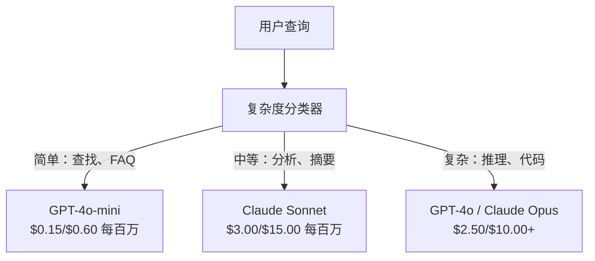

# 缓存、频率限制与成本优化

> 大多数 AI 创业公司不是死于坏模型，而是死于糟糕的单位经济学。一次 GPT-4o 调用只需几分钱。一万个用户每天打十个电话，光输入 token 就花 $250——在你收到一分钱之前。活下来的公司是把每次 API 调用当财务交易来对待，而非一次函数调用。

**类型：** 构建
**语言：** Python
**前置要求：** Phase 11 Lesson 09（Function Calling）
**时间：** 约 45 分钟
**相关内容：** Phase 11 · 15（Prompt 缓存）——本课涵盖应用层缓存（语义缓存、精确哈希缓存、模型路由）。Lesson 15 涵盖提供商层 prompt 缓存（Anthropic cache_control、OpenAI 自动、Gemini CachedContent）。两者结合可节省 50-95% 成本。

## 学习目标

- 实现语义缓存，对重复或相似查询从缓存提供服务，而非发起新的 API 调用
- 计算跨提供商的每次请求成本，并实现基于 token 的频率限制和预算警报
- 构建带 prompt 压缩、模型路由（贵 vs 便宜）和响应缓存的成本优化层
- 设计分层缓存策略，对不同查询类型使用精确匹配、语义相似度和前缀缓存

## 问题背景

你做了一个 RAG 聊天机器人。效果很棒。用户喜欢它。

然后账单来了。

GPT-5 每百万输入 token $5，每百万输出 $15。Claude Opus 4.7 每百万 $15/$75。Gemini 3 Pro 每百万 $1.25/$5。以下价格仅供参考；请始终查看提供商的当前定价页。

以下是杀死创业公司的数学：

- 每天 10,000 个活跃用户
- 每个用户每天 10 次查询
- 每次查询 1,000 输入 token（系统 prompt + 上下文 + 用户消息）
- 每次回复 500 输出 token

**每日输入成本：** 10,000 x 10 x 1,000 / 1,000,000 x $2.50 = **$250/天**
**每日输出成本：** 10,000 x 10 x 500 / 1,000,000 x $10.00 = **$500/天**
**每月总计：** **$22,500/月**

这只是 LLM。算上嵌入、向量数据库托管、基础设施。你在看一个聊天机器人 $30,000/月。

残酷的部分：40-60% 的查询是近乎重复的。用户用稍微不同的词问同样的问题。你的系统 prompt——在每个请求中都相同——每次都计费。RAG 检索的上下文文档在问同一主题的用户间重复。

你在为冗余计算付全价。

## 核心概念

### LLM 调用的成本构成

每个 API 调用有五个成本组成部分。



系统 prompt 是沉默的杀手。带有 1,500-token 系统 prompt 的每个请求，在该前缀上花 $3.75/百万请求。在 100K 请求/天，那是 $375/天——$11,250/月——对于从不改变的文本。

### 提供商缓存：内置折扣

2026 年三大提供商都提供提供商端 prompt 缓存，但机制不同。参见 Phase 11 · 15 深度讲解。

| 提供商 | 机制 | 折扣 | 最低要求 | 缓存持续时间 |
|--------|------|------|---------|------------|
| Anthropic | 显式 cache_control 标记 | 命中折扣 90%（写入加收 25%） | 1,024 tokens（Sonnet/Opus），2,048（Haiku） | 默认 5 分钟；1 小时扩展（2x 写入溢价） |
| OpenAI | 自动前缀匹配 | 命中折扣 50% | 1,024 tokens | 尽力而为，最长 1 小时 |
| Google Gemini | 显式 CachedContent API | 按存储计费；读取约正常价的 25% | 4,096（Flash）/ 32,768（Pro） | 用户可配置（默认 1 小时） |

**Anthropic 的方法**是显式的。你在 prompt 部分用 `cache_control: {"type": "ephemeral"}` 标记。第一次请求支付 25% 写入溢价。后续相同前缀的请求获得 90% 折扣。一个通常花费 $0.005 的 2,000-token 系统 prompt，在缓存命中时花费 $0.000625。10 万次请求，节省 $437.50/天。

**OpenAI 的方法**是自动的。任何匹配先前请求的前缀都获得 50% 折扣。无需标记。权衡：折扣较小，控制较少，但零实现工作量。

### 语义缓存：你的自定义层

提供商缓存仅对相同前缀有效。语义缓存处理更困难的情况：意思相同但措辞不同的查询。

"退货政策是什么？"和"如何退货？"是不同的字符串但意图相同。语义缓存将两个查询都嵌入，计算余弦相似度，如果相似度超过阈值（通常 0.92-0.95）则返回缓存响应。



嵌入成本可以忽略不计。OpenAI 的 text-embedding-3-small 每百万 token $0.02。检查缓存的成本相比完整 LLM 调用几乎为零。

### 精确缓存：哈希与匹配

对于确定性调用（temperature=0，相同模型，相同 prompt），精确缓存更简单更快。将完整 prompt 哈希，检查缓存，如果有则返回。

这完美适用于：
- 系统 prompt + 固定上下文 + 相同用户查询
- 带相同工具定义的 function calling
- 批处理，其中同一文档被处理多次

### 频率限制：保护你的预算

频率限制不只是关乎公平，而是关乎生存。

**Token bucket 算法：** 每个用户获得一个 N 个 token 的桶，以每秒 R 个 token 的速率补充。请求消耗桶中的 token。如果桶空了，请求被拒绝。这允许突发（立即用完整桶），同时执行平均速率。

**按用户配额：** 为每个用户层级设置每日/每月 token 限制。

| 层级 | 每日 Token 限制 | 最大请求/分钟 | 模型访问 |
|------|---------------|------------|---------|
| 免费 | 50,000 | 10 | 仅 GPT-4o-mini |
| 专业 | 500,000 | 60 | GPT-4o、Claude Sonnet |
| 企业 | 5,000,000 | 300 | 所有模型 |

### 模型路由：正确的工作用正确的模型

不是每个查询都需要 GPT-4o。

"商店几点关门？"不需要 $10/百万输出的模型。$0.60/百万输出的 GPT-4o-mini 完美处理。$1.25/百万输出的 Claude Haiku 也可以。一个简单的分类器将廉价查询路由到廉价模型，复杂查询路由到昂贵模型。



一个调优良好的路由器仅在模型成本上节省 40-70%。

### 成本追踪：知道钱花在哪里

你无法优化你看不见的。每次 API 调用记录：
- 时间戳
- 模型名称
- 输入 token
- 输出 token
- 延迟（ms）
- 计算成本（$）
- 用户 ID
- 缓存命中/未命中
- 请求类别

这些数据揭示哪些功能昂贵、哪些用户消耗多、哪里缓存影响最大。

### 批处理：批量折扣

OpenAI 的 Batch API 以 50% 折扣异步处理请求。你提交最多 50,000 个请求的批次，结果在 24 小时内返回。

批处理用于：
- 夜间文档处理
- 批量分类
- 评估运行
- 数据富化流水线

不用于：需要实时响应的用户面向查询（延迟很重要）。

### 预算警报和断路器

断路器在你达到限制时停止消费。没有它，一个 bug 或滥用会在几小时内耗尽你整月预算。

设置三个阈值：
1. **警告**（预算的 70%）：发送警报
2. **限流**（预算的 85%）：切换到仅更便宜的模型
3. **停止**（预算的 95%）：拒绝新请求，仅返回缓存响应

### 优化技术栈

按顺序应用这些技术。每一层在前一层基础上叠加。

| 层级 | 技术 | 典型节省 | 实现难度 |
|------|------|---------|---------|
| 1 | 提供商 prompt 缓存 | 30-50% | 低（添加缓存标记） |
| 2 | 精确缓存 | 10-20% | 低（哈希 + 字典） |
| 3 | 语义缓存 | 15-30% | 中（嵌入 + 相似度） |
| 4 | 模型路由 | 40-70% | 中（分类器） |
| 5 | 频率限制 | 保护预算 | 低（token bucket） |
| 6 | Prompt 压缩 | 10-30% | 中（重写 prompt） |
| 7 | 批处理 | 符合条件的 50% | 低（批处理 API） |

应用层 1-5 的 RAG 应用通常将成本从 $22,500/月 减少到 $4,000-6,000/月。这就是烧钱和建立业务之间的区别。

### 实际节省：优化前后

这是一个服务 10,000 DAU 的 RAG 聊天机器人的真实分解。

| 指标 | 优化前 | 优化后 | 节省 |
|------|-------|-------|------|
| 每月 LLM 成本 | $22,500 | $5,200 | 77% |
| 每次查询平均成本 | $0.0075 | $0.0017 | 77% |
| 缓存命中率 | 0% | 52% | -- |
| 路由到 mini 的查询 | 0% | 65% | -- |
| P95 延迟 | 2,800ms | 900ms（缓存命中：50ms） | 68% |
| 每月嵌入成本 | $0 | $180 | （新成本） |
| 每月总成本 | $22,500 | $5,380 | 76% |

语义缓存的嵌入成本（$180/月）在缓存命中的第一小时内就回本了。

## 构建

### 第一步：成本计算器

构建一个了解主要模型当前定价的 token 成本计算器。

```python
import hashlib
import time
import json
import math
from dataclasses import dataclass, field


MODEL_PRICING = {
    "gpt-4o": {"input": 2.50, "output": 10.00, "cached_input": 1.25},
    "gpt-4o-mini": {"input": 0.15, "output": 0.60, "cached_input": 0.075},
    "gpt-4.1": {"input": 2.00, "output": 8.00, "cached_input": 0.50},
    "gpt-4.1-mini": {"input": 0.40, "output": 1.60, "cached_input": 0.10},
    "gpt-4.1-nano": {"input": 0.10, "output": 0.40, "cached_input": 0.025},
    "o3": {"input": 2.00, "output": 8.00, "cached_input": 0.50},
    "o3-mini": {"input": 1.10, "output": 4.40, "cached_input": 0.55},
    "o4-mini": {"input": 1.10, "output": 4.40, "cached_input": 0.275},
    "claude-opus-4": {"input": 15.00, "output": 75.00, "cached_input": 1.50},
    "claude-sonnet-4": {"input": 3.00, "output": 15.00, "cached_input": 0.30},
    "claude-haiku-3.5": {"input": 0.80, "output": 4.00, "cached_input": 0.08},
    "gemini-2.5-pro": {"input": 1.25, "output": 10.00, "cached_input": 0.3125},
    "gemini-2.5-flash": {"input": 0.15, "output": 0.60, "cached_input": 0.0375},
}


def calculate_cost(model, input_tokens, output_tokens, cached_input_tokens=0):
    if model not in MODEL_PRICING:
        return {"error": f"Unknown model: {model}"}
    pricing = MODEL_PRICING[model]
    non_cached = input_tokens - cached_input_tokens
    input_cost = (non_cached / 1_000_000) * pricing["input"]
    cached_cost = (cached_input_tokens / 1_000_000) * pricing["cached_input"]
    output_cost = (output_tokens / 1_000_000) * pricing["output"]
    total = input_cost + cached_cost + output_cost
    return {
        "model": model,
        "input_tokens": input_tokens,
        "output_tokens": output_tokens,
        "cached_input_tokens": cached_input_tokens,
        "input_cost": round(input_cost, 6),
        "cached_input_cost": round(cached_cost, 6),
        "output_cost": round(output_cost, 6),
        "total_cost": round(total, 6),
    }
```

### 第二步：精确缓存

将完整 prompt 哈希，对相同请求返回缓存响应。

```python
class ExactCache:
    def __init__(self, max_size=1000, ttl_seconds=3600):
        self.cache = {}
        self.max_size = max_size
        self.ttl = ttl_seconds
        self.hits = 0
        self.misses = 0

    def _hash(self, model, messages, temperature):
        key_data = json.dumps({"model": model, "messages": messages, "temperature": temperature}, sort_keys=True)
        return hashlib.sha256(key_data.encode()).hexdigest()

    def get(self, model, messages, temperature=0.0):
        if temperature > 0:
            self.misses += 1
            return None
        key = self._hash(model, messages, temperature)
        if key in self.cache:
            entry = self.cache[key]
            if time.time() - entry["timestamp"] < self.ttl:
                self.hits += 1
                entry["access_count"] += 1
                return entry["response"]
            del self.cache[key]
        self.misses += 1
        return None

    def put(self, model, messages, temperature, response):
        if temperature > 0:
            return
        if len(self.cache) >= self.max_size:
            oldest_key = min(self.cache, key=lambda k: self.cache[k]["timestamp"])
            del self.cache[oldest_key]
        key = self._hash(model, messages, temperature)
        self.cache[key] = {
            "response": response,
            "timestamp": time.time(),
            "access_count": 1,
        }

    def stats(self):
        total = self.hits + self.misses
        return {
            "hits": self.hits,
            "misses": self.misses,
            "hit_rate": round(self.hits / total, 4) if total > 0 else 0,
            "cache_size": len(self.cache),
        }
```

### 第三步：语义缓存

嵌入查询，当相似度超过阈值时返回缓存响应。

```python
def simple_embed(text):
    words = text.lower().split()
    vocab = {}
    for w in words:
        vocab[w] = vocab.get(w, 0) + 1
    norm = math.sqrt(sum(v * v for v in vocab.values()))
    if norm == 0:
        return {}
    return {k: v / norm for k, v in vocab.items()}


def cosine_similarity(a, b):
    if not a or not b:
        return 0.0
    all_keys = set(a) | set(b)
    dot = sum(a.get(k, 0) * b.get(k, 0) for k in all_keys)
    return dot


class SemanticCache:
    def __init__(self, similarity_threshold=0.85, max_size=500, ttl_seconds=3600):
        self.entries = []
        self.threshold = similarity_threshold
        self.max_size = max_size
        self.ttl = ttl_seconds
        self.hits = 0
        self.misses = 0

    def get(self, query):
        query_embedding = simple_embed(query)
        now = time.time()
        best_match = None
        best_sim = 0.0
        for entry in self.entries:
            if now - entry["timestamp"] > self.ttl:
                continue
            sim = cosine_similarity(query_embedding, entry["embedding"])
            if sim > best_sim:
                best_sim = sim
                best_match = entry
        if best_match and best_sim >= self.threshold:
            self.hits += 1
            best_match["access_count"] += 1
            return {"response": best_match["response"], "similarity": round(best_sim, 4), "original_query": best_match["query"]}
        self.misses += 1
        return None

    def put(self, query, response):
        if len(self.entries) >= self.max_size:
            self.entries.sort(key=lambda e: e["timestamp"])
            self.entries.pop(0)
        self.entries.append({
            "query": query,
            "embedding": simple_embed(query),
            "response": response,
            "timestamp": time.time(),
            "access_count": 1,
        })

    def stats(self):
        total = self.hits + self.misses
        return {
            "hits": self.hits,
            "misses": self.misses,
            "hit_rate": round(self.hits / total, 4) if total > 0 else 0,
            "cache_size": len(self.entries),
        }
```

### 第四步：频率限制器

带按用户配额的 Token bucket 频率限制器。

```python
class TokenBucketRateLimiter:
    def __init__(self):
        self.buckets = {}
        self.tiers = {
            "free": {"capacity": 50_000, "refill_rate": 500, "max_requests_per_min": 10},
            "pro": {"capacity": 500_000, "refill_rate": 5_000, "max_requests_per_min": 60},
            "enterprise": {"capacity": 5_000_000, "refill_rate": 50_000, "max_requests_per_min": 300},
        }

    def _get_bucket(self, user_id, tier="free"):
        if user_id not in self.buckets:
            tier_config = self.tiers.get(tier, self.tiers["free"])
            self.buckets[user_id] = {
                "tokens": tier_config["capacity"],
                "capacity": tier_config["capacity"],
                "refill_rate": tier_config["refill_rate"],
                "last_refill": time.time(),
                "request_timestamps": [],
                "max_rpm": tier_config["max_requests_per_min"],
                "tier": tier,
                "total_tokens_used": 0,
            }
        return self.buckets[user_id]

    def _refill(self, bucket):
        now = time.time()
        elapsed = now - bucket["last_refill"]
        refill = int(elapsed * bucket["refill_rate"])
        if refill > 0:
            bucket["tokens"] = min(bucket["capacity"], bucket["tokens"] + refill)
            bucket["last_refill"] = now

    def check(self, user_id, tokens_needed, tier="free"):
        bucket = self._get_bucket(user_id, tier)
        self._refill(bucket)
        now = time.time()
        bucket["request_timestamps"] = [t for t in bucket["request_timestamps"] if now - t < 60]
        if len(bucket["request_timestamps"]) >= bucket["max_rpm"]:
            return {"allowed": False, "reason": "rate_limit", "retry_after_seconds": 60 - (now - bucket["request_timestamps"][0])}
        if bucket["tokens"] < tokens_needed:
            deficit = tokens_needed - bucket["tokens"]
            wait = deficit / bucket["refill_rate"]
            return {"allowed": False, "reason": "token_limit", "tokens_available": bucket["tokens"], "retry_after_seconds": round(wait, 1)}
        return {"allowed": True, "tokens_available": bucket["tokens"]}

    def consume(self, user_id, tokens_used, tier="free"):
        bucket = self._get_bucket(user_id, tier)
        bucket["tokens"] -= tokens_used
        bucket["request_timestamps"].append(time.time())
        bucket["total_tokens_used"] += tokens_used

    def get_usage(self, user_id):
        if user_id not in self.buckets:
            return {"error": "User not found"}
        b = self.buckets[user_id]
        return {
            "user_id": user_id,
            "tier": b["tier"],
            "tokens_remaining": b["tokens"],
            "capacity": b["capacity"],
            "total_tokens_used": b["total_tokens_used"],
            "utilization": round(b["total_tokens_used"] / b["capacity"], 4) if b["capacity"] else 0,
        }
```

### 第五步：成本追踪器

记录每次调用并计算运行总计。

```python
class CostTracker:
    def __init__(self, monthly_budget=1000.0):
        self.logs = []
        self.monthly_budget = monthly_budget
        self.alerts = []

    def log_call(self, model, input_tokens, output_tokens, cached_input_tokens=0, latency_ms=0, user_id="anonymous", cache_status="miss"):
        cost = calculate_cost(model, input_tokens, output_tokens, cached_input_tokens)
        entry = {
            "timestamp": time.time(),
            "model": model,
            "input_tokens": input_tokens,
            "output_tokens": output_tokens,
            "cached_input_tokens": cached_input_tokens,
            "latency_ms": latency_ms,
            "cost": cost["total_cost"],
            "user_id": user_id,
            "cache_status": cache_status,
        }
        self.logs.append(entry)
        self._check_budget()
        return entry

    def _check_budget(self):
        total = self.total_cost()
        pct = total / self.monthly_budget if self.monthly_budget > 0 else 0
        if pct >= 0.95 and not any(a["level"] == "stop" for a in self.alerts):
            self.alerts.append({"level": "stop", "message": f"预算 95% 已消耗: ${total:.2f}/${self.monthly_budget:.2f}", "timestamp": time.time()})
        elif pct >= 0.85 and not any(a["level"] == "throttle" for a in self.alerts):
            self.alerts.append({"level": "throttle", "message": f"预算 85% 已消耗: ${total:.2f}/${self.monthly_budget:.2f}", "timestamp": time.time()})
        elif pct >= 0.70 and not any(a["level"] == "warning" for a in self.alerts):
            self.alerts.append({"level": "warning", "message": f"预算 70% 已消耗: ${total:.2f}/${self.monthly_budget:.2f}", "timestamp": time.time()})

    def total_cost(self):
        return round(sum(e["cost"] for e in self.logs), 6)

    def cost_by_model(self):
        by_model = {}
        for e in self.logs:
            m = e["model"]
            if m not in by_model:
                by_model[m] = {"calls": 0, "cost": 0, "input_tokens": 0, "output_tokens": 0}
            by_model[m]["calls"] += 1
            by_model[m]["cost"] = round(by_model[m]["cost"] + e["cost"], 6)
            by_model[m]["input_tokens"] += e["input_tokens"]
            by_model[m]["output_tokens"] += e["output_tokens"]
        return by_model

    def cache_savings(self):
        cache_hits = [e for e in self.logs if e["cache_status"] == "hit"]
        if not cache_hits:
            return {"saved": 0, "cache_hits": 0}
        saved = 0
        for e in cache_hits:
            full_cost = calculate_cost(e["model"], e["input_tokens"], e["output_tokens"])
            saved += full_cost["total_cost"]
        return {"saved": round(saved, 4), "cache_hits": len(cache_hits)}

    def summary(self):
        if not self.logs:
            return {"total_calls": 0, "total_cost": 0}
        total_latency = sum(e["latency_ms"] for e in self.logs)
        cache_hits = sum(1 for e in self.logs if e["cache_status"] == "hit")
        return {
            "total_calls": len(self.logs),
            "total_cost": self.total_cost(),
            "avg_cost_per_call": round(self.total_cost() / len(self.logs), 6),
            "avg_latency_ms": round(total_latency / len(self.logs), 1),
            "cache_hit_rate": round(cache_hits / len(self.logs), 4),
            "cost_by_model": self.cost_by_model(),
            "cache_savings": self.cache_savings(),
            "budget_remaining": round(self.monthly_budget - self.total_cost(), 2),
            "budget_utilization": round(self.total_cost() / self.monthly_budget, 4) if self.monthly_budget > 0 else 0,
            "alerts": self.alerts,
        }
```

### 第六步：模型路由器

将查询路由到能处理它的最便宜模型。

```python
SIMPLE_KEYWORDS = ["几点", "营业时间", "地址", "电话", "价格", "退货政策", "你好", "谢谢", "是的", "否"]
COMPLEX_KEYWORDS = ["分析", "比较", "解释为什么", "写代码", "调试", "架构", "设计", "权衡", "评估"]


def classify_complexity(query):
    q = query.lower()
    if len(q.split()) <= 5 or any(kw in q for kw in SIMPLE_KEYWORDS):
        return "simple"
    if any(kw in q for kw in COMPLEX_KEYWORDS):
        return "complex"
    return "medium"


def route_model(query, tier="pro"):
    complexity = classify_complexity(query)
    routing_table = {
        "simple": {"free": "gpt-4.1-nano", "pro": "gpt-4o-mini", "enterprise": "gpt-4o-mini"},
        "medium": {"free": "gpt-4o-mini", "pro": "claude-sonnet-4", "enterprise": "claude-sonnet-4"},
        "complex": {"free": "gpt-4o-mini", "pro": "gpt-4o", "enterprise": "claude-opus-4"},
    }
    model = routing_table[complexity].get(tier, "gpt-4o-mini")
    return {"query": query, "complexity": complexity, "model": model, "tier": tier}
```

### 第七步：运行演示

```python
def simulate_llm_call(model, query):
    input_tokens = len(query.split()) * 4 + 500
    output_tokens = 150 + (len(query.split()) * 2)
    latency = 200 + (output_tokens * 2)
    return {
        "model": model,
        "response": f"[Simulated {model} response to: {query[:50]}...]",
        "input_tokens": input_tokens,
        "output_tokens": output_tokens,
        "latency_ms": latency,
    }


def run_demo():
    print("=" * 60)
    print("  缓存、频率限制与成本优化演示")
    print("=" * 60)

    print("\n--- 模型定价 ---")
    for model, pricing in list(MODEL_PRICING.items())[:6]:
        cost_1k = calculate_cost(model, 1000, 500)
        print(f"  {model}: ${cost_1k['total_cost']:.6f} 每千次输入 + 500 输出")

    print("\n--- 成本对比：10 万请求 ---")
    for model in ["gpt-4o", "gpt-4o-mini", "claude-sonnet-4", "claude-haiku-3.5"]:
        cost = calculate_cost(model, 1000 * 100_000, 500 * 100_000)
        print(f"  {model}: ${cost['total_cost']:.2f}")

    print("\n--- Anthropic 缓存节省 ---")
    no_cache = calculate_cost("claude-sonnet-4", 2000, 500, 0)
    with_cache = calculate_cost("claude-sonnet-4", 2000, 500, 1500)
    saving = no_cache["total_cost"] - with_cache["total_cost"]
    print(f"  无缓存: ${no_cache['total_cost']:.6f}")
    print(f"  1500 缓存 tokens: ${with_cache['total_cost']:.6f}")
    print(f"  每次节省: ${saving:.6f} ({saving/no_cache['total_cost']*100:.1f}%)")

    exact_cache = ExactCache(max_size=100, ttl_seconds=300)
    semantic_cache = SemanticCache(similarity_threshold=0.75, max_size=100)
    rate_limiter = TokenBucketRateLimiter()
    tracker = CostTracker(monthly_budget=100.0)

    print("\n--- 精确缓存 ---")
    messages_1 = [{"role": "user", "content": "退货政策是什么？"}]
    result = exact_cache.get("gpt-4o-mini", messages_1, 0.0)
    print(f"  首次查询: {'HIT' if result else 'MISS'}")
    exact_cache.put("gpt-4o-mini", messages_1, 0.0, "您可以在 30 天内退货，需凭收据。")
    result = exact_cache.get("gpt-4o-mini", messages_1, 0.0)
    print(f"  第二次查询: {'HIT' if result else 'MISS'} -> {result}")
    result = exact_cache.get("gpt-4o-mini", messages_1, 0.7)
    print(f"  temp=0.7 时: {'HIT' if result else 'MISS（非确定性，跳过缓存）'}")
    print(f"  统计: {exact_cache.stats()}")

    print("\n--- 语义缓存 ---")
    test_queries = [
        ("退货政策是什么？", "您可以在 30 天内退货，凭收据。"),
        ("如何退货？", None),
        ("你们几点营业？", "周一至周六上午 9 点至晚上 9 点营业。"),
        ("商店几点开门？", None),
        ("介绍一下量子计算", "量子计算机使用量子比特..."),
        ("解释量子力学", None),
    ]
    for query, response in test_queries:
        cached = semantic_cache.get(query)
        if cached:
            print(f"  '{query[:40]}' -> 缓存命中 (sim={cached['similarity']}, original='{cached['original_query'][:40]}')")
        elif response:
            semantic_cache.put(query, response)
            print(f"  '{query[:40]}' -> 未命中（已存储）")
        else:
            print(f"  '{query[:40]}' -> 未命中（无匹配）")
    print(f"  统计: {semantic_cache.stats()}")

    print("\n--- 频率限制 ---")
    for i in range(12):
        check = rate_limiter.check("user_1", 1000, "free")
        if check["allowed"]:
            rate_limiter.consume("user_1", 1000, "free")
        status = "OK" if check["allowed"] else f"阻止 ({check['reason']})"
        if i < 5 or not check["allowed"]:
            print(f"  请求 {i+1}: {status}")
    print(f"  使用情况: {rate_limiter.get_usage('user_1')}")

    print("\n--- 模型路由 ---")
    routing_queries = [
        "你们几点关门？",
        "总结这份季度财报",
        "分析微服务与单体的权衡",
        "你好",
        "写一个二叉搜索树删除代码",
    ]
    for q in routing_queries:
        route = route_model(q, "pro")
        print(f"  '{q[:50]}' -> {route['model']} ({route['complexity']})")

    print("\n--- 完整流水线：优化前后对比 ---")
    queries = [
        "退货政策是什么？",
        "如何退货？",
        "你们几点营业？",
        "几点开门？",
        "解释 TCP 和 UDP 的区别",
        "比较 TCP 和 UDP 协议",
        "你好",
        "你们电话多少？",
        "写一个 Python 排序列表的函数",
        "分析无服务器架构的优缺点",
    ]

    print("\n  [优化前：无缓存，单一模型 (gpt-4o)]")
    tracker_before = CostTracker(monthly_budget=1000.0)
    for q in queries:
        result = simulate_llm_call("gpt-4o", q)
        tracker_before.log_call("gpt-4o", result["input_tokens"], result["output_tokens"], latency_ms=result["latency_ms"], cache_status="miss")
    before = tracker_before.summary()
    print(f"  总成本: ${before['total_cost']:.6f}")
    print(f"  平均成本/次: ${before['avg_cost_per_call']:.6f}")
    print(f"  平均延迟: {before['avg_latency_ms']}ms")

    print("\n  [优化后：缓存 + 路由 + 频率限制]")
    exact_c = ExactCache()
    semantic_c = SemanticCache(similarity_threshold=0.75)
    tracker_after = CostTracker(monthly_budget=1000.0)

    for q in queries:
        messages = [{"role": "user", "content": q}]
        cached = exact_c.get("gpt-4o", messages, 0.0)
        if cached:
            tracker_after.log_call("gpt-4o-mini", 0, 0, latency_ms=5, cache_status="hit")
            continue
        sem_cached = semantic_c.get(q)
        if sem_cached:
            tracker_after.log_call("gpt-4o-mini", 0, 0, latency_ms=15, cache_status="hit")
            continue
        route = route_model(q)
        result = simulate_llm_call(route["model"], q)
        tracker_after.log_call(route["model"], result["input_tokens"], result["output_tokens"], latency_ms=result["latency_ms"], cache_status="miss")
        exact_c.put(route["model"], messages, 0.0, result["response"])
        semantic_c.put(q, result["response"])

    after = tracker_after.summary()
    print(f"  总成本: ${after['total_cost']:.6f}")
    print(f"  平均成本/次: ${after['avg_cost_per_call']:.6f}")
    print(f"  平均延迟: {after['avg_latency_ms']}ms")
    print(f"  缓存命中率: {after['cache_hit_rate']:.0%}")

    if before["total_cost"] > 0:
        savings_pct = (1 - after["total_cost"] / before["total_cost"]) * 100
        print(f"\n  节省：{savings_pct:.1f}% 成本降低")
        print(f"  延迟改善：{(1 - after['avg_latency_ms'] / before['avg_latency_ms']) * 100:.1f}% 更快")

    print("\n--- 预算警报演示 ---")
    alert_tracker = CostTracker(monthly_budget=0.01)
    for i in range(5):
        alert_tracker.log_call("gpt-4o", 5000, 2000, latency_ms=500)
    print(f"  总花费: ${alert_tracker.total_cost():.6f} / ${alert_tracker.monthly_budget}")
    for alert in alert_tracker.alerts:
        print(f"  警报 [{alert['level'].upper()}]：{alert['message']}")

    print("\n--- 按模型成本分解 ---")
    multi_tracker = CostTracker(monthly_budget=500.0)
    for _ in range(50):
        multi_tracker.log_call("gpt-4o-mini", 800, 200, latency_ms=150)
    for _ in range(30):
        multi_tracker.log_call("claude-sonnet-4", 1500, 500, latency_ms=400)
    for _ in range(10):
        multi_tracker.log_call("gpt-4o", 2000, 800, latency_ms=600)
    for _ in range(10):
        multi_tracker.log_call("claude-opus-4", 3000, 1000, latency_ms=1200)
    breakdown = multi_tracker.cost_by_model()
    for model, data in sorted(breakdown.items(), key=lambda x: x[1]["cost"], reverse=True):
        print(f"  {model}: {data['calls']} 次调用，${data['cost']:.6f}，{data['input_tokens']:,} 输入 / {data['output_tokens']:,} 输出")
    print(f"  总计：${multi_tracker.total_cost():.6f}")

    print("\n" + "=" * 60)
    print("  演示完成。")
    print("=" * 60)


if __name__ == "__main__":
    run_demo()
```

## 使用

### Anthropic Prompt 缓存

```python
# import anthropic
#
# client = anthropic.Anthropic()
#
# response = client.messages.create(
#     model="claude-sonnet-4-20250514",
#     max_tokens=1024,
#     system=[
#         {
#             "type": "text",
#             "text": "You are a helpful customer support agent for Acme Corp...",
#             "cache_control": {"type": "ephemeral"},
#         }
#     ],
#     messages=[{"role": "user", "content": "退货政策是什么？"}],
# )
#
# print(f"Input tokens: {response.usage.input_tokens}")
# print(f"Cache creation tokens: {response.usage.cache_creation_input_tokens}")
# print(f"Cache read tokens: {response.usage.cache_read_input_tokens}")
```

第一次调用写入缓存（25% 溢价）。后续相同系统 prompt 的每次调用从缓存读取（90% 折扣）。缓存持续 5 分钟，每次命中时重置计时器。

### OpenAI 自动缓存

```python
# from openai import OpenAI
#
# client = OpenAI()
#
# response = client.chat.completions.create(
#     model="gpt-4o",
#     messages=[
#         {"role": "system", "content": "You are a helpful customer support agent..."},
#         {"role": "user", "content": "退货政策是什么？"},
#     ],
# )
#
# print(f"Prompt tokens: {response.usage.prompt_tokens}")
# print(f"Cached tokens: {response.usage.prompt_tokens_details.cached_tokens}")
# print(f"Completion tokens: {response.usage.completion_tokens}")
```

OpenAI 自动缓存。任何 1,024+ token 的前缀匹配最近请求都获得 50% 折扣。无需代码更改——只需在响应中检查 `prompt_tokens_details.cached_tokens` 验证它是否工作。

### OpenAI Batch API

```python
# import json
# from openai import OpenAI
#
# client = OpenAI()
#
# requests = []
# for i, query in enumerate(queries):
#     requests.append({
#         "custom_id": f"request-{i}",
#         "method": "POST",
#         "url": "/v1/chat/completions",
#         "body": {
#             "model": "gpt-4o-mini",
#             "messages": [{"role": "user", "content": query}],
#         },
#     })
#
# with open("batch_input.jsonl", "w") as f:
#     for r in requests:
#         f.write(json.dumps(r) + "\n")
#
# batch_file = client.files.create(file=open("batch_input.jsonl", "rb"), purpose="batch")
# batch = client.batches.create(input_file_id=batch_file.id, endpoint="/v1/chat/completions", completion_window="24h")
# print(f"Batch ID: {batch.id}, Status: {batch.status}")
```

Batch API 提供全场 50% 折扣。所有 token 在 24 小时内获得结果。适合非实时工作负载：评估、数据标注、批量摘要。

### 生产语义缓存（Redis）

```python
# import redis
# import numpy as np
# from openai import OpenAI
#
# r = redis.Redis()
# client = OpenAI()
#
# def get_embedding(text):
#     response = client.embeddings.create(model="text-embedding-3-small", input=text)
#     return response.data[0].embedding
#
# def semantic_cache_lookup(query, threshold=0.95):
#     query_emb = np.array(get_embedding(query))
#     keys = r.keys("cache:emb:*")
#     best_sim, best_key = 0, None
#     for key in keys:
#         stored_emb = np.frombuffer(r.get(key), dtype=np.float32)
#         sim = np.dot(query_emb, stored_emb) / (np.linalg.norm(query_emb) * np.linalg.norm(stored_emb))
#         if sim > best_sim:
#             best_sim, best_key = sim, key
#     if best_sim >= threshold and best_key:
#         response_key = best_key.decode().replace("cache:emb:", "cache:resp:")
#         return r.get(response_key).decode()
#     return None
```

生产中，用向量索引（Redis Vector Search、Pinecone 或 pgvector）替换线性扫描。线性扫描对 <1,000 个条目有效。超过该数量，使用 ANN（近似最近邻）实现 O(log n) 查找。

## 上线

本课产出 `outputs/prompt-cost-optimizer.md` —— 一个分析你的 LLM 应用并推荐具体成本优化及预期节省的可复用 prompt。

还产出 `outputs/skill-cost-patterns.md` —— 一个为你的用例选择正确缓存策略、频率限制配置和模型路由规则的决策框架。

## 练习

1. **为语义缓存实现 LRU 淘汰。** 用最近最少使用替换最旧的淘汰。当缓存满时，跟踪每个条目的最后访问时间并淘汰访问时间最老的条目。在 100 个查询上比较两种策略的命中率。

2. **构建成本预测工具。** 给定 API 调用日志（CostTracker 日志），根据过去 7 天平均值预测月度成本。考虑工作日/周末模式。如果预测月度成本超过预算超过 20% 则触发警报。

3. **实现分层语义缓存。** 使用两个相似度阈值：0.98 用于高置信度命中（立即返回）和 0.90 用于中等置信度命中（带免责声明返回："基于一个类似的先前问题..."）。追踪每次命中来自哪一层，测量用户满意度差异。

4. **构建模型路由分类器。** 用基于嵌入的分类器替换基于关键词的分类器。嵌入 50 个标记查询（简单/中等/复杂），然后通过找到最近的标记示例对新查询分类。在 20 个查询的测试集上测量分类准确率。

5. **实现带降级级别的断路器。** 在 70% 预算时记录警告。在 85% 时自动将所有路由切换到最便宜的模型（gpt-4o-mini）。在 95% 时仅提供缓存响应并拒绝新查询。通过模拟 1,000 个请求对 $1.00 预算进行测试，验证每个阈值正确触发。

## 关键术语

| 术语 | 常见说法 | 实际含义 |
|------|---------|---------|
| Prompt 缓存 | "缓存系统 prompt" | 提供商级别缓存，对重复 prompt 前缀打折（Anthropic 90%、OpenAI 50%）——OpenAI 无需代码更改，Anthropic 需显式标记 |
| 语义缓存 | "智能缓存" | 嵌入查询，计算与过去查询的相似度，如果相似度超过阈值则返回缓存响应——捕获精确匹配会遗漏的释义 |
| 精确缓存 | "哈希缓存" | 对完整 prompt（模型 + 消息 + temperature）哈希，对相同输入返回缓存响应——仅适用于 temperature=0 确定性调用 |
| Token bucket | "频率限制器" | 每个用户有一个 N 个 token 桶，以每秒 R 个 token 速率补充的算法——允许突发到 N，同时执行平均速率 R |
| 模型路由 | "省钱路由" | 用分类器将简单查询发送到廉价模型（GPT-4o-mini、Haiku），复杂查询发送到昂贵模型（GPT-4o、Opus）——仅模型成本节省 40-70% |
| 成本追踪 | "计量" | 记录每次 API 调用，含模型、token、延迟、成本和用户 ID，让你准确知道钱花在哪里以及哪些功能昂贵 |
| 断路器 | "杀死开关" | 当花费接近预算限制时自动降级服务（更便宜的模型、仅缓存）或完全停止请求 |
| Batch API | "批量折扣" | OpenAI 异步处理 50% 折扣——提交最多 50,000 个请求，24 小时内获得结果 |
| Prompt 压缩 | "Token 节食" | 重写系统 prompt 和上下文以使用更少 token 同时保留含义——更短的 prompt 更便宜且通常表现更好 |
| 缓存命中率 | "缓存效率" | 从缓存提供服务的请求百分比——生产聊天机器人典型 40-60%，按比例节省成本 |

## 扩展阅读

- [Anthropic Prompt 缓存指南](https://docs.anthropic.com/en/docs/build-with-claude/prompt-caching) —— Anthropic 显式 cache_control 标记、定价和缓存生命周期行为的官方文档
- [OpenAI Prompt 缓存](https://platform.openai.com/docs/guides/prompt-caching) —— OpenAI 自动缓存、如何通过使用量字段验证缓存命中，以及最低前缀长度
- [OpenAI Batch API](https://platform.openai.com/docs/guides/batch) —— 异步处理 50% 折扣，JSONL 格式，24 小时完成窗口，50K 请求限制
- [GPTCache](https://github.com/zilliztech/GPTCache) —— 开源语义缓存库，支持多种嵌入后端、向量存储和淘汰策略
- [Martian Model Router](https://docs.withmartian.com) —— 生产模型路由，自动选择能处理每个查询的最便宜模型
- [Not Diamond](https://www.notdiamond.ai) —— 基于 ML 的模型路由器，从你的流量模式中学习跨提供商优化成本/质量权衡
- [Helicone](https://www.helicone.ai) —— LLM 可观测性平台，含成本追踪、缓存、频率限制和预算警报作为代理层
- [Dean & Barroso, "The Tail at Scale" (CACM 2013)](https://research.google/pubs/the-tail-at-scale/) —— 延迟、吞吐量、TTFT/TPOT 百分位和 hedged 请求；"选择 P95 下最便宜模型"背后的成本模型
- [Kwon et al., "Efficient Memory Management for Large Language Model Serving with PagedAttention" (SOSP 2023)](https://arxiv.org/abs/2309.06180) —— vLLM 论文；为什么分页 KV-cache + 连续批处理比朴素服务器快 24 倍吞吐，"缓存和成本"之下的基础设施层
- [Dao et al., "FlashAttention-2: Faster Attention with Better Parallelism and Work Partitioning" (ICLR 2024)](https://arxiv.org/abs/2307.08691) —— 与 prompt 缓存正交的内核级成本降低；与推测解码和 GQA 一起读以获得完整成本曲线