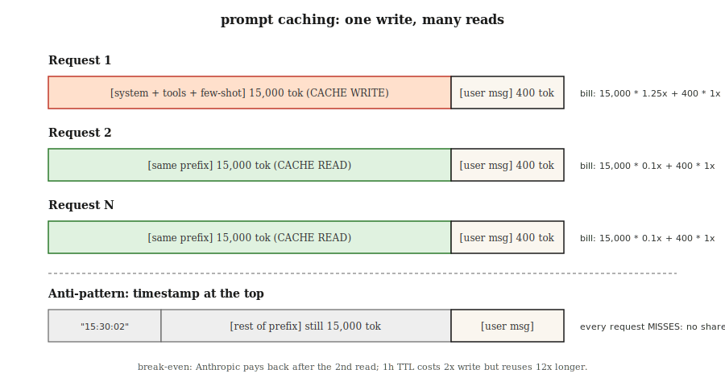

# Prompt 缓存与上下文缓存

> 你的系统 prompt 是 4,000 tokens。你的 RAG 上下文是 20,000 tokens。每次请求你都发送两者。你也为两者付费——每次。Prompt 缓存让提供商在他们那端保持前缀温热，并在重用时按正常价格的 10% 计费。使用得当，它将推理成本降低 50-90%，首 token 延迟降低 40-85%。

**类型：** 构建
**语言：** Python
**前置要求：** Phase 11 · 01（Prompt 工程），Phase 11 · 05（上下文工程），Phase 11 · 11（缓存与成本）
**时间：** 约 60 分钟

## 问题背景

一个编码 Agent 在每次对话轮次都将相同的 15,000-token 系统 prompt 发送给 Claude。二十轮按 $3/百万输入 token 计，仅输入成本就 $0.90——在任何用户实际消息之前。乘以每天 10,000 个对话，账单达到 $9,000/天，都是付给从不改变的文本。

你不能在不损害质量的情况下缩小 prompt。你不能避免发送它——模型每次轮次都需要它。唯一的选择是停止为提供商已经看过的前缀付全价。

那个选择就是 prompt 缓存。Anthropic 于 2024 年 8 月发布（2025 年增加 1 小时扩展 TTL 变体），OpenAI 同年下半年自动化，Google 在 Gemini 1.5 一起发布显式上下文缓存，三者现在都将其作为前沿模型的一等特性。

## 核心概念



**机制。** 当请求的前缀匹配最近请求的前缀时，提供商从先前运行中提供 KV-cache，而不是重新编码 token。第一次付小额定写入费，之后每次都大折扣。

**2026 年三大提供商风格。**

| 提供商 | API 风格 | 命中折扣 | 写入溢价 | 默认 TTL | 最小可缓存 |
|--------|---------|---------|---------|---------|-----------|
| Anthropic | 显式 `cache_control` 内容块标记 | 输入 90% 折扣 | 加收 25% | 5 分钟（可扩展到 1 小时） | 1,024 tokens（Sonnet/Opus），2,048（Haiku） |
| OpenAI | 自动前缀检测 | 输入 50% 折扣 | 无 | 尽力而为，最长 1 小时 | 1,024 tokens |
| Google (Gemini) | 显式 `CachedContent` API | 存储计费；读取约正常价的 25% | 存储费按 token·小时 | 用户可设置（默认 1 小时） | 4,096 tokens（Flash）/ 32,768（Pro） |

**不变量。** 三个都只缓存前缀。如果任何 token 在请求间不同，之后的一切都未命中。把**稳定的**部分放顶部，**可变的**部分放底部。

### 缓存友好的布局

```
[系统 prompt]          <-- 缓存这个
[工具定义]            <-- 缓存这个
[少样本示例]          <-- 缓存这个
[检索的文档]          <-- 如果重用就缓存，否则不
[对话历史]            <-- 缓存到上一轮
[当前用户消息]        <-- 永不缓存（每次不同）
```

违反顺序——将用户消息放到系统 prompt 之上、在少样本之间交错动态检索——缓存永远不会命中。

### 盈亏平衡计算

Anthropic 的 25% 写入溢价意味着一个缓存块必须被读取至少两次才能净省钱。1 次写入 + 1 次读取平均每次请求成本 0.675 倍（节省 32%）；1 次写入 + 10 次读取平均每次 0.205 倍（节省 80%）。经验法则：缓存任何你期望在 TTL 内至少重用 3 次的东西。

## 构建

### 第一步：Anthropic 显式标记 prompt 缓存

```python
import anthropic

client = anthropic.Anthropic()

SYSTEM = [
    {
        "type": "text",
        "text": "你是一个高级 Python 审查员。严格遵循评分标准。\n\n" + RUBRIC_15K_TOKENS,
        "cache_control": {"type": "ephemeral"},
    }
]

def review(code: str):
    return client.messages.create(
        model="claude-opus-4-7",
        max_tokens=1024,
        system=SYSTEM,
        messages=[{"role": "user", "content": code}],
    )
```

`cache_control` 标记告诉 Anthropic 为 5 分钟存储该块。在这个窗口内重用则命中；过期后重用则重新写入。

**响应 usage 字段：**

```python
response = review(code_a)
response.usage
# InputTokensUsage(
#     input_tokens=120,
#     cache_creation_input_tokens=15023,   # 按 1.25x 付费
#     cache_read_input_tokens=0,
#     output_tokens=340,
# )

response_b = review(code_b)
response_b.usage
# cache_creation_input_tokens=0
# cache_read_input_tokens=15023           # 按 0.1x 付费
```

在 CI 中检查两个字段——如果 `cache_read_input_tokens` 在请求间保持为零，你的缓存键在漂移。

### 第二步：一小时扩展 TTL

对于长时间运行的批处理作业，5 分钟默认值在作业之间过期。设置 `ttl`：

```python
{"type": "text", "text": RUBRIC, "cache_control": {"type": "ephemeral", "ttl": "1h"}}
```

1 小时 TTL 花费 2 倍写入溢价（baseline 上加 50% 而非 25%），但在 prefix 重用超过 5 次的任何批处理上都能快速回本。

### 第三步：OpenAI 自动缓存

OpenAI 让你无需配置。任何超过 1,024 tokens 的前缀匹配最近请求都自动获得 50% 折扣。

```python
from openai import OpenAI
client = OpenAI()

resp = client.chat.completions.create(
    model="gpt-5",
    messages=[
        {"role": "system", "content": SYSTEM_PROMPT},   # 长且稳定
        {"role": "user", "content": user_msg},
    ],
)
resp.usage.prompt_tokens_details.cached_tokens  # 折扣部分
```

相同的缓存友好布局规则适用。两件事杀死 OpenAI 的缓存但不杀死 Anthropic 的：更改 `user` 字段（用作缓存键组件）和重新排序工具。

### 第四步：Gemini 显式上下文缓存

Gemini 将缓存视为你创建和命名的一等对象：

```python
from google import genai
from google.genai import types

client = genai.Client()

cache = client.caches.create(
    model="gemini-3-pro",
    config=types.CreateCachedContentConfig(
        display_name="rubric-v3",
        system_instruction=RUBRIC,
        contents=[FEW_SHOT_EXAMPLES],
        ttl="3600s",
    ),
)

resp = client.models.generate_content(
    model="gemini-3-pro",
    contents=["Review this code:\n" + code],
    config=types.GenerateContentConfig(cached_content=cache.name),
)
```

Gemini 按缓存存活期间每 token·小时计存储费，读取约正常输入价的 25%。当你跨多天重用相同巨型 prompt 或代码/文档语料库时，这是正确的形状。

### 第五步：在生产中测量命中率

参见 `code/main.py` 获取模拟三提供商会计器，跟踪写入/读取/未命中计数并计算每千请求的混合成本。在目标命中率上 gate 部署——大多数生产 Anthropic 设置在预热后应看到 >80% 读取比例。

## 2026 年仍然发货的陷阱

- **顶部动态时间戳。** 系统 prompt 顶部的 `"Current time: 2026-04-22 15:30:02"`。每次请求都未命中。将时间戳移至缓存断点以下。
- **工具重新排序。** 部署间字典重排会破坏每个命中。按稳定顺序序列化工具。
- **自由文本近似重复。** "You are helpful." vs "You are a helpful assistant." —— 一个字节差异 = 完全未命中。
- **太小的块。** Anthropic 强制执行 1,024-token 底限（Haiku 为 2,048）。更小的块静默地不缓存。
- **盲目成本仪表盘。** 将"输入 token"拆分为缓存 vs 非缓存。否则流量下降看起来像缓存赢。

## 使用

2026 年缓存技术栈：

| 场景 | 选择 |
|------|------|
| 带稳定 10k+ 系统 prompt 的 Agent，多轮 | Anthropic `cache_control` 配 5 分钟 TTL |
| 30+ 分钟重用前缀的批处理作业 | Anthropic 配 `ttl: "1h"` |
| GPT-5 上无自定义基础设施的 Serverless 端点 | OpenAI 自动（只需让你的前缀稳定且长） |
| 巨型代码/文档语料库跨多天重用 | Gemini 显式 `CachedContent` |
| 跨提供商回退 | 保持跨提供商相同的可缓存前缀布局，使任何命中都有效 |

与语义缓存（Phase 11 · 11）结合用于用户消息层：prompt 缓存处理*token 完全相同*的重用，语义缓存处理*意思相同*的重用。

## 上线

保存 `outputs/skill-prompt-caching-planner.md`：

```markdown
---
name: prompt-caching-planner
description: 设计缓存友好的 prompt 布局并选择正确的提供商缓存模式。
version: 1.0.0
phase: 11
lesson: 15
tags: [llm-engineering, caching, cost]
---

给定一个 prompt（系统 + 工具 + 少样本 + 检索 + 历史 + 用户）和使用配置文件（每小时请求数、所需 TTL、提供商），输出：

1. 布局。重排序的部分用单个缓存断点标记；说明哪些部分是稳定的，哪些是可变的。
2. 提供商模式。Anthropic cache_control、OpenAI 自动或 Gemini CachedContent。从 TTL 和重用模式说明原因。
3. 盈亏平衡。TTL 内每次写入的预期读取次数；带数学的净成本 vs 无缓存。
4. 验证计划。CI 断言第二次相同请求上 cache_read_input_tokens > 0；仪表盘按缓存 vs 非缓存 token 拆分。
5. 失败模式。列出此设置中最可能未命中的三个原因（动态时间戳、工具重排、近重复文本）以及你将如何防止每个。

拒绝发货将动态字段放在断点上方的缓存计划。拒绝在重用计数不能使 2x 写入溢价回本的 情况下启用 1 小时 TTL。
```

## 练习

1. **简单。** 对 Claude 进行 10 轮对话，系统 prompt 为 5,000 tokens，一次不用 `cache_control`，一次用。报告每次的输入 token 账单。

2. **中等。** 编写一个测试工具，给定 prompt 模板和请求日志，计算每个提供商的预期命中率和每美元节省（Anthropic 5m、Anthropic 1h、OpenAI 自动、Gemini 显式）。

3. **困难。** 构建布局优化器：给定 prompt 和标记 `stable=True/False` 的字段列表，重写 prompt 将单个缓存断点放在最大缓存友好位置而不丢失信息。在真实 Anthropic 端点上验证。

## 关键术语

| 术语 | 常见说法 | 实际含义 |
|------|---------|---------|
| Prompt 缓存 | "让长 prompt 便宜" | 重用提供商端 KV-cache 以获取匹配前缀；重复输入 token 享 50-90% 折扣 |
| `cache_control` | "Anthropic 标记" | 内容块属性声明"这之前的一切都可缓存"；`{"type": "ephemeral"}` |
| 缓存写入 | "付溢价" | 第一次填充缓存的请求；在 Anthropic 按约 1.25x 输入价付费，OpenAI 免费 |
| 缓存读取 | "折扣 | 匹配前缀的后续请求；在 Anthropic 按 10%（OpenAI 50%、Gemini 约 25%）付费 |
| TTL | "它存活多久" | 缓存保持温热的时间；Anthropic 默认 5 分钟（可扩展到 1 小时），OpenAI 尽力而为最长 1 小时，Gemini 用户设置 |
| 扩展 TTL | "Anthropic 1 小时缓存" | `{"type": "ephemeral", "ttl": "1h"}`；2 倍写入溢价但在批处理重用上值得 |
| 前缀匹配 | "为什么我的缓存未命中" | 缓存仅在从开始到断点的每个 token 字节完全相同时命中 |
| 上下文缓存 (Gemini) | "显式那个" | Google 的命名、按存储计费的缓存对象；最适合代码/文档语料库跨多天重用 |

## 扩展阅读

- [Anthropic — Prompt 缓存](https://docs.anthropic.com/en/docs/build-with-claude/prompt-caching) —— `cache_control`、1 小时 TTL、盈亏平衡表
- [OpenAI — Prompt 缓存](https://platform.openai.com/docs/guides/prompt-caching) —— 自动前缀匹配
- [Google — 上下文缓存](https://ai.google.dev/gemini-api/docs/caching) —— `CachedContent` API 和存储定价
- [Anthropic 工程 — 长上下文工作负载的 Prompt 缓存](https://www.anthropic.com/news/prompt-caching) —— 带有延迟数字的原始发布帖子
- Phase 11 · 05（上下文工程）—— 在哪里分割 prompt 使缓存可以着陆
- Phase 11 · 11（缓存与成本）—— 在用户消息上与语义缓存配对
- [Pope et al., "Efficiently Scaling Transformer Inference" (2022)](https://arxiv.org/abs/2211.05102) —— prompt 缓存向用户公开的 KV-cache 内存模型；解释为什么缓存前缀的重读比重新计算便宜约 10 倍
- [Agrawal et al., "SARATHI: Efficient LLM Inference by Piggybacking Decodes with Chunked Prefills" (2023)](https://arxiv.org/abs/2308.16369) —— prefill 是 prompt 缓存捷径的阶段；本文解释为什么 TTFT 在缓存命中时急剧下降而 TPOT 不受影响
- [Leviathan et al., "Fast Inference from Transformers via Speculative Decoding" (2023)](https://arxiv.org/abs/2211.17192) —— prompt 缓存与推测解码、Flash Attention 和 MQA/GQA 并列为弯曲推理成本曲线的杠杆；读这个以获取其他三个