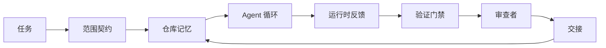

# Agent 工作台工程：为何能力足够的模型仍然失败

> 一个能力足够的模型是不够的。可靠的 Agent 需要一个工作台：指令、状态、范围、反馈、验证、审查、交接。去掉了这些，即使是最前沿的模型也会产出无法安全交付的工作。

**类型：** 学习 + 动手实现
**语言：** Python（标准库）
**前置要求：** Phase 14 · 01（Agent 循环）、Phase 14 · 26（失败模式）
**时长：** 约 45 分钟

## 学习目标

- 区分模型能力与执行可靠性。
- 说出决定 Agent 能否交付的七个工作台表面。
- 在一个小规模仓库任务上比较纯提示词运行与工作台引导运行的差异。
- 产出一份失败模式报告，将每个遗漏的表面映射到它导致的症状。

## 问题

你将一个前沿模型放入一个真实仓库，让它添加输入校验。它打开了四个文件，写了看起来合理的代码，宣称成功，然后停止了。你运行测试，两个失败。第三个被改动的文件与校验毫无关系。没有记录显示 Agent 做了什么假设、最初尝试了什么、还有什么待完成。

这个模型并没有搞错 Python，而是搞错了工作。它完全不知道完成的标准是什么、允许写入哪里、哪些测试是权威的、下一个会话应该如何接续。

这不是模型 bug，是工作台 bug。Agent 表面的覆盖缺失，正是将一次生成变成可靠、可恢复工程的关键缺口。

## 概念

工作台是包裹模型执行任务时的操作环境。它有七个表面：

| 表面 | 承载内容 | 缺失时的失败 |
|------|----------|--------------|
| 指令 | 启动规则、禁止操作、完成定义 | Agent 猜测什么叫交付 |
| 状态 | 当前任务、改动文件、阻碍项、下一步 | 每个会话从头重启 |
| 范围 | 允许的文件、禁止的文件、验收标准 | 编辑泄漏到无关代码 |
| 反馈 | 真实命令输出接入循环 | Agent 在收到 400 时宣称成功 |
| 验证 | 测试、lint、冒烟运行、范围检查 | "看起来不错" 的代码进入 main |
| 审查 | 不同角色的二次检查 | 建造者给自己的作业打分 |
| 交接 | 改动了什么、为什么、还有什么 | 下一个会话重新发现一切 |

工作台与模型无关。换掉模型，表面还在。可靠性不来自模型，来自表面。



循环在状态文件上闭合，而非聊天记录。聊天是易失的。仓库才是系统 of record。

### 工作台 vs 提示词工程

提示词告诉模型这次想要什么。工作台告诉模型如何在多次交互和多个会话之间完成工作。大多数 Agent 失败故事都是穿着提示词工程外衣的工作台失败。

### 工作台 vs 框架

框架提供运行时（LangGraph、AutoGen、Agents SDK）。工作台在运行时内部给 Agent 一个工作的地方。两者都需要。这个小系列讲的是第二件事。

### 从原语出发推理，而非厂商术语

现在有大量关于"运行 Harness 工程"的文章。Addy Osmani、OpenAI、Anthropic、LangChain、Martin Fowler、MongoDB、HumanLayer、Augment Code、Thoughtworks、walkinglabs awesome list，以及持续不断的 Medium 和 Hacker News 文章都在讨论它。它们在 Harness 的边界、范围和词汇上并不一致。我们不需要选边站。七大表面是一个 UX 层；在每个工作台下面，都是同一套分布式系统原语在支撑所有可靠的后端。

暂时拿掉 Agent 标签。Agent 运行是跨越时间、进程和机器的计算。要让它可靠，你需要所有生产系统都需要的那套原语。

| 原语 | 是什么 | 为 Agent 承载什么 |
|------|--------|------------------|
| 函数 | 类型化处理器。尽可能纯函数。拥有自己的输入和输出。 | 一次工具调用、规则检查、验证步骤、模型调用 |
| Worker | 长生命周期进程，拥有一个或多个函数和生命周期管理 | 建造者、审查者、验证器、MCP 服务器 |
| 触发器 | 调用函数的事件源 | Agent 循环 tick、HTTP 请求、队列消息、Cron、文件变更、钩子 |
| 运行时 | 决定在哪里运行、用什么超时和资源的边界 | Claude Code 的进程、LangGraph 的运行时、一个 Worker 容器 |
| HTTP / RPC | 调用方和 Worker 之间的通信线 | 工具调用协议、MCP 请求、模型 API |
| 队列 | 触发器和 Worker 之间的持久缓冲；背压、重试、幂等性 | 任务板、反馈日志、审查收件箱 |
| 会话持久化 | 跨崩溃、重启、模型切换存活的状态 | `agent_state.json`、检查点、KV 存储、仓库本身 |
| 授权策略 | 谁可以用什么范围调用什么函数 | 允许/禁止的文件、审批边界、MCP 能力列表 |

现在将七个工作台表面映射到这些原语上：

- **指令** — 策略 + 函数元数据。规则是检查（函数）。路由器（`AGENTS.md`）是附加在运行时启动时的策略。
- **状态** — 会话持久化。一个 Keyed Store，运行时在每一步读取。文件、KV 或 DB；持久化语义重要，存储后端不重要。
- **范围** — 每个任务的授权策略。允许/禁止的 glob 是 ACL。所需审批是权限格。
- **反馈** — 写入队列的调用日志。每条 Shell 调用都是一条持久、可回放的记录。
- **验证** — 一个函数。对输入确定性计算。任务关闭时触发。失败时关闭。
- **审查** — 一个独立的 Worker，对建造者产物只有读权限，对审查报告只有写权限。
- **交接** — 会话结束触发器发出的持久记录。下一个会话的启动触发器读取它。

Agent 循环本身就是一个 Worker，它消费事件（用户消息、工具结果、定时器 tick），调用函数（模型，然后模型选择的工具），写记录（状态、反馈），并发出触发器（验证、审查、交接）。没有神秘之处；它与作业处理器的形状完全相同。

### 业界流行模式的原语翻译

每个流行的 Harness 模式都能归约到八个原语。翻译表如下：

| 厂商或社区模式 | 实际是什么 |
|---------------|-----------|
| Ralph Loop（Claude Code、Codex、agentic_harness 书）— 当 Agent 提前停止时将原始意图重新注入新的上下文窗口 | 一个触发器，将任务重新排队并附上干净的上下文；会话持久化将目标向前携带 |
| Plan / Execute / Verify（PEV）| 三个 Worker 各司其职，通过状态和阶段间队列通信 |
| Harness-计算分离（OpenAI Agents SDK，2026 年 4 月）— 控制平面与执行平面分离 | 不过是重新陈述控制平面/数据平面。这个概念在 Agent 这个标签出现之前几十年就存在了 |
| Open Agent Passport（OAP，2026 年 3 月）— 在执行前用声明式策略对每次工具调用签名和审计 | 一个预执行 Worker 强制执行的授权策略，带签名审计队列 |
| Guides and Sensors（Birgitta Böckeler / Thoughtworks）— 前馈规则 + 反馈可观测性 | 授权策略 + 验证函数 + 可观测性追踪 |
| 渐进压缩，5 阶段（Claude Code 逆向工程，2026 年 4 月）| 一个状态管理 Worker，类似 Cron 运行在会话持久化上以保持其在预算内 |
| 钩子/中间件（LangChain、Claude Code）— 拦截模型和工具调用 | 触发器 + 函数，包装在运行时的调用路径上 |
| Markdown 形式的 Skills 并渐进披露（Anthropic、Flue）| 函数注册表，其中函数元数据在运行时按需加载到上下文中 |
| 沙箱 Agent（Codex、Sandcastle、Vercel Sandbox）| 计算平面：带隔离文件系统、网络和生命周期的运行时 |
| MCP 服务器 | 通过稳定 RPC 暴露函数的 Worker，用能力列表作为授权 |

表中每一项都是 Agent 社区到达了一个分布式系统中已有名字的原语，然后给了它一个新名字。用于营销是好的词汇；作为工程词汇是不够的。

### 数据支撑的真实结论

Harness 优于模型的说法有数据支撑了。值得了解一下，因为它们也是反驳"等着更强的模型就好"的唯一诚实论据。

- Terminal Bench 2.0 — 同一模型，换了 Harness，编码 Agent 从 30 名开外跃升至第 5 名（LangChain，*Anatomy of an Agent Harness*）。
- Vercel — 删除了 Agent 80% 的工具；成功率从 80% 跳升到 100%（MongoDB）。
- Harvey — 仅通过 Harness 优化，Legal Agent 准确率提升一倍以上（MongoDB）。
- 88% 的企业 AI Agent 项目无法投产。失败集中在运行时，而非推理能力（preprints.org，*Harness Engineering for Language Agents*，2026 年 3 月）。
- 2025 年一项对三个流行开源框架的基准研究显示任务完成率约 50%；长上下文 WebAgent 在长上下文条件下从 40–50% 崩塌到 10% 以下，主要原因是无限循环和目标丢失（广泛见诸 2026 年初的分析文章）。

结论不是"Harness 永远胜出"。模型确实会吸收 Harness 的技巧。结论是今天，核心工程负载在模型周围，而非模型内部；承载这些负载的原语，正是所有生产系统一直以来都需要的那套。

### 厂商文章止步之处

这部分不需要客气。

- LangChain 的 *Anatomy of an Agent Harness* 列举了 11 个组件——提示词、工具、钩子、沙箱、编排、记忆、Skills、子 Agent 和一个运行时"傻循环"。但没有提到队列、Worker 作为部署单元、触发器语义、会话持久化作为独立关注点，或授权策略。它把 Harness 当作一个配置对象，而不是一个你部署的系统。
- Addy Osmani 的 *Agent Harness Engineering* 给出了框架 `Agent = Model + Harness` 和棘轮模式，但没有说明 Harness 是由什么构成的。它读起来像是一种立场，而非规范。
- Anthropic 和 OpenAI 在表面描述上走得最深，但停留在各自的运行时内部。2026 年 4 月 Agents SDK 中"Harness-计算分离"的宣布是第一个明确认可控制平面/数据平面分离的厂商文章。这是一个原语思想，不是新发明。
- agentic_harness 书将 Harness 当作配置对象（Jaymin West，*Agentic Engineering*，第 6 章），其中最强的一句话是"Harness 是 Agentic 系统的首要安全边界"。这不过是授权策略的重新陈述。
- Hacker News 讨论持续到达同一处。2026 年 4 月的帖子 *The agent harness belongs outside the sandbox* 认为 Harness 应该"更像一个超级监控器，位于所有东西之外并根据上下文和用户授权访问"。这又是授权策略作为独立平面的说法。

你不需要不同意这些文章才能注意到这个缺口。它们是对一个已经存在的系统的 UX 描述。我们在写这个系统。当系统构建正确时，七个表面从原语中自然得出。构建不正确时，再多的 `AGENTS.md` 打磨也补不上缺失的队列。

所以当你在别处听到"Harness 工程"时，翻译成原语。提示词和规则是策略和函数。脚手架是运行时。护栏是授权+验证。钩子是触发器。记忆是会话持久化。Ralph Loop 是重新入队。子 Agent 是 Worker。沙箱是计算平面。词汇变了，工程没变。工作台是 Agent 的前端 UX；而在经历了下一个厂商重新框架后仍然存活的"Harness"，是函数、Worker、触发器、运行时、队列、持久化和策略正确连接在一起的产物。

## 动手实现

`code/main.py` 用同一个任务运行两次 Agent。一次纯提示词，一次七大表面全部接入。同样的模型，同样的任务。脚本统计纯提示词运行中缺失了哪些表面，输出一份失败模式报告。

仓库任务刻意设计得小：为单文件 FastAPI 风格处理器添加输入校验并写一个通过的测试。

运行：

```bash
python3 code/main.py
```

输出：两次运行的并排日志，一个 `failure_modes.json` 汇总纯提示词运行的失败，以及工作台运行的一行判定。

Agent 是一个小型的基于规则的存根；重点是表面，不是模型。在这个小系列的后续内容中，你将把每个表面重建为一个真实可复用的构件。

## 用现成库

工作台表面已经存在于三处，即使没有人这样称呼它们：

- **Claude Code、Codex、Cursor。** `AGENTS.md` 和 `CLAUDE.md` 是指令表面。斜杠命令是范围。钩子是验证。
- **LangGraph、OpenAI Agents SDK。** 检查点和会话存储是状态表面。交接是交接表面。
- **真实仓库的 CI。** 测试、lint 和类型检查是验证。PR 模板是交接。CODEOWNERS 是审查。

工作台工程是将这些表面显式化和可复用化的学科，而不是让每个团队重新发现它们。

## 产出

`outputs/skill-workbench-audit.md` 是一个可移植的 Skill，审计一个现有仓库的七个工作台表面，报告哪些缺失、哪些部分覆盖、哪些健康良好。放到任何 Agent 设置旁边；它告诉你先修复什么。

## 练习

1. 选一个你已经在跑 Agent 的仓库，给七个表面打分（0 = 缺失，2 = 健康良好）。你最弱的表面是哪个？
2. 扩展 `main.py`，让纯提示词运行也产生一个假的"成功"声明。验证验证门禁本可以捕获它。
3. 为你的产品添加第八个表面。说明为什么它不会崩溃成现有七个之一。
4. 用一个会虚构额外文件写入的不同存根 Agent 重新运行脚本。哪个表面最先捕获到它？
5. 将 Phase 14 · 26 中五个行业反复出现的失败模式映射到七个表面。设计每个表面是为了吸收哪种模式？

## 关键术语

| 术语 | 常见说法 | 实际含义 |
|------|----------|----------|
| 工作台 | 配置 | 模型周围使工作可靠的工程化表面 |
| 表面 | "一个文档"或"一个脚本" | Agent 每轮读取或写入的命名化、机器可读输入 |
| 系统 of record | 笔记 | 当聊天记录消失时 Agent 视为真理的文件 |
| 完成定义 | 验收 | Agent 无法伪造的客观、文件支持的检查清单 |
| 工作台审计 | 仓库就绪检查 | 对七个表面的检查，在工作开始前标记缺失的部分 |

## 延伸阅读

将以下内容作为数据点，而非权威。每个都是部分分类法。将每个概念翻译回一个原语（函数、Worker、触发器、运行时、HTTP/RPC、队列、持久化、策略），再决定是否采纳。

厂商框架：

- [Addy Osmani，Agent Harness 工程](https://addyosmani.com/blog/agent-harness-engineering/) — `Agent = Model + Harness` 和棘轮模式；对基础设施描述不足
- [LangChain，An Agent Harness 的剖析](https://blog.langchain.com/the-anatomy-of-an-agent-harness/) — 11 个组件：提示词、工具、钩子、编排、沙箱、记忆、Skills、子 Agent、运行时；遗漏了队列、部署、授权
- [OpenAI，Harness 工程：让 Codex 在 Agent 优先世界中发挥作用](https://openai.com/index/harness-engineering/) — Codex 团队对运行时周围表面的看法
- [OpenAI，解码 Codex Agent 循环](https://openai.com/index/unrolling-the-codex-agent-loop/) — Agent 循环归约为 `while` 循环遍历函数调用
- [Anthropic，面向长时 Agent 的高效运行机制](https://www.anthropic.com/engineering/effective-harnesses-for-long-running-agents) — 特定运行时内部的长时表面
- [Anthropic，面向长时应用开发的 Harness 设计](https://www.anthropic.com/engineering/harness-design-long-running-apps) — 应用设计笔记
- [LangChain Deep Agents Harness 能力](https://docs.langchain.com/oss/python/deepagents/harness) — 运行时配置表面

有可用细节的实践者文章：

- [Martin Fowler / Birgitta Böckeler，面向编码 Agent 用户的 Harness 工程](https://martinfowler.com/articles/harness-engineering.html) — guides（前馈）+ sensors（反馈）；最清晰的控制论框架
- [HumanLayer，技能问题：面向编码 Agent 的 Harness 工程](https://www.humanlayer.dev/blog/skill-issue-harness-engineering-for-coding-agents) — "不是模型问题，是配置问题"
- [MongoDB，Agent Harness：为什么 LLM 是 Agent 系统中最小的一部分](https://www.mongodb.com/company/blog/technical/agent-harness-why-llm-is-smallest-part-of-your-agent-system) — 数据：Vercel 80%→100%、Harvey 准确率翻倍、Terminal Bench 30 名开外→第 5 名
- [Augment Code，面向 AI 编码 Agent 的 Harness 工程](https://www.augmentcode.com/guides/harness-engineering-ai-coding-agents) — 约束优先的演练
- [Sequoia 播客，Harrison Chase 论上下文工程与长时 Agent](https://sequoiacap.com/podcast/context-engineering-our-way-to-long-horizon-agents-langchains-harrison-chase/) — 运行时关注点优于模型关注点

书籍、论文和参考实现：

- [Jaymin West，Agentic Engineering — 第 6 章：Harnesses](https://www.jayminwest.com/agentic-engineering-book/6-harnesses) — 书籍级论述，将 Harness 作为主要安全边界
- [preprints.org，面向语言 Agent 的 Harness 工程（2026 年 3 月）](https://www.preprints.org/manuscript/202603.1756) — 作为控制/代理/运行时的学术框架
- [walkinglabs/awesome-harness-engineering](https://github.com/walkinglabs/awesome-harness-engineering) — 跨上下文、评估、可观测性、编排的精选阅读列表
- [ai-boost/awesome-harness-engineering](https://github.com/ai-boost/awesome-harness-engineering) — 备选精选列表（工具、评估、记忆、MCP、权限）
- [andrewgarst/agentic_harness](https://github.com/andrewgarst/agentic_harness) — 生产就绪参考实现，带 Redis 后端记忆和评估套件
- [HKUDS/OpenHarness](https://github.com/HKUDS/OpenHarness) — 带内置个人 Agent 的开放 Agent Harness

值得一读的 Hacker News 讨论（用于看分歧，不是看共识）：

- [HN：面向长时 Agent 的高效运行机制](https://news.ycombinator.com/item?id=46081704)
- [HN：一下午改进 15 个 LLMs 的编码能力。只改了 Harness](https://news.ycombinator.com/item?id=46988596)
- [HN：Agent Harness 应该在沙箱外面](https://news.ycombinator.com/item?id=47990675) — 论证授权作为独立平面

本课程内部交叉引用：

- Phase 14 · 23 — OpenTelemetry GenAI 约定：sensors 文献指向的可观测性层
- Phase 14 · 26 — 失败模式目录，七个表面旨在吸收它们
- Phase 14 · 27 — 提示词注入防御，位于授权策略原语层
- Phase 14 · 29 — 生产运行时（队列、事件、Cron）：本讲原语在部署中的位置