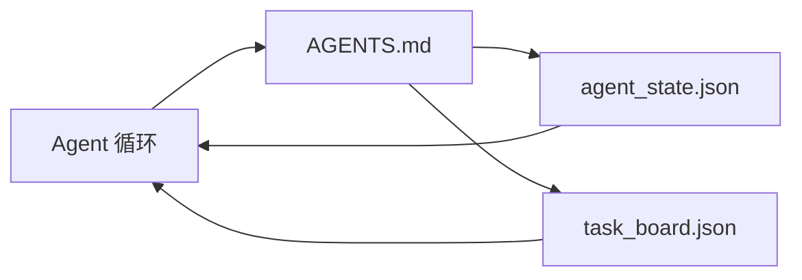

# 极简 Agent 工作台

> 最小可用工作台只有三个文件：一个根指令路由器、一个状态文件、一个任务板。其他都是在此基础上叠加。仓库如果连这三个都承载不了，再好的模型也救不了它。

**类型：** 动手实现
**语言：** Python（标准库）
**前置要求：** Phase 14 · 31（为何能力足够的模型仍然失败）
**时长：** 约 45 分钟

## 学习目标

- 定义构成最小可用工作台的三个文件。
- 解释为什么短的根路由器优于冗长的单体 `AGENTS.md`。
- 构建一个 Agent 每轮都可以读取、结束时写入的状态文件。
- 构建一个在多会话工作中存活的任务板，无需聊天记录。

## 问题

大多数团队是通过写一个 3000 行的 `AGENTS.md` 来搭建工作台的，然后认为大功告成。模型加载它，忽略它无法概括的部分，仍然在它一贯失败的表面上失败。

你需要的是相反的东西。一个小的根文件，只在相关时才将 Agent 路由到更深层的文件。持久状态让 Agent 在行动前读取、行动后写入。任务板说明什么是进行中、什么是被阻塞、什么是下一步。

三个文件。每个文件各司其职。每个文件都足够机器可读，可以演进成真正的系统。

## 概念



### AGENTS.md 是路由器，不是手册

一个好的 `AGENTS.md` 很短。它指向：

- 状态文件（你进展到哪里了）。
- 任务板（还有什么没做）。
- 更深层的规则（`docs/agent-rules.md` 下）。
- 验证命令（怎么知道它能工作）。

超过这个长度的内容都应该放在更深的文档中，只在需要时加载。长篇手册会被忽略。短路由器会被遵守。

### agent_state.json 是系统 of record

状态包含：当前任务 ID、改动过的文件、做过的假设、阻碍项、下一步动作。Agent 每轮读取它。下一个会话读取它，而不是回放聊天记录。

状态存在文件中，因为聊天历史不可靠。会话会终止。对话会被截断。文件不会。

### task_board.json 是队列

任务板携带每个任务的状态 `todo | in_progress | done | blocked`。它是 Agent 在状态为空时拉取任务的队列，也是你在想知道 Agent 是否跑偏时查看的队列。

板上的任务有 ID、目标、负责人（`builder`、`reviewer` 或 `human`）和验收标准。板子有意保持小：当它超过一屏时，你遇到的是规划问题，不是看板问题。

### 三个文件是下限，不是上限

后续章节会叠加范围契约、反馈运行器、验证门禁、审查清单和交接包。这三个文件是它们全部假设的基础。

## 动手实现

`code/main.py` 将最小工作台写入一个空仓库，并演示单个 Agent 轮次：

1. 读取 `agent_state.json`。
2. 若状态为空，从 `task_board.json` 拉取下一个任务。
3. 在范围内改动一个文件。
4. 写回更新后的状态。

运行：

```bash
python3 code/main.py
```

脚本在自身旁边创建 `workdir/`，部署三个文件，运行一轮，打印差异。再次运行可以看到第二轮如何承接第一轮的进度。

## 用现成库

在生产 Agent 产品中，同样的三个文件以不同名字出现：

- **Claude Code：** `AGENTS.md` 或 `CLAUDE.md` 作为路由器，`.claude/state.json` 风格存储作为状态，钩子作为看板。
- **Codex / Cursor：** 工作区规则作为路由器，聊天边栏中的会话记忆作为状态、排队的任务作为看板。
- **自定义 Python Agent：** 就是你刚写的这些文件。

名字变了。形态没变。

## 生产模式的真实案例

当在以下三个模式叠加后，最小工作台就能在真实大仓库中存活。它们相互独立；选择你的仓库真正需要的那些。

**嵌套 `AGENTS.md` 采用最近优先原则。** OpenAI 在其主仓库中部署了 88 个 `AGENTS.md` 文件，每个子组件一个。Codex、Cursor、Claude Code 和 Copilot 都从当前文件向仓库根目录遍历，拼接沿途发现的每个 `AGENTS.md`。子目录文件扩展根文件。Codex 添加了 `AGENTS.override.md` 以替换而非扩展；这个覆盖机制是 Codex 特有的，在跨工具工作中应该避免。Augment Code 的衡量指标才是关键：最好的 `AGENTS.md` 文件带来的质量提升相当于从 Haiku 升级到 Opus；最差的让输出比没有文档时更差。

**需要拒绝的反模式，即使它们看起来像是覆盖。** 冲突指令会让 Agent 静默从交互模式降级到贪婪模式（ICLR 2026 AMBIG-SWE：48.8%→28% 解决率）；使用数字优先级而不是平铺堆叠。无法验证的样式规则（"遵循 Google Python 风格指南"）没有强制命令会让 Agent 虚构合规性；每个样式规则都要配上确切的 lint 命令。优先讲样式而不是命令会埋没验证路径；命令优先，样式最后。写给人类而不是 Agent 会浪费上下文预算；简洁是优点。

**跨工具符号链接。** 一个带符号链接的单一根文件（`ln -s AGENTS.md CLAUDE.md`，`ln -s AGENTS.md .github/copilot-instructions.md`，`ln -s AGENTS.md .cursorrules`）让每个编码 Agent 都基于同一个 source of truth。Nx 的 `nx ai-setup` 从单一配置自动化跨 Claude Code、Cursor、Copilot、Gemini、Codex、OpenCode 的设置。

## 产出

`outputs/skill-minimal-workbench.md` 为任何新仓库生成三文件工作台：一个针对项目调优的 `AGENTS.md` 路由器、键值正确的 `agent_state.json`，以及用当前待办事项初始化的 `task_board.json`。

## 练习

1. 给 `agent_state.json` 添加 `last_run` 时间戳。如果文件超过 24 小时未更新则拒绝运行，除非有操作员确认。
2. 给任务板添加 `priority` 字段，并让拉取器始终选取优先级最高的 `todo`。
3. 将 `task_board.json` 迁移为 JSON Lines 格式，每行一个任务，版本控制中 diff 更清晰。
4. 写一个 `lint_workbench.py`，如果 `AGENTS.md` 超过 80 行或引用了不存在的文件则失败。
5. 决定三个文件中哪一个丢失时伤害最大。说明你的理由。

## 关键术语

| 术语 | 常见说法 | 实际含义 |
|------|----------|----------|
| 路由器 | `AGENTS.md` | 短的根文件，将 Agent 指向更深的文档和文件 |
| 状态文件 | 笔记 | Agent 每轮读取并写入的机器可读当前位置记录 |
| 任务板 | 待办列表 | 带状态、负责人、验收条件的 JSON 工作队列 |
| 系统 of record | source of truth | 当聊天消失时工作台将其视为权威的文件 |

## 延伸阅读

- [agents.md — 开放规范](https://agents.md/) — 被 Cursor、Codex、Claude Code、Copilot、Gemini、OpenCode 采用
- [Augment Code，好的 AGENTS.md 相当于一次模型升级。差的比没有文档更差](https://www.augmentcode.com/blog/how-to-write-good-agents-dot-md-files) — 有量化数据支撑的质量差异
- [Blake Crosley，AGENTS.md 模式：什么真正改变 Agent 行为](https://blakecrosley.com/blog/agents-md-patterns) — 什么有效，什么无效的经验数据
- [Datadog 前端团队，用 AGENTS.md 驾驭 Monorepo 中的 AI Agent](https://dev.to/datadog-frontend-dev/steering-ai-agents-in-monorepos-with-agentsmd-13g0) — 嵌套优先级的实践
- [Nx 博客，教你的 AI Agent 学会在 Monorepo 中工作](https://nx.dev/blog/nx-ai-agent-skills) — 单一配置跨六工具生成
- [The Prompt Shelf，AGENTS.md 最佳实践：结构、范围和真实案例](https://thepromptshelf.dev/blog/agents-md-best-practices/) — 经得起审查的章节排序
- [Anthropic，Claude Code 子 Agent 和会话存储](https://docs.anthropic.com/en/docs/agents-and-tools/claude-code/sub-agents)
- Phase 14 · 31 — 本最小实现所吸收的失败模式
- Phase 14 · 34 — 本讲所预览的持久状态 schema