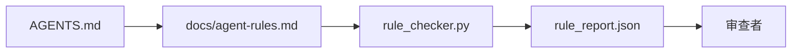

# Agent 指令即执行约束

> 写成散文的指令是愿望。写成约束的指令是测试。工作台将每条规则变成 Agent 可在运行时检查、审查者可在事后验证的东西。

**类型：** 动手实现
**语言：** Python（标准库）
**前置要求：** Phase 14 · 32（极简工作台）
**时长：** 约 50 分钟

## 学习目标

- 将路由散文与操作规则区分开。
- 将启动规则、禁止操作、完成定义、不确定处理和审批边界表达为机器可检查的约束。
- 实现一个规则检查器，对规则集评分。
- 让规则集对 diff 友好，以便审查看到变化。

## 问题

一个典型的 `AGENTS.md` 读起来像入职文档。它告诉 Agent "要小心""要充分测试""不确定就问"。三天后，Agent 交付了一个没有任何测试的改动、写入了禁止的目录，从没问过，因为从来不知道那条线在哪里。

指令在可操作时有力，在空谈时无力。解决方案是写出工作台能解释、审查者能评分的规则。

## 概念

规则放在 `docs/agent-rules.md`，远离简短的根路由器。每条规则有名称、类别和一个检查函数。



### 覆盖大多数规则的五大类别

| 类别 | 规则回答的问题 | 示例 |
|------|----------------|------|
| 启动 | 工作开始前必须为什么为真？ | "状态文件存在且是最新的" |
| 禁止 | 什么绝对不能发生？ | "不得编辑 `scripts/release.sh`" |
| 完成定义 | 什么证明任务已完成？ | "pytest 退出 0 且验收行通过" |
| 不确定处理 | Agent 不确定时做什么？ | "打开一个问题笔记而非猜测" |
| 审批 | 什么需要人工审批？ | "任何新依赖、任何生产写入" |

一条不属于这五类的规则通常是想拆成两条。强制拆分。

### 规则是机器可读的

每条规则有一个 slug、类别、一行描述，以及一个命名 `rule_checker.py` 中函数的 `check` 字段。增加规则意味着增加检查；检查器随工作台一起成长。

### 规则对 diff 友好

规则以每标题一条的方式放在一个 Markdown 文件中。重命名在 diff 中可见。新规则位于其类别顶部。陈旧规则要删除而非注释，因为工作台是 source of truth，而非上季度团队感受的聊天记录。

### 规则 vs 框架护栏

框架护栏（OpenAI Agents SDK 护栏、LangGraph 中断）在运行时层面强制执行规则。本讲的规则集是这些护栏的人类可读、可审查的契约。两者都需要：运行时在回合中捕获违规，规则集证明运行时在做正确的事。

## 动手实现

`code/main.py` 提供：

- 解析 `agent-rules.md` 的加载器，将规则加载到 dataclass。
- `rule_checker.py` 中的样式检查函数，每个 `check` 引用一条。
- 一个演示 Agent 运行，违反两条规则，检查通过并捕获它们。

运行：

```bash
python3 code/main.py
```

输出：解析后的规则集、运行追踪、每条规则的通过/失败，以及保存到脚本旁边的 `rule_report.json`。

## 生产模式的真实案例

三个模式让一个规则集能用一个季度，而非一周就腐化。

**在写入时就标注严重性。** 每条规则携带 `severity`：`block`、`warn` 或 `info`。检查器报告全部三种；运行时仅在 `block` 时拒绝。大多数团队在早期高估严重性，然后在截止期压力下悄悄削弱；写入时就标注强制提前校准。配合验证门禁（Phase 14 · 38），它将任何 `block` 规则覆盖签名到 `overrides.jsonl` 审计日志中。

**规则有效期作为驱动力。** 每条规则携带 `expires_at` 日期（默认从编写起 90 天）。检查器在一条未过期的规则连续 60 天无违规时发出警告；下次季度审查时要么证明保留合理、要么降级为 `info`、要么删除。Cloudflare 的生产 AI 代码审查数据（2026 年 4 月，30 天内 5169 个仓库中 131,246 次审查运行）显示，有明确有效期的规则集保持在每个仓库 30 条以下；没有的在 80+ 条，其中大多数从未触发过。

**Markdown 为源、JSON 为缓存。** `agent-rules.md` 是编写文件；`agent-rules.lock.json` 是检查器在热路径读取的缓存。锁由 pre-commit 钩子重新生成。Markdown diff 可审查；JSON 解析不进入每个回合。与 `package.json` / `package-lock.json` 和 `Cargo.toml` / `Cargo.lock` 同构。

## 用现成库

在生产中：

- Claude Code、Codex、Cursor 在会话开始时读取规则并在拒绝操作时引用它们。检查器在 CI 中重新运行以捕获静默漂移。
- OpenAI Agents SDK 护栏将相同检查注册为输入和输出护栏。Markdown 是文档表面；SDK 是运行时表面。
- LangGraph 中断在飞行中节点违反规则时触发。中断处理器读取规则、询问人类，然后恢复。

规则集在三者间可移植，因为它只是 Markdown 加函数名。

## 产出

`outputs/skill-rule-set-builder.md` 采访项目负责人，将其现有散文指令分类到五类别中，发射一个版本化的 `agent-rules.md` 加检查器存根。

## 练习

1. 如果你的产品真正需要，添加第六个类别。说明为什么它不会崩溃成五类之一。
2. 扩展检查器，使规则可携带严重性（`block`、`warn`、`info`），报告相应聚合。
3. 将检查器接入 CI：block 严重性规则在最新 Agent 运行中失败时让构建失败。
4. 给每条规则添加"过期"字段。90 天无检查失败后，该规则有待审查。
5. 找一份真实的 `AGENTS.md`，将其重写为五类规则。它的多少行是操作性的？多少行是空谈性的？

## 关键术语

| 术语 | 常见说法 | 实际含义 |
|------|----------|----------|
| 操作性规则 | 真正的指令 | 工作台可在运行时检查的规则 |
| 空谈性规则 | "要小心" | 没有检查的规则；删除或升级 |
| 完成定义 | 验收 | 任务完成的客观、文件支持的证明 |
| Block 严重性 | 硬规则 | 违规停止运行；不经操作员无法静默 |
| 规则有效期 | 陈旧规则清除 | N 天无失败即待淘汰的规则 |

## 延伸阅读

- [OpenAI Agents SDK 护栏](https://platform.openai.com/docs/guides/agents-sdk/guardrails)
- [LangGraph 中断](https://langchain-ai.github.io/langgraph/how-tos/human_in_the_loop/breakpoints/)
- [Anthropic，构建有效的 Agent](https://www.anthropic.com/research/building-effective-agents)
- [Rick Hightower，Agent RuleZ：AI 编码 Agent 的确定性策略引擎](https://medium.com/@richardhightower/agent-rulez-a-deterministic-policy-engine-for-ai-coding-agents-9489e0561edf) — 生产中的 block/warn/info 严重性
- [Cloudflare，在规模上编排 AI 代码审查](https://blog.cloudflare.com/ai-code-review/) — 131k 审查运行，规则组合经验
- [microservices.io，GenAI 开发平台 — 第 1 部分：护栏](https://microservices.io/post/architecture/2026/03/09/genai-development-platform-part-1-development-guardrails.html) — 规则与 CI 之间的纵深防御
- [类型检查合规性：确定性护栏（arXiv 2604.01483）](https://arxiv.org/pdf/2604.01483) — Lean 4 作为规则作为检查的上界
- [logi-cmd/agent-guardrails](https://github.com/logi-cmd/agent-guardrails) — 合并拦截实现：范围、变更测试、违规预算
- Phase 14 · 32 — 本规则集所嵌入的最小工作台
- Phase 14 · 38 — 消费规则报告的验证门禁
- Phase 14 · 39 — 评分规则合规性的审查 Agent