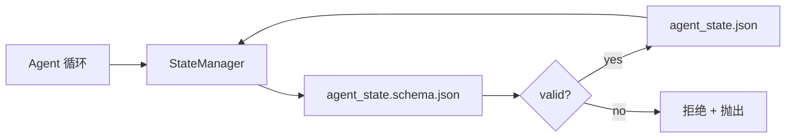

# 仓库记忆与持久状态

> 聊天历史是易失的。仓库是持久的。工作台将 Agent 状态存储在版本化文件中，这样下一个会话、下一个 Agent 和下一个审查者都从同一个 source of truth 读取。

**类型：** 动手实现
**语言：** Python（标准库 + `jsonschema` 可选）
**前置要求：** Phase 14 · 32（极简工作台）
**时长：** 约 60 分钟

## 学习目标

- 定义什么属于仓库记忆、什么属于聊天历史。
- 为 `agent_state.json` 和 `task_board.json` 编写 JSON Schema。
- 构建一个原子地加载、验证、变更和持久化状态的状态管理器。
- 用 schema 在坏写入腐化工作台之前拒绝它们。

## 问题

Agent 完成一个会话。聊天关闭。下一个会话打开，问从哪里开始。模型说"让我检查文件"，读取陈旧笔记，重新做了已经完成的工作。更糟的是，它重写了一个已完成的文件，因为没人告诉它文件已经完成了。

工作台的修复方案是仓库记忆：状态以 JSON 文件形式存在于仓库中，按 schema 写入，原子持久化，在代码审查中 diff 友好。聊天是瞬态 feed；仓库才是系统 of record。

## 概念



### 什么属于仓库记忆

| 属于 | 不属于 |
|------|--------|
| 当前任务 ID | 原始聊天记录 |
| 本会话改动的文件 | Token 级推理追踪 |
| Agent 所做的假设 | "用户似乎很沮丧" |
| 未解决的阻碍项 | 采样完成结果 |
| 下一步动作 | 供应商特定模型 ID |

检验标准是持久性：三个月后的 CI 重跑中这还有用吗？如果有，放仓库。如果没用，放遥测。

### Schema 优先的状态

JSON Schema 是契约。没有它，每个 Agent 发明新字段，每个审查者学习新形状，每个 CI 脚本都要对旧版本做特殊处理。有了它，一次坏写入就是一次被拒绝的写入。

Schema 覆盖：

- 必填键。
- 允许的 `status` 值。
- 禁止的值（例如数组的 `null`）。
- 模式约束（任务 ID 匹配 `T-\d{3,}`）。
- 用于迁移的版本字段。

### 原子写入

状态写入需要承受部分失败：写入临时文件、fsync、用 rename 覆盖目标。状态文件是 source of truth；半写入的状态比没有文件更糟。

### 迁移

Schema 变化时，在 schema 升级旁边附带迁移脚本。状态文件携带 `schema_version` 字段；管理器拒绝加载无法迁移的文件版本。

## 动手实现

`code/main.py` 实现：

- `agent_state.schema.json` 和 `task_board.schema.json`。
- 仅标准库验证器（JSON Schema 子集：required、type、enum、pattern、items）。
- `StateManager.load`、`StateManager.update`、`StateManager.commit`，带原子临时文件 rename 写入。
- 一个演示：变更状态、持久化、重新加载、证明往返有效。

运行：

```bash
python3 code/main.py
```

脚本写入 `workdir/agent_state.json` 和 `workdir/task_board.json`，跨两轮变更它们，每步打印验证后的状态。

## 生产模式的真实案例

四个模式将本讲的最简方案变成多 Agent monorepo 能承受的东西。

**原子临时文件 rename 不是可选项。** 2026 年 3 月一个 Hive 项目 bug 报告清楚地记录了这个失败模式：`state.json` 通过 `write_text()` 写入，异常被捕获并静默。部分写入让会话在 corrupt 状态上恢复，没有任何信号。修复方案始终是：`tempfile.mkstemp` 在目标所在目录，写入，`fsync`，`os.replace`（POSIX 和 Windows 上的原子 rename）。本讲的 `atomic_write` 正是这样做的。

**每个非幂等工具调用带上幂等键。** 如果 Agent 在调用工具后、检查点结果前崩溃，恢复重试该工具调用。读操作安全；邮件、数据库插入、文件上传则危险。模式：在执行前将每次工具调用的 ID 记录到 `pending_calls.jsonl`。重试时检查 ID；若存在则跳过调用，使用缓存结果。Anthropic 和 LangChain 在 2026 年指引中都提到了这一点；LangGraph 的 checkpointer 为相同原因持久化待写入。

**大产物与状态分离。** 不要在 `agent_state.json` 中存储 CSV、长记录或生成文件。将产物存为独立文件（或上传到对象存储），在状态中只保留路径。检查点保持小而快；产物独立增长。

**事件溯源用于审计，快照用于恢复。** 每次变更向事件日志（`state.events.jsonl`）追加；定期快照到 `state.json`。恢复时读取快照，然后重放快照时间戳之后的所有事件。这消耗更多磁盘，但能逐字回放 Agent 的决策——在调试长时运行时至关重要。与 Postgres 内部用于 WAL 的形状相同。

**Schema 迁移或拒绝加载。** `schema_version` 整数是契约。当管理器加载未知版本的文件时，它拒绝读取。在 schema 升级旁边附带迁移脚本；`tools/migrate_state.py` 在每次启动时幂等运行。

## 用现成库

在生产中：

- **LangGraph checkpointers。** 同样的思路，不同的存储。Checkpointer 将图状态持久化到 SQLite、Postgres 或自定义后端。本讲教的 schema 是当 checkpointer 故障、你需要手动读取状态时所使用的东西。
- **Letta 记忆块。** 带结构化 schema 的持久块（Phase 14 · 08）。同样原则，限定在长时 persona 场景。
- **OpenAI Agents SDK 会话存储。** 可插拔后端，schema 感知。本讲的状态文件是本地文件后端。

## 产出

`outputs/skill-state-schema.md` 生成项目专属的 JSON Schema 对（状态 + 看板）、一个接好原子写入的 Python `StateManager`，以及迁移脚手架，使下次 schema 升级不会破坏工作台。

## 练习

1. 添加 `last_human_touch` 时间戳。拒绝人类编辑后五秒内的任何 Agent 写入。
2. 扩展验证器支持 `oneOf`，使任务可以是构建任务或审查任务，具有不同必填字段。
3. 添加 `schema_version` 字段并编写从 v1 到 v2 的迁移（将 `blockers` 重命名为 `risks`）。
4. 将存储后端从本地文件迁移到 SQLite。保持 `StateManager` API 不变。
5. 用 50ms 写入竞态让两个 Agent 对同一状态文件运行。会出现什么问题，原子 rename 如何拯救你？

## 关键术语

| 术语 | 常见说法 | 实际含义 |
|------|----------|----------|
| 仓库记忆 | 笔记文件 | 存在仓库中被追踪的文件中的状态，受 schema 约束 |
| Schema 优先 | 验证输入 | 在写入前定义契约，拒绝漂移 |
| 原子写入 | 简单 rename | 写入临时文件、fsync、rename，部分失败不会腐化数据 |
| 迁移 | Schema 升级 | 将 vN 状态转换为 v(N+1) 状态的脚本 |
| 系统 of record | source of truth | 工作台视为权威的产物 |

## 延伸阅读

- [JSON Schema 规范](https://json-schema.org/specification.html)
- [LangGraph checkpointers](https://langchain-ai.github.io/langgraph/concepts/persistence/)
- [Letta 记忆块](https://docs.letta.com/concepts/memory)
- [Fast.io，AI Agent 状态检查点：实用指南](https://fast.io/resources/ai-agent-state-checkpointing/) — schema 优先检查点与幂等性
- [Fast.io，AI Agent 工作流状态持久化：2026 最佳实践](https://fast.io/resources/ai-agent-workflow-state-persistence/) — 并发控制、TTL、事件溯源
- [Hive Issue #6263 — 非原子 state.json 写入被静默忽略](https://github.com/aden-hive/hive/issues/6263) — 真实项目中的失败模式
- [eunomia，检查点/恢复系统：演进、技术、应用](https://eunomia.dev/blog/2025/05/11/checkpointrestore-systems-evolution-techniques-and-applications-in-ai-agents/) — OS 历史中的 CR 原语在 Agent 中的应用
- [Indium，2026 年长时 AI Agent 的 7 种状态持久化策略](https://www.indium.tech/blog/7-state-persistence-strategies-ai-agents-2026/)
- [Microsoft Agent Framework，Compaction](https://learn.microsoft.com/en-us/agent-framework/agents/conversations/compaction) — 供应商检查点管理器
- Phase 14 · 08 — 记忆块与空闲时间计算
- Phase 14 · 32 — 本讲 Schema 化的三文件最小实现
- Phase 14 · 40 — 从同一 schema 读取的交接包