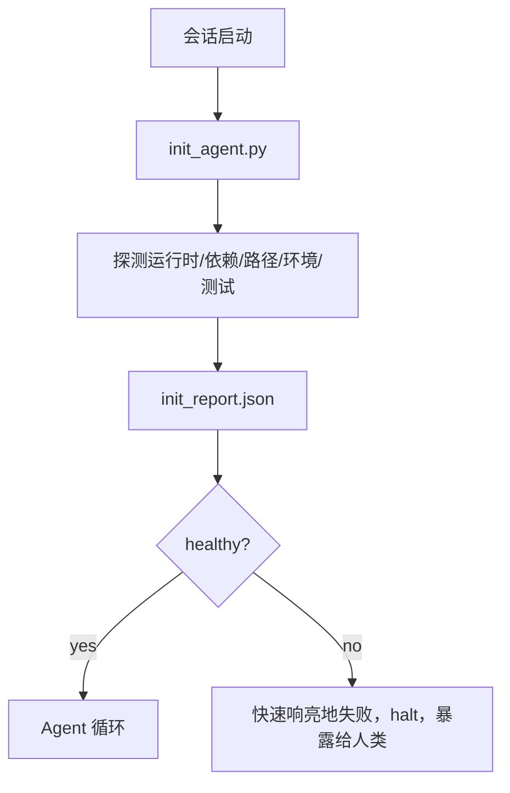

# Agent 初始化脚本

> 每个冷启动的会话都要付出代价。Agent 读取相同的文件、重试相同的探测、重新发现相同的路径。初始化脚本付出一次代价，将答案写入状态。

**类型：** 动手实现
**语言：** Python（标准库）
**前置要求：** Phase 14 · 32（极简工作台）、Phase 14 · 34（仓库记忆）
**时长：** 约 45 分钟

## 学习目标

- 识别 Agent 每会话永远不需要重做的工作。
- 构建一个确定性初始化脚本，探测运行时、依赖和仓库健康状况。
- 持久化探测结果，使 Agent 读取它而非重新运行检查。
- 当初始化失败时，快速响亮地失败，有一个统一的排查入口。

## 问题

打开一个会话。Agent 猜测 Python 版本。猜测测试命令。列出仓库根目录五次以找到入口点。尝试导入一个未安装的包。询问用户配置文件在哪里。等它做出真正的编辑时，一万个 token 已经花在了本该是一个脚本完成的设置工作上。

修复方案是一个初始化脚本，在 Agent 做任何事情之前运行，将 `init_report.json` 写入，Agent 在启动时读取它。

## 概念



### 初始化脚本探测的内容

| 探测项 | 为什么重要 |
|--------|-----------|
| 运行时版本 | 错误的 Python 或 Node 版本意味着静默的版本错误 bug |
| 依赖可用性 | 稍后缺少包的成本是现在捕获它的十倍 |
| 测试命令 | Agent 必须知道如何验证；如果命令缺失工作台就坏了 |
| 仓库路径 | 硬编码路径会漂移；一次性解析并固定 |
| 环境变量 | 缺少 `OPENAI_API_KEY` 是失败面，不是运行时谜题 |
| 状态 + 看板新鲜度 | 崩溃会话的陈旧状态是个隐患 |
| 上一个已知正常提交 | 会话结束时交接 diff 的锚点 |

### 快速响亮地失败，快速失败，统一入口

探测失败意味着 halt 并暴露给人类。不是"Agent 会搞清楚的"。初始化的全部意义在于在工作台坏了的时候拒绝启动。

### 幂等

连续运行两次。第二次应该除了刷新时间戳外是一个空操作。幂等性使得你能够将脚本接入 CI、钩子或预任务斜杠命令。

### 初始化 vs 启动规则

规则（Phase 14 · 33）描述了什么必须为真才能行动。初始化是建立这些规则可以被检查的脚本。没有规则的初始化变成"要小心"。没有规则的初始化变成一个精致的失败。

## 动手实现

`code/main.py` 实现 `init_agent.py`：

- 五个探测：Python 版本、通过 `importlib.util.find_spec` 检测依赖、测试命令可解析性、必要环境变量、状态文件新鲜度。
- 每个探测返回 `(name, status, detail)`。
- 脚本写入 `init_report.json`，包含完整探测集，若任何 block 严重性探测失败则非零退出。

运行：

```bash
python3 code/main.py
```

脚本打印探测表格，写入 `init_report.json`，在愉快路径上退出零，失败时非零退出并附带失败探测列表。

## 生产模式的真实案例

三个模式将一个有用的初始化脚本与一个走过场的仪式区分开来。

**上一个已知正常提交锚定。** 探测当前提交相对于上次成功合并时写入的 `LKG` 文件的差异。如果 diff 超过预算（默认 50 个文件），拒绝启动并要求人类确认新的基线。这就是 Cloudflare AI 代码审查用于限定审查 Agent 范围的方式：每次审查会话锚定到同一个上一个已知正常，绝不在会话间累积漂移。

**带 TTL 的锁文件。** 首次成功探测通过后写入 `prereqs.lock`。后续运行在 N 小时内信任锁（默认 24h）并跳过昂贵的探测。初始化脚本先读取锁；如果锁是最新的且依赖清单哈希匹配，则短路。这与 Docker 用于层缓存的模式相同：幂等探测 + 内容哈希 = 跳过。

**热路径中无网络、无 LLM、无意外。** 初始化探测是确定性管道。一个探测调用 LLM 来分类失败或访问外部服务来检查许可证，这不是探测，是一个工作流。如果一次 dry run 中探测超过三秒，将其视为工作台坏味道，要么移出初始化，要么缓存其结果。

## 用现成库

在生产中：

- **Claude Code 钩子。** `pre-task` 钩子调用初始化脚本，若失败则拒绝启动 Agent。
- **GitHub Actions。** `setup-agent` job 运行初始化脚本；Agent job 依赖它。
- **Docker 入口点。** Agent 容器在 exec-ing Agent 运行时前运行初始化脚本；日志在失败时暴露。

初始化脚本可移植，因为它不调用特定框架。Bash、Make 或 tasks 文件都可以包装它。

## 产出

`outputs/skill-init-script.md` 采访项目，将其设置工作分类为探测，发射项目专属的 `init_agent.py` 加 CI workflow，在任何 Agent 步骤前运行它。

## 练习

1. 添加一个探测，比较当前提交与上一个已知正常提交的差异，超过 50 个文件变更则拒绝启动。
2. 让脚本写入 `prereqs.lock` 文件，锁超过七天后拒绝启动。
3. 添加 `--fix` 标志，自动安装缺失的开发依赖，但未经审批绝不修改运行时依赖。
4. 将探测从硬编码函数迁移到 YAML 注册表。为这个权衡辩护。
5. 给每个探测添加计时预算。运行超过三秒的探测是工作台坏味道。

## 关键术语

| 术语 | 常见说法 | 实际含义 |
|------|----------|----------|
| 探测 | 检查 | 返回 `(name, status, detail)` 的确定性函数 |
| 初始化报告 | 设置输出 | 写入状态旁边的 JSON，包含探测结果 |
| 幂等 | 可安全重复运行 | 连续两次运行产生相同报告（时间戳除外） |
| 快速响亮地失败 | 不要吞掉 | Halt 并暴露给人类；不静默回退 |
| 设置税 | 引导成本 | Agent 每会话花在重新发现明显事物上的 token |

## 延伸阅读

- [Anthropic，面向长时 Agent 的高效运行机制](https://www.anthropic.com/engineering/effective-harnesses-for-long-running-agents)
- [GitHub Actions，复合 action 用于设置](https://docs.github.com/en/actions/sharing-automations/creating-actions/creating-a-composite-action)
- [microservices.io，GenAI 开发平台：护栏](https://microservices.io/post/architecture/2026/03/09/genai-development-platform-part-1-development-guardrails.html) — pre-commit + CI 检查作为初始化
- [Augment Code，如何构建你的 AGENTS.md（2026）](https://www.augmentcode.com/guides/how-to-build-agents-md) — 初始化期望
- [Codex 博客，Codex CLI 上下文压缩架构](https://codex.danielvaughan.com/2026/03/31/codex-cli-context-compaction-architecture/) — 会话启动作为压缩感知初始化
- Phase 14 · 33 — 本脚本所启用的规则集
- Phase 14 · 34 — 本脚本所播种的状态文件
- Phase 14 · 38 — 本脚本所喂入的验证门禁
- Phase 14 · 40 — 消费初始化报告上一个已知正常的交接