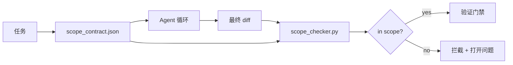

# 范围契约与任务边界

> 模型不知道工作在哪里结束。范围契约是每个任务对应的文件，说明工作从哪里开始、到哪里结束、溢出时如何回滚。契约将"保持在范围内"从愿望变成检查。

**类型：** 动手实现
**语言：** Python（标准库）
**前置要求：** Phase 14 · 32（极简工作台）、Phase 14 · 33（规则即约束）
**时长：** 约 50 分钟

## 学习目标

- 编写一个范围契约，Agent 在任务开始时读取，验证器在任务结束时读取。
- 指定允许的文件、禁止的文件、验收标准、回滚计划和审批边界。
- 实现一个范围检查器，将 diff 与契约比较并标记违规。
- 让范围蔓延可见、自动和可审查。

## 问题

Agent 会蔓延。任务是"修复登录 bug"。Diff 触及了登录路由、邮件辅助函数、数据库驱动、README 和发布脚本。每个触及在当时都有合理的理由放在一起它们是一个与被审查的那个不同的改动。

范围蔓延是 Agent 工作中最不被监控的失败模式，因为 Agent 每一步都以善意叙述。修复方案不是更严格的提示词。修复方案是磁盘上的一份契约，说明承诺了什么，以及一个将结果与承诺比较的检查。

## 概念



### 范围契约的内容

| 字段 | 用途 |
|------|------|
| `task_id` | 链接到任务板上的任务 |
| `goal` | 一句话，审查者可验证 |
| `allowed_files` | Agent 可以写入的 glob |
| `forbidden_files` | Agent 即使意外也不得触及的 glob |
| `acceptance_criteria` | 证明完成的测试命令或断言行 |
| `rollback_plan` | 如果需要 halt 操作员可执行的一段话 |
| `approvals_required` | 范围外需要明确人类签名的操作 |

没有 `forbidden_files` 的契约是不完整的。负空间是契约的一半。

### 用 glob，不用原始路径

真实仓库会移动文件。将契约固定到 glob（`app/**/*.py`、`tests/test_signup*.py`），这样会话间的重构不会让契约失效。

### 回滚是范围的一部分

列出如何回滚，迫使契约作者思考什么可能出错。一个无法回滚的契约就是一个不该被批准的契约。

### 范围检查就是 diff 检查

Agent 写出一个 diff。检查器读取 diff、允许的 glob、禁止的 glob，以及运行的任何验收命令列表。每个违规都是一个带标签的发现，验证门禁可以拒绝。

## 动手实现

`code/main.py` 实现：

- `scope_contract.json` schema（JSON Schema 子集，glob 数组）。
- 一个 diff 解析器，将触及文件列表和运行命令列表转换为 `RunSummary`。
- 一个 `scope_check`，对契约返回 `(violations, in_scope, off_scope)`。
- 两个演示运行：一个保持在范围内，一个蔓延。检查器用确切的文件和原因标记蔓延。

运行：

```bash
python3 code/main.py
```

输出：契约、两次运行、每次运行的判定，以及保存的 `scope_report.json`。

## 生产模式的真实案例

一位实践者在 YAML 中编写范围契约后再调用 Agent，"规范最大化"后报告兔子洞率在三周内从 52% 下降到 21%，而没有改变 Agent。契约完成了工作，不是模型。三个模式使收益持久化。

**违规预算，而非二元失败。** `agent-guardrails`（Claude Code、Cursor、Windsurf、Codex 通过 MCP 使用的开源合并拦截器）每个任务携带 `violationBudget`：预算内的轻微范围滑移作为警告浮出水面；只有超过预算时合并拦截器才拒绝。配合 `violationSeverity: "error" | "warning"`。预算是让一个拦截器被发货而不是被团队禁用之间的区别。

**按路径族的严重性不对称。** `docs/**` 的范围外写入通常是 `warn`；`scripts/**`、`migrations/**`、`config/prod/**` 的范围外写入始终是 `block`。这种不对称必须存在于契约中，而不是运行时中，因为它随项目而异、随任务而变。

**时间和网络预算与文件预算并列。** `time_budget_minutes` 字段限制墙上时钟；运行时在不重新批准的情况下拒绝继续超出。`network_egress` 白名单限制主机名，防止 Agent 悄悄 Hit 不在任务范围内的外部 API。这些也是范围维度；文件 glob 是必要的，但光有它不够。

**多契约合并语义（最小权限）。** 当两个范围契约适用（例如一个项目级契约加一个任务级契约）时，合并规则为：`allowed_files` 取**交集**（两个契约都必须允许该路径），`forbidden_files` 取**并集**（任一可禁止），`time_budget_minutes` 取最严格的（最小值），`approvals_required` 累加。`network_egress`：`None` 表示不强制，`[]` 表示全部拒绝，`[...]` 作为白名单；合并时，`None` 服从另一侧，两个列表取交集，全部拒绝保持全部拒绝。在契约 schema 中声明这一点，使合并是机械的、可审查的。

## 用现成库

生产模式：

- **Claude Code 斜杠命令。** `/scope` 命令写入契约并固定为会话上下文。子 Agent 在行动前读取契约。
- **GitHub PR。** 将契约作为 PR body 中的 JSON 文件或作为签入产物推送。CI 对合并 diff 运行范围检查器。
- **LangGraph 中断。** 范围违规触发中断；处理器询问人类契约是否需要扩展或 Agent 需要退让。

契约随任务旅行。当任务关闭时，契约存档在 `outputs/scope/closed/`。

## 产出

`outputs/skill-scope-contract.md` 根据任务描述生成范围契约，和一个在 CI 中对每个 Agent diff 运行的 glob 感知检查器。

## 练习

1. 添加 `network_egress` 字段，列出允许的外部主机。拒绝触及其他主机的运行。
2. 扩展检查器，对 `docs/**` 软失败，对 `scripts/**` 硬失败。说明不对称的合理性。
3. 使契约从 `goal` 字段用静态规则集派生 `allowed_files`（不用 LLM）。第一个边缘情况会出现什么问题？
4. 添加 `time_budget_minutes`，一旦墙上时钟超过则拒绝继续。
5. 对同一 diff 运行两个契约。当两者都适用时，正确的合并语义是什么？

## 关键术语

| 术语 | 常见说法 | 实际含义 |
|------|----------|----------|
| 范围契约 | 任务简报 | 每个任务的 JSON，列出允许/禁止的文件、验收、回滚 |
| 范围蔓延 | "它还触及了……" | 同一任务中契约外的文件被改动 |
| 回滚计划 | 我们可以回退 | 操作员 halt 的一段落运行手册 |
| 审批边界 | 需要签章 | 契约中列为需要明确人类批准的操作 |
| Diff 检查 | 路径审计 | 将触及文件与契约 glob 比较 |

## 延伸阅读

- [LangGraph 人机交互中断](https://langchain-ai.github.io/langgraph/concepts/human_in_the_loop/)
- [OpenAI Agents SDK 工具批准策略](https://platform.openai.com/docs/guides/agents-sdk)
- [logi-cmd/agent-guardrails — 合并拦截和范围验证](https://github.com/logi-cmd/agent-guardrails) — 违规预算、严重性层级
- [Dev|Journal，用 Agent 契约测试防止 AI Agent 配置漂移](https://earezki.com/ai-news/2026-05-05-i-built-a-tiny-ci-tool-to-keep-ai-agent-configs-from-drifting-in-my-repo/) — 无外部依赖的 `--strict` 模式
- [Agentic Coding Is Not a Trap（生产日志）](https://dev.to/jtorchia/agentic-coding-is-not-a-trap-i-answered-the-viral-hn-post-with-my-own-production-logs-33d9) — 规范最大化收据：52% → 21%
- [OpenCode 权限 glob](https://opencode.ai/docs/agents/) — 细粒度按权限范围
- [Knostic，AI 编码 Agent 安全：威胁模型与保护策略](https://www.knostic.ai/blog/ai-coding-agent-security) — 范围作为最小权限的一部分
- [Augment Code，AI Spec 模板](https://www.augmentcode.com/guides/ai-spec-template) — 三层边界系统（必须/询问/绝不）
- Phase 14 · 27 — 与范围锁配合的提示词注入防御
- Phase 14 · 33 — 本契约所细化的规则集
- Phase 14 · 38 — 检查器报告给验证门禁