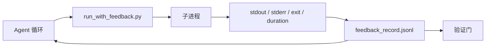

# 运行时反馈循环

> 看不懂真实命令输出的 Agent 只能靠猜。反馈运行器将 stdout、stderr、退出码和耗时记录为结构化数据，下一个回合就能读取。然后 Agent 反应的是事实，而不是它自己预测的事实。

**类型:** 动手实现
**语言:** Python (stdlib)
**前置知识:** Phase 14 · 32（最小工作台）, Phase 14 · 35（初始化脚本）
**时长:** 约 50 分钟

## 学习目标

- 区分运行时反馈与可观测性遥测。
- 构建一个包装 shell 命令并持久化结构化记录的反馈运行器。
- 确定性地截断大输出，使循环保持在 token 预算内。
- 缺少反馈时拒绝推进循环。

## 问题

Agent 说"现在运行测试。"下一条消息说"所有测试都通过了。"实际情况是根本没有运行任何测试。Agent 臆造了输出，或者运行了命令但从未读取结果，或者读取了结果但悄悄截断了失败的那一行。

反馈运行器堵住了这个缺口。每条命令都经过运行器。每条记录都携带命令、捕获的 stdout 和 stderr、退出码、墙上耗时，以及一行 Agent 备注。Agent 在下一个回合读取这条记录。验证门在任务结束时读取这些记录。

## 核心概念



### 反馈记录包含什么

| 字段 | 为什么重要 |
|-------|----------------|
| `command` | 精确的 argv，无 shell 展开带来的意外 |
| `stdout_tail` | 最后 N 行，确定性截断 |
| `stderr_tail` | 最后 N 行，与 stdout 分开记录 |
| `exit_code` | 明确无误的成功信号 |
| `duration_ms` | 暴露慢探测和失控进程 |
| `started_at` | 用于回放的时间戳 |
| `agent_note` | Agent 写的一行说明，描述它的预期 |

### 截断是确定性的

50 MB 日志会拖垮整个循环。运行器从头尾双向截断，插入 `...truncated N lines...` 标记——确定性截断保证相同输出总产生相同记录。不采样；Agent 需要看的部分（最后的错误、最后的摘要）在尾部。

### 反馈与遥测的区别

遥测（Phase 14 · 23，OTel GenAI 语义约定）是供人类操作员跨时间审视运行过程用的。反馈是为本次运行的下一轮回合准备的。两者共享字段，但写入不同文件，有不同保留策略。

### 没有反馈就不推进

如果运行器在捕获退出码之前出错，记录携带 `exit_code: null` 和 `error: <reason>`。Agent 循环必须在 `null` 退出时拒绝声称成功。没有退出码，不推进。

## 动手实现

`code/main.py` 实现：

- `run_with_feedback(command, agent_note)` 包装 `subprocess.run`，捕获 stdout/stderr/exit/耗时，确定性截断，追加到 `feedback_record.jsonl`。
- 一个轻量加载器，将 JSONL 流式读入 Python 列表。
- 一个演示，运行三条命令（成功、失败、慢），并打印每条命令的最后一条记录。

运行：

```
python3 code/main.py
```

输出：三条反馈记录追加到 `feedback_record.jsonl`，每条命令的最后一条打印出来。跨运行用 tail 观察文件，可以看到循环逐步积累。

## 真实生产模式

三个模式让运行器足够坚固可以发布。

**写入时脱敏，而非读取时脱敏。** 任何触及 stdout 或 stderr 的记录都可能泄露密钥。运行器在追加 JSONL 之前执行脱敏步骤：剔除匹配 `^Bearer `、`password=`、`api[_-]?key=`、`AKIA[0-9A-Z]{16}`（AWS）、`xox[baprs]-`（Slack）的行。读取时脱敏是给自己埋雷；攻击者接触到的是磁盘上的文件。每个季度对照生产运行时观察到的密钥格式审核脱敏模式。

**轮转策略，而非单一文件。** `feedback_record.jsonl` 每文件上限 1 MB；溢出时轮转到 `.1`、`.2`，丢弃 `.5` 及更早。Agent 循环只读当前文件，所以运行时开销有界。CI 工件存储获取完整的轮转文件集合。没有轮转，文件会在每次加载器调用时成为瓶颈。

**父命令 id 用于重试链。** 每条记录有 `command_id`；重试携带 `parent_command_id` 指向前一次尝试。审核者的"失败尝试"列表（Phase 14 · 40）和验证门的审计都沿链追溯。没有这条链路，重试看起来像独立成功，审计就隐藏了失败历史。

## 用现成库

生产模式：

- **Claude Code Bash 工具。** 该工具已捕获 stdout、stderr、exit 和耗时。本课中的运行器是任何 Agent 产品的框架无关等效实现。
- **LangGraph 节点。** 任意 shell 节点用运行器包装，记录就可以持久化到图状态之外。
- **CI 日志。** 将 JSONL 接入 CI 工件存储；审核者无需重跑会话就能重放任意命令。

运行器是一个薄包装，因为记录格式归它定义，所以它能在每次框架迁移中存活。

## 产出

`outputs/skill-feedback-runner.md` 生成项目特定的 `run_with_feedback.py`（含正确的截断预算）、接入工作台的 JSONL 写入器，以及 Agent 每轮读取的加载器。

## 练习

1. 为每条记录添加 `cwd` 字段，这样从不同目录运行的相同命令可以区分。
2. 添加一个 `redaction` 步骤，剔除匹配 `^Bearer ` 或 `password=` 的行。在一个 fixture 记录上测试。
3. 将 `feedback_record.jsonl` 总大小上限设为 1 MB，轮转到 `.1`、`.2` 文件。阐明轮转策略的理由。
4. 添加 `parent_command_id`，使重试链可见：哪条命令产生了下一条命令消费的输入。
5. 将 JSONL 接进一个小 TUI，高亮最新的非零退出码。TUI 必须展示的八个关键功能点是什么，才能在审核中有用？

## 关键术语

| 术语 | 大家这么说 | 实际指什么 |
|------|----------------|------------------------|
| 反馈记录 | "运行日志" | 结构化 JSONL 条目，含命令、输出、退出码、耗时 |
| 尾部截断 | "裁剪日志" | 确定性的头尾截断，使记录适配 token 预算 |
| 遇 null 即拒 | "遇缺失数据即阻止" | `exit_code` 为 null 时循环不得推进 |
| Agent 备注 | "预期标签" | Agent 在读取结果前写的一行预测 |
| 遥测分离 | "两个日志文件" | 反馈给下一轮，遥测给操作员 |

## 延伸阅读

- [OpenTelemetry GenAI 语义约定](https://opentelemetry.io/docs/specs/semconv/gen-ai/)
- [Anthropic, Effective harnesses for long-running agents](https://www.anthropic.com/engineering/effective-harnesses-for-long-running-agents)
- [Guardrails AI x MLflow — deterministic safety, PII, quality validators](https://guardrailsai.com/blog/guardrails-mlflow) — 脱敏模式作为回归测试
- [Aport.io, Best AI Agent Guardrails 2026: Pre-Action Authorization Compared](https://aport.io/blog/best-ai-agent-guardrails-2026-pre-action-authorization-compared/) — 工具调用前后捕获
- [Andrii Furmanets, AI Agents in 2026: Practical Architecture for Tools, Memory, Evals, Guardrails](https://andriifurmanets.com/blogs/ai-agents-2026-practical-architecture-tools-memory-evals-guardrails) — 可观测性层面
- Phase 14 · 23 — OTel GenAI 语义约定（遥测侧）
- Phase 14 · 24 — Agent 可观测性平台（Langfuse, Phoenix, Opik）
- Phase 14 · 33 — 要求在宣布完成前必须有反馈的规则
- Phase 14 · 38 — 读取该 JSONL 的验证门