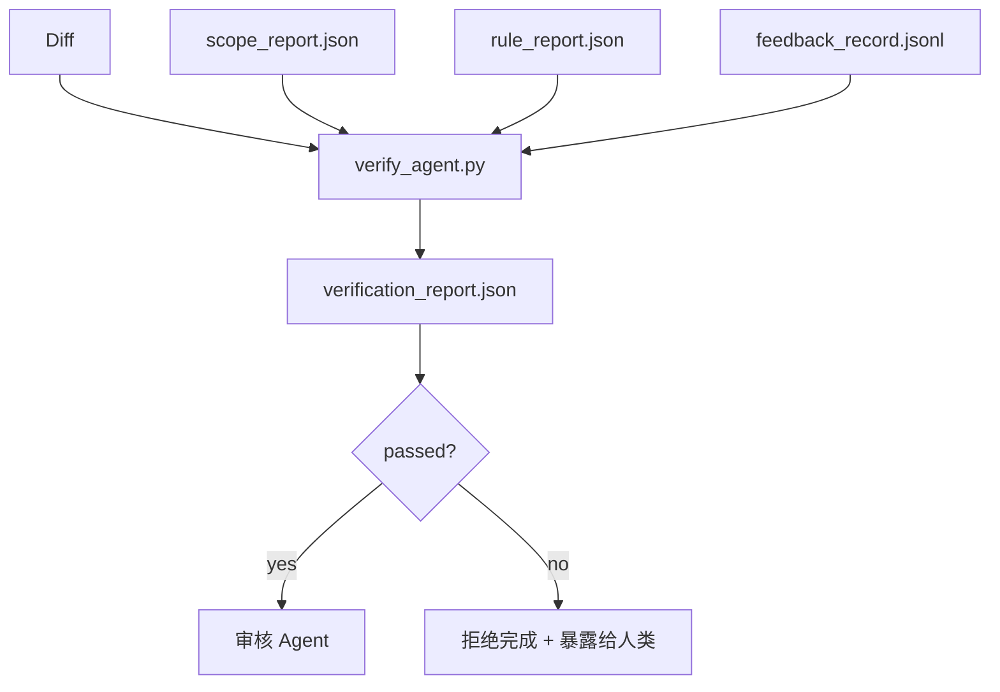

# 验证门

> Agent 不能给自己的工作打完成标记。验证门读取范围契约、反馈日志、规则报告和 diff，回答一个唯一的问题：任务真的完成了吗？门说不，行就是没说——不管聊天里怎么讲。

**类型:** 动手实现
**语言:** Python (stdlib)
**前置知识:** Phase 14 · 33（规则）, Phase 14 · 36（范围）, Phase 14 · 37（反馈）
**时长:** 约 55 分钟

## 学习目标

- 将验证门定义为工作台工件上的确定性函数。
- 将规则报告、范围报告、反馈记录和 diff 合并为一个裁决。
- 发出审核 Agent 和 CI 都能读取的 `verification_report.json`。
- 任何 block 级别失败都拒绝推进任务，无例外。

## 问题

Agent 太容易宣称成功了。三种失败形态占主导：

- "看起来不错。" 模型读了它自己的 diff，认为它是对的。
- "测试通过了。" 很自信地说。但没有任何记录证明测试真的运行过。
- "验收标准达到了。" 验收标准被解读得足够宽松，"任何看起来完成了的东西"都算。

工作台的修复方案是一个单一的验证门，读取 Agent 已产生的工件并做出判断。门是确定性的。门在版本控制中。门接入 CI。Agent 无法贿赂它。

## 核心概念



### 门检查什么

| 检查项 | 来源工件 | 严重级别 |
|-------|-----------------|----------|
| 所有验收命令已运行 | `feedback_record.jsonl` | block |
| 所有验收命令退出码为 0 | `feedback_record.jsonl` | block |
| 范围检查无禁止写入 | `scope_report.json` | block |
| 范围检查无范围外写入 | `scope_report.json` | block 或 warn |
| 所有 block 级别规则通过 | `rule_report.json` | block |
| 反馈中无 `null` 退出码 | `feedback_record.jsonl` | block |
| 修改的文件匹配 `scope.allowed_files` | 两者都有 | warn |

`warn` 结果在裁决中标注；`block` 结果阻止 `passed: true`。

### 确定性，而非概率性

门必须对相同的工件集合每次产生相同的裁决。无 LLM 裁判。LLM 裁判属于审核侧（Phase 14 · 39），那里目标是定性评估，不是状态判定。

### 一个报告，一个路径

门每次任务收尾时写一份 `verification_report.json`，路径为 `outputs/verification/<task_id>.json`。CI 消费同一路径。多门多路径会让真相来源分裂。

### 无例外地拒绝

Block 级别结果不能被 Agent 覆盖。只能被人覆盖，必须有记录的 `override_reason` 和 `overridden_by` 用户 id。覆盖是一次签名提交，不是 Agent 的决定。

## 动手实现

`code/main.py` 实现：

- 每个输入工件的加载器，均为本地存根，使课程自包含。
- 一个 `verify(task_id, artifacts) -> VerdictReport` 纯函数。
- 一个打印器，显示每项检查结果和最终通过/失败。
- 三个任务场景演示：干净通过、范围蔓延、缺失验收。

运行：

```
python3 code/main.py
```

输出：三个裁决报告，保存在脚本同目录下。

## 真实生产模式

四个模式将门从"又一个 lint 任务"提升为"决定性防线"。

**纵深防御，而非单一门。** Pre-commit hook → CI 状态检查 → pre-tool 授权钩子 → pre-merge 门。每一层都是确定性的，所以一层失败会被下一层捕获。microservices.io 的 2026 年 3 月 playbook 明确指出：pre-commit hook 不可绕过，因为它不像模型侧 skill 那样依赖 Agent 遵守指令。验证门位于 CI / pre-merge 层。

**确定性检查防御，模型裁判只在需要细致判断时用。** Anthropic 2026 年混合规范配对：可验证的奖励（单元测试、schema 检查、退出码）回答"代码解决问题了吗？"——LLM 标准回答"代码可读吗，安全吗，风格对吗？"门运行第一类；审核者（Phase 14 · 39）运行第二类。混在一起会让信号崩溃。

**签名覆盖日志，而非 Slack 讨论串。** 每次覆盖在 `outputs/verification/overrides.jsonl` 写入一行，含：时间戳、发现代码、原因、签名用户、当前 HEAD 提交。运行时拒绝任何缺少签名的覆盖；审计跟踪由 git 管理。这就是覆盖政策与覆盖表演之间的分界线。

**覆盖率底线作为一等检查项。** `coverage_report.json` 供给一个 `coverage_floor`（默认 80%）检查。门的检查失败条件：实测覆盖率低于底线，或低于上一次合并的底线超过 1 个百分点。没有这项检查，Agent 会悄悄删除失败的测试，验证报告保持绿色。

**`--strict` 模式将 warn 升为 block。** 对于 release 分支、阻止发布的 PR，或事故后排查，`--strict` 将每个警告变为硬失败。该标志按分支 opt-in，不设全局默认，因为所有东西都 strict 会腐蚀日常流程。

## 用现成库

生产模式：

- **CI 步骤。** `verify_agent` 作业对 Agent 的最终工件运行门。合并保护在没有 `passed: true` 时拒绝。
- **Pre-handoff 钩子。** Agent 运行时在生成 handoff 文档前调用门。没有绿色裁决，不 handoff。
- **人工分类。** 当 Agent 声称成功但人类怀疑时，操作员阅读报告。

门是工作台流程中的决定性防线。其他所有地方都在它上游。

## 产出

`outputs/skill-verification-gate.md` 将门接入特定项目：哪些验收命令喂给它，哪些规则是 block 级别，哪些范围外写入是可容忍的，覆盖审计日志存在哪里。

## 练习

1. 添加 `coverage_floor` 检查：测试命令必须生成覆盖率报告且不低于 80%。决定哪个工件携带底线。
2. 支持 `--strict` 模式，将每个 `warn` 升为 `block`。说明 strict 模式成为正确默认的场景。
3. 让门额外生成 Markdown 摘要（除 JSON 外）。说明哪些字段应该进入摘要。
4. 添加 `time_since_last_human_touch` 检查：任何在人类击键后 60 秒内编辑的文件可豁免范围外标记。
5. 在你产品的真实 Agent diff 上运行门。有多少发现是真实的，多少是噪音？门需要在哪里成长？

## 关键术语

| 术语 | 大家这么说 | 实际指什么 |
|------|----------------|------------------------|
| 验证门 | "阻止事情的检查" | 对工作台工件产生通过/失败裁决的确定性函数 |
| Block 级别 | "硬失败" | 阻止 `passed: true` 且需要签名覆盖的结果 |
| 覆盖日志 | "我们为什么放行" | 含原因和用户 id 的签名条目，由审核审计 |
| 验收命令 | "证明" | shell 命令，退出码为 0 代表"完成了" |
| 单报告路径 | "真相来源" | `outputs/verification/<task_id>.json`，CI 和人类都读它 |

## 延伸阅读

- [Anthropic, Harness design for long-running application development](https://www.anthropic.com/engineering/harness-design-long-running-apps)
- [OpenAI Agents SDK guardrails](https://platform.openai.com/docs/guides/agents-sdk/guardrails)
- [microservices.io, GenAI dev platform: guardrails](https://microservices.io/post/architecture/2026/03/09/genai-development-platform-part-1-development-guardrails.html) — pre-commit 到 CI 的纵深防御
- [ICMD, The 2026 Playbook for Agentic AI Ops](https://icmd.app/article/the-2026-playbook-for-agentic-ai-ops-guardrails-costs-and-reliability-at-scale-1776661990431) — approval-gate 阶梯（draft → approval → 阈值下自动）
- [Type-Checked Compliance: Deterministic Guardrails (arXiv 2604.01483)](https://arxiv.org/pdf/2604.01483) — Lean 4 作为确定性门控的上界
- [logi-cmd/agent-guardrails — merge gate spec](https://github.com/logi-cmd/agent-guardrails) — scope + 变异测试门
- [Guardrails AI x MLflow](https://guardrailsai.com/blog/guardrails-mlflow) — 确定性验证器作为 CI 评分器
- [Akira, Real-Time Guardrails for Agentic Systems](https://www.akira.ai/blog/real-time-guardrails-agentic-systems) — pre/post-tool 门
- Phase 14 · 27 — 提示注入防御（门的对抗配对）
- Phase 14 · 36 — 本门执行的范围契约
- Phase 14 · 37 — 本门打分的反馈日志
- Phase 14 · 39 — 本门交接给的审核 Agent