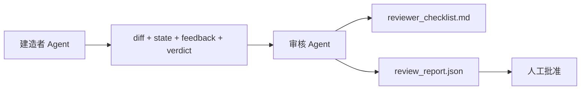

# 审核 Agent：把建造者与评判者分开

> 写了代码的 Agent 无法给它评分。审核者是一个第二个循环，有不同的系统 prompt、不同的目标，且对建造者产生的所有内容只读不写。建造者与审核者之间的差距，是大多数可靠性所在的地方。

**类型:** 动手实现
**语言:** Python (stdlib)
**前置知识:** Phase 14 · 38（验证门）
**时长:** 约 55 分钟

## 学习目标

- 论证同一 Agent 无法可靠审核自己工作的原因。
- 构建一个消费建造者工件并发出结构化审核报告的审核 Agent 循环。
- 编写一个在特定维度而非凭感觉打分的审核评分标准。
- 将审核者接入工作台，使人肉审核步骤从真实工件开始。

## 问题

你让 Agent 修一个 bug。它改了四个文件，运行测试，报告完成。验证门（Phase 14 · 38）确认验收已运行、范围已守住。门说 `passed: true`。你合并了。两天后发现修复修错了 bug 的另一半。

验收是必要的，但还不够。审核者问的是验收无法问的问题：解决了正确的问题吗？扩大范围却没有标记吗？把应该被质疑的假设记录下来了吗？留给下次会话的工作台状态能让下一轮干净接续吗？

## 核心概念



### 审核评分标准

五个维度，每项 0 到 2 分。

| 维度 | 问题 |
|-----------|----------|
| 问题匹配度 | 这次修改解决了陈述的任务，还是解决了附近的一个任务？ |
| 范围纪律 | 修改是否限定在契约内，还是契约被悄悄扩大了？ |
| 假设 | 所有隐含假设是否写在某处可审核的地方？ |
| 验收质量 | 验收命令真的证明了目标，还是只证明了一个更弱的版本？ |
| 交接就绪度 | 下一轮能否从当前状态干净接续？ |

满分 10 分。低于 7 分是软失败；低于 5 分是硬失败。

### 审核者是独立角色，不是独立模型

可以用与建造者相同的模型运行审核者。纪律在于角色分离：不同的系统 prompt、不同的输入、不允许写 diff。姿态的改变带来信号的改变。

### 审核者不能编辑 diff

审核者读取 diff、状态、反馈、裁决。它写报告。它不打补丁 diff。如果报告说"修复这里"，下一轮建造者做修复；审核者回去审核。角色混用会消除差距。

### 审核评分标准与验证门的对比

门（Phase 14 · 38）检查确定性事实：验收是否运行、规则是否通过、范围是否守住。审核者做定性判断：这是正确的工作吗？有文档吗？交接可用吗？两者都必须有。

## 动手实现

`code/main.py` 实现：

- `ReviewerInputs` 数据类，打包审核者读取的工件。
- 一个评分标准打分器，每维度一个函数。每函数是确定性的，且本课用的是 stub 级实现；真实实现会调用 LLM。
- 一个 `review_report.json` 写入器，含五项分数、总分和裁决（`pass`、`soft_fail`、`hard_fail`）。
- 两个演示用例：一个干净修改和一个"测试正确但问题解决错了"的修改。

运行：

```
python3 code/main.py
```

输出：两个审核报告写入磁盘，控制台打印维度分数表。

## 真实生产模式

实绩：Cloudflare 的 2026 年 4 月 AI 代码审核系统，30 天内在 5169 个仓库、48095 个合并请求中运行了 131246 次审核。中位审核完成时间 3 分 39 秒。多达七位专业审核者（安全、性能、代码质量、文档、发布管理、合规、工程典籍）在审核协调器下去重和判断严重级别后并行运行。顶级模型专用于协调器；专业审核者跑在更便宜的层级。

四个模式使这在大规模下可行。

**专业池，而非一个大审核者。** 五维度评分的单一审核者适用于单人仓库。代码库一旦有了安全关键、性能关键和文档表面，就拆分成更小 prompt 的专业审核者。协调器做去重；专业审核者从不运行完整评分标准。模型层级分离自然产生：便宜的专业审核者，昂贵的协调器。

**偏差缓解是设计要求，不是优化目标。** LLM 裁判有四个可靠偏差（Adnan Masood，2026 年 4 月）：位置偏差（GPT-4 对 (A,B) 和 (B,A) 顺序约 40% 不一致）、冗长度偏差（约 15% 对更长输出给分膨胀）、自偏好（裁判偏好同模型家族的输出）、权威性（裁判对已知作者引用的评价偏高）。缓解方法：对两个顺序都评估，只认可一致获胜；使用 1-4 分制显式奖励简洁；跨模型家族轮转裁判；评分前剔除作者姓名。

**校准集，而非凭感觉。** 一个含 10-20 个已知正确答案的历史任务集。每次 prompt 变更都对其运行审核者。如果与历史记录的一致性低于 80%，审核评分标准需要在发布前修订。每个团队最终都会重新发现这一点；一开始就带上更好。

**与门的混合规范。** 验证门（Phase 14 · 38）处理确定性检查（验收是否运行、测试是否通过、范围是否守住）。审核者处理语义检查（这是正确的工作吗，假设有文档吗，交接可用吗）。Anthropic 2026 年指引明确说明了这个分工：不要让审核者重做门已证明的事情。

## 用现成库

生产模式：

- **Claude Code 子 Agent。** 建造者关闭任务后，一个审核子 Agent 运行。它在 PR 上发一条评论，附上评分标准分数。
- **OpenAI Agents SDK 交接。** 建造者在任务完成时交接给审核者。审核者可以带着发现列表交回，或交给人。
- **双模型配对。** 建造者跑在更快更便宜的模型上。审核者跑在更强但上下文更小的模型上，聚焦于判断。

审核者是工作台长出的人类无法亲自完成每条审核时的第二双眼睛。

## 产出

`outputs/skill-reviewer-agent.md` 生成项目特定的审核评分标准、一个接入建造者工件存根的审核 Agent stub，以及与验证门的集成，使人工审核从一个书面报告开始，而不是一张白纸。

## 练习

1. 添加第六个维度，专属于你的产品领域。说明为什么它不能被现有五维吸收。
2. 用两种不同的系统 prompt 运行审核者（简洁版、冗长版）。哪个更可能让人读得下去？
3. 每个维度添加 `confidence` 字段。当最低维度置信度低于 0.6 时拒绝发出报告。
4. 构建校准集：10 个已知正确裁决的历史任务关闭。用审核者跑一遍。在哪里与历史记录不一致？
5. 添加"请求更多证据"功能：审核者可以在打分前要求建造者运行特定测试。这样设计后退机制才不会死循环？

## 关键术语

| 术语 | 大家这么说 | 实际指什么 |
|------|----------------|------------------------|
| 审核评分标准 | "检查清单" | 五维度 0-2 评分，每维度有书面问题 |
| 软失败 | "需要修订" | 总分低于 7；建造者收到需要处理的发现 |
| 硬失败 | "拒绝" | 总分低于 5 或任何维度得 0 分；停止并暴露给人类 |
| 角色分离 | "不同的 prompt" | 同一模型可以同时担任两个角色；纪律在于输入和姿态 |
| 置信度底线 | "不发低信号报告" | 当评分标准不确定时拒绝发出裁决 |

## 延伸阅读

- [OpenAI Agents SDK handoffs](https://platform.openai.com/docs/guides/agents-sdk/handoffs)
- [Anthropic Claude Code subagents](https://docs.anthropic.com/en/docs/agents-and-tools/claude-code/sub-agents)
- [Cloudflare, Orchestrating AI Code Review at Scale](https://blog.cloudflare.com/ai-code-review/) — 7 专业 + 协调器架构，30 天 131k 次运行
- [Agent-as-a-Judge: Evaluating Agents with Agents (OpenReview / ICLR)](https://openreview.net/forum?id=DeVm3YUnpj) — DevAI 基准，366 个分层解决方案需求
- [Adnan Masood, Rubric-Based Evaluations and LLM-as-a-Judge: Methodologies, Biases, Empirical Validation](https://medium.com/@adnanmasood/rubric-based-evals-llm-as-a-judge-methodologies-and-empirical-validation-in-domain-context-71936b989e80) — 四个偏差及缓解方法
- [MLflow, LLM-as-a-Judge Evaluation](https://mlflow.org/llm-as-a-judge) — 分离建造者/评估器的生产工具
- [LangChain, How to Calibrate LLM-as-a-Judge with Human Corrections](https://www.langchain.com/articles/llm-as-a-judge) — 校准集工作流
- [Evidently AI, LLM-as-a-judge: a complete guide](https://www.evidentlyai.com/llm-guide/llm-as-a-judge)
- [Arize, LLM as a Judge — Primer and Pre-Built Evaluators](https://arize.com/llm-as-a-judge/)
- Phase 14 · 05 — Self-Refine 和 CRITIC（单 Agent 自我审核基线）
- Phase 14 · 30 — Eval 驱动的 Agent 开发（校准集生成器）
- Phase 14 · 38 — 审核者读取的验证门
- Phase 14 · 40 — 审核报告喂给的交接包