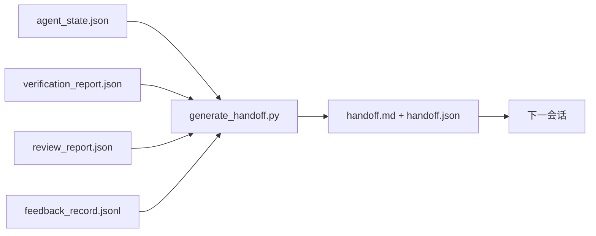

# 多会话交接

> 会话即将结束。工作没完。交接包是把"Agent 工作了一小时"变成"下一次会话第一分钟就开始干活"的工件。下意识地建它，而不是马后炮。

**类型:** 动手实现
**语言:** Python (stdlib)
**前置知识:** Phase 14 · 34（仓库记忆）, Phase 14 · 38（验证）, Phase 14 · 39（审核者）
**时长:** 约 50 分钟

## 学习目标

- 识别每个交接包必须携带的七个字段。
- 从工作台工件自动生成交接包，无需手写叙述文字。
- 将大型反馈日志裁剪为适合交接的摘要。
- 使下一会话的第一个动作是确定性的。

## 问题

会话结束。Agent 说"很好，我们取得了进展。"下一会话开始。下一个 Agent 问"上次停在哪里？"第一个 Agent 的回答没了。下一个 Agent 重新发现、重跑相同命令、重新问人类相同问题，花三十分钟恢复上一个会话最后三十秒的状态。

一次糟糕的交接的代价，是在这个任务生命周期内每个会话都要付的。修复方案是在会话结束时自动生成一个包：什么变了、为什么、试了什么、什么失败了、还剩什么、下次第一步做什么。

## 核心概念



### 每个交接包携带的七个字段

| 字段 | 它回答的问题 |
|-------|---------------------|
| `summary` | 做了一段的总结，一段文字 |
| `changed_files` | diff 一眼可见 |
| `commands_run` | 实际执行了什么 |
| `failed_attempts` | 试了什么以及为什么没成功 |
| `open_risks` | 下个会话可能踩的坑，含严重级别 |
| `next_action` | 下个会话第一步要做的具体步骤 |
| `verdict_pointer` | 验证和审核报告的路径 |

`next_action` 字段是承重字段。缺少它，只有其他一切的交接包是状态报告，不是交接。

### 交接包是生成的，不是手写的

手写的交接包是在艰难的一天会被跳过的交接包。生成器读取工作台工件并发出包。Agent 的职责是把工作台留在生成器可以总结的状态，不是写总结。

### 两种形式：人读的和机器读的

`handoff.md` 是给人读的。`handoff.json` 是给下一个 Agent 加载的。两者来自相同的源工件。如果两者分歧，以 JSON 为准。

### 反馈日志裁剪

完整的 `feedback_record.jsonl` 可能有数百条记录。交接包只携带最后 K 条加每条非零退出的记录。下一会话如有需要可加载完整日志，但包本身保持精简。

## 动手实现

`code/main.py` 实现：

- 一个加载器，汇集 state、verdict、review 和 feedback 到单个 `WorkbenchSnapshot`。
- `generate_handoff(snapshot) -> (markdown, payload)` 函数。
- 一个过滤器，选取最后 K 条反馈记录加上所有非零退出。
- 一次演示运行，将 `handoff.md` 和 `handoff.json` 写在脚本同目录下。

运行：

```
python3 code/main.py
```

输出：一份打印出来的交接包主体，加两个文件到磁盘。

## 真实生产模式

Codex CLI、Claude Code 和 OpenCode 各有不同的压缩故事；结构化交接包架在三者之上。

**压缩策略各异，包 schema 不变。** Codex CLI 的 POST /v1/responses/compact 是一个服务端不透明 AES blob（面向 OpenAI 模型快路径）；fallback 是一个作为 `_summary` user-role 消息追加的本地"交接摘要"。Claude Code 在 95% 上下文时跑五阶段渐进压缩。OpenCode 做基于时间戳的消息隐藏加 5 个标题 LLM 摘要。三种不同机制，同样的需求：将压缩后存活的内容序列化为可移植工件。包就是那个工件。

**新会话交接不是压缩。** 压缩延长一个会话；交接干净关闭一个会话然后开启下一个。Hermes Issue #20372（2026 年 4 月）表述正确：当就地压缩开始降质时，Agent 应写一个精简交接包，结束会话，在新上下文中恢复。包使这个过渡廉价。错误做法是不断压缩直到质量崩溃；修复方案是为一个早发的、干净的交接做预算。

**每个分支和主题一个活跃交接。** 多 Agent 协调在过期交接上崩溃的速度比在糟糕模型输出上还快。始终包含 `branch`、`last_known_good_commit` 和 `status`（`active | superseded | archived`）。过期交接归档；只有活跃的那个驱动下一会话。这是交接-as-笔记与交接-as-状态的区别。

**在 50-75% 上下文时收尾，而不是撞墙。** 手写模式 playbook（CLAUDE.md + HANDOVER.md）报告：会话在 50-75% 上下文预算时结束，而非 95% 时，效果最好。包生成器在源状态被压缩伪影污染之前干净运行。上下文完整时写廉价；模型已经开始丢失位置时写代价高。

## 用现成库

生产模式：

- **会话结束钩子。** 运行时在用户关闭聊天时触发生成器。包写入 `outputs/handoff/<session_id>/`。
- **PR 模板。** 生成器的 markdown 同时作为 PR 正文。审核者无需打开五个文件就能读。
- **跨 Agent 交接。** 用一个产品构建（Claude Code），用另一个继续（Codex）。包是通用语。

包很小、规律、产生廉价。每次会话都节省成本，并随时间复利。

## 产出

`outputs/skill-handoff-generator.md` 生成针对项目工件路径调优的生成器、在会话结束时运行它的钩子，以及下一 Agent 启动时加载的 `handoff.json` schema。

## 练习

1. 添加 `assumptions_to_validate` 字段，暴露建造者记录但审核者评分未超过 1 的每个假设。
2. 对失败运行和通过运行使用不同的反馈摘要裁剪方式。说明不对称的理由。
3. 加入"向人类提问"列表。一个问题进入包而非进入聊天消息的阈值是什么？
4. 让生成器具有幂等性：运行两次产生相同的包。要做到这点，哪些东西必须稳定？
5. 添加"下一会话前置条件"部分，精确列出下一会话在行动前必须加载的工件。

## 关键术语

| 术语 | 大家这么说 | 实际指什么 |
|------|----------------|------------------------|
| 交接包 | "会话摘要" | 含七个字段的生成工件，markdown 和 JSON 两种形式 |
| Next action | "第一步做什么" | 开启下一会话的那一个具体步骤 |
| 反馈裁剪 | "日志摘要" | 最后 K 条记录加上每条非零退出 |
| 状态报告 | "我们做了什么" | 缺少 `next_action` 的文档；有用，但不是交接 |
| 裁决指针 | "凭证" | 可追溯性的验证和审核报告路径 |

## 延伸阅读

- [Anthropic, Effective harnesses for long-running agents](https://www.anthropic.com/engineering/effective-harnesses-for-long-running-agents)
- [OpenAI Agents SDK handoffs](https://platform.openai.com/docs/guides/agents-sdk/handoffs)
- [Codex Blog, Codex CLI Context Compaction: Architecture, Configuration, Managing Long Sessions](https://codex.danielvaughan.com/2026/03/31/codex-cli-context-compaction-architecture/) — POST /v1/responses/compact 及本地 fallback
- [Justin3go, Shedding Heavy Memories: Context Compaction in Codex, Claude Code, OpenCode](https://justin3go.com/en/posts/2026/04/09-context-compaction-in-codex-claude-code-and-opencode) — 三家压缩对比
- [JD Hodges, Claude Handoff Prompt: How to Keep Context Across Sessions (2026)](https://www.jdhodges.com/blog/ai-session-handoffs-keep-context-across-conversations/) — CLAUDE.md + HANDOVER.md，50-75% 上下文预算
- [Mervin Praison, Managing Handoffs in Multi-Agent Coding Sessions: Fresh Context Without Losing Continuity](https://mer.vin/2026/04/managing-handoffs-in-multi-agent-coding-sessions-fresh-context-without-losing-continuity/) — 分布式系统视角
- [Hermes Issue #20372 — compression 降质时自动新会话交接](https://github.com/NousResearch/hermes-agent/issues/20372)
- [Hermes Issue #499 — Context Compaction Quality Overhaul](https://github.com/NousResearch/hermes-agent/issues/499) — Codex CLI 中面向交接的 prompt
- [Microsoft Agent Framework, Compaction](https://learn.microsoft.com/en-us/agent-framework/agents/conversations/compaction)
- [OpenCode, Context Management and Compaction](https://deepwiki.com/sst/opencode/2.4-context-management-and-compaction)
- [LangChain, Context Engineering for Agents](https://www.langchain.com/blog/context-engineering-for-agents)
- Phase 14 · 34 — 生成器读取的状态文件
- Phase 14 · 38 — 包指向的验证裁决
- Phase 14 · 39 — 打包进包的审核报告