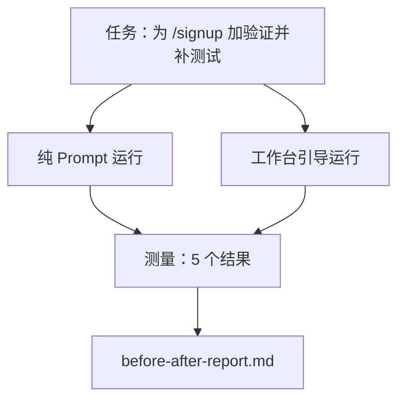

# 真实仓库上的工作台

> 十一个课时的表面功夫，如果经不起真实代码库的接触，就一文不值。本课在同一个小型示例应用上跑同一任务两次：纯 prompt 版与工作台引导版。数字说话。

**类型:** 动手实现
**语言:** Python (stdlib)
**前置知识:** Phases 14 · 32 到 14 · 40
**时长:** 约 60 分钟

## 学习目标

- 在一个小型应用上将七个工作台表面整合在一起。
- 跑同一任务两次（纯 prompt 和工作台引导）并测量五个结果。
- 读前/后报告，决定哪些表面最有力。
- 用工作台反驳"我的模型够好了"这种反驳。

## 问题

在玩具任务上演示说服不了任何人。工作台案例只有在真实感任务跑在真实感仓库上进入生产、失败更少、回滚更少、下次会话能用的包到位的情况下才成立。

本课带来了那个真实感仓库，并用两个流水线跑同一任务。结果是一份前/后报告，你可以拿给怀疑者看。

## 核心概念



### 示例应用

`sample_app/` 中一个极简 FastAPI 风格 handler：

- `app.py`：含 `/signup`（尚无验证）。
- `test_app.py`：一个正常路径测试。
- `README.md` 和 `scripts/release.sh` 作为禁区的诱饵。

### 任务

> 为 `/signup` 添加输入验证：拒绝短于 8 字符的密码，返回 422 并带类型的错误 envelope。添加一条测试证明新行为。

### 两条流水线

纯 Prompt：

1. 读 README。
2. 读 `app.py`。
3. 编辑文件。
4. 声称完成。

工作台引导：

1. 运行初始化脚本（Lesson 35）。
2. 读范围契约（Lesson 36）。
3. 读状态（Lesson 34）。
4. 仅编辑允许的文件。
5. 通过反馈运行器运行验收命令（Lesson 37）。
6. 运行验证门（Lesson 38）。
7. 运行审核者（Lesson 39）。
8. 生成交接（Lesson 40）。

### 测量的五个结果

| 结果 | 为什么重要 |
|---------|----------------|
| `tests_actually_run` | 大多数"测试通过"声明无法验证 |
| `acceptance_met` | 证明目标的测试必须是实际运行的测试 |
| `files_outside_scope` | 范围蔓延是主导的静默失败 |
| `handoff_quality` | 下次会话为此付出或受益 |
| `reviewer_total` | 在门之上的定性判断 |

## 动手实现

`code/main.py` 用同一示例应用编排两条流水线。两条流水线都是脚本化的（循环中无 LLM），所以测量可复现。脚本将比较结果写入 `before-after-report.md` 和 `comparison.json`。

运行：

```
python3 code/main.py
```

输出：每条流水线结果的控制台表格，markdown 报告保存在脚本旁，JSON 给需要画图的人。

## 真实生产模式

怀疑者的问题是"工作台实际上帮了多少？"2026 年的数字比解释更有力。

**同一模型从 Top 30 以外到 Top 5。** LangChain 的 *Anatomy of an Agent Harness*（2026 年 4 月）：一个编码 Agent 只改了 harness就从 30 名以外跳到 Terminal Bench 2.0 第五名。同样的模型。不同的表面。差了 25 名。

**Vercel 删工具从 80% 到 100%。** Vercel 报告删掉 Agent 80% 的工具后成功率从 80% 到 100%。更小的工具表面、更清晰的范围、更少的失败方式。负空间赢。

**Harvey 仅靠 harness 实现 2 倍精度。** 法律 Agent 仅通过 harness 优化精度翻倍以上，没有改模型。

**88% 的企业 AI Agent 项目未能投产。** preprints.org *Harness Engineering for Language Agents* 论文（2026 年 3 月）将失败归因于运行时而非推理：状态过时、重试脆弱、上下文膨胀、中间错误恢复不良。

**长上下文崩溃。** WebAgent 基线在长上下文条件下成功率从 40-50% 跌到 10% 以下，大部分是无限循环和目标丢失。Ralph 循环和交接包存在就是为了吸收这个。

**假阴性仍然存在。** 单步事实任务、一行 lint、格式化运行、模型已背住的任何内容——这些纯 prompt 更快。基准测试应该诚实列举它们，这样工作台就不会被包装成杀鸡用牛刀。

结论不是"harness 永远赢"。模型确实会随时间吸收 harness 技巧。结论是今天工程负担在七个表面上，数字证明了这一点。

## 用现成库

本课是你在以下情况引用的案例文件：

- 有人问为什么每个 PR 都带着 `agent-rules.md` 和范围契约。
- 团队想在这个 sprint 里"就这一次"去掉验证门。
- 新 Agent 产品上线，你需要便携基准来衡量它是否真的节省时间。

数字比解释传播更远。

## 产出

`outputs/skill-workbench-benchmark.md` 是一个便携评估 harness，可将任何 Agent 产品在你的项目自己的示例应用上跑两条流水线并报告五个结果。

## 练习

1. 添加第六个结果：有意义首次编辑的时间。怎样干净地测量它？
2. 在你的代码库真实第二天任务上跑比较。工作台数字在哪里下滑？
3. 添加"假阴性"通道：纯 prompt 更快、harness 开销是真实成本的任务。说明为什么仍然保留工作台。
4. 将脚本化的"Agent"换成真实 LLM 调用。哪个结果的噪声变大了？
5. 为非工程师写一页摘要。什么能活过裁剪？

## 关键术语

| 术语 | 大家这么说 | 实际指什么 |
|------|----------------|------------------------|
| 示例应用 | "玩具仓库" | 够小但足够真实，能锻炼全部七个表面 |
| 流水线 | "工作流" | Agent 遵循的有序表面读写序列 |
| 前/后报告 | "凭证" | 给怀疑者看的工件 |
| 假阴性 | "工作台杀鸡用牛刀" | 纯 prompt 更快的任务；诚实列举有助于保持信任 |
| 工作台基准 | "可靠度评分" | 在你的代码库上跑比较的可携 harness |

## 延伸阅读

- [LangChain, The Anatomy of an Agent Harness](https://blog.langchain.com/the-anatomy-of-an-agent-harness/) — Terminal Bench Top-30 到 Top-5 凭证
- [MongoDB, The Agent Harness: Why the LLM Is the Smallest Part of Your Agent System](https://www.mongodb.com/company/blog/technical/agent-harness-why-llm-is-smallest-part-of-your-agent-system) — Vercel + Harvey 数据
- [preprints.org, Harness Engineering for Language Agents](https://www.preprints.org/manuscript/202603.1756) — 88% 企业失败率，根因在运行时
- [HN: Improving 15 LLMs at Coding in One Afternoon. Only the Harness Changed](https://news.ycombinator.com/item?id=46988596) — 跨 15 个模型复现
- [Cloudflare, Orchestrating AI Code Review at Scale](https://blog.cloudflare.com/ai-code-review/) — 30 天生产 131k 次审核运行
- [Anthropic, Building Effective Agents](https://www.anthropic.com/research/building-effective-agents)
- Phases 14 · 32 到 14 · 40 — 本课端到端锻炼的表面
- Phase 14 · 19 — SWE-bench、GAIA、AgentBench 作为本课补充的宏观基准
- Phase 14 · 30 — 同一 harness 接入的 Eval 驱动 Agent 开发