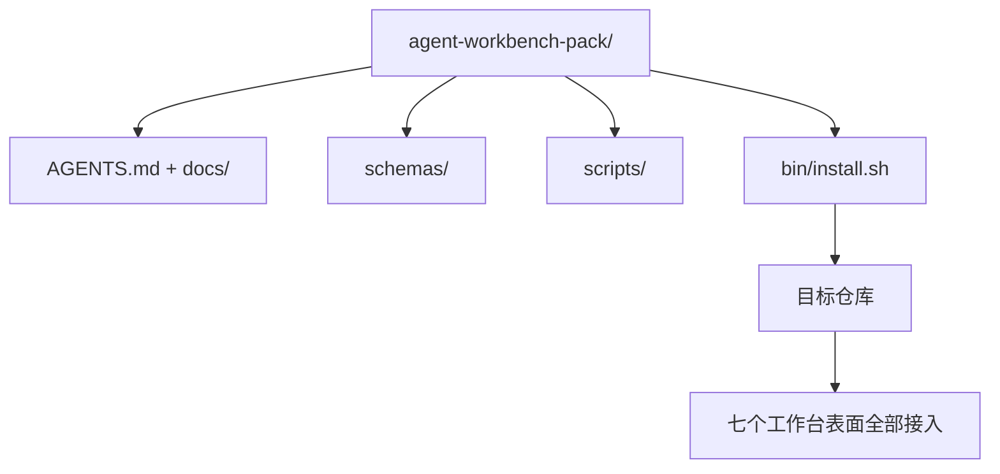

# 总结项目：产出一个可复用 Agent 工作台包

> 迷你轨以一个你可以投入任何仓库的包收尾。十一个课时的表面压缩进一个目录，`cp -r` 进去，第二天早上 Agent 就能可靠工作了。这个总结项目就是本课程交易的工件。

**类型:** 动手实现
**语言:** Python (stdlib)
**前置知识:** Phases 14 · 31 到 14 · 41
**时长:** 约 75 分钟

## 学习目标

- 将七个工作台表面打包成一个可即插即用的目录。
- 固定 schema、脚本和模板，使新仓库获得已知的良好基线。
- 添加一个单一安装脚本，幂等地铺下这个包。
- 决定什么放进去、什么不放进去，为每个决定辩护。

## 问题

一个活在 Google Doc、聊天历史和三个半遗忘脚本里的工作台，每季度都要重建一次。解法是一个带版本号的包：一个仓库或目录，含表面、schema、脚本和一个一条命令的安装器。

本课结束时，你会在磁盘上得到 `outputs/agent-workbench-pack/`，外加一个 `bin/install.sh` 可以将它投放到任意目标仓库。

## 核心概念



### 包布局

```
outputs/agent-workbench-pack/
├── AGENTS.md
├── docs/
│   ├── agent-rules.md
│   ├── reliability-policy.md
│   ├── handoff-protocol.md
│   └── reviewer-rubric.md
├── schemas/
│   ├── agent_state.schema.json
│   ├── task_board.schema.json
│   └── scope_contract.schema.json
├── scripts/
│   ├── init_agent.py
│   ├── run_with_feedback.py
│   ├── verify_agent.py
│   └── generate_handoff.py
├── bin/
│   └── install.sh
└── README.md
```

### 什么放进去，什么不放进去

放进去：

- 表面 schema。它们是契约。
- 上述四个脚本。它们是运行时。
- 上述四个文档。它们是规则和评分标准。

不放进去：

- 项目特定任务。任务属于目标仓库的任务板，不属于包。
- 厂商 SDK 调用。包与框架无关。
- 入职叙述文字。包放在团队现有入职材料旁边，不塞进去。

### 安装器

一个短的 `bin/install.sh`（或 `bin/install.py`）：

1. 未经 `--force` 拒绝覆盖已有包。
2. 将包复制到目标仓库。
3. 如果存在 `.github/workflows/` 则接入 CI。
4. 打印下一步：填充任务板、设验收命令、运行初始化脚本。

### 版本控制

包携带一个 `VERSION` 文件。Schema 变更和需要迁移的脚本变更升主版本。仅文档变更升补丁版本。目标仓库的 `agent_state.json` 记录它是用哪个包版本初始化的。

## 动手实现

`code/main.py` 将包组装到本课旁边的 `outputs/agent-workbench-pack/`，从迷你轨前几课中取用 schema 和脚本，以及你已经写好的文档。

运行：

```
python3 code/main.py
```

脚本复制并固定表面，写 README，打印包目录树，然后退出零。重复运行具有幂等性。

## 真实生产模式

一个包只有在经历 fork、更新和不友好上游时仍能存活才有价值。四个模式使之可行。

**`VERSION` 是契约，不是营销。** 主版本升需要有状态迁移。次版本升需要重新运行检查器。补丁升是纯文档变更。安装器每次安装时在目标仓库写入 `.workbench-version`；`lint_pack.py` 如果目标的锁与包的 `VERSION` 不合就拒绝发布。这就是 `npm`、`Cargo` 和 `pyproject.toml` 在十年动荡中存活下来的方式；Agent 没什么不同。

**跨工具单一来源分发。** Nx 发一个 `nx ai-setup`，从一个配置铺下 `AGENTS.md`、`CLAUDE.md`、`.cursor/rules/`、`.github/copilot-instructions.md` 和一个 MCP 服务器。包应该做同样的事；安装器发出符号链接（`ln -s AGENTS.md CLAUDE.md`），使单一真相来源分发到每个编码 Agent。分叉包去支持一个工具而不是另一个是失败模式。

**`uninstall.sh` 拒绝在非平凡状态时卸载。** 卸载包不得删除用户的 `agent_state.json`、`task_board.json` 或 `outputs/`。卸载器移除 schema、脚本、文档和 `AGENTS.md`（带 `--keep-agents-md` 退出选项），如果状态文件有任何未提交变更则拒绝继续。状态属于用户；包不拥有它。

**Skill 即可发布。SkillKit 风格分发。** 包作为 SkillKit skill 发布：`skillkit install agent-workbench-pack` 从单一来源在 32 个 AI Agent 上铺下它。包仓库是真相来源；SkillKit 是分发渠道。厂商锁定瓦解；七个表面保持不变。

## 用现成库

包发布到三个地方：

- **作为一个投放到仓库的目录。** `cp -r outputs/agent-workbench-pack /path/to/repo`。
- **作为公开模板仓库。** Fork 后定制，`VERSION` 控制漂移。
- **作为 SkillKit skill。** 接入你的 Agent 产品，一条命令铺下。

包是配方。每次安装是一份出品。

## 产出

`outputs/skill-workbench-pack.md` 生成针对项目调优的包：规则根据团队历史打磨，范围 glob 与仓库匹配，评分标准维度扩展一个领域特定条目。

## 练习

1. 决定哪个可选第五文档值得升为规范包的一部分。为这个决定辩护。
2. 将安装器重写为 Python，加 `--dry-run` 标志。与 bash 比对 ergonomics。
3. 添加一个 `bin/uninstall.sh` 安全移除包，并在状态文件有非平凡历史时拒绝。什么算非平凡？
4. 添加 `lint_pack.py`，在包偏离 `VERSION` 时失败。将它接入包自己仓库的 CI。
5. 撰写从手搓工作台迁移到本包的操作手册。最小化停机的操作顺序是什么？

## 关键术语

| 术语 | 大家这么说 | 实际指什么 |
|------|----------------|------------------------|
| 工作台包 | "入门套件" | 带版本号的目录，携带全部七个表面 |
| 安装器 | "安装脚本" | 幂等铺下包的 `bin/install.sh` |
| 包版本 | "VERSION" | schema/脚本变更升主版本，纯文档升补丁 |
| 即插即用包 | "cp -r 就能跑" | 包第一天就能工作，无需逐仓定制 |
| 可分叉模板 | "GitHub 模板" | GitHub"使用此模板"可克隆的公开仓库 |

## 延伸阅读

- Phases 14 · 31 到 14 · 41 — 这个包打包的每个表面
- [SkillKit](https://github.com/rohitg00/skillkit) — 跨 32 个 AI Agent 安装此 skill
- [Nx Blog, Teach Your AI Agent How to Work in a Monorepo](https://nx.dev/blog/nx-ai-agent-skills) — 跨六个工具的单一来源生成器
- [agents.md — the open spec](https://agents.md/) — 包的路由必须实现的规范
- [HKUDS/OpenHarness](https://github.com/HKUDS/OpenHarness) — 包等效项的参考实现
- [andrewgarst/agentic_harness](https://github.com/andrewgarst/agentic_harness) — Redis 后端参考，含 eval 套件
- [Augment Code, A good AGENTS.md is a model upgrade](https://www.augmentcode.com/blog/how-to-write-good-agents-dot-md-files) — 包文档质量标杆
- [Anthropic, Effective harnesses for long-running agents](https://www.anthropic.com/engineering/effective-harnesses-for-long-running-agents)
- [Anthropic, Harness design for long-running application development](https://www.anthropic.com/engineering/harness-design-long-running-apps)
- Phase 14 · 30 — 消耗包的验证门的 Eval 驱动 Agent 开发
- Phase 14 · 41 — 这个包所要改进的前/后基准