# 通信协议

> 不能说同一种语言的智能体不是团队。他们只是在对着虚空喊叫。

**类型：** 构建
**语言：** TypeScript
**前置知识：** Phase 14（智能体工程），Lesson 16.01（为什么要用多智能体）
**时间：** 约120分钟

## 学习目标

- 实现 MCP 工具发现和调用，使智能体能够使用外部服务器暴露的工具
- 构建 A2A 智能体卡片和任务端点，允许一个智能体通过 HTTP 将工作委托给另一个
- 比较 MCP（工具访问）、A2A（智能体对智能体）、ACP（企业审计）、ANP（去中心化信任），并解释每个协议解决哪个问题
- 在单一系统中将多个协议连接在一起，智能体通过 MCP 发现工具、通过 A2A 委托任务

## 问题

你把系统拆成了多个智能体。一个研究员、一个编码员、一个审查员。他们各自的工作都很出色。但现在你需要他们真正地互相交谈。

你的第一次尝试很明显：传递字符串。研究员返回一个文本blob，编码员尽力解析。它能工作——直到编码员误解了研究摘要，或者两个智能体互相死锁等待，或者你需要不同团队构建的智能体协作。突然，"只是传递字符串"就崩溃了。

这就是通信协议问题。没有智能体交换信息的共享契约，多智能体系统是脆弱的、不可审计的，无法扩展到少数你亲自编写的智能体之外。

AI 生态系统用四个协议回应，每个解决问题的不同切片：

- **MCP** 用于工具访问
- **A2A** 用于智能体对智能体协作
- **ACP** 用于企业可审计性
- **ANP** 用于去中心化身份和信任

本课深入讲解。你将阅读每个规范的真实有线格式，构建可工作的实现，并将四个连接成一个统一系统。

## 概念

### 协议格局

把这四个协议想成层，每层回答不同问题：

```mermaid
block-beta
  columns 1
  block:ANP["ANP — 智能体如何信任陌生人？\n去中心化身份（DID）、E2EE、元协议"]
  end
  block:A2A["A2A — 智能体如何协作实现目标？\n智能体卡片、任务生命周期、流式、协商"]
  end
  block:ACP["ACP — 智能体如何在可审计系统中交谈？\n运行、轨迹元数据、会话连续性"]
  end
  block:MCP["MCP — 智能体如何使用工具？\n工具发现、执行、上下文共享"]
  end

  style ANP fill:#f3e8ff,stroke:#7c3aed
  style A2A fill:#dbeafe,stroke:#2563eb
  style ACP fill:#fef3c7,stroke:#d97706
  style MCP fill:#d1fae5,stroke:#059669
```

它们不是竞争者。它们在不同层面解决不同问题。

### MCP（回顾）

MCP 在 Phase 13 中有深入讲解。快速回顾：MCP 标准化了 LLM 连接到外部工具和数据源的方式。它是一个**客户端-服务器**协议，其中智能体（客户端）发现并调用服务器暴露的工具。

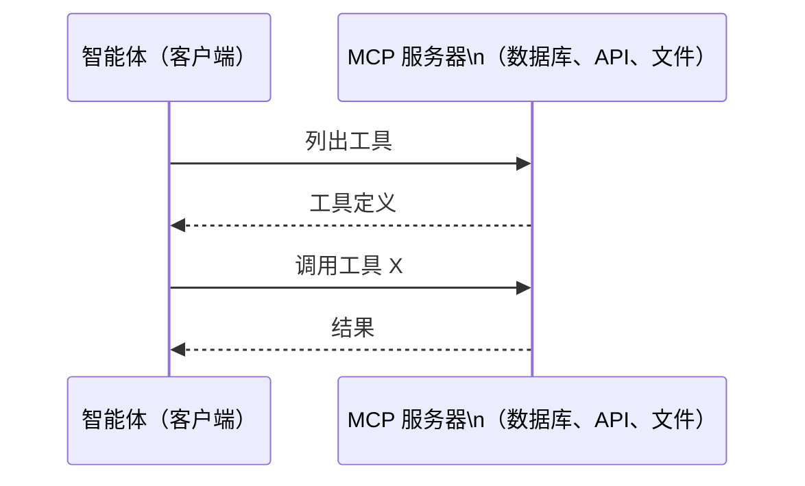

MCP 是**智能体对工具**通信。它不能帮助智能体互相交谈。

### A2A（Agent2Agent 协议）

**创建者：** Google（现归 Linux Foundation，为 `lf.a2a.v1`）
**规范版本：** 1.0.0
**问题：** 自主智能体如何互相协作、协商和委托任务？

A2A 是**点对点智能体协作**的协议。MCP 连接智能体到工具，A2A 连接智能体到其他智能体。每个智能体在已知 URL 发布一个**智能体卡片**，其他智能体通过它发现、协商和委托任务。

#### A2A 工作原理

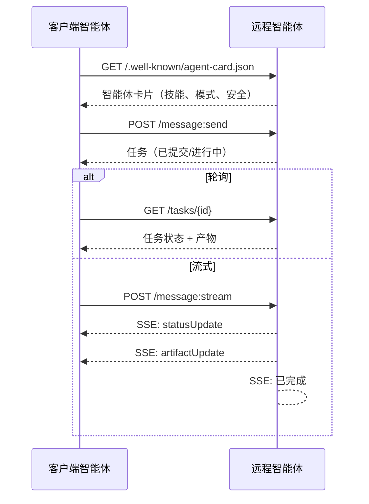

#### 真实的智能体卡片

A2A 智能体卡片在真实环境中的样子。通过 `GET /.well-known/agent-card.json` 提供：

```json
{
  "name": "Research Agent",
  "description": "Searches documentation and summarizes findings",
  "version": "1.0.0",
  "supportedInterfaces": [
    {
      "url": "https://research-agent.example.com/a2a/v1",
      "protocolBinding": "JSONRPC",
      "protocolVersion": "1.0"
    },
    {
      "url": "https://research-agent.example.com/a2a/rest",
      "protocolBinding": "HTTP+JSON",
      "protocolVersion": "1.0"
    }
  ],
  "provider": {
    "organization": "Your Company",
    "url": "https://example.com"
  },
  "capabilities": {
    "streaming": true,
    "pushNotifications": false
  },
  "defaultInputModes": ["text/plain", "application/json"],
  "defaultOutputModes": ["text/plain", "application/json"],
  "skills": [
    {
      "id": "web-research",
      "name": "Web Research",
      "description": "Searches the web and synthesizes findings",
      "tags": ["research", "search", "summarization"],
      "examples": ["Research the latest changes in React 19"]
    },
    {
      "id": "doc-analysis",
      "name": "Documentation Analysis",
      "description": "Reads and analyzes technical documentation",
      "tags": ["docs", "analysis"],
      "inputModes": ["text/plain", "application/pdf"],
      "outputModes": ["application/json"]
    }
  ],
  "securitySchemes": {
    "bearer": {
      "httpAuthSecurityScheme": {
        "scheme": "Bearer",
        "bearerFormat": "JWT"
      }
    }
  },
  "security": [{ "bearer": [] }]
}
```

关键点：
- **技能**是智能体能做的事。每个都有 ID、标签和支持的输入/输出 MIME 类型。客户端智能体据此判断远程智能体是否能处理其请求。
- **supportedInterfaces** 列出了多个协议绑定。一个智能体可以同时说 JSON-RPC、REST 和 gRPC。
- **安全**内置于卡片。客户端在发出单个请求之前就知道需要什么认证。

#### 任务生命周期

任务是 A2A 的核心工作单元。它们经过定义的状态：

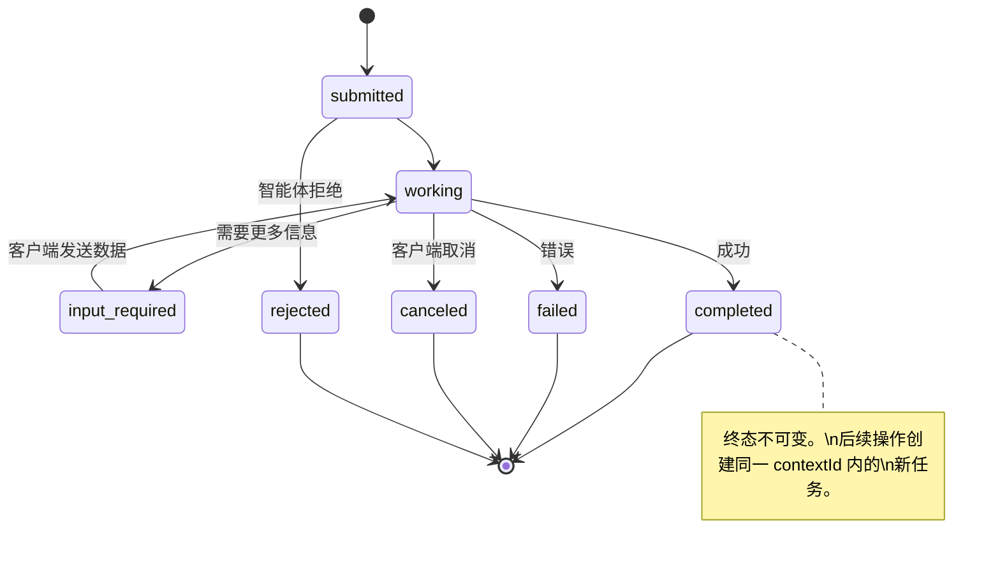

所有 8 个状态（规范还定义了 `UNSPECIFIED` 作为哨兵，此处省略）：

| 状态 | 终态？ | 含义 |
|---|---|---|
| `TASK_STATE_SUBMITTED` | 否 | 已确认，尚未处理 |
| `TASK_STATE_WORKING` | 否 | 正在处理 |
| `TASK_STATE_INPUT_REQUIRED` | 否 | 智能体需要客户端更多信息 |
| `TASK_STATE_AUTH_REQUIRED` | 否 | 需要认证 |
| `TASK_STATE_COMPLETED` | 是 | 成功完成 |
| `TASK_STATE_FAILED` | 是 | 出错完成 |
| `TASK_STATE_CANCELED` | 是 | 完成前取消 |
| `TASK_STATE_REJECTED` | 是 | 智能体拒绝任务 |

任务达到终态后不可变。不再有消息。后续创建同一 `contextId` 内的新任务。

#### 有线格式

A2A 使用 JSON-RPC 2.0。以下是真实消息交换的样子：

**客户端发送任务：**
```json
{
  "jsonrpc": "2.0",
  "id": 1,
  "method": "SendMessage",
  "params": {
    "message": {
      "messageId": "msg-001",
      "role": "ROLE_USER",
      "parts": [{ "text": "Research React 19 compiler features" }]
    },
    "configuration": {
      "acceptedOutputModes": ["text/plain", "application/json"],
      "historyLength": 10
    }
  }
}
```

**智能体响应任务：**
```json
{
  "jsonrpc": "2.0",
  "id": 1,
  "result": {
    "task": {
      "id": "task-abc-123",
      "contextId": "ctx-xyz-789",
      "status": {
        "state": "TASK_STATE_COMPLETED",
        "timestamp": "2026-03-27T10:30:00Z"
      },
      "artifacts": [
        {
          "artifactId": "art-001",
          "name": "research-results",
          "parts": [{
            "data": {
              "findings": [
                "React 19 compiler auto-memoizes components",
                "No more manual useMemo/useCallback needed",
                "Compiler runs at build time, not runtime"
              ]
            },
            "mediaType": "application/json"
          }]
        }
      ]
    }
  }
}
```

**通过 SSE 流式传输：**
```
data: {"task":{"id":"task-123","status":{"state":"TASK_STATE_WORKING"}}}

data: {"statusUpdate":{"taskId":"task-123","status":{"state":"TASK_STATE_WORKING","message":{"role":"ROLE_AGENT","parts":[{"text":"Searching documentation..."}]}}}}

data: {"artifactUpdate":{"taskId":"task-123","artifact":{"artifactId":"art-1","parts":[{"text":"partial findings..."}]},"append":true,"lastChunk":false}}

data: {"statusUpdate":{"taskId":"task-123","status":{"state":"TASK_STATE_COMPLETED"}}}
```

### ACP（智能体通信协议）

**创建者：** IBM / BeeAI
**规范版本：** 0.2.0（OpenAPI 3.1.1）
**状态：** 正在合并到 Linux Foundation 下的 A2A
**问题：** 智能体如何在完整可审计性、会话连续性和轨迹跟踪下通信？

ACP 是**企业协议**。与许多概述不同，ACP **不使用** JSON-LD。它是通过 OpenAPI 定义的直接 REST/JSON API。真正特别的是 **TrajectoryMetadata**：每个智能体响应可以携带详细日志，记录产生它的推理步骤和工具调用。

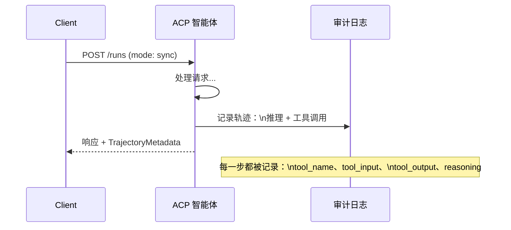

#### ACP 中的智能体发现

ACP 定义了四种发现方法：

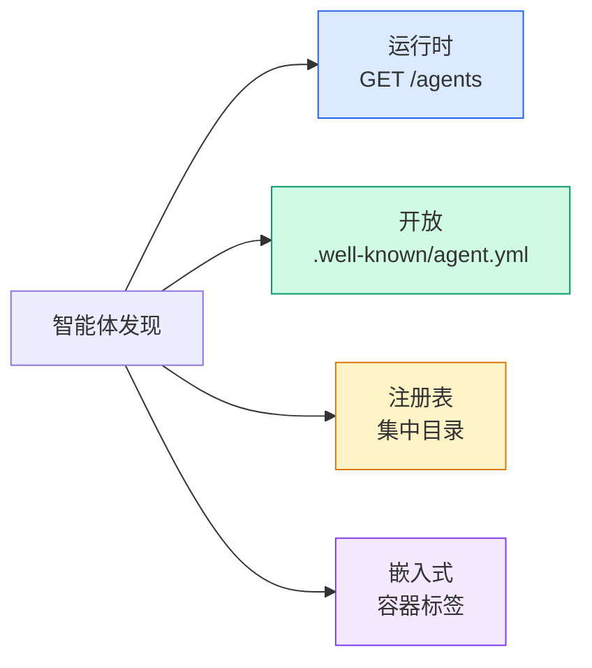

**AgentManifest** 比 A2A 的智能体卡片更简单：

```json
{
  "name": "summarizer",
  "description": "Summarizes documents with source citations",
  "input_content_types": ["text/plain", "application/pdf"],
  "output_content_types": ["text/plain", "application/json"],
  "metadata": {
    "tags": ["summarization", "RAG"],
    "framework": "BeeAI",
    "capabilities": [
      {
        "name": "Document Summarization",
        "description": "Condenses long documents into key points"
      }
    ],
    "recommended_models": ["llama3.3:70b-instruct-fp16"],
    "license": "Apache-2.0",
    "programming_language": "Python"
  }
}
```

#### 运行生命周期

ACP 用"运行"代替"任务"。运行是带有三种模式的智能体执行：

| 模式 | 行为 |
|---|---|
| `sync` | 阻塞。响应包含完整结果。 |
| `async` | 立即返回 202。轮询 `GET /runs/{id}` 获取状态。 |
| `stream` | SSE 流。事件在智能体工作时触发。 |

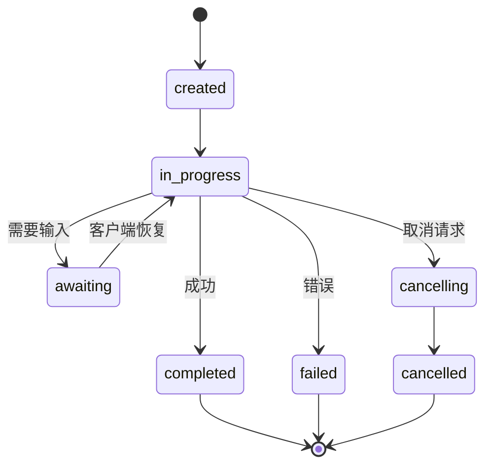

#### TrajectoryMetadata（审计跟踪）

这是 ACP 的关键差异点。每个消息部分可以包含元数据显示智能体确切做了什么：

```json
{
  "role": "agent/researcher",
  "parts": [
    {
      "content_type": "text/plain",
      "content": "The weather in San Francisco is 72F and sunny.",
      "metadata": {
        "kind": "trajectory",
        "message": "I need to check the weather for this location",
        "tool_name": "weather_api",
        "tool_input": { "location": "San Francisco, CA" },
        "tool_output": { "temperature": 72, "condition": "sunny" }
      }
    }
  ]
}
```

对于受监管行业这是金矿。每个答案都带有可证明的推理链：调用了哪些工具、使用了哪些输入、收到了哪些输出。没有黑箱。

ACP 还支持 **CitationMetadata** 用于来源归属：

```json
{
  "kind": "citation",
  "start_index": 0,
  "end_index": 47,
  "url": "https://weather.gov/sf",
  "title": "NWS San Francisco Forecast"
}
```

### ANP（智能体网络协议）

**创建者：** 开源社区（由 GaoWei Chang 创立）
**仓库：** github.com/agent-network-protocol/AgentNetworkProtocol
**问题：** 来自不同组织的智能体如何在没有中央权威的情况下互相信任？

ANP 是**去中心化身份协议**。它使用 W3C 去中心化标识符（DID）和端到端加密建立信任。与 A2A 你通过已知端点发现智能体不同，ANP 让智能体密码学证明其身份。

ANP 有三层：

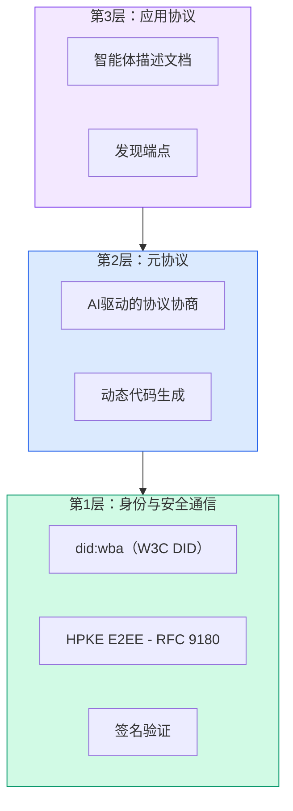

#### DID 文档（真实结构）

ANP 使用名为 `did:wba`（基于 Web 的智能体）的自定义 DID 方法。DID `did:wba:example.com:user:alice` 解析为 `https://example.com/user/alice/did.json`：

```json
{
  "@context": [
    "https://www.w3.org/ns/did/v1",
    "https://w3id.org/security/suites/jws-2020/v1",
    "https://w3id.org/security/suites/secp256k1-2019/v1"
  ],
  "id": "did:wba:example.com:user:alice",
  "verificationMethod": [
    {
      "id": "did:wba:example.com:user:alice#key-1",
      "type": "EcdsaSecp256k1VerificationKey2019",
      "controller": "did:wba:example.com:user:alice",
      "publicKeyJwk": {
        "crv": "secp256k1",
        "x": "NtngWpJUr-rlNNbs0u-Aa8e16OwSJu6UiFf0Rdo1oJ4",
        "y": "qN1jKupJlFsPFc1UkWinqljv4YE0mq_Ickwnjgasvmo",
        "kty": "EC"
      }
    },
    {
      "id": "did:wba:example.com:user:alice#key-x25519-1",
      "type": "X25519KeyAgreementKey2019",
      "controller": "did:wba:example.com:user:alice",
      "publicKeyMultibase": "z9hFgmPVfmBZwRvFEyniQDBkz9LmV7gDEqytWyGZLmDXE"
    }
  ],
  "authentication": [
    "did:wba:example.com:user:alice#key-1"
  ],
  "keyAgreement": [
    "did:wba:example.com:user:alice#key-x25519-1"
  ],
  "humanAuthorization": [
    "did:wba:example.com:user:alice#key-1"
  ],
  "service": [
    {
      "id": "did:wba:example.com:user:alice#agent-description",
      "type": "AgentDescription",
      "serviceEndpoint": "https://example.com/agents/alice/ad.json"
    }
  ]
}
```

关键点：
- **密钥分离**是强制执行的。签名密钥（secp256k1）与加密密钥（X25519）分开。
- **`humanAuthorization`** 是 ANP 独有的。这些密钥需要明确的人类批准（生物识别、密码、HSM）才能使用。高风险操作（如资金转账）走这个路径。
- **`keyAgreement`** 密钥用于 HPKE 端到端加密（RFC 9180）。
- **service** 部分链接到智能体描述文档。

#### ANP 中信任如何运作

ANP **不使用**信任网络或背书图。信任是双边的，每次交互都验证：

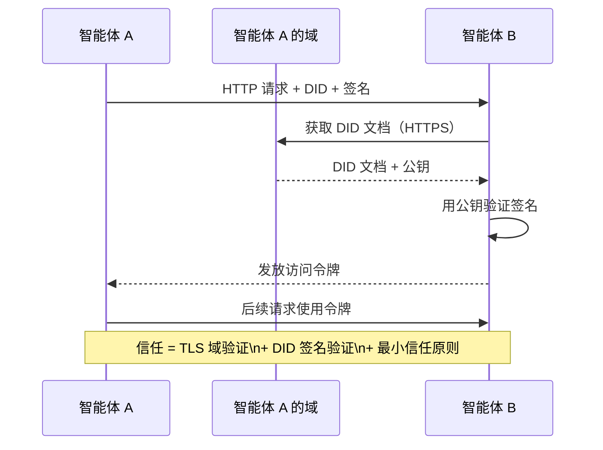

信任来自三个来源：
1. **域级 TLS** 验证 DID 文档主机
2. **DID 密码签名** 验证智能体身份
3. **最小信任原则** 只授予最低权限

没有基于 gossip 的信任传播或 PageRank 评分。你通过 DID 直接验证每个智能体。

#### 元协议协商

这是 ANP 最创新的功能。当来自不同生态的两个智能体相遇时，它们不需要预协议的 数据格式。它们用自然语言协商：

```json
{
  "action": "protocolNegotiation",
  "sequenceId": 0,
  "candidateProtocols": "I can communicate using:\n1. JSON-RPC with hotel booking schema\n2. REST with OpenAPI 3.1 spec\n3. Natural language over HTTP",
  "modificationSummary": "Initial proposal",
  "status": "negotiating"
}
```

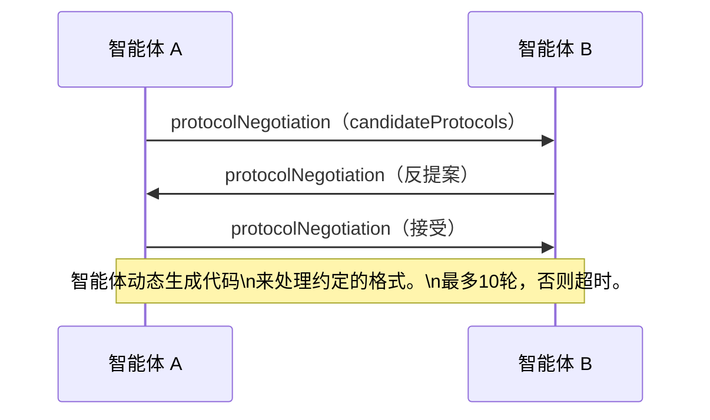

智能体往返（最多 10 轮）直到达成格式一致，然后动态生成代码处理它。状态：`negotiating`、`rejected`、`accepted`、`timeout`。

这意味着两个从未谋面的智能体可以弄清楚如何通信，无需任何人预定义共享模式。

### 比较（已纠正）

| | MCP | A2A | ACP | ANP |
|---|---|---|---|---|
| **创建者** | Anthropic | Google / Linux Foundation | IBM / BeeAI | 社区 |
| **规范格式** | JSON-RPC | JSON-RPC / REST / gRPC | OpenAPI 3.1（REST） | JSON-RPC |
| **主要用途** | 智能体对工具 | 智能体对智能体 | 智能体对智能体 | 智能体对智能体 |
| **发现** | 工具列表 | `/.well-known/agent-card.json` | `GET /agents`、`.well-known/agent.yml` | `/.well-known/agent-descriptions`、DID 服务端点 |
| **身份** | 隐式（本地） | 安全方案（OAuth、mTLS） | 服务器级 | W3C DID（`did:wba`）+ E2EE |
| **审计跟踪** | 不适用 | 基本（任务历史） | TrajectoryMetadata（工具调用、推理） | 未正式指定 |
| **状态机** | 不适用 | 9 个任务状态 | 7 个运行状态 | 不适用 |
| **流式** | 不适用 | SSE | SSE | 传输无关 |
| **独特功能** | 工具模式 | 智能体卡片 + 技能 | 轨迹审计跟踪 | 元协议协商 |
| **最适合** | 工具和数据 | 动态协作 | 受监管行业 | 跨组织信任 |
| **状态** | 稳定 | 稳定（v1.0） | 正在合并到 A2A | 活跃开发 |

### 它们如何协同工作

这些协议不互斥。现实的企业系统使用多个：

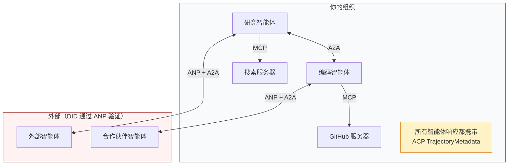

- **MCP** 连接每个智能体到其工具
- **A2A** 处理智能体之间的协作（内部和外部）
- **ACP** 将响应包裹在轨迹元数据中以实现可审计性
- **ANP** 为你不控制的智能体提供身份验证

## 构建

### 步骤 1：核心消息类型

每个多智能体系统从一个消息格式开始。我们定义的类型映射到真实协议使用的类型：

```typescript
import crypto from "node:crypto";

type MessageRole = "user" | "agent";

type MessagePart =
  | { kind: "text"; text: string }
  | { kind: "data"; data: unknown; mediaType: string }
  | { kind: "file"; name: string; url: string; mediaType: string };

type TrajectoryEntry = {
  reasoning: string;
  toolName?: string;
  toolInput?: unknown;
  toolOutput?: unknown;
  timestamp: number;
};

type AgentMessage = {
  id: string;
  role: MessageRole;
  parts: MessagePart[];
  trajectory?: TrajectoryEntry[];
  replyTo?: string;
  timestamp: number;
};

function createMessage(
  role: MessageRole,
  parts: MessagePart[],
  replyTo?: string
): AgentMessage {
  return {
    id: crypto.randomUUID(),
    role,
    parts,
    replyTo,
    timestamp: Date.now(),
  };
}

function textMessage(role: MessageRole, text: string): AgentMessage {
  return createMessage(role, [{ kind: "text", text }]);
}
```

注意：`MessagePart` 是多模态的（文本、结构化数据、文件），就像真实的 A2A 和 ACP 规范一样。`TrajectoryEntry` 捕获推理链，匹配 ACP 的 TrajectoryMetadata。

### 步骤 2：A2A 智能体卡片和注册表

构建匹配真实 A2A 规范的智能体发现：

```typescript
type Skill = {
  id: string;
  name: string;
  description: string;
  tags: string[];
  inputModes: string[];
  outputModes: string[];
};

type AgentCard = {
  name: string;
  description: string;
  version: string;
  url: string;
  capabilities: {
    streaming: boolean;
    pushNotifications: boolean;
  };
  defaultInputModes: string[];
  defaultOutputModes: string[];
  skills: Skill[];
};

class AgentRegistry {
  private cards: Map<string, AgentCard> = new Map();

  register(card: AgentCard) {
    this.cards.set(card.name, card);
  }

  discoverBySkillTag(tag: string): AgentCard[] {
    return [...this.cards.values()].filter((card) =>
      card.skills.some((skill) => skill.tags.includes(tag))
    );
  }

  discoverByInputMode(mimeType: string): AgentCard[] {
    return [...this.cards.values()].filter(
      (card) =>
        card.defaultInputModes.includes(mimeType) ||
        card.skills.some((skill) => skill.inputModes.includes(mimeType))
    );
  }

  resolve(name: string): AgentCard | undefined {
    return this.cards.get(name);
  }

  listAll(): AgentCard[] {
    return [...this.cards.values()];
  }
}
```

这比简单的名称到能力映射丰富得多。你可以通过技能标签、输入 MIME 类型或名称发现智能体，就像真实的 A2A 规范支持的那样。

### 步骤 3：A2A 任务生命周期

构建完整任务状态机：

```typescript
type TaskState =
  | "submitted"
  | "working"
  | "input-required"
  | "auth-required"
  | "completed"
  | "failed"
  | "canceled"
  | "rejected";

const TERMINAL_STATES: TaskState[] = [
  "completed",
  "failed",
  "canceled",
  "rejected",
];

type TaskStatus = {
  state: TaskState;
  message?: AgentMessage;
  timestamp: number;
};

type Artifact = {
  id: string;
  name: string;
  parts: MessagePart[];
};

type Task = {
  id: string;
  contextId: string;
  status: TaskStatus;
  artifacts: Artifact[];
  history: AgentMessage[];
};

type TaskEvent =
  | { kind: "statusUpdate"; taskId: string; status: TaskStatus }
  | {
      kind: "artifactUpdate";
      taskId: string;
      artifact: Artifact;
      append: boolean;
      lastChunk: boolean;
    };

type TaskHandler = (
  task: Task,
  message: AgentMessage
) => AsyncGenerator<TaskEvent>;

class TaskManager {
  private tasks: Map<string, Task> = new Map();
  private handlers: Map<string, TaskHandler> = new Map();
  private listeners: Map<string, ((event: TaskEvent) => void)[]> = new Map();

  registerHandler(agentName: string, handler: TaskHandler) {
    this.handlers.set(agentName, handler);
  }

  subscribe(taskId: string, listener: (event: TaskEvent) => void) {
    const existing = this.listeners.get(taskId) ?? [];
    existing.push(listener);
    this.listeners.set(taskId, existing);
  }

  async sendMessage(
    agentName: string,
    message: AgentMessage,
    contextId?: string
  ): Promise<Task> {
    const handler = this.handlers.get(agentName);
    if (!handler) {
      const task = this.createTask(contextId);
      task.status = {
        state: "rejected",
        timestamp: Date.now(),
        message: textMessage("agent", `No handler for ${agentName}`),
      };
      return task;
    }

    const task = this.createTask(contextId);
    task.history.push(message);
    task.status = { state: "submitted", timestamp: Date.now() };

    this.processTask(task, handler, message).catch((err) => {
      task.status = {
        state: "failed",
        timestamp: Date.now(),
        message: textMessage("agent", String(err)),
      };
    });
    return task;
  }

  getTask(taskId: string): Task | undefined {
    return this.tasks.get(taskId);
  }

  cancelTask(taskId: string): boolean {
    const task = this.tasks.get(taskId);
    if (!task || TERMINAL_STATES.includes(task.status.state)) return false;
    task.status = { state: "canceled", timestamp: Date.now() };
    this.emit(taskId, {
      kind: "statusUpdate",
      taskId,
      status: task.status,
    });
    return true;
  }

  private createTask(contextId?: string): Task {
    const task: Task = {
      id: crypto.randomUUID(),
      contextId: contextId ?? crypto.randomUUID(),
      status: { state: "submitted", timestamp: Date.now() },
      artifacts: [],
      history: [],
    };
    this.tasks.set(task.id, task);
    return task;
  }

  private async processTask(
    task: Task,
    handler: TaskHandler,
    message: AgentMessage
  ) {
    task.status = { state: "working", timestamp: Date.now() };
    this.emit(task.id, {
      kind: "statusUpdate",
      taskId: task.id,
      status: task.status,
    });

    try {
      for await (const event of handler(task, message)) {
        if (TERMINAL_STATES.includes(task.status.state)) break;

        if (event.kind === "statusUpdate") {
          task.status = event.status;
        }
        if (event.kind === "artifactUpdate") {
          const existing = task.artifacts.find(
            (a) => a.id === event.artifact.id
          );
          if (existing && event.append) {
            existing.parts.push(...event.artifact.parts);
          } else {
            task.artifacts.push(event.artifact);
          }
        }
        this.emit(task.id, event);
      }
    } catch (err) {
      task.status = {
        state: "failed",
        timestamp: Date.now(),
        message: textMessage("agent", String(err)),
      };
      this.emit(task.id, {
        kind: "statusUpdate",
        taskId: task.id,
        status: task.status,
      });
    }
  }

  private emit(taskId: string, event: TaskEvent) {
    for (const listener of this.listeners.get(taskId) ?? []) {
      listener(event);
    }
  }
}
```

这实现了真实的 A2A 任务生命周期：submitted、working、input-required、终态。处理程序是异步生成器，产生事件（状态更新和产物块），匹配 SSE 流式传输模式。

### 步骤 4：ACP 风格审计跟踪

用轨迹跟踪包装通信：

```typescript
type AuditEntry = {
  runId: string;
  agentName: string;
  input: AgentMessage[];
  output: AgentMessage[];
  trajectory: TrajectoryEntry[];
  status: "created" | "in-progress" | "completed" | "failed" | "awaiting";
  startedAt: number;
  completedAt?: number;
  sessionId?: string;
};

class AuditableRunner {
  private log: AuditEntry[] = [];
  private handlers: Map<
    string,
    (input: AgentMessage[]) => Promise<{
      output: AgentMessage[];
      trajectory: TrajectoryEntry[];
    }>
  > = new Map();

  registerAgent(
    name: string,
    handler: (input: AgentMessage[]) => Promise<{
      output: AgentMessage[];
      trajectory: TrajectoryEntry[];
    }>
  ) {
    this.handlers.set(name, handler);
  }

  async run(
    agentName: string,
    input: AgentMessage[],
    sessionId?: string
  ): Promise<AuditEntry> {
    const entry: AuditEntry = {
      runId: crypto.randomUUID(),
      agentName,
      input: structuredClone(input),
      output: [],
      trajectory: [],
      status: "created",
      startedAt: Date.now(),
      sessionId,
    };
    this.log.push(entry);

    const handler = this.handlers.get(agentName);
    if (!handler) {
      entry.status = "failed";
      return entry;
    }

    entry.status = "in-progress";
    try {
      const result = await handler(input);
      entry.output = structuredClone(result.output);
      entry.trajectory = structuredClone(result.trajectory);
      entry.status = "completed";
      entry.completedAt = Date.now();
    } catch (err) {
      entry.status = "failed";
      entry.trajectory.push({
        reasoning: `错误：${String(err)}`,
        timestamp: Date.now(),
      });
      entry.completedAt = Date.now();
    }
    return entry;
  }

  getFullAuditLog(): AuditEntry[] {
    return structuredClone(this.log);
  }

  getAuditLogForAgent(agentName: string): AuditEntry[] {
    return structuredClone(
      this.log.filter((e) => e.agentName === agentName)
    );
  }

  getAuditLogForSession(sessionId: string): AuditEntry[] {
    return structuredClone(
      this.log.filter((e) => e.sessionId === sessionId)
    );
  }

  getTrajectoryForRun(runId: string): TrajectoryEntry[] {
    const entry = this.log.find((e) => e.runId === runId);
    return entry ? structuredClone(entry.trajectory) : [];
  }
}
```

每次智能体执行都产生一个完整审计条目：输入什么、输出什么，以及中间的完整工具调用和推理步骤轨迹。你可以通过智能体、会话或单独运行来查询。

### 步骤 5：ANP 风格身份验证

构建基于 DID 的身份和验证：

```typescript
type VerificationMethod = {
  id: string;
  type: string;
  controller: string;
  publicKeyDer: string;
};

type DIDDocument = {
  id: string;
  verificationMethod: VerificationMethod[];
  authentication: string[];
  keyAgreement: string[];
  humanAuthorization: string[];
  service: { id: string; type: string; serviceEndpoint: string }[];
};

type AgentIdentity = {
  did: string;
  document: DIDDocument;
  privateKey: crypto.KeyObject;
  publicKey: crypto.KeyObject;
};

class IdentityRegistry {
  private documents: Map<string, DIDDocument> = new Map();

  publish(doc: DIDDocument) {
    this.documents.set(doc.id, doc);
  }

  resolve(did: string): DIDDocument | undefined {
    return this.documents.get(did);
  }

  verify(did: string, signature: string, payload: string): boolean {
    const doc = this.documents.get(did);
    if (!doc) return false;

    const authKeyIds = doc.authentication;
    const authKeys = doc.verificationMethod.filter((vm) =>
      authKeyIds.includes(vm.id)
    );

    for (const key of authKeys) {
      const publicKey = crypto.createPublicKey({
        key: Buffer.from(key.publicKeyDer, "base64"),
        format: "der",
        type: "spki",
      });
      const isValid = crypto.verify(
        null,
        Buffer.from(payload),
        publicKey,
        Buffer.from(signature, "hex")
      );
      if (isValid) return true;
    }
    return false;
  }

  requiresHumanAuth(did: string, operationKeyId: string): boolean {
    const doc = this.documents.get(did);
    if (!doc) return false;
    return doc.humanAuthorization.includes(operationKeyId);
  }
}

function createIdentity(domain: string, agentName: string): AgentIdentity {
  const did = `did:wba:${domain}:agent:${agentName}`;
  const { publicKey, privateKey } = crypto.generateKeyPairSync("ed25519");

  const publicKeyDer = publicKey
    .export({ format: "der", type: "spki" })
    .toString("base64");

  const keyId = `${did}#key-1`;
  const encKeyId = `${did}#key-x25519-1`;

  const document: DIDDocument = {
    id: did,
    verificationMethod: [
      {
        id: keyId,
        type: "Ed25519VerificationKey2020",
        controller: did,
        publicKeyDer,
      },
      {
        id: encKeyId,
        type: "X25519KeyAgreementKey2019",
        controller: did,
        publicKeyDer,
      },
    ],
    authentication: [keyId],
    keyAgreement: [encKeyId],
    humanAuthorization: [],
    service: [
      {
        id: `${did}#agent-description`,
        type: "AgentDescription",
        serviceEndpoint: `https://${domain}/agents/${agentName}/ad.json`,
      },
    ],
  };

  return { did, document, privateKey, publicKey };
}

function signPayload(identity: AgentIdentity, payload: string): string {
  return crypto
    .sign(null, Buffer.from(payload), identity.privateKey)
    .toString("hex");
}
```

这镜像了真实的 ANP 身份模型：智能体有 DID 文档，具有单独的认证、密钥协商和人类授权密钥。`IdentityRegistry` 模拟 DID 解析（生产中这会是到智能体域的 HTTP 获取）。

### 步骤 6：协议网关

将四个协议连接成一个统一系统：

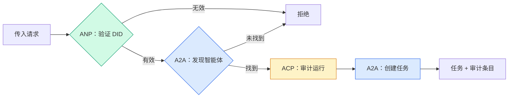

```typescript
class ProtocolGateway {
  private registry: AgentRegistry;
  private taskManager: TaskManager;
  private auditRunner: AuditableRunner;
  private identityRegistry: IdentityRegistry;

  constructor(
    registry: AgentRegistry,
    taskManager: TaskManager,
    auditRunner: AuditableRunner,
    identityRegistry: IdentityRegistry
  ) {
    this.registry = registry;
    this.taskManager = taskManager;
    this.auditRunner = auditRunner;
    this.identityRegistry = identityRegistry;
  }

  async delegateTask(
    fromDid: string,
    signature: string,
    targetAgent: string,
    message: AgentMessage,
    sessionId?: string
  ): Promise<{ task: Task; audit: AuditEntry } | { error: string }> {
    if (!this.identityRegistry.verify(fromDid, signature, message.id)) {
      return { error: "身份验证失败" };
    }

    const card = this.registry.resolve(targetAgent);
    if (!card) {
      return { error: `智能体 ${targetAgent} 在注册表中未找到` };
    }

    const audit = await this.auditRunner.run(
      targetAgent,
      [message],
      sessionId
    );
    const task = await this.taskManager.sendMessage(targetAgent, message);

    return { task, audit };
  }

  discoverAndDelegate(
    fromDid: string,
    signature: string,
    skillTag: string,
    message: AgentMessage
  ): Promise<{ task: Task; audit: AuditEntry } | { error: string }> {
    const candidates = this.registry.discoverBySkillTag(skillTag);
    if (candidates.length === 0) {
      return Promise.resolve({
        error: `未找到具有技能标签的智能体：${skillTag}`,
      });
    }
    return this.delegateTask(
      fromDid,
      signature,
      candidates[0].name,
      message
    );
  }
}
```

网关在一个调用中做四件事：
1. **ANP**：通过 DID 签名验证调用者身份
2. **A2A**：发现目标智能体并检查能力
3. **ACP**：将执行包装在带有轨迹的审计跟踪中
4. **A2A**：创建具有完整生命周期跟踪的任务

### 步骤 7：全部连接起来

```typescript
async function protocolDemo() {
  const registry = new AgentRegistry();
  registry.register({
    name: "researcher",
    description: "搜索并总结发现",
    version: "1.0.0",
    url: "https://researcher.local/a2a/v1",
    capabilities: { streaming: true, pushNotifications: false },
    defaultInputModes: ["text/plain"],
    defaultOutputModes: ["text/plain", "application/json"],
    skills: [
      {
        id: "web-research",
        name: "网络研究",
        description: "搜索网络",
        tags: ["research", "search", "summarization"],
        inputModes: ["text/plain"],
        outputModes: ["application/json"],
      },
    ],
  });
  registry.register({
    name: "coder",
    description: "根据规范编写代码",
    version: "1.0.0",
    url: "https://coder.local/a2a/v1",
    capabilities: { streaming: false, pushNotifications: false },
    defaultInputModes: ["text/plain", "application/json"],
    defaultOutputModes: ["text/plain"],
    skills: [
      {
        id: "code-gen",
        name: "代码生成",
        description: "生成代码",
        tags: ["coding", "generation"],
        inputModes: ["text/plain", "application/json"],
        outputModes: ["text/plain"],
      },
    ],
  });

  const taskManager = new TaskManager();
  const auditRunner = new AuditableRunner();

  const researchTrajectory: TrajectoryEntry[] = [];

  taskManager.registerHandler(
    "researcher",
    async function* (task, message) {
      yield {
        kind: "statusUpdate" as const,
        taskId: task.id,
        status: { state: "working" as const, timestamp: Date.now() },
      };

      researchTrajectory.push({
        reasoning: "搜索 React 19 文档",
        toolName: "web_search",
        toolInput: { query: "React 19 compiler features" },
        toolOutput: {
          results: ["react.dev/blog/react-19", "github.com/react/react"],
        },
        timestamp: Date.now(),
      });

      researchTrajectory.push({
        reasoning: "从搜索结果中提取关键发现",
        toolName: "doc_analysis",
        toolInput: { url: "react.dev/blog/react-19" },
        toolOutput: {
          summary:
            "React 19 编译器自动记忆化，无需手动 useMemo",
        },
        timestamp: Date.now(),
      });

      yield {
        kind: "artifactUpdate" as const,
        taskId: task.id,
        artifact: {
          id: crypto.randomUUID(),
          name: "research-results",
          parts: [
            {
              kind: "data" as const,
              data: {
                findings: [
                  "React 19 编译器自动记忆化组件",
                  "无需手动 useMemo/useCallback",
                  "编译器在构建时运行，而非运行时",
                ],
                sources: ["react.dev/blog/react-19"],
              },
              mediaType: "application/json",
            },
          ],
        },
        append: false,
        lastChunk: true,
      };

      yield {
        kind: "statusUpdate" as const,
        taskId: task.id,
        status: { state: "completed" as const, timestamp: Date.now() },
      };
    }
  );

  auditRunner.registerAgent("researcher", async () => ({
    output: [
      textMessage("agent", "React 19 编译器自动记忆化组件"),
    ],
    trajectory: researchTrajectory,
  }));

  const identityRegistry = new IdentityRegistry();

  const coderIdentity = createIdentity("coder.local", "coder");
  const researcherIdentity = createIdentity("researcher.local", "researcher");

  identityRegistry.publish(coderIdentity.document);
  identityRegistry.publish(researcherIdentity.document);

  const gateway = new ProtocolGateway(
    registry,
    taskManager,
    auditRunner,
    identityRegistry
  );

  console.log("=== 协议演示 ===\n");

  console.log("1. 智能体发现（A2A）");
  const researchAgents = registry.discoverBySkillTag("research");
  console.log(
    `   找到 ${researchAgents.length} 个智能体：`,
    researchAgents.map((a) => a.name)
  );

  console.log("\n2. 身份验证（ANP）");
  const message = textMessage("user", "研究 React 19 编译器特性");
  const signature = signPayload(coderIdentity, message.id);
  const verified = identityRegistry.verify(
    coderIdentity.did,
    signature,
    message.id
  );
  console.log(`   编码员 DID：${coderIdentity.did}`);
  console.log(`   签名已验证：${verified}`);

  console.log("\n3. 任务委托（A2A + ACP + ANP）");
  const result = await gateway.delegateTask(
    coderIdentity.did,
    signature,
    "researcher",
    message,
    "session-001"
  );

  if ("error" in result) {
    console.log(`   错误：${result.error}`);
    return;
  }

  console.log(`   任务 ID：${result.task.id}`);
  console.log(`   任务状态：${result.task.status.state}`);
  console.log(`   产物数：${result.task.artifacts.length}`);

  console.log("\n4. 审计跟踪（ACP）");
  console.log(`   运行 ID：${result.audit.runId}`);
  console.log(`   状态：${result.audit.status}`);
  console.log(`   轨迹步数：${result.audit.trajectory.length}`);
  for (const step of result.audit.trajectory) {
    console.log(`     - ${step.reasoning}`);
    if (step.toolName) {
      console.log(`       工具：${step.toolName}`);
    }
  }

  console.log("\n5. 完整审计日志");
  const fullLog = auditRunner.getFullAuditLog();
  console.log(`   总运行数：${fullLog.length}`);
  for (const entry of fullLog) {
    const duration = entry.completedAt
      ? `${entry.completedAt - entry.startedAt}ms`
      : "进行中";
    console.log(`   ${entry.agentName}：${entry.status}（${duration}）`);
  }
}

protocolDemo().catch((err) => {
  console.error("协议演示失败：", err);
  process.exitCode = 1;
});
```

## 什么会出错

协议解决快乐路径。以下是生产中会崩溃的东西：

**模式漂移。** 智能体 A 发布的智能体卡片宣传 `application/json` 输出。但 JSON 模式在版本之间变化。智能体 B 解析旧格式并得到垃圾。修复：给你的技能和输出模式加版本。A2A 规范支持智能体卡片的 `version` 字段就是这个原因。

**状态机违规。** 智能体处理程序产生一个 `completed` 事件，然后试图产生更多产物。任务是不可变的。你的代码会悄悄丢弃更新或抛出。修复：在产生前检查终态。上面的 `TaskManager` 用终态后的 `break` 来强制执行此规则。

**信任解析失败。** 智能体 A 试图验证智能体 B 的 DID，但智能体 B 的域宕机。DID 文档无法获取。你是开放接受（接受未验证的智能体）还是关闭拒绝（拒绝一切）？ANP 推荐关闭拒绝，遵循最小信任原则。

**轨迹膨胀。** ACP 轨迹日志功能强大但昂贵。一次运行中有 200 次工具调用的复杂智能体产生巨大的审计条目。修复：以可配置详细级别记录轨迹。记录工具名称和 IO 以满足合规，跳过非受监管工作负载的推理步骤。

**发现雷鸣般的 herd。** 50 个智能体在启动时同时查询 `GET /agents`。修复：用 TTL 缓存智能体卡片，错开发现间隔，或使用推送式注册代替轮询。

## 使用

### 真实实现

**A2A** 是最成熟的。Google 的[官方规范](https://github.com/google/A2A)在 Linux Foundation 下开源。有 Python 和 TypeScript SDK。如果你的智能体需要动态发现和协作，从这里开始。

**ACP** 正在合并到 A2A。IBM 的 [BeeAI 项目](https://github.com/i-am-bee/acp) 创建了 ACP 作为 REST 优先的替代，但轨迹元数据概念正在被吸收到 A2A 生态中。即使你使用 A2A 作为传输，也要使用 ACP 模式（轨迹日志、运行生命周期）。

**ANP** 是最具实验性的。[社区仓库](https://github.com/agent-network-protocol/AgentNetworkProtocol)有 Python SDK（AgentConnect）。元协议协商概念是真正新颖的。值得关注的跨组织智能体部署。

**MCP** 已在 Phase 13 中涵盖。如果你想让智能体使用工具，MCP 是标准。

### 选择正确协议

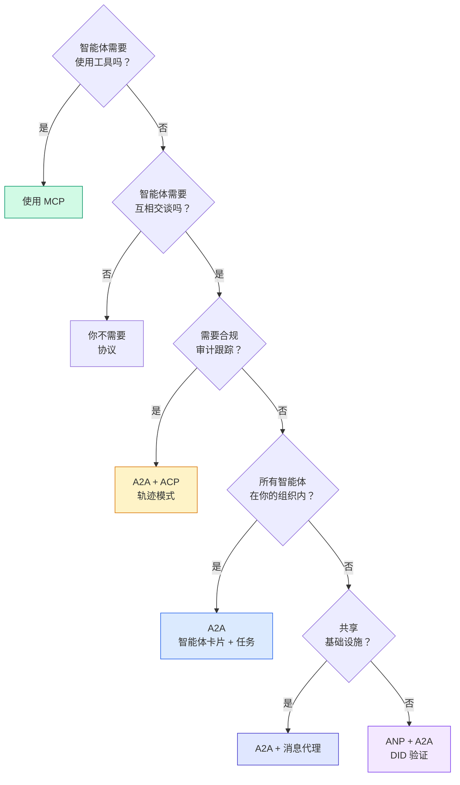

## 交付

本课产生：
- `code/main.ts`——所有四个协议模式的完整实现
- `outputs/prompt-protocol-selector.md`——帮助为你的系统选择协议的提示

## 练习

1. **多跳任务委托。** 扩展 `TaskManager`，使智能体处理程序可以将子任务委托给其他智能体。研究员接收任务，将"搜索"和"总结"子任务委托给两个专业智能体，等待两者完成，然后将结果合并到自己的产物中。
2. **流式审计跟踪。** 修改 `AuditableRunner` 以支持流式模式。不是等待完整结果，而是在添加轨迹条目时实时 yield `AuditEntry` 快照。使用生成审计快照的异步生成器。
3. **DID 轮换。** 向 `IdentityRegistry` 添加密钥轮换。智能体应该能够发布带有更新密钥的新 DID 文档，同时保持 `previousDid` 引用。在宽限期内的验证者应接受当前和之前密钥的签名。
4. **协议协商。** 实现 ANP 的元协议概念。两个智能体交换 `protocolNegotiation` 消息，候选格式（例如，"我可以说 JSON-RPC"vs"我更喜欢 REST"）。最多 3 轮后，约定格式或超时。约定的格式决定它们使用哪个 `TaskManager` 或 `AuditableRunner`。
5. **速率限制发现。** 添加 `RateLimitedRegistry` 包装器，用可配置 TTL 缓存智能体卡片查找，并限制每个智能体每秒的发现查询。在 100 个智能体启动时发现彼此时进行模拟，并测量差异。

## 关键术语

| 术语 | 人们常说 | 实际含义 |
|------|----------------|----------------------|
| MCP | "AI 工具协议" | 客户端-服务器协议，智能体用来发现和使用工具。智能体对工具，不是智能体对智能体。 |
| A2A | "Google 的智能体协议" | Linux Foundation 下的点对点智能体协作协议。通过智能体卡片发现，9 状态任务生命周期，通过 SSE 流式传输。支持 JSON-RPC、REST 和 gRPC 绑定。 |
| ACP | "企业智能体消息" | IBM/BeeAI 的 REST API，用于带 TrajectoryMetadata 的智能体运行：每个响应都携带完整推理和工具调用链。正在合并到 A2A。 |
| ANP | "去中心化智能体身份" | 使用 `did:wba`（DID）的社区协议，用于密码学身份，HPKE 用于 E2EE，以及用于从未谋面的智能体的 AI 驱动元协议协商。 |
| 智能体卡片 | "智能体的名片" | `/.well-known/agent-card.json` 处的 JSON 文档，描述技能、支持 MIME 类型、安全方案和协议绑定。 |
| DID | "去中心化 ID" | W3C 标准，用于密码学可验证身份，托管在智能体自己的域上。ANP 使用 `did:wba` 方法。 |
| TrajectoryMetadata | "审计收据" | ACP 的机制，为每个智能体响应附加推理步骤、工具调用及其输入/输出。 |
| 元协议 | "智能体协商如何交谈" | ANP 的方法，智能体用自然语言动态约定数据格式，然后生成代码来处理它们。 |
| 任务 | "工作单元" | A2A 的有状态对象，从提交跟踪到完成。一旦终态就不可变。 |

## 延伸阅读

- [Google A2A 规范](https://github.com/google/A2A)——官方规范和 SDK（v1.0.0，Linux Foundation）
- [IBM/BeeAI ACP 规范](https://github.com/i-am-bee/acp)——智能体运行和轨迹元数据的 OpenAPI 3.1 规范
- [智能体网络协议](https://github.com/agent-network-protocol/AgentNetworkProtocol)——基于 DID 的身份、E2EE、元协议协商
- [模型上下文协议文档](https://modelcontextprotocol.io/)——Anthropic 的 MCP 规范（Phase 13 中涵盖）
- [W3C 去中心化标识符](https://www.w3.org/TR/did-core/)——支撑 ANP 的身份标准
- [RFC 9180（HPKE）](https://www.rfc-editor.org/rfc/rfc9180)——ANP 用于 E2EE 的加密方案
- [FIPA 智能体通信语言](http://www.fipa.org/specs/fipa00061/SC00061G.html)——现代智能体协议的学术前身
